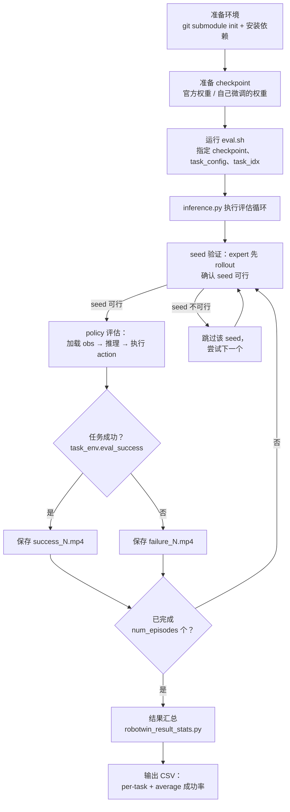
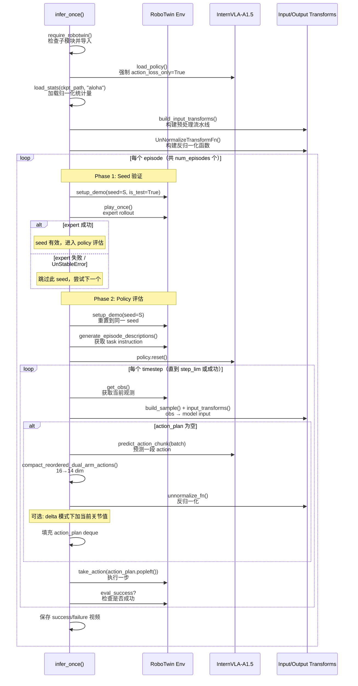
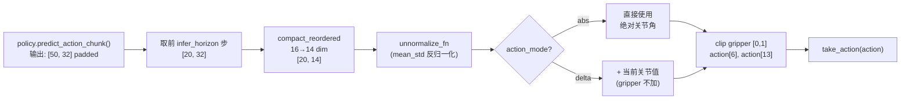

# InternVLA-A1.5 在 RoboTwin 2.0 上的评估操作手册

> 本手册详细说明如何在 [RoboTwin 2.0](https://robotwin-platform.github.io/) 仿真平台上评估 InternVLA-A1.5 的 checkpoint 权重——包括官方预训练权重（[InternVLA-A1.5-base](https://huggingface.co/InternRobotics/InternVLA-A1.5-base)、InternVLA-A1.5-RoboTwin）和自己微调出来的 checkpoint（如在 `stack_bowls_three` 上的 fine-tune 产物）。
>
> 本手册分两部分：**Part A 是可执行的分步评估手册**（覆盖从环境搭建到结果分析的全流程）；**Part B 是执行记录**——按时间顺序记录实际操作、问题与修复、最终结果。
>
> 配套文档：微调实施手册见 `reprd_rbtwn_stackb3.md`。

---

## 目录

- [Part A：评估手册](#part-a评估手册)
  - [0. 评估方案概览](#0-评估方案概览)
  - [1. 环境准备](#1-环境准备)
  - [2. 评估代码深度解读](#2-评估代码深度解读)
  - [3. 评估官方预训练权重](#3-评估官方预训练权重)
  - [4. 评估自己微调的 checkpoint](#4-评估自己微调的-checkpoint)
  - [5. 多任务 & 全 benchmark 评估](#5-多任务--全-benchmark-评估)
  - [6. 结果汇总与分析](#6-结果汇总与分析)
  - [7. 关键参数调优指南](#7-关键参数调优指南)
  - [8. 已知问题与排错](#8-已知问题与排错)
  - [9. 附录](#9-附录)
- [Part B：执行记录](#part-b执行记录)
  - [时间线 / 操作日志](#时间线--操作日志)
  - [问题记录](#问题记录报错--根因--修复--验证)
  - [最终结果](#最终结果)

---

## Part A：评估手册

### 0. 评估方案概览

#### 0.1 RoboTwin 2.0 平台简介

[RoboTwin 2.0](https://robotwin-platform.github.io/) 是一个基于 [SAPIEN](https://sapien.ucsd.edu/) 物理引擎的大规模双臂操作 benchmark，包含 **50 个任务**（如堆叠碗、放置物品、开微波炉等），涵盖从简单抓放到复杂多步推理的操作技能。

**核心特性**：

| 维度 | 说明 |
|------|------|
| 机器人 | 双臂（ALOHA 等多种 embodiment），关节空间控制 |
| 任务数 | 50 个，按难度和类型分类 |
| 相机 | 3 个视角：`head_camera`（俯视）、`left_camera`（左腕）、`right_camera`（右腕） |
| 评测配置 | `demo_clean`（Easy）和 `demo_randomized`（Hard） |
| 每任务 episode 数 | 默认 100（论文标准协议） |
| 物理引擎 | SAPIEN（GPU 加速碰撞检测与渲染） |

**两种评测配置的区别**：

- **`demo_clean`（Easy）**：物体位姿、光照、背景等均固定，与训练数据分布一致。测试 policy 在 in-distribution 条件下的基础操控能力。
- **`demo_randomized`（Hard）**：在 5 个轴上施加域随机化（domain randomization）——物体位姿、光照强度/方向、桌面纹理、干扰物、相机抖动。测试 policy 的泛化能力（compositional generalization）。

#### 0.2 本仓库的评估路径

> **重要区分**：LeRobot 上游（`huggingface/lerobot`）已集成了 `lerobot-eval --env.type=robotwin` CLI，但**本仓库（InternVLA-A-series）不使用该路径**。本仓库没有 `src/lerobot/envs/` 目录，不实现 gymnasium 式环境封装，而是使用自己的 `evaluation/RoboTwin/inference.py` 自定义评估脚本。

```
两种评估方式对比：

┌──────────────────────────┐     ┌───────────────────────────────┐
│ LeRobot upstream         │     │ 本仓库 (InternVLA-A-series)    │
│ (huggingface/lerobot)    │     │                               │
├──────────────────────────┤     ├───────────────────────────────┤
│ lerobot-eval CLI         │     │ evaluation/RoboTwin/eval.sh   │
│ --env.type=robotwin      │     │ → inference.py                │
│ gymnasium 环境封装        │     │ 直接调用 RoboTwin Python API  │
│ 有 envs/ 目录            │     │ 无 envs/ 目录                 │
│ ❌ 本仓库不支持           │     │ ✅ 本仓库唯一支持的方式       │
└──────────────────────────┘     └───────────────────────────────┘
```

**为什么本仓库自己写评估脚本？** InternVLA-A1.5 的推理流水线（chat processor → action expert → flow matching → compact reorder）和 LeRobot 上游的 generic policy 接口不完全兼容，因此用自定义的 `inference.py` 做端到端评估。

#### 0.3 评估流程总览



---

### 1. 环境准备

#### 1.1 RoboTwin 子模块初始化

本仓库通过 git submodule 引入 RoboTwin 平台代码。当前子模块**未初始化**（`.gitmodules` 已声明但 `third_party/RoboTwin/` 目录为空）。

```bash
cd /home/physical/SRC/Robot/InternVLA-A-series

# 初始化并拉取 RoboTwin 子模块
git submodule update --init third_party/RoboTwin

# 验证
ls third_party/RoboTwin/envs/
# 应看到: __init__.py, adjust_bottle.py, beat_block_hammer.py, ... (50 个任务的 env 文件)
```

> **注意**：如果网络不好，可以先单独 clone 再手动链接：
> ```bash
> git clone https://github.com/RoboTwin-Platform/RoboTwin.git /tmp/RoboTwin
> rm -rf third_party/RoboTwin
> ln -s /tmp/RoboTwin third_party/RoboTwin
> ```

#### 1.2 RoboTwin 依赖安装

按 `evaluation/RoboTwin/README.md` 的指引：

```bash
# Step 1: 复制本仓库定制的 requirements 到 RoboTwin script 目录
cp evaluation/RoboTwin/requirements.txt third_party/RoboTwin/script/requirements.txt

# Step 2: 进入 RoboTwin 目录并安装依赖
cd third_party/RoboTwin
bash script/_install.sh

# Step 3: 下载机器人资产（URDF、mesh 文件等）
bash script/_download_assets.sh

cd ../..
```

**`_install.sh` 主要安装的依赖**：

| 包 | 用途 |
|----|------|
| `sapien` | SAPIEN 物理引擎（GPU 加速） |
| `curobo` | cuRobo — CUDA 加速的运动规划库（用于 expert policy） |
| `omegaconf` | YAML 配置解析 |
| `imageio` / `imageio-ffmpeg` | 视频录制 |

#### 1.3 资产下载

`_download_assets.sh` 会从远程下载所有任务所需的 3D 模型资产（URDF、碰撞 mesh、视觉 mesh）。下载完成后，资产存放在 `third_party/RoboTwin/description/` 目录下。

> **磁盘空间**：RoboTwin 资产约需 2-5 GB 磁盘空间。

#### 1.4 虚拟环境 & 环境变量

使用与训练相同的虚拟环境：

```bash
# 激活 venv
source /mnt/r/VENV/ivla15/bin/activate

# 设置环境变量
export HF_HOME=/mnt/r/CKPT/hf_home
export PYTHONPATH="/home/physical/SRC/Robot/InternVLA-A-series/src:/home/physical/SRC/Robot/InternVLA-A-series/third_party/RoboTwin:${PYTHONPATH:-}"
export TOKENIZERS_PARALLELISM=false

# CUDA 相关（headless 渲染需要）
export LD_LIBRARY_PATH="/mnt/r/VENV/ivla15/lib:${LD_LIBRARY_PATH:-}"
```

**eval.sh 会自动设置 PYTHONPATH**（将 `src/` 和 `third_party/RoboTwin` 加入），但如果手动运行 `inference.py` 则需要自己设置。

#### 1.5 安装验证

```bash
# 验证 SAPIEN 可导入
python -c "import sapien; print(f'SAPIEN version: {sapien.__version__}')"

# 验证 RoboTwin envs 可导入（需要在 third_party/RoboTwin 目录下或设置 PYTHONPATH）
cd third_party/RoboTwin
python -c "from envs import CONFIGS_PATH; print(f'RoboTwin configs: {CONFIGS_PATH}')"
cd ../..

# 验证 InternVLA-A1.5 policy 可导入
python -c "from lerobot.policies.internvla_a1_5.configuration_internvla_a1_5 import InternVLAA15Config; print('OK')"

# 验证 EGL 渲染（headless GPU 服务器）
python -c "
import sapien
engine = sapien.Engine()
renderer = sapien.SapienRenderer()
engine.set_renderer(renderer)
print('EGL rendering OK')
"
```

> 如果 EGL 验证失败，参见 [8.2 节](#82-sapienegl-渲染问题)。

---

### 2. 评估代码深度解读

#### 2.1 eval.sh 脚本解析

`evaluation/RoboTwin/eval.sh` 是评估的入口脚本。其核心逻辑：

```bash
# evaluation/RoboTwin/eval.sh 关键行解读

# 1. 环境设置（conda 激活、HF_HOME 设置）
source ${CONDA_ROOT}/etc/profile.d/conda.sh
conda activate ${CONDA_ENV}

# 2. 参数解析（位置参数 + 环境变量 fallback）
PRETRAINED_CKPT="${1:-${PRETRAINED_CKPT:-InternRobotics/InternVLA-A1.5-RoboTwin}}"
TASK_CONFIG="${3:-${TASK_CONFIG:-demo_clean}}"
TASK_IDX="${4:-${TASK_IDX:-44}}"

# 3. PYTHONPATH 设置（关键！必须包含 src/ 和 third_party/RoboTwin）
export PYTHONPATH="${REPO_ROOT}/src:${REPO_ROOT}/third_party/RoboTwin:${PYTHONPATH:-}"

# 4. cd 到 RoboTwin 目录（inference.py 中的 require_robotwin() 需要相对路径）
cd ${REPO_ROOT}/third_party/RoboTwin

# 5. 运行推理
python ../../evaluation/RoboTwin/inference.py \
  --ckpt-path "${PRETRAINED_CKPT}" \
  --video-dir "${OUTPUT_PATH}" \
  --task-config "${TASK_CONFIG}" \
  --task-idx "${TASK_IDX}" \
  --action-mode "${ACTION_MODE}" \
  --infer-horizon "${INFER_HORIZON}" \
  --inference-backend "${INFERENCE_BACKEND}"
```

**完整参数表**：

| 参数来源 | 参数名 | inference.py 对应 | 默认值 | 说明 |
|----------|--------|-------------------|--------|------|
| 位置 $1 | PRETRAINED_CKPT | `--ckpt-path` | `InternRobotics/InternVLA-A1.5-RoboTwin` | checkpoint 路径或 HF repo id |
| 位置 $2 | OUTPUT_PATH | `--video-dir` | `outputs/robotwin/...` | 视频输出目录 |
| 位置 $3 | TASK_CONFIG | `--task-config` | `demo_clean` | `demo_clean` 或 `demo_randomized` |
| 位置 $4 | TASK_IDX | `--task-idx` | `44` | 任务索引（0-49） |
| 环境变量 | RESIZE_SIZE | `--resize-size` | `224` | 输入图像尺寸 |
| 环境变量 | ACTION_MODE | `--action-mode` | `abs` | `abs` 或 `delta` |
| 环境变量 | INFER_HORIZON | `--infer-horizon` | `20` | 每次推理的 action chunk 使用长度 |
| 环境变量 | INFERENCE_BACKEND | `--inference-backend` | `standard` | `standard` 或 `optimized` |

> **注意**：`eval.sh` 使用 conda 激活（`conda activate internvla_a1_5`），但我们的环境用的是 venv。如果用 venv，需要修改或直接手动运行 `inference.py`。见 [第 3 节](#3-评估官方预训练权重) 的具体命令。

#### 2.2 inference.py 核心流程

`evaluation/RoboTwin/inference.py` 的 `infer_once()` 函数是评估的核心。下面用序列图展示其执行流程：



#### 2.3 模型加载与推理后端

`load_policy()` 函数（`inference.py:230-244`）是模型加载的核心：

```python
def load_policy(args, dtype):
    config = PreTrainedConfig.from_pretrained(args.ckpt_path)
    
    # ★ 关键：始终强制 action_loss_only = True
    # 这会跳过 WAN 视频生成模型的加载，只保留 action expert
    config.action_loss_only = True
    
    # 设置推理后端
    config.inference_backend = args.inference_backend  # "standard" or "optimized"
    
    policy_cls = get_policy_class(config.type)  # InternVLAA15Policy
    policy = policy_cls.from_pretrained(args.ckpt_path, config=config)
    policy.to(device=device, dtype=dtype)
    policy.eval()
    return policy, device, config
```

**两种推理后端的区别**：

| 特性 | `standard` | `optimized` |
|------|-----------|-------------|
| 实现 | `modeling_internvla_a1_5.py` | `modeling_internvla_a1_5_optimized.py` |
| Attention | Eager attention | SDPA (Scaled Dot-Product Attention) |
| CUDA Graph | 不使用 | 使用 CUDA Graph replay 加速 |
| 首次推理 | 快 | 慢（需要 warm-up 编译 CUDA Graph） |
| 后续推理 | 正常速度 | 显著更快（~2-3x） |
| 推荐场景 | 调试、少量 episode | 大规模评测（50 task × 100 episode） |

> **建议**：单任务调试用 `standard`，全 benchmark 评估用 `optimized` 以节省时间。

#### 2.4 动作处理链（14 ↔ 16 dim reorder）

InternVLA-A1.5 使用 `aloha.yaml` schema 定义的 action reorder 机制。这是理解评估代码的关键。

**训练时的正向变换（14 → 16 dim）**：

```
原始 14 dim:  [left_joint(6), left_gripper(1), right_joint(6), right_gripper(1)]
                    ↓ action_reorder
重排 16 dim:  [left_joint(6), gap(1), left_gripper(1), right_joint(6), gap(2), right_gripper(1)]
                                 ↑                                        ↑↑
                             index 6=0                            index 14,15=0
```

reorder 规则来自 `src/lerobot/dataset_schemas/configs/aloha.yaml`：
```yaml
action_reorder:
  - [0, 6, 0, 6]      # left_joint: src[0:6] → dst[0:6]
  - [6, 7, 7, 8]      # left_gripper: src[6:7] → dst[7:8]  (dst index 6 留空)
  - [7, 13, 8, 14]    # right_joint: src[7:13] → dst[8:14]
  - [13, 14, 15, 16]  # right_gripper: src[13:14] → dst[15:16]  (dst indices 14,15 留空)
```

**评估时的逆变换（16 → 14 dim）**：

`compact_reordered_dual_arm_actions()` 函数（`inference.py:279-290`）做逆映射：

```python
def compact_reordered_dual_arm_actions(actions):
    # 从 16 dim 中挑出实际使用的 14 dim，跳过 index 6, 14, 15
    return torch.cat([
        actions[..., :6],      # left_joint   (indices 0-5)
        actions[..., 7:8],     # left_gripper (index 7)
        actions[..., 8:14],    # right_joint  (indices 8-13)
        actions[..., 15:16],   # right_gripper (index 15)
    ], dim=-1)  # → 14 dim
```

**完整的推理动作处理链**：



#### 2.5 归一化与反归一化

**Stats 加载**（`inference.py:194-203`）：

```python
def load_stats(ckpt_path, stats_key):
    stats = load_json(ckpt_path / "stats.json")
    selected = stats[stats_key]  # stats_key = "aloha"
    
    # 提取 state 和 action 的统计量
    stat_keys = ["min", "max", "mean", "std"]
    state_stat = {OBS_STATE: {k: np.asarray(selected[OBS_STATE][k]) for k in stat_keys}}
    action_stat = {ACTION: {k: np.asarray(selected[ACTION][k]) for k in stat_keys}}
    return state_stat, action_stat
```

- stats 文件来自 checkpoint 目录下的 `stats.json`
- key 为 `aloha`（由 `--stats-key` 参数控制，默认值）
- 归一化模式为 **mean_std**：$x_{norm} = \frac{x - \mu}{\sigma + \epsilon}$

**输入归一化**（state）：在 `build_input_transforms()` 中，通过 `NormalizeTransformFn(selected_keys=[OBS_STATE])` 对 state 做归一化。

**输出反归一化**（action）：通过 `UnNormalizeTransformFn(selected_keys=[ACTION], mode="mean_std")` 将模型预测的归一化 action 还原为实际关节值：$x = x_{norm} \cdot (\sigma + \epsilon) + \mu$

> **关键点**：训练时用什么 stats 训的，评估时就必须用同样的 stats。自己微调的 checkpoint 需要确保 `stats.json` 与训练时使用的一致。

#### 2.6 Seed 验证与 Episode 循环

RoboTwin 评估有一个独特的 **seed 验证机制**（`inference.py:347-376`）：

1. **生成 seed 候选列表**：基于 `--seed`（默认 42）计算 `seed_start = 100000 * (1 + seed) = 4300000`
2. **Expert 验证**：对每个 seed，先用 RoboTwin 内置的 expert policy（完美运动规划）做一次 rollout
   - 如果 expert 能成功完成任务 → 该 seed 有效
   - 如果 expert 失败或抛出 `UnStableError` → 跳过该 seed
3. **Policy 评估**：仅在 expert 验证通过的 seed 上评估待测 policy

**为什么需要 seed 验证？** 某些随机 seed 可能产生物理上不稳定的场景（如物体穿模、初始碰撞等），或者任务对 expert 本身就是不可解的。过滤这些无效 seed 确保评估的公平性。

**Episode 循环的终止条件**：
- 在 **有效 seed** 上完成 `num_episodes` 个 episode（默认 100）
- 每个 episode 最多执行 `step_lim` 步（由任务配置决定）

#### 2.7 视频录制与成功判定

**成功判定**：通过 `task_env.eval_success` 属性判断。每个任务有自己的成功条件（如碗堆叠高度、物体放置位置等），由 RoboTwin 环境内部实现。

**视频录制**：
- 录制 head camera 的 `image0` 视角（经过 resize 后的 224×224 图像）
- 格式：`success_<id>.mp4` 或 `failure_<id>.mp4`
- 保存目录：`--video-dir` 指定的路径
- FPS：`--fps`（默认 30）

> **注意**：`inference.py` 的 `main()` 会在启动时 **清空整个 video-dir**（`shutil.rmtree`），所以不要把不同任务的结果放到同一个目录！

---

### 3. 评估官方预训练权重

#### 3.1 评估 InternVLA-A1.5-base

InternVLA-A1.5-base 是在混合数据集上预训练的基座模型（**未在 RoboTwin 上专门训练**），直接在 RoboTwin 上评估可以测试其 zero-shot 泛化能力。

```bash
# 激活环境
source /mnt/r/VENV/ivla15/bin/activate
export HF_HOME=/mnt/r/CKPT/hf_home

cd /home/physical/SRC/Robot/InternVLA-A-series

# 设置 PYTHONPATH（手动运行时必须设置）
export PYTHONPATH="$(pwd)/src:$(pwd)/third_party/RoboTwin:${PYTHONPATH:-}"
export TOKENIZERS_PARALLELISM=false

# 进入 RoboTwin 目录（inference.py 需要在此目录下运行）
cd third_party/RoboTwin

# 评估 stack_bowls_three（任务索引 46）
python ../../evaluation/RoboTwin/inference.py \
  --ckpt-path /mnt/r/CKPT/InternVLA-A1.5-base \
  --video-dir ../../outputs/robotwin/internvla_a1_5_base/robotwin/demo_clean/stack_bowls_three \
  --task-config demo_clean \
  --task-idx 46 \
  --action-mode abs \
  --infer-horizon 20 \
  --inference-backend standard \
  --num-episodes 50 \
  --resize-size 224

cd ../..
```

> **注意输出目录结构**：为了后续使用 `robotwin_result_stats.py` 汇总，视频目录必须符合格式：
> `<root>/robotwin/<task_config>/<task_name>/`
>
> 所以 `--video-dir` 应设为 `outputs/robotwin/internvla_a1_5_base/robotwin/demo_clean/stack_bowls_three`

#### 3.2 评估 InternVLA-A1.5-RoboTwin

InternVLA-A1.5-RoboTwin 是在 RoboTwin 全部 50 个任务的数据上微调过的官方 checkpoint：

```bash
cd /home/physical/SRC/Robot/InternVLA-A-series/third_party/RoboTwin

# 方式 1：使用 HuggingFace repo id（会自动下载）
python ../../evaluation/RoboTwin/inference.py \
  --ckpt-path InternRobotics/InternVLA-A1.5-RoboTwin \
  --video-dir ../../outputs/robotwin/internvla_a1_5_robotwin/robotwin/demo_clean/stack_bowls_three \
  --task-config demo_clean \
  --task-idx 46 \
  --action-mode abs \
  --infer-horizon 20 \
  --num-episodes 100

# 方式 2：如果已经下载到本地
python ../../evaluation/RoboTwin/inference.py \
  --ckpt-path /path/to/InternVLA-A1.5-RoboTwin \
  --video-dir ../../outputs/robotwin/internvla_a1_5_robotwin/robotwin/demo_clean/stack_bowls_three \
  --task-config demo_clean \
  --task-idx 46 \
  --action-mode abs

cd ../..
```

---

### 4. 评估自己微调的 checkpoint

#### 4.1 Checkpoint 目录结构要求

`inference.py` 的 `load_policy()` 和 `load_stats()` 要求 checkpoint 目录具有以下结构：

```
<checkpoint_dir>/
├── config.json          # PreTrainedConfig 序列化（必须包含 policy.type = "internvla_a1_5"）
├── model.safetensors    # 模型权重
└── stats.json           # 归一化统计量（必须包含 "aloha" key）
```

**通常的训练输出**：使用 `launch/internvla_a15_finetune_*.sh` 训练后，checkpoint 保存在 `outputs/<run_name>/checkpoints/<step>/` 目录下，已包含上述所有文件。

#### 4.2 stats.json 匹配

> **常见陷阱**：`stats.json` 必须包含以 `--stats-key`（默认 `aloha`）为 key 的条目。

**检查 stats.json 是否正确**：

```bash
# 查看 stats.json 的顶层 key
python -c "
import json
with open('<ckpt_path>/stats.json') as f:
    stats = json.load(f)
print('Keys:', list(stats.keys()))
# 应包含 'aloha'

# 检查 aloha 下的子 key
aloha = stats['aloha']
print('aloha sub-keys:', list(aloha.keys()))
# 应包含 'observation.state' 和 'action'

# 检查维度
print('action mean shape:', len(aloha['action']['mean']))
# 应为 16 (reorder 后的维度)
"
```

**如果 stats.json 不包含 `aloha` key**：

可能的原因：
1. 训练时 `--dataset.external_stats_path` 指向了不同的 stats 文件
2. stats 是用 `compute_norm_stats_multi.py` 计算的，输出格式不同

解决方案：手动构造或复制正确的 stats.json 到 checkpoint 目录。最简单的方式是从官方 checkpoint（如 InternVLA-A1.5-base）复制 stats.json，前提是训练时使用了相同的 stats。

#### 4.3 单任务评估示例（stack_bowls_three）

假设微调的 checkpoint 在 `/mnt/r/CKPT/b1k2026/pi05/0714/checkpoint-10000/`：

```bash
source /mnt/r/VENV/ivla15/bin/activate
export HF_HOME=/mnt/r/CKPT/hf_home
export TOKENIZERS_PARALLELISM=false

cd /home/physical/SRC/Robot/InternVLA-A-series
export PYTHONPATH="$(pwd)/src:$(pwd)/third_party/RoboTwin:${PYTHONPATH:-}"

CKPT_PATH="/mnt/r/CKPT/b1k2026/pi05/0714/checkpoint-10000"
OUTPUT_ROOT="outputs/robotwin/stackb3_ft_10k"

cd third_party/RoboTwin

# 评估 demo_clean
python ../../evaluation/RoboTwin/inference.py \
  --ckpt-path "${CKPT_PATH}" \
  --video-dir "../../${OUTPUT_ROOT}/robotwin/demo_clean/stack_bowls_three" \
  --task-config demo_clean \
  --task-idx 46 \
  --action-mode abs \
  --infer-horizon 20 \
  --inference-backend standard \
  --num-episodes 100

# 评估 demo_randomized（Hard 模式）
python ../../evaluation/RoboTwin/inference.py \
  --ckpt-path "${CKPT_PATH}" \
  --video-dir "../../${OUTPUT_ROOT}/robotwin/demo_randomized/stack_bowls_three" \
  --task-config demo_randomized \
  --task-idx 46 \
  --action-mode abs \
  --infer-horizon 20 \
  --inference-backend standard \
  --num-episodes 100

cd ../..

# 汇总结果
python util_scripts/robotwin_result_stats.py "${OUTPUT_ROOT}"
```

#### 4.4 评估不同训练步数的 checkpoint

在微调过程中，通常会保存多个 checkpoint（如每 2000 步保存一次）。可以批量评估以找到最佳步数：

```bash
source /mnt/r/VENV/ivla15/bin/activate
export HF_HOME=/mnt/r/CKPT/hf_home
export TOKENIZERS_PARALLELISM=false

cd /home/physical/SRC/Robot/InternVLA-A-series
export PYTHONPATH="$(pwd)/src:$(pwd)/third_party/RoboTwin:${PYTHONPATH:-}"

CKPT_BASE="/mnt/r/CKPT/b1k2026/pi05/0714"
TASK_IDX=46  # stack_bowls_three

cd third_party/RoboTwin

for STEP in 2000 4000 6000 8000 10000; do
  CKPT_PATH="${CKPT_BASE}/checkpoint-${STEP}"
  OUTPUT_DIR="../../outputs/robotwin/stackb3_ft_step${STEP}/robotwin/demo_clean/stack_bowls_three"
  
  if [ ! -d "${CKPT_PATH}" ]; then
    echo "跳过不存在的 checkpoint: ${CKPT_PATH}"
    continue
  fi
  
  echo "========== 评估 checkpoint-${STEP} =========="
  python ../../evaluation/RoboTwin/inference.py \
    --ckpt-path "${CKPT_PATH}" \
    --video-dir "${OUTPUT_DIR}" \
    --task-config demo_clean \
    --task-idx ${TASK_IDX} \
    --action-mode abs \
    --infer-horizon 20 \
    --num-episodes 50
done

cd ../..

# 批量汇总
for STEP in 2000 4000 6000 8000 10000; do
  OUTPUT_ROOT="outputs/robotwin/stackb3_ft_step${STEP}"
  if [ -d "${OUTPUT_ROOT}" ]; then
    echo "===== Step ${STEP} ====="
    python util_scripts/robotwin_result_stats.py "${OUTPUT_ROOT}"
  fi
done
```

---

### 5. 多任务 & 全 benchmark 评估

#### 5.1 全 50 任务索引表

`inference.py` 中 `TASK_NAMES` 列表定义了全部 50 个任务及其索引：

| Index | Task Name | Index | Task Name |
|-------|-----------|-------|-----------|
| 0 | adjust_bottle | 25 | place_can_basket |
| 1 | beat_block_hammer | 26 | place_cans_plasticbox |
| 2 | blocks_ranking_rgb | 27 | place_container_plate |
| 3 | blocks_ranking_size | 28 | place_dual_shoes |
| 4 | click_alarmclock | 29 | place_empty_cup |
| 5 | click_bell | 30 | place_fan |
| 6 | dump_bin_bigbin | 31 | place_mouse_pad |
| 7 | grab_roller | 32 | place_object_basket |
| 8 | handover_block | 33 | place_object_scale |
| 9 | handover_mic | 34 | place_object_stand |
| 10 | hanging_mug | 35 | place_phone_stand |
| 11 | lift_pot | 36 | place_shoe |
| 12 | move_can_pot | 37 | press_stapler |
| 13 | move_pillbottle_pad | 38 | put_bottles_dustbin |
| 14 | move_playingcard_away | 39 | put_object_cabinet |
| 15 | move_stapler_pad | 40 | rotate_qrcode |
| 16 | **open_laptop** ⚠️ | 41 | scan_object |
| 17 | open_microwave | 42 | shake_bottle |
| 18 | pick_diverse_bottles | 43 | shake_bottle_horizontally |
| 19 | pick_dual_bottles | 44 | stack_blocks_three |
| 20 | place_a2b_left | 45 | stack_blocks_two |
| 21 | place_a2b_right | **46** | **stack_bowls_three** |
| 22 | place_bread_basket | 47 | stack_bowls_two |
| 23 | place_bread_skillet | 48 | stamp_seal |
| 24 | place_burger_fries | 49 | turn_switch |

> ⚠️ `open_laptop`（index 16）存在已知的 `arm_tag` bug，可能导致评估崩溃。见 [8.1 节](#81-open_laptop-arm_tag-bug)。

#### 5.2 批量评估脚本

以下脚本在全部 50 个任务上进行评估（`demo_clean` 配置）：

```bash
#!/usr/bin/env bash
# batch_eval_robotwin.sh — 全任务批量评估
# 用法: bash batch_eval_robotwin.sh <checkpoint_path> [output_root]

set -euo pipefail

source /mnt/r/VENV/ivla15/bin/activate
export HF_HOME=/mnt/r/CKPT/hf_home
export TOKENIZERS_PARALLELISM=false

REPO_ROOT="/home/physical/SRC/Robot/InternVLA-A-series"
export PYTHONPATH="${REPO_ROOT}/src:${REPO_ROOT}/third_party/RoboTwin:${PYTHONPATH:-}"

CKPT_PATH="${1:?Usage: $0 <checkpoint_path> [output_root]}"
OUTPUT_ROOT="${2:-${REPO_ROOT}/outputs/robotwin/$(basename ${CKPT_PATH})}"
TASK_CONFIG="${TASK_CONFIG:-demo_clean}"
NUM_EPISODES="${NUM_EPISODES:-100}"
INFER_HORIZON="${INFER_HORIZON:-20}"
ACTION_MODE="${ACTION_MODE:-abs}"
INFERENCE_BACKEND="${INFERENCE_BACKEND:-standard}"

# 50 个任务名（与 inference.py 中 TASK_NAMES 对应）
TASK_NAMES=(
  adjust_bottle beat_block_hammer blocks_ranking_rgb blocks_ranking_size
  click_alarmclock click_bell dump_bin_bigbin grab_roller
  handover_block handover_mic hanging_mug lift_pot
  move_can_pot move_pillbottle_pad move_playingcard_away move_stapler_pad
  open_laptop open_microwave pick_diverse_bottles pick_dual_bottles
  place_a2b_left place_a2b_right place_bread_basket place_bread_skillet
  place_burger_fries place_can_basket place_cans_plasticbox place_container_plate
  place_dual_shoes place_empty_cup place_fan place_mouse_pad
  place_object_basket place_object_scale place_object_stand place_phone_stand
  place_shoe press_stapler put_bottles_dustbin put_object_cabinet
  rotate_qrcode scan_object shake_bottle shake_bottle_horizontally
  stack_blocks_three stack_blocks_two stack_bowls_three stack_bowls_two
  stamp_seal turn_switch
)

cd "${REPO_ROOT}/third_party/RoboTwin"

for IDX in $(seq 0 49); do
  TASK_NAME="${TASK_NAMES[$IDX]}"
  VIDEO_DIR="../../${OUTPUT_ROOT}/robotwin/${TASK_CONFIG}/${TASK_NAME}"
  
  # 跳过已完成的任务（如果输出目录已存在且有视频文件）
  if [ -d "${VIDEO_DIR}" ] && [ "$(ls ${VIDEO_DIR}/*.mp4 2>/dev/null | wc -l)" -ge "${NUM_EPISODES}" ]; then
    echo "[SKIP] Task ${IDX}: ${TASK_NAME} — 已有 ${NUM_EPISODES}+ 个视频"
    continue
  fi
  
  echo "========== [${IDX}/49] ${TASK_NAME} (${TASK_CONFIG}) =========="
  
  python ../../evaluation/RoboTwin/inference.py \
    --ckpt-path "${CKPT_PATH}" \
    --video-dir "${VIDEO_DIR}" \
    --task-config "${TASK_CONFIG}" \
    --task-idx "${IDX}" \
    --action-mode "${ACTION_MODE}" \
    --infer-horizon "${INFER_HORIZON}" \
    --inference-backend "${INFERENCE_BACKEND}" \
    --num-episodes "${NUM_EPISODES}" \
    2>&1 | tee -a "../../${OUTPUT_ROOT}/eval_${TASK_CONFIG}.log" || {
      echo "[ERROR] Task ${IDX}: ${TASK_NAME} 失败，继续下一个..."
      continue
    }
done

cd ../..

echo "========== 汇总结果 =========="
python util_scripts/robotwin_result_stats.py "${OUTPUT_ROOT}"
echo "结果 CSV 已保存到: ${OUTPUT_ROOT}/results_robotwin.csv"
```

使用方法：

```bash
# 评估 demo_clean（Easy）
bash batch_eval_robotwin.sh /mnt/r/CKPT/InternVLA-A1.5-base outputs/robotwin/a15_base

# 评估 demo_randomized（Hard）
TASK_CONFIG=demo_randomized bash batch_eval_robotwin.sh /mnt/r/CKPT/InternVLA-A1.5-base outputs/robotwin/a15_base

# 减少 episode 数加速调试
NUM_EPISODES=10 bash batch_eval_robotwin.sh /mnt/r/CKPT/InternVLA-A1.5-base outputs/robotwin/a15_base_debug
```

#### 5.3 demo_clean vs demo_randomized

**评估协议**：论文标准是在 demo_clean 和 demo_randomized 两种配置下各评估 100 个 episode。

```bash
CKPT="/mnt/r/CKPT/InternVLA-A1.5-base"
OUT="outputs/robotwin/a15_base"

# 先跑 demo_clean
TASK_CONFIG=demo_clean bash batch_eval_robotwin.sh ${CKPT} ${OUT}

# 再跑 demo_randomized
TASK_CONFIG=demo_randomized bash batch_eval_robotwin.sh ${CKPT} ${OUT}

# 汇总（会同时处理 demo_clean 和 demo_randomized）
python util_scripts/robotwin_result_stats.py ${OUT}
```

`robotwin_result_stats.py` 会自动扫描 `<output_root>/robotwin/demo_clean/` 和 `<output_root>/robotwin/demo_randomized/` 下的所有任务目录，生成包含两列的 CSV。

---

### 6. 结果汇总与分析

#### 6.1 robotwin_result_stats.py 使用

```bash
# 基本用法：汇总单个 checkpoint 的评估结果
python util_scripts/robotwin_result_stats.py outputs/robotwin/a15_base

# 自定义输出文件名
python util_scripts/robotwin_result_stats.py outputs/robotwin/a15_base --csv-name my_results.csv

# 同时汇总多个 checkpoint（用于对比）
python util_scripts/robotwin_result_stats.py \
  outputs/robotwin/a15_base \
  outputs/robotwin/a15_robotwin \
  outputs/robotwin/stackb3_ft_10k
```

**目录结构要求**：

```
<output_root>/
└── robotwin/
    ├── demo_clean/
    │   ├── stack_bowls_three/
    │   │   ├── success_1.mp4
    │   │   ├── failure_2.mp4
    │   │   └── ...
    │   ├── stack_bowls_two/
    │   │   └── ...
    │   └── ...
    └── demo_randomized/
        ├── stack_bowls_three/
        │   └── ...
        └── ...
```

> **重要**：`--video-dir` 对应的是最内层的任务目录（如 `stack_bowls_three/`），而 `robotwin_result_stats.py` 的输入是最外层的 `<output_root>/`。两者之间必须有 `robotwin/<task_config>/<task_name>/` 的层级结构。

#### 6.2 结果 CSV 解读

输出的 CSV 文件格式如下：

```csv
names,a15_base,,a15_robotwin,
,demo_clean,demo_randomized,demo_clean,demo_randomized
Average,12.50% (125/1000),,45.00% (450/1000),
stack_bowls_three,15.00% (15/100),8.00% (8/100),60.00% (60/100),35.00% (35/100)
stack_bowls_two,20.00% (20/100),12.00% (12/100),70.00% (70/100),50.00% (50/100)
...
```

| 列 | 说明 |
|----|------|
| names | 任务名 |
| demo_clean | Easy 模式成功率（百分比 + 成功数/总数） |
| demo_randomized | Hard 模式成功率 |
| Average | 所有任务的加权平均（按总 episode 数加权，非简单平均） |

#### 6.3 对比不同 checkpoint

将多个 checkpoint 的评估结果放在**不同的** `<output_root>` 目录下，然后一起传给 `robotwin_result_stats.py`：

```bash
# 汇总多个 checkpoint 到同一个 CSV
python util_scripts/robotwin_result_stats.py \
  outputs/robotwin/a15_base \
  outputs/robotwin/stackb3_ft_step2000 \
  outputs/robotwin/stackb3_ft_step5000 \
  outputs/robotwin/stackb3_ft_step10000
```

> **注意**：每次调用 `robotwin_result_stats.py` 时传入**多个** output_roots，脚本目前的实现是分别处理每个 root 并写入各自目录的 CSV——不会合并到一个文件。若需要跨 checkpoint 对比，可手动合并 CSV 或修改脚本。

---

### 7. 关键参数调优指南

#### 7.1 `--infer-horizon`（推理时的 action chunk 使用长度）

- **定义**：每次调用 `predict_action_chunk()` 后，取前 `infer_horizon` 步 action 放入 action plan deque
- **默认值**：20
- **取值范围**：1 ~ 50（`chunk_size` = 50）
- **影响**：
  - 值越大 → 每次推理覆盖更多步 → **推理频率降低**（policy 调用次数少，速度快） → 但对环境变化的响应更慢
  - 值越小 → **推理频率更高** → 对环境变化响应更灵敏 → 但速度慢
- **建议**：
  - 简单任务（如 `stack_bowls_two`）：20（默认值足够）
  - 精细操作任务：10-15（更频繁的 re-plan）
  - 快速初筛：30-50（减少推理次数，加速评估）

#### 7.2 `--inference-backend`

| 后端 | 首次推理 | 后续推理 | GPU 显存 | 建议场景 |
|------|---------|---------|---------|---------|
| `standard` | 快 | 正常 | 较低 | 调试、单任务少量 episode |
| `optimized` | 慢（warm-up） | ~2-3x 加速 | 较高 | 全 benchmark 评估、生产部署 |

```bash
# 使用 optimized 后端（大规模评估推荐）
INFERENCE_BACKEND=optimized bash batch_eval_robotwin.sh <ckpt> <output>
```

#### 7.3 `--action-mode`

- **`abs`**（绝对模式）：模型直接输出目标关节角度，`take_action(action)` 直接使用
- **`delta`**（增量模式）：模型输出关节角度**增量**，需要加上当前关节值：
  ```python
  action_pred = action_pred + current_action[:14]
  # gripper 通道（index 6, 13）的 current_action 被置零，不参与加法
  ```
- **匹配要求**：**必须与训练时的 `action_mode` 一致**。如果训练时用 `abs`，评估也必须用 `abs`

#### 7.4 `--num-episodes`

- **默认值**：100（论文标准协议）
- **调试/初筛**：10-20（快速检查 policy 是否基本工作）
- **正式评估**：100（与论文对标，确保统计显著性）
- **精细分析**：200+（更稳定的成功率估计）

#### 7.5 `--dtype`

| 类型 | 精度 | 速度 | 显存 | 建议 |
|------|------|------|------|------|
| `float32` | 最高 | 较慢 | ~5.4 GB | 默认，确保精度 |
| `bfloat16` | 足够 | ~2x 加速 | ~2.7 GB | 大规模评估时推荐 |

```bash
# 使用 bfloat16 评估
python ../../evaluation/RoboTwin/inference.py \
  --ckpt-path <ckpt> \
  --dtype bfloat16 \
  ...
```

> InternVLA-A1.5 的 Qwen3.5 backbone 原生支持 bfloat16，在实践中 bfloat16 与 float32 的成功率差异通常小于 1%。

---

### 8. 已知问题与排错

#### 8.1 open_laptop arm_tag bug

**现象**：评估 `open_laptop`（task_idx=16）时，RoboTwin 环境抛出 `arm_tag` 相关错误。

**原因**：RoboTwin 上游的 `open_laptop` 任务存在 embodiment 配置问题，在某些版本中 `arm_tag` 变量未正确定义。

**解决**：
- 暂时跳过 `open_laptop`（在批量脚本中加 `if [ "${IDX}" -eq 16 ]; then continue; fi`）
- 或更新 RoboTwin 子模块到最新版本（可能已修复）

#### 8.2 SAPIEN/EGL 渲染问题

**现象**：`RuntimeError: Failed to create EGL context` 或 `DISPLAY is not set`。

**原因**：headless GPU 服务器（无显示器）需要 EGL 渲染支持。

**解决方案**：

```bash
# 方法 1：设置 EGL 环境变量
export PYOPENGL_PLATFORM=egl
export MESA_GL_VERSION_OVERRIDE=4.1

# 方法 2：安装 EGL 驱动
sudo apt-get install libegl1-mesa-dev libgl1-mesa-dev

# 方法 3：使用 NVIDIA EGL（推荐 for GPU 服务器）
# 确认 NVIDIA 驱动安装了 EGL 支持
ls /usr/lib/x86_64-linux-gnu/libEGL_nvidia.so*
# 如果不存在，安装：
sudo apt-get install libnvidia-egl-wayland1
```

#### 8.3 cuRobo 安装问题

**现象**：`ModuleNotFoundError: No module named 'curobo'`

**原因**：cuRobo 是 RoboTwin expert policy 所需的运动规划库，需要 CUDA 编译。

**解决**：

```bash
# 方法 1：通过 pip 安装（需要与 torch CUDA 版本匹配）
pip install curobo

# 方法 2：从源码安装（如果 pip 版本不兼容）
git clone https://github.com/NVlabs/curobo.git /tmp/curobo
cd /tmp/curobo
pip install -e .
```

> **注意**：cuRobo 仅用于 seed 验证阶段的 expert rollout，不影响待测 policy 的推理。如果安装困难，可以考虑修改 `inference.py` 跳过 seed 验证（但这会影响评估公平性）。

#### 8.4 stats.json key 不匹配

**现象**：`KeyError: stats_key 'aloha' not found in <ckpt>/stats.json`

**原因**：checkpoint 的 stats.json 中没有以 `aloha` 为 key 的条目。常见于：
- 直接使用 `compute_norm_stats_multi.py` 输出的 stats（该脚本不一定产生 `aloha` key）
- 使用了不同 robot_type 的 stats

**解决方案**：

```bash
# 方案 1：指定正确的 stats-key
python ../../evaluation/RoboTwin/inference.py \
  --stats-key <正确的key> \
  ...

# 方案 2：手动构造 stats.json
python -c "
import json

# 读取现有 stats
with open('<ckpt>/stats.json') as f:
    stats = json.load(f)

# 如果有其他 key，复制为 aloha
existing_key = list(stats.keys())[0]
stats['aloha'] = stats[existing_key]

with open('<ckpt>/stats.json', 'w') as f:
    json.dump(stats, f, indent=2)
print('Done. Added aloha key from', existing_key)
"

# 方案 3：从官方 checkpoint 复制 stats.json
cp /mnt/r/CKPT/InternVLA-A1.5-base/stats.json <ckpt>/stats.json
```

#### 8.5 常见错误速查表

| 错误信息 | 原因 | 解决 |
|---------|------|------|
| `RoboTwin is not initialized` | 子模块未拉取 | `git submodule update --init third_party/RoboTwin` |
| `No module named 'envs'` | PYTHONPATH 未设置或 cwd 不对 | 确保 `cd third_party/RoboTwin` 并设置 PYTHONPATH |
| `task_idx must be in [0, 49]` | 任务索引越界 | 检查 `--task-idx` 是否在 0-49 范围内 |
| `policy.type must be 'internvla_a1_5'` | checkpoint 不是 InternVLA-A1.5 | 检查 checkpoint 的 `config.json` |
| `KeyError: 'aloha'` | stats.json 缺少 aloha key | 见 [8.4 节](#84-statsjson-key-不匹配) |
| `CUDA out of memory` | GPU 显存不足 | 使用 `--dtype bfloat16` 或换更大显存的 GPU |
| `UnStableError` (大量) | RoboTwin 场景物理不稳定 | 正常现象，seed 验证会自动跳过 |
| `Failed to create EGL context` | headless 渲染问题 | 见 [8.2 节](#82-sapienegl-渲染问题) |
| `shutil.rmtree` 删除已有结果 | `inference.py` 启动时清空 video-dir | 评估不同任务/配置时使用不同 video-dir |

---

### 9. 附录

#### 9.1 与 LeRobot upstream lerobot-eval 的对比

为了帮助理解两种评估路径的差异，下表做了详细对比：

| 维度 | LeRobot upstream (`lerobot-eval`) | 本仓库 (`inference.py`) |
|------|-----------------------------------|------------------------|
| 安装 | `pip install lerobot[robotwin]` | `git submodule + _install.sh` |
| 命令 | `lerobot-eval --env.type=robotwin` | `python inference.py` |
| 环境封装 | gymnasium API (`lerobot.envs`) | 直接调用 RoboTwin Python API |
| Policy 接口 | `policy.select_action(batch)` | `policy.predict_action_chunk(batch)` |
| 动作处理 | 在 env wrapper 中处理 reorder | 手动 `compact_reordered_dual_arm_actions` |
| Seed 验证 | 通过 env config seed list | 自定义 expert rollout 验证 |
| 支持的 policy | 任意 LeRobot policy | InternVLA-A1.5 only |
| 适用仓库 | `huggingface/lerobot` | `InternRobotics/InternVLA-A-series` |

> **何时用哪种？** 如果你在本仓库（InternVLA-A-series）工作，**只能用 `inference.py`**。`lerobot-eval` 仅供参考理解 LeRobot 生态，不能直接用于本仓库。

#### 9.2 RoboTwin 2.0 任务完整列表与描述

| Index | Task Name | 中文描述 | 类别 |
|-------|-----------|---------|------|
| 0 | adjust_bottle | 调整瓶子位置 | 精细操作 |
| 1 | beat_block_hammer | 用锤子敲击积木 | 工具使用 |
| 2 | blocks_ranking_rgb | 按颜色排列积木 | 排序/推理 |
| 3 | blocks_ranking_size | 按大小排列积木 | 排序/推理 |
| 4 | click_alarmclock | 按闹钟按钮 | 精细操作 |
| 5 | click_bell | 按铃 | 精细操作 |
| 6 | dump_bin_bigbin | 倒桶到大桶 | 倾倒 |
| 7 | grab_roller | 抓取滚筒 | 抓取 |
| 8 | handover_block | 传递积木（左手→右手） | 双手协调 |
| 9 | handover_mic | 传递麦克风 | 双手协调 |
| 10 | hanging_mug | 挂杯子 | 精细放置 |
| 11 | lift_pot | 举起锅 | 双手抬举 |
| 12 | move_can_pot | 将罐子移到锅里 | 放置 |
| 13 | move_pillbottle_pad | 移动药瓶到垫子上 | 放置 |
| 14 | move_playingcard_away | 移走扑克牌 | 推/移 |
| 15 | move_stapler_pad | 移动订书机到垫子上 | 放置 |
| 16 | open_laptop ⚠️ | 打开笔记本电脑 | 铰链操作 |
| 17 | open_microwave | 打开微波炉门 | 铰链操作 |
| 18 | pick_diverse_bottles | 拾取不同形状的瓶子 | 多物体 |
| 19 | pick_dual_bottles | 双手各拾取一个瓶子 | 双手抓取 |
| 20 | place_a2b_left | 将物体从 A 放到 B（左手） | 放置 |
| 21 | place_a2b_right | 将物体从 A 放到 B（右手） | 放置 |
| 22 | place_bread_basket | 放面包到篮子 | 放置 |
| 23 | place_bread_skillet | 放面包到平底锅 | 放置 |
| 24 | place_burger_fries | 放汉堡和薯条 | 多物体放置 |
| 25 | place_can_basket | 放罐子到篮子 | 放置 |
| 26 | place_cans_plasticbox | 放罐子到塑料盒 | 放置 |
| 27 | place_container_plate | 放容器到盘子 | 放置 |
| 28 | place_dual_shoes | 放两只鞋 | 双手放置 |
| 29 | place_empty_cup | 放置空杯子 | 放置 |
| 30 | place_fan | 放置风扇 | 放置 |
| 31 | place_mouse_pad | 放鼠标到垫子上 | 放置 |
| 32 | place_object_basket | 放物体到篮子 | 放置 |
| 33 | place_object_scale | 放物体到秤上 | 放置 |
| 34 | place_object_stand | 放物体到支架 | 放置 |
| 35 | place_phone_stand | 放手机到支架 | 精细放置 |
| 36 | place_shoe | 放置鞋子 | 放置 |
| 37 | press_stapler | 按压订书机 | 工具使用 |
| 38 | put_bottles_dustbin | 放瓶子到垃圾桶 | 放置 |
| 39 | put_object_cabinet | 放物体到柜子 | 放置 |
| 40 | rotate_qrcode | 旋转二维码 | 精细旋转 |
| 41 | scan_object | 扫描物体 | 抓取+移动 |
| 42 | shake_bottle | 摇瓶子（竖直） | 精细操作 |
| 43 | shake_bottle_horizontally | 摇瓶子（水平） | 精细操作 |
| 44 | stack_blocks_three | 堆叠三块积木 | 堆叠 |
| 45 | stack_blocks_two | 堆叠两块积木 | 堆叠 |
| 46 | stack_bowls_three | 堆叠三个碗 | 堆叠 |
| 47 | stack_bowls_two | 堆叠两个碗 | 堆叠 |
| 48 | stamp_seal | 盖章 | 工具使用 |
| 49 | turn_switch | 转动开关 | 精细操作 |

#### 9.3 参考资料

| 资源 | 链接 |
|------|------|
| RoboTwin 2.0 官网 | https://robotwin-platform.github.io/ |
| RoboTwin GitHub | https://github.com/RoboTwin-Platform/RoboTwin |
| InternVLA-A1.5 论文 | https://arxiv.org/abs/2607.04988 |
| InternVLA-A1.5 GitHub | https://github.com/InternRobotics/InternVLA-A-series |
| InternVLA-A1.5-base 权重 | https://huggingface.co/InternRobotics/InternVLA-A1.5-base |
| LeRobot RoboTwin 文档 | https://huggingface.co/docs/lerobot/en/robotwin |
| SAPIEN 官网 | https://sapien.ucsd.edu/ |
| cuRobo (NVIDIA) | https://github.com/NVlabs/curobo |

---

## Part B：执行记录

> 以下部分在实际执行评估时填写。

### 时间线 / 操作日志

| 时间 | 操作 | 结果 |
|------|------|------|
| | | |

### 问题记录（报错 → 根因 → 修复 → 验证）

| # | 报错现象 | 根因分析 | 修复方式 | 验证结果 |
|---|---------|---------|---------|---------|
| | | | | |

### 最终结果

| Checkpoint | Task | Config | Episodes | 成功率 |
|-----------|------|--------|----------|-------|
| | | | | |
