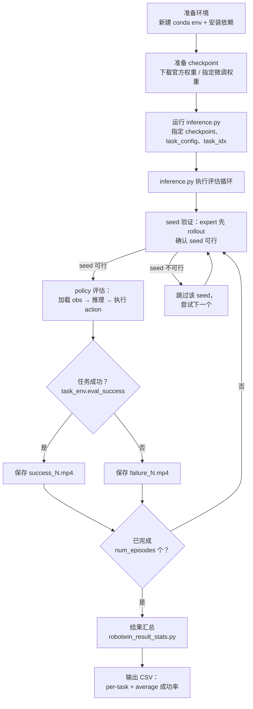
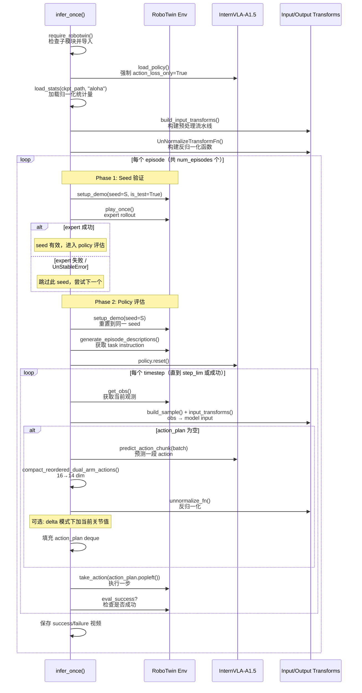
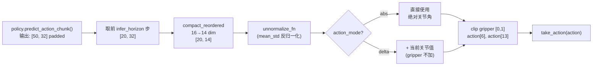

# InternVLA-A1.5 在 RoboTwin 2.0 上的评估操作手册（GCP Blackwell 机器）

> 本手册详细说明如何在本机（GCP Blackwell 实例）上使用 [RoboTwin 2.0](https://robotwin-platform.github.io/) 仿真平台评估 InternVLA-A1.5 的 checkpoint 权重——包括官方预训练权重（[InternVLA-A1.5-base](https://huggingface.co/InternRobotics/InternVLA-A1.5-base)、[InternVLA-A1.5-RoboTwin](https://huggingface.co/InternRobotics/InternVLA-A1.5-RoboTwin)）和自己微调出来的 checkpoint（如在 `stack_bowls_three` 上的 fine-tune 产物）。
>
> **本机特点**：2× NVIDIA RTX PRO 6000 Blackwell（96 GB VRAM × 2）、AMD EPYC 9B45 96 线程、354 GB RAM、CUDA 12.8、Ubuntu 22.04 on GCP。RoboTwin 2.0 已在 `/home/luogang/share/zwy/Projects/RoboTwin/` 完整安装（含 50 个任务环境和资产）。
>
> 本手册分两部分：**Part A 是可执行的分步评估手册**（覆盖从环境搭建到结果分析的全流程）；**Part B 是执行记录**——按时间顺序记录实际操作、问题与修复、最终结果。
>
> 配套文档：微调实施手册见 `reprd_rbtwn_stackb3.md`；另一台机器的评估手册见 `reprd_rbtwn_stackb3_eval.md`。

---

## 目录

- [Part A：评估手册](#part-a评估手册)
  - [0. 评估方案概览](#0-评估方案概览)
  - [1. 环境准备](#1-环境准备)
  - [2. 评估代码深度解读](#2-评估代码深度解读)
  - [3. 评估官方预训练权重](#3-评估官方预训练权重)
  - [4. 评估自己微调的 checkpoint](#4-评估自己微调的-checkpoint)
  - [5. 多任务 & 全 benchmark 评估](#5-多任务--全-benchmark-评估)
  - [6. 结果汇总与分析](#6-结果汇总与分析)
  - [7. 关键参数调优指南](#7-关键参数调优指南)
  - [8. 已知问题与排错](#8-已知问题与排错)
  - [9. 附录](#9-附录)
- [Part B：执行记录](#part-b执行记录)
  - [时间线 / 操作日志](#时间线--操作日志)
  - [问题记录](#问题记录报错--根因--修复--验证)
  - [最终结果](#最终结果)

---

## Part A：评估手册

### 0. 评估方案概览

#### 0.1 RoboTwin 2.0 平台简介

[RoboTwin 2.0](https://robotwin-platform.github.io/)（[论文](https://arxiv.org/abs/2506.18088)）是一个基于 [SAPIEN](https://sapien.ucsd.edu/) 物理引擎的大规模双臂操作 benchmark，包含 **50 个任务**（如堆叠碗、放置物品、开微波炉等），涵盖从简单抓放到复杂多步推理的操作技能。

**核心特性**：

| 维度 | 说明 |
|------|------|
| 机器人 | 双臂（ALOHA-AgileX 等 5 种 embodiment），14 DOF 关节空间控制 |
| 任务数 | 50 个，按难度和类型分类 |
| 相机 | 3 个视角：`head_camera`（俯视）、`left_camera`（左腕）、`right_camera`（右腕） |
| 评测配置 | `demo_clean`（Easy）和 `demo_randomized`（Hard） |
| 每任务 episode 数 | 默认 100（论文标准协议） |
| 物理引擎 | SAPIEN（GPU 加速碰撞检测与渲染） |
| 域随机化轴 | 5 个：物体位姿、光照、桌面纹理/高度、干扰物、语言指令 |

**两种评测配置的区别**：

- **`demo_clean`（Easy）**：物体位姿、光照、背景等均固定，与训练数据分布一致。测试 policy 在 in-distribution 条件下的基础操控能力。
- **`demo_randomized`（Hard）**：在 5 个轴上施加域随机化（domain randomization）。测试 policy 的泛化能力（compositional generalization）。

> 参考：[RoboTwin 2.0 官网](https://robotwin-platform.github.io/) · [GitHub](https://github.com/RoboTwin-Platform/RoboTwin) · [Leaderboard](https://robotwin-platform.github.io/leaderboard) · [LeRobot RoboTwin 文档](https://huggingface.co/docs/lerobot/en/robotwin)

#### 0.2 本仓库的评估路径

> **重要区分**：LeRobot 上游（`huggingface/lerobot`）已集成了 `lerobot-eval --env.type=robotwin` CLI，但**本仓库（InternVLA-A-series）不使用该路径**。本仓库没有 `src/lerobot/envs/` 目录，不实现 gymnasium 式环境封装，而是使用自己的 `evaluation/RoboTwin/inference.py` 自定义评估脚本。

```
两种评估方式对比：

┌──────────────────────────┐     ┌───────────────────────────────┐
│ LeRobot upstream         │     │ 本仓库 (InternVLA-A-series)    │
│ (huggingface/lerobot)    │     │                               │
├──────────────────────────┤     ├───────────────────────────────┤
│ lerobot-eval CLI         │     │ evaluation/RoboTwin/eval.sh   │
│ --env.type=robotwin      │     │ → inference.py                │
│ gymnasium 环境封装        │     │ 直接调用 RoboTwin Python API  │
│ 有 envs/ 目录            │     │ 无 envs/ 目录                 │
│ ❌ 本仓库不支持           │     │ ✅ 本仓库唯一支持的方式       │
└──────────────────────────┘     └───────────────────────────────┘
```

**为什么本仓库自己写评估脚本？** InternVLA-A1.5 的推理流水线（chat processor → action expert → flow matching → compact reorder）和 LeRobot 上游的 generic policy 接口不完全兼容，因此用自定义的 `inference.py` 做端到端评估。

#### 0.3 评估流程总览



#### 0.4 本机评估上下文

**硬件配置**：

| 维度 | 规格 |
|------|------|
| GPU | 2× NVIDIA RTX PRO 6000 Blackwell Server Edition，每卡 96 GB VRAM |
| CPU | AMD EPYC 9B45，48 核 / 96 线程 |
| 内存 | 354 GB DDR5 |
| 磁盘 | 969 GB（`/dev/root`），已用 ~750 GB，**剩余约 219 GB** |
| OS | Ubuntu 22.04.5 LTS，内核 6.8.0-1064-gcp |

**软件环境**：

| 维度 | 规格 |
|------|------|
| CUDA toolkit | 12.8（`nvcc`），驱动支持至 13.0 |
| Python（系统） | 3.10.12（`/usr/bin/python3`） |
| Conda | miniforge3 v26.5.3（`/home/luogang/miniforge3`） |
| Vulkan | 已安装（`libvulkan1`、`mesa-vulkan-drivers`、`vulkan-tools`） |
| EGL | 已验证可用 |
| ffmpeg | 系统级未安装；`RoboTwin` conda env 内有 `ffmpeg 7.1.1` |

**已有资源清单**：

| 资源 | 路径 | 状态 |
|------|------|------|
| RoboTwin 2.0 完整安装 | `/home/luogang/share/zwy/Projects/RoboTwin/` | 50 个任务 env + 资产 + CuRobo 已编译 |
| RoboTwin-Clean 训练数据 | `/home/luogang/share/zwy/Projects/DATA/RoboTwin-Clean/` | 3.9 GB，50 个任务文件夹 |
| Conda env `RoboTwin` | `/home/luogang/miniforge3/envs/RoboTwin` | Python 3.10，有 sapien/curobo/mplib/torch 2.11 |
| Conda env `starVLA` | `/home/luogang/miniforge3/envs/starVLA` | Python 3.10，有 transformers/flash_attn/torch 2.11 |
| Qwen3.5 基座模型 | `/home/luogang/share/zwy/CKPT/Qwen3.5-{0.8B,2B,4B}` | 用于 VLM backbone |
| GR00T-style 训练 checkpoints | `/home/luogang/share/zwy/CKPT/072*` | `.pt` 格式，**非** InternVLA-A1.5 格式 |
| InternVLA-A1.5 权重 | 无 | **需从 HuggingFace 下载** |

> **注意**：本机已有的 GR00T-style `.pt` checkpoint（如 `0728_stack_bowls_three_14d_qwen35_08b_gr00t_robotwin_train/checkpoints/steps_5000_pytorch_model.pt`）是由另一个训练框架（GR00T/starVLA）产生的，**不能**直接被 InternVLA-A1.5 的 `inference.py` 使用。InternVLA-A1.5 的评估需要特定格式的 checkpoint（见[第 4.1 节](#41-checkpoint-目录结构要求)）。

---

### 1. 环境准备

#### 1.1 创建 conda 虚拟环境

新建名为 `ivla15` 的 conda 环境，Python 3.10（RoboTwin 和 InternVLA-A1.5 均要求 Python 3.10）：

```bash
conda create -n ivla15 python=3.10 -y
conda activate ivla15
```

> 后续所有安装步骤均在 `ivla15` 环境中执行。

#### 1.2 安装 PyTorch

安装与本机 CUDA 12.8 兼容的 PyTorch。本机已有的 `RoboTwin` 和 `starVLA` 环境均使用 `torch 2.11.0+cu128`，保持一致：

```bash
pip install torch torchvision torchaudio --index-url https://download.pytorch.org/whl/cu128
```

验证：

```bash
python -c "import torch; print(f'torch={torch.__version__}, CUDA={torch.version.cuda}, GPU={torch.cuda.get_device_name(0)}')"
# 预期输出: torch=2.11.0+cu128, CUDA=12.8, GPU=NVIDIA RTX PRO 6000 Blackwell Server Edition
```

#### 1.3 安装 InternVLA-A-series（可编辑模式）

```bash
cd /home/luogang/SRC/Robot/InternVLA-A-series

# 以可编辑（开发）模式安装，包含所有可选依赖
pip install -e ".[all]"
```

这会安装 `pyproject.toml` 中声明的全部依赖（datasets、diffusers、accelerate、draccus、omegaconf、einops、wandb、imageio 等），并将 `src/lerobot/` 注册为可编辑包。

验证：

```bash
python -c "from lerobot.policies.internvla_a1_5.configuration_internvla_a1_5 import InternVLAA15Config; print('InternVLA-A1.5 config OK')"
```

#### 1.4 安装 transformers 并打 Qwen3.5 补丁

InternVLA-A1.5 使用了自定义的 Qwen3.5 模型代码（在 `transformers_replace/` 目录下），需要将其复制到 transformers 包中。

```bash
# 安装 transformers（版本需支持 qwen3_5 模块）
pip install "transformers>=5.2.0"

# 找到 transformers 安装位置
TRANSFORMERS_DIR=$(python -c "import transformers, pathlib; print(pathlib.Path(transformers.__file__).parent)")
echo "Transformers at: ${TRANSFORMERS_DIR}"

# 复制自定义模型代码（覆盖 Qwen3.5 建模文件）
cp -r src/lerobot/policies/internvla_a1_5/transformers_replace/models/* ${TRANSFORMERS_DIR}/models/

# 如果使用 pi0/pi05 policy，也需要复制对应的补丁（本手册以 internvla_a1_5 为主）
# cp -r src/lerobot/policies/pi0/transformers_replace/models/* ${TRANSFORMERS_DIR}/models/
# cp -r src/lerobot/policies/pi05/transformers_replace/models/* ${TRANSFORMERS_DIR}/models/
```

验证：

```bash
python -c "from transformers.models.qwen3_5 import Qwen3_5ForConditionalGeneration; print('Qwen3.5 patch OK')"
```

> **为什么需要打补丁？** InternVLA-A1.5 的 `modeling_internvla_a1_5.py` 导入了 `from transformers.models.qwen3_5 import Qwen3_5ForConditionalGeneration`（`modeling_internvla_a1_5.py:33`），并使用了自定义的 attention 修改（支持 knowledge insulation、foresight token 等）。这些修改不在上游 transformers 中。

#### 1.5 安装 flash-attn

flash-attn 需要从源码编译 CUDA kernel，在本机（CUDA 12.8 + Blackwell GPU）上大约需要 10-20 分钟：

```bash
pip install flash-attn --no-build-isolation
```

> **注意**：`--no-build-isolation` 是必需的，因为 flash-attn 的构建系统需要访问已安装的 PyTorch 来检测 CUDA 版本和 GPU 架构。
>
> 如果编译失败，检查：
> - `nvcc --version` 是否显示 12.8
> - `CUDA_HOME` 是否设置为 `/usr/local/cuda-12.8`
> - 可尝试设置 `MAX_JOBS=4` 以限制并行编译任务数减少内存占用

验证：

```bash
python -c "import flash_attn; print(f'flash-attn {flash_attn.__version__} OK')"
```

#### 1.6 安装 RoboTwin 评估依赖

本仓库在 `evaluation/RoboTwin/requirements.txt` 中定义了一套**精简的** RoboTwin 依赖（避免了 RoboTwin 自身 `requirements.txt` 中的 torch 版本锁定冲突）：

```bash
cd /home/luogang/SRC/Robot/InternVLA-A-series

# 安装精简版 RoboTwin 依赖
pip install -r evaluation/RoboTwin/requirements.txt
```

该文件安装的关键包：

| 包 | 版本 | 用途 |
|----|------|------|
| `sapien` | 3.0.0b1 | SAPIEN 物理引擎（GPU 渲染 + 碰撞检测） |
| `mplib` | 0.2.1 | 运动规划库（expert policy 使用） |
| `trimesh` | 4.4.3 | 3D mesh 处理 |
| `open3d` | 0.18.0 | 3D 数据处理 |
| `imageio` | 2.34.2 | 视频录制 |
| `h5py` | - | HDF5 数据格式 |

#### 1.7 安装 CuRobo

CuRobo 是 NVIDIA 开发的 CUDA 加速运动规划库，用于 RoboTwin 的 expert policy（seed 验证阶段）。本机在 `/home/luogang/share/zwy/Projects/RoboTwin/envs/curobo/` 已有从源码编译过的 CuRobo，可复用其源码：

```bash
# 方法 A（推荐）：在新环境中从已有源码安装
cd /home/luogang/share/zwy/Projects/RoboTwin/envs/curobo
pip install -e . --no-build-isolation
cd /home/luogang/SRC/Robot/InternVLA-A-series
```

```bash
# 方法 B（备选）：如果方法 A 失败，从 GitHub 重新 clone 并安装
cd /tmp
git clone https://github.com/NVlabs/curobo.git
cd curobo
pip install -e . --no-build-isolation
cd /home/luogang/SRC/Robot/InternVLA-A-series
```

验证：

```bash
python -c "import curobo; print('CuRobo OK')"
```

> **注意**：CuRobo 仅用于 seed 验证阶段的 expert rollout，不影响待测 policy 的推理。如果安装确实困难，可以考虑修改 `inference.py` 跳过 seed 验证（但这会影响评估公平性）。

#### 1.8 安装 pytorch3d 和 ffmpeg

```bash
# pytorch3d（用于 RoboTwin 的 3D 处理，某些任务可能需要）
pip install "git+https://github.com/facebookresearch/pytorch3d.git@stable"

# ffmpeg（用于视频录制和处理）
conda install -c conda-forge ffmpeg -y
```

> pytorch3d 从源码编译可能需要 10-15 分钟。如果只做评估（不涉及 3D 数据），pytorch3d 安装失败不会阻碍评估流程。

#### 1.9 打 SAPIEN 和 mplib 补丁

RoboTwin 需要对 SAPIEN 的 `urdf_loader.py` 和 mplib 的 `planner.py` 做两个补丁。这些补丁在已有的 `RoboTwin` conda 环境中已应用，但新环境需要重新打：

```bash
conda activate ivla15

# 补丁 1：SAPIEN urdf_loader.py — 添加 encoding="utf-8"
SAPIEN_LOCATION=$(pip show sapien | grep 'Location' | awk '{print $2}')/sapien
URDF_LOADER=${SAPIEN_LOCATION}/wrapper/urdf_loader.py
if [ -f "${URDF_LOADER}" ]; then
  sed -i -E 's/("r")(\))( as)/\1, encoding="utf-8") as/g' "${URDF_LOADER}"
  echo "SAPIEN urdf_loader.py patched"
else
  echo "WARNING: urdf_loader.py not found at ${URDF_LOADER}"
fi

# 补丁 2：mplib planner.py — 移除 'or collide' 条件
MPLIB_LOCATION=$(pip show mplib | grep 'Location' | awk '{print $2}')/mplib
PLANNER=${MPLIB_LOCATION}/planner.py
if [ -f "${PLANNER}" ]; then
  sed -i -E 's/(if np.linalg.norm\(delta_twist\) < 1e-4 )(or collide )(or not within_joint_limit:)/\1\3/g' "${PLANNER}"
  echo "mplib planner.py patched"
else
  echo "WARNING: planner.py not found at ${PLANNER}"
fi
```

**为什么需要这两个补丁？**
- SAPIEN 补丁：修复 URDF 文件中含有非 ASCII 字符时的读取错误，同时修复 `.srdf` 扩展名拼写（`"srdf"` → `".srdf"`）。
- mplib 补丁：移除运动规划中的碰撞检测短路条件（`or collide`），否则 expert policy 在某些任务配置下会过于保守地放弃规划。

#### 1.10 连接 RoboTwin（symlink）

`inference.py` 硬编码了 `ROBOTWIN_ROOT = REPO_ROOT / "third_party" / "RoboTwin"`（`inference.py:20-21`），因此必须在 `third_party/` 下提供 RoboTwin 代码。本机已在 `/home/luogang/share/zwy/Projects/RoboTwin/` 有完整安装（含 50 个任务环境、已下载的资产、已编译的 CuRobo），用符号链接即可：

```bash
cd /home/luogang/SRC/Robot/InternVLA-A-series

# 创建 third_party 目录（如果不存在）
mkdir -p third_party

# 创建符号链接
ln -sfn /home/luogang/share/zwy/Projects/RoboTwin third_party/RoboTwin
```

验证：

```bash
ls third_party/RoboTwin/envs/__init__.py
# 应输出文件路径，确认链接有效

ls third_party/RoboTwin/assets/embodiments/
# 应看到: ARX-X5, aloha-agilex, franka-panda, piper, ur5-wsg 等
```

> **为什么不用 `git submodule update --init`？** 本机已在 `/home/luogang/share/zwy/Projects/RoboTwin/` 有完整的 RoboTwin 安装（约 20 GB，含已下载的 3D 资产和已编译的 CuRobo），重复下载和安装既浪费磁盘（本机仅剩 ~219 GB）又浪费时间。符号链接能完美满足 `inference.py` 的路径要求。

#### 1.11 环境变量与激活脚本

每次评估前需要设置的环境变量：

```bash
# 激活 conda 环境
conda activate ivla15

# 项目根目录
export REPO_ROOT=/home/luogang/SRC/Robot/InternVLA-A-series

# PYTHONPATH（关键：必须包含 src/ 和 third_party/RoboTwin）
export PYTHONPATH="${REPO_ROOT}/src:${REPO_ROOT}/third_party/RoboTwin:${PYTHONPATH:-}"

# HuggingFace 缓存目录
export HF_HOME="${HOME}/.cache/huggingface"

# 其他环境变量
export TOKENIZERS_PARALLELISM=false
export CUDA_HOME="/usr/local/cuda-12.8"
export LD_LIBRARY_PATH="${CUDA_HOME}/lib64:${LD_LIBRARY_PATH:-}"
```

可以把以上内容保存为激活脚本 `activate_ivla15.sh`，方便复用：

```bash
cat > /home/luogang/SRC/Robot/InternVLA-A-series/activate_ivla15.sh << 'ACTIVATE_EOF'
#!/usr/bin/env bash
conda activate ivla15
export REPO_ROOT=/home/luogang/SRC/Robot/InternVLA-A-series
export PYTHONPATH="${REPO_ROOT}/src:${REPO_ROOT}/third_party/RoboTwin:${PYTHONPATH:-}"
export HF_HOME="${HOME}/.cache/huggingface"
export TOKENIZERS_PARALLELISM=false
export CUDA_HOME="/usr/local/cuda-12.8"
export LD_LIBRARY_PATH="${CUDA_HOME}/lib64:${LD_LIBRARY_PATH:-}"
echo "ivla15 environment activated. REPO_ROOT=${REPO_ROOT}"
ACTIVATE_EOF
chmod +x /home/luogang/SRC/Robot/InternVLA-A-series/activate_ivla15.sh
```

使用方式：`source /home/luogang/SRC/Robot/InternVLA-A-series/activate_ivla15.sh`

> **关于 `eval.sh`**：`evaluation/RoboTwin/eval.sh` 硬编码了 `CONDA_ENV=internvla_a1_5`（第 7 行），与我们的 `ivla15` 环境名不匹配。因此本手册推荐**直接运行 `inference.py`** 而非通过 `eval.sh`。如果希望使用 `eval.sh`，需要修改其第 7 行或创建名为 `internvla_a1_5` 的环境别名。

#### 1.12 安装验证清单

```bash
conda activate ivla15
cd /home/luogang/SRC/Robot/InternVLA-A-series
export PYTHONPATH="$(pwd)/src:$(pwd)/third_party/RoboTwin:${PYTHONPATH:-}"

echo "=== 1. SAPIEN ==="
python -c "import sapien; print(f'SAPIEN {sapien.__version__} OK')"

echo "=== 2. RoboTwin envs ==="
cd third_party/RoboTwin
python -c "from envs import CONFIGS_PATH; print(f'RoboTwin configs: {CONFIGS_PATH}')"
cd ../..

echo "=== 3. InternVLA-A1.5 policy ==="
python -c "from lerobot.policies.internvla_a1_5.configuration_internvla_a1_5 import InternVLAA15Config; print('InternVLA-A1.5 config OK')"

echo "=== 4. Qwen3.5 transformers patch ==="
python -c "from transformers.models.qwen3_5 import Qwen3_5ForConditionalGeneration; print('Qwen3.5 patch OK')"

echo "=== 5. flash-attn ==="
python -c "import flash_attn; print(f'flash-attn {flash_attn.__version__} OK')"

echo "=== 6. CuRobo ==="
python -c "import curobo; print('CuRobo OK')"

echo "=== 7. EGL 渲染 ==="
python -c "
import sapien
scene = sapien.Scene()
print('EGL rendering OK (using sapien.Scene)')
"

echo "=== 8. ffmpeg ==="
ffmpeg -version 2>/dev/null | head -1 || echo "WARNING: ffmpeg not in PATH"
python -c "import imageio; print(f'imageio {imageio.__version__} OK')"
```

**预期输出**：所有 8 项均显示 OK。SAPIEN 可能显示 `Engine is deprecated. use sapien.Scene() directly.` 等弃用警告，这些是 SAPIEN 3.0.0b1 的正常行为。

---

### 2. 评估代码深度解读

#### 2.1 eval.sh 脚本解析

`evaluation/RoboTwin/eval.sh` 是评估的入口脚本。其核心逻辑：

```bash
# 1. 环境设置（conda 激活）
CONDA_ENV=internvla_a1_5       # ← 本机需改为 ivla15 或直接运行 inference.py
source ${CONDA_ROOT}/etc/profile.d/conda.sh
conda activate ${CONDA_ENV}

# 2. 参数解析
PRETRAINED_CKPT="${1:-InternRobotics/InternVLA-A1.5-RoboTwin}"
TASK_CONFIG="${3:-demo_clean}"
TASK_IDX="${4:-44}"

# 3. PYTHONPATH 设置
export PYTHONPATH="${REPO_ROOT}/src:${REPO_ROOT}/third_party/RoboTwin:${PYTHONPATH:-}"

# 4. cd 到 RoboTwin 目录
cd ${REPO_ROOT}/third_party/RoboTwin

# 5. 运行推理
python ../../evaluation/RoboTwin/inference.py \
  --ckpt-path "${PRETRAINED_CKPT}" \
  --video-dir "${OUTPUT_PATH}" \
  --task-config "${TASK_CONFIG}" \
  --task-idx "${TASK_IDX}" \
  --action-mode "${ACTION_MODE}" \
  --infer-horizon "${INFER_HORIZON}" \
  --inference-backend "${INFERENCE_BACKEND}"
```

**完整参数表**：

| 参数来源 | 参数名 | inference.py 对应 | 默认值 | 说明 |
|----------|--------|-------------------|--------|------|
| 位置 $1 | PRETRAINED_CKPT | `--ckpt-path` | `InternRobotics/InternVLA-A1.5-RoboTwin` | checkpoint 路径或 HF repo id |
| 位置 $2 | OUTPUT_PATH | `--video-dir` | `outputs/robotwin/...` | 视频输出目录 |
| 位置 $3 | TASK_CONFIG | `--task-config` | `demo_clean` | `demo_clean` 或 `demo_randomized` |
| 位置 $4 | TASK_IDX | `--task-idx` | `44` | 任务索引（0-49） |
| 环境变量 | RESIZE_SIZE | `--resize-size` | `224` | 输入图像尺寸 |
| 环境变量 | ACTION_MODE | `--action-mode` | `abs` | `abs` 或 `delta` |
| 环境变量 | INFER_HORIZON | `--infer-horizon` | `20` | 每次推理的 action chunk 使用长度 |
| 环境变量 | INFERENCE_BACKEND | `--inference-backend` | `standard` | `standard` 或 `optimized` |

> **本机建议**：由于 `eval.sh` 的 conda env 名与本机不匹配，建议**直接运行 `inference.py`**（后续章节中的命令均采用此方式）。

#### 2.2 inference.py 核心流程

`evaluation/RoboTwin/inference.py` 的 `infer_once()` 函数是评估核心（`inference.py:313-445`）。执行流程：



#### 2.3 模型加载与推理后端

`load_policy()` 函数（`inference.py:230-244`）是模型加载的核心：

```python
def load_policy(args, dtype):
    config = PreTrainedConfig.from_pretrained(args.ckpt_path)
    
    # 始终强制 action_loss_only = True
    # 这会跳过 WAN 视频生成模型的加载，只保留 action expert
    config.action_loss_only = True
    
    # 设置推理后端
    config.inference_backend = args.inference_backend  # "standard" or "optimized"
    
    policy_cls = get_policy_class(config.type)  # InternVLAA15Policy
    policy = policy_cls.from_pretrained(args.ckpt_path, config=config)
    policy.to(device=device, dtype=dtype)
    policy.eval()
    return policy, device, config
```

**两种推理后端的区别**：

| 特性 | `standard` | `optimized` |
|------|-----------|-------------|
| 实现 | `modeling_internvla_a1_5.py` | `modeling_internvla_a1_5_optimized.py` |
| Attention | Eager attention | SDPA (Scaled Dot-Product Attention) |
| CUDA Graph | 不使用 | 使用 CUDA Graph replay 加速 |
| 首次推理 | 快 | 慢（需要 warm-up 编译 CUDA Graph） |
| 后续推理 | 正常速度 | 显著更快（~2-3x） |
| 推荐场景 | 调试、少量 episode | 大规模评测（50 task × 100 episode） |

> **本机建议**：由于 RTX PRO 6000 Blackwell 有 96 GB VRAM，无论 float32 还是 bfloat16，无论 standard 还是 optimized，都不会有显存压力。单任务调试用 `standard`，全 benchmark 评估用 `optimized` 以节省时间。

#### 2.4 动作处理链（14 ↔ 16 dim reorder）

InternVLA-A1.5 使用 `aloha.yaml` schema 定义的 action reorder 机制。

**训练时的正向变换（14 → 16 dim）**：

```
原始 14 dim:  [left_joint(6), left_gripper(1), right_joint(6), right_gripper(1)]
                    ↓ action_reorder
重排 16 dim:  [left_joint(6), gap(1), left_gripper(1), right_joint(6), gap(2), right_gripper(1)]
                                 ↑                                        ↑↑
                             index 6=0                            index 14,15=0
```

reorder 规则来自 `src/lerobot/dataset_schemas/configs/aloha.yaml`：
```yaml
action_reorder:
  - [0, 6, 0, 6]      # left_joint: src[0:6] → dst[0:6]
  - [6, 7, 7, 8]      # left_gripper: src[6:7] → dst[7:8]  (dst index 6 留空)
  - [7, 13, 8, 14]    # right_joint: src[7:13] → dst[8:14]
  - [13, 14, 15, 16]  # right_gripper: src[13:14] → dst[15:16]  (dst indices 14,15 留空)
```

**评估时的逆变换（16 → 14 dim）**：

`compact_reordered_dual_arm_actions()` 函数（`inference.py:279-290`）做逆映射：

```python
def compact_reordered_dual_arm_actions(actions):
    # 从 16 dim 中挑出实际使用的 14 dim，跳过 index 6, 14, 15
    return torch.cat([
        actions[..., :6],      # left_joint   (indices 0-5)
        actions[..., 7:8],     # left_gripper (index 7)
        actions[..., 8:14],    # right_joint  (indices 8-13)
        actions[..., 15:16],   # right_gripper (index 15)
    ], dim=-1)  # → 14 dim
```

**完整的推理动作处理链**：



#### 2.5 归一化与反归一化

**Stats 加载**（`inference.py:194-203`）：

```python
def load_stats(ckpt_path, stats_key):
    stats = load_json(ckpt_path / "stats.json")
    selected = stats[stats_key]  # stats_key = "aloha"
    
    stat_keys = ["min", "max", "mean", "std"]
    state_stat = {OBS_STATE: {k: np.asarray(selected[OBS_STATE][k]) for k in stat_keys}}
    action_stat = {ACTION: {k: np.asarray(selected[ACTION][k]) for k in stat_keys}}
    return state_stat, action_stat
```

- stats 文件来自 checkpoint 目录下的 `stats.json`
- key 为 `aloha`（由 `--stats-key` 参数控制，默认值）
- 归一化模式为 **mean_std**：$x_{norm} = \frac{x - \mu}{\sigma + \epsilon}$

**输入归一化**（state）：在 `build_input_transforms()` 中，通过 `NormalizeTransformFn(selected_keys=[OBS_STATE])` 对 state 做归一化。

**输出反归一化**（action）：通过 `UnNormalizeTransformFn(selected_keys=[ACTION], mode="mean_std")` 将模型预测的归一化 action 还原为实际关节值：$x = x_{norm} \cdot (\sigma + \epsilon) + \mu$

> **关键点**：训练时用什么 stats 训的，评估时就必须用同样的 stats。自己微调的 checkpoint 需要确保 `stats.json` 与训练时使用的一致。

#### 2.6 Seed 验证与 Episode 循环

RoboTwin 评估有一个独特的 **seed 验证机制**（`inference.py:347-376`）：

1. **生成 seed 候选列表**：基于 `--seed`（默认 42）计算 `seed_start = 100000 * (1 + seed) = 4300000`
2. **Expert 验证**：对每个 seed，先用 RoboTwin 内置的 expert policy（完美运动规划）做一次 rollout
   - 如果 expert 能成功完成任务 → 该 seed 有效
   - 如果 expert 失败或抛出 `UnStableError` → 跳过该 seed
3. **Policy 评估**：仅在 expert 验证通过的 seed 上评估待测 policy

**为什么需要 seed 验证？** 某些随机 seed 可能产生物理上不稳定的场景（如物体穿模、初始碰撞等），或者任务对 expert 本身就是不可解的。过滤这些无效 seed 确保评估的公平性。

**Episode 循环的终止条件**：
- 在 **有效 seed** 上完成 `num_episodes` 个 episode（默认 100）
- 每个 episode 最多执行 `step_lim` 步（由 `task_config/_eval_step_limit.yml` 中的任务配置决定，如 `stack_bowls_three: 1200`）

#### 2.7 视频录制与成功判定

**成功判定**：通过 `task_env.eval_success` 属性判断（`inference.py:420-421`）。每个任务有自己的成功条件（如碗堆叠高度、物体放置位置等），由 RoboTwin 环境内部实现。

**视频录制**：
- 录制 head camera 的 `image0` 视角（经过 resize 后的 224×224 图像）
- 格式：`success_<id>.mp4` 或 `failure_<id>.mp4`
- 保存目录：`--video-dir` 指定的路径
- FPS：`--fps`（默认 30）

> **注意**：`inference.py` 的 `main()` 会在启动时 **清空整个 video-dir**（`shutil.rmtree`，`inference.py:458`），所以不要把不同任务的结果放到同一个目录！

---

### 3. 评估官方预训练权重

#### 3.1 下载 InternVLA-A1.5 权重

本机没有 InternVLA-A1.5 权重的本地副本，需要从 HuggingFace 下载。有两种权重可用：

| 权重 | HF Repo ID | 说明 | 大小（预估） |
|------|-----------|------|-------------|
| InternVLA-A1.5-base | `InternRobotics/InternVLA-A1.5-base` | 基座模型，未在 RoboTwin 上训练 | ~5-10 GB |
| InternVLA-A1.5-RoboTwin | `InternRobotics/InternVLA-A1.5-RoboTwin` | 在 RoboTwin 全部 50 个任务上微调 | ~5-10 GB |

**下载方式**：

```bash
# 方式 A：下载到本地目录（推荐，避免重复下载）
huggingface-cli download InternRobotics/InternVLA-A1.5-base \
  --local-dir /home/luogang/share/zwy/CKPT/InternVLA-A1.5-base

huggingface-cli download InternRobotics/InternVLA-A1.5-RoboTwin \
  --local-dir /home/luogang/share/zwy/CKPT/InternVLA-A1.5-RoboTwin

# 方式 B：直接在 --ckpt-path 中使用 HF repo id（会自动下载到 HF_HOME cache）
# 无需预下载，inference.py 中 PreTrainedConfig.from_pretrained() 会自动处理
```

> **磁盘预算**：本机剩余 ~219 GB。每个权重约 5-10 GB，两个权重 + 评估视频输出（~50-200 MB/任务）在预算内。但建议定期用 `df -h /` 监控磁盘使用。

#### 3.2 评估 InternVLA-A1.5-base（zero-shot 泛化测试）

InternVLA-A1.5-base 是在混合数据集上预训练的基座模型（**未在 RoboTwin 上专门训练**），直接在 RoboTwin 上评估可以测试其 zero-shot 泛化能力。

```bash
# 环境设置
conda activate ivla15
export REPO_ROOT=/home/luogang/SRC/Robot/InternVLA-A-series
export PYTHONPATH="${REPO_ROOT}/src:${REPO_ROOT}/third_party/RoboTwin:${PYTHONPATH:-}"
export TOKENIZERS_PARALLELISM=false

cd ${REPO_ROOT}/third_party/RoboTwin

# 评估 stack_bowls_three（任务索引 46），demo_clean
python ../../evaluation/RoboTwin/inference.py \
  --ckpt-path /home/luogang/share/zwy/CKPT/InternVLA-A1.5-base \
  --video-dir ../../outputs/robotwin/a15_base/robotwin/demo_clean/stack_bowls_three \
  --task-config demo_clean \
  --task-idx 46 \
  --action-mode abs \
  --infer-horizon 20 \
  --inference-backend standard \
  --num-episodes 50 \
  --resize-size 224

cd ../..
```

> **如果使用 HF repo id 而非本地路径**：将 `--ckpt-path` 改为 `InternRobotics/InternVLA-A1.5-base`，首次运行时会自动下载到 `$HF_HOME/hub/`。
>
> **输出目录结构**：`--video-dir` 必须符合 `<root>/robotwin/<task_config>/<task_name>/` 格式，以便后续用 `robotwin_result_stats.py` 汇总。

#### 3.3 评估 InternVLA-A1.5-RoboTwin

InternVLA-A1.5-RoboTwin 是在 RoboTwin 全部 50 个任务的数据上微调过的官方 checkpoint：

```bash
cd ${REPO_ROOT}/third_party/RoboTwin

python ../../evaluation/RoboTwin/inference.py \
  --ckpt-path /home/luogang/share/zwy/CKPT/InternVLA-A1.5-RoboTwin \
  --video-dir ../../outputs/robotwin/a15_robotwin/robotwin/demo_clean/stack_bowls_three \
  --task-config demo_clean \
  --task-idx 46 \
  --action-mode abs \
  --infer-horizon 20 \
  --num-episodes 100

cd ../..
```

---

### 4. 评估自己微调的 checkpoint

#### 4.1 Checkpoint 目录结构要求

`inference.py` 的 `load_policy()` 和 `load_stats()` 要求 checkpoint 目录具有以下结构：

```
<checkpoint_dir>/
├── config.json          # PreTrainedConfig 序列化（必须包含 policy.type = "internvla_a1_5"）
├── model.safetensors    # 模型权重（或分片: model-00001-of-*.safetensors + model.safetensors.index.json）
└── stats.json           # 归一化统计量（必须包含 "aloha" key）
```

**训练输出格式**：使用 `launch/internvla_a15_finetune*.sh` 训练后，checkpoint 保存在 `outputs/<run_name>/checkpoints/<step>/` 目录下，已包含上述所有文件。

#### 4.2 本机已有 checkpoint 的格式说明

> **重要**：本机在 `/home/luogang/share/zwy/CKPT/` 下已有的训练 checkpoint 是 **GR00T-style** 格式，**不能**直接用于 InternVLA-A1.5 评估。

| 特征 | InternVLA-A1.5 格式 | GR00T-style 格式（本机已有） |
|------|--------------------|-----------------------------|
| 权重文件 | `model.safetensors` | `steps_N_pytorch_model.pt` |
| 配置文件 | `config.json`（含 `type: "internvla_a1_5"`） | 无标准 config.json |
| 归一化统计 | `stats.json`（含 `"aloha"` key） | 可能有不同格式的 stats |
| 示例路径 | `outputs/internvla_a1_5/run_name/checkpoints/6000/` | `CKPT/0728_.../checkpoints/steps_5000_pytorch_model.pt` |

**要评估 InternVLA-A1.5 微调 checkpoint，必须**：
1. 使用 InternVLA-A1.5 的训练流水线（`launch/internvla_a15_finetune_robotwin.sh` 或 `launch/internvla_a15_finetune_robotwin_stackb3_venv.sh`）进行微调
2. 训练产出的 checkpoint 自动具有正确格式
3. 或手动将其他格式的权重转换为 InternVLA-A1.5 格式（需要额外的转换脚本）

#### 4.3 stats.json 匹配

> **常见陷阱**：`stats.json` 必须包含以 `--stats-key`（默认 `aloha`）为 key 的条目。

**检查 stats.json 是否正确**：

```bash
python -c "
import json
with open('<ckpt_path>/stats.json') as f:
    stats = json.load(f)
print('Keys:', list(stats.keys()))
# 应包含 'aloha'

aloha = stats['aloha']
print('aloha sub-keys:', list(aloha.keys()))
# 应包含 'observation.state' 和 'action'

print('action mean shape:', len(aloha['action']['mean']))
# 应为 16 (reorder 后的维度)
"
```

**如果 stats.json 不包含 `aloha` key**：

可能的原因：
1. 训练时 `--dataset.external_stats_path` 指向了不同格式的 stats 文件
2. stats 是用 `compute_norm_stats_multi.py` 计算的，输出格式不同

解决方案：
```bash
# 方案 1：指定正确的 stats-key
python ../../evaluation/RoboTwin/inference.py --stats-key <正确的key> ...

# 方案 2：从官方 checkpoint 复制 stats.json
cp /home/luogang/share/zwy/CKPT/InternVLA-A1.5-base/stats.json <ckpt>/stats.json

# 方案 3：手动添加 aloha key
python -c "
import json
with open('<ckpt>/stats.json') as f:
    stats = json.load(f)
existing_key = list(stats.keys())[0]
stats['aloha'] = stats[existing_key]
with open('<ckpt>/stats.json', 'w') as f:
    json.dump(stats, f, indent=2)
print('Added aloha key from', existing_key)
"
```

> **关键原则**：训练时用什么 stats 训的，评估时就必须用同样的 stats。参考 `launch/internvla_a15_finetune_robotwin_stackb3_venv.sh` 中的 `EXTERNAL_STATS_PATH` 设置。

#### 4.4 单任务评估示例（stack_bowls_three）

假设微调的 checkpoint 在 `<CKPT_PATH>`（如 `outputs/internvla_a1_5/run_name/checkpoints/6000/`）：

```bash
conda activate ivla15
export REPO_ROOT=/home/luogang/SRC/Robot/InternVLA-A-series
export PYTHONPATH="${REPO_ROOT}/src:${REPO_ROOT}/third_party/RoboTwin:${PYTHONPATH:-}"
export TOKENIZERS_PARALLELISM=false

CKPT_PATH="<your-checkpoint-path>"
OUTPUT_ROOT="${REPO_ROOT}/outputs/robotwin/stackb3_ft_6k"

cd ${REPO_ROOT}/third_party/RoboTwin

# 评估 demo_clean（Easy 模式）
python ../../evaluation/RoboTwin/inference.py \
  --ckpt-path "${CKPT_PATH}" \
  --video-dir "../../${OUTPUT_ROOT}/robotwin/demo_clean/stack_bowls_three" \
  --task-config demo_clean \
  --task-idx 46 \
  --action-mode abs \
  --infer-horizon 20 \
  --inference-backend standard \
  --num-episodes 100

# 评估 demo_randomized（Hard 模式）
python ../../evaluation/RoboTwin/inference.py \
  --ckpt-path "${CKPT_PATH}" \
  --video-dir "../../${OUTPUT_ROOT}/robotwin/demo_randomized/stack_bowls_three" \
  --task-config demo_randomized \
  --task-idx 46 \
  --action-mode abs \
  --infer-horizon 20 \
  --inference-backend standard \
  --num-episodes 100

cd ../..

# 汇总结果
python util_scripts/robotwin_result_stats.py "${OUTPUT_ROOT}"
```

#### 4.5 评估不同训练步数的 checkpoint

在微调过程中，通常会保存多个 checkpoint。可以批量评估以找到最佳步数：

```bash
conda activate ivla15
export REPO_ROOT=/home/luogang/SRC/Robot/InternVLA-A-series
export PYTHONPATH="${REPO_ROOT}/src:${REPO_ROOT}/third_party/RoboTwin:${PYTHONPATH:-}"
export TOKENIZERS_PARALLELISM=false

CKPT_BASE="<your-training-output>/checkpoints"
TASK_IDX=46  # stack_bowls_three

cd ${REPO_ROOT}/third_party/RoboTwin

for STEP in 2500 5000 7500 10000; do
  CKPT_PATH="${CKPT_BASE}/${STEP}"
  OUTPUT_DIR="../../${REPO_ROOT}/outputs/robotwin/stackb3_ft_step${STEP}/robotwin/demo_clean/stack_bowls_three"
  
  if [ ! -d "${CKPT_PATH}" ]; then
    echo "跳过不存在的 checkpoint: ${CKPT_PATH}"
    continue
  fi
  
  echo "========== 评估 checkpoint step=${STEP} =========="
  python ../../evaluation/RoboTwin/inference.py \
    --ckpt-path "${CKPT_PATH}" \
    --video-dir "${OUTPUT_DIR}" \
    --task-config demo_clean \
    --task-idx ${TASK_IDX} \
    --action-mode abs \
    --infer-horizon 20 \
    --num-episodes 50
done

cd ../..

# 批量汇总
for STEP in 2500 5000 7500 10000; do
  OUTPUT_ROOT="${REPO_ROOT}/outputs/robotwin/stackb3_ft_step${STEP}"
  if [ -d "${OUTPUT_ROOT}" ]; then
    echo "===== Step ${STEP} ====="
    python util_scripts/robotwin_result_stats.py "${OUTPUT_ROOT}"
  fi
done
```

---

### 5. 多任务 & 全 benchmark 评估

#### 5.1 全 50 任务索引表

`inference.py` 中 `TASK_NAMES` 列表定义了全部 50 个任务及其索引：

| Index | Task Name | Index | Task Name |
|-------|-----------|-------|-----------|
| 0 | adjust_bottle | 25 | place_can_basket |
| 1 | beat_block_hammer | 26 | place_cans_plasticbox |
| 2 | blocks_ranking_rgb | 27 | place_container_plate |
| 3 | blocks_ranking_size | 28 | place_dual_shoes |
| 4 | click_alarmclock | 29 | place_empty_cup |
| 5 | click_bell | 30 | place_fan |
| 6 | dump_bin_bigbin | 31 | place_mouse_pad |
| 7 | grab_roller | 32 | place_object_basket |
| 8 | handover_block | 33 | place_object_scale |
| 9 | handover_mic | 34 | place_object_stand |
| 10 | hanging_mug | 35 | place_phone_stand |
| 11 | lift_pot | 36 | place_shoe |
| 12 | move_can_pot | 37 | press_stapler |
| 13 | move_pillbottle_pad | 38 | put_bottles_dustbin |
| 14 | move_playingcard_away | 39 | put_object_cabinet |
| 15 | move_stapler_pad | 40 | rotate_qrcode |
| 16 | **open_laptop** ⚠️ | 41 | scan_object |
| 17 | open_microwave | 42 | shake_bottle |
| 18 | pick_diverse_bottles | 43 | shake_bottle_horizontally |
| 19 | pick_dual_bottles | 44 | stack_blocks_three |
| 20 | place_a2b_left | 45 | stack_blocks_two |
| 21 | place_a2b_right | **46** | **stack_bowls_three** |
| 22 | place_bread_basket | 47 | stack_bowls_two |
| 23 | place_bread_skillet | 48 | stamp_seal |
| 24 | place_burger_fries | 49 | turn_switch |

> ⚠️ `open_laptop`（index 16）存在已知的 `arm_tag` bug（其 `check_success()` 使用了 `self.arm_tag`，该变量仅在 expert `play_once()` 路径中设置，policy eval 时未定义）。见 [8.1 节](#81-open_laptop-arm_tag-bug)。

#### 5.2 批量评估脚本

以下脚本在全部 50 个任务（或跳过已知有 bug 的任务）上进行评估：

```bash
#!/usr/bin/env bash
# batch_eval_robotwin.sh — 全任务批量评估（GCP Blackwell 机器版）
# 用法: bash batch_eval_robotwin.sh <checkpoint_path> [output_root]

set -euo pipefail

conda activate ivla15

REPO_ROOT="/home/luogang/SRC/Robot/InternVLA-A-series"
export PYTHONPATH="${REPO_ROOT}/src:${REPO_ROOT}/third_party/RoboTwin:${PYTHONPATH:-}"
export TOKENIZERS_PARALLELISM=false
export HF_HOME="${HOME}/.cache/huggingface"

CKPT_PATH="${1:?Usage: $0 <checkpoint_path> [output_root]}"
OUTPUT_ROOT="${2:-${REPO_ROOT}/outputs/robotwin/$(basename ${CKPT_PATH})}"
TASK_CONFIG="${TASK_CONFIG:-demo_clean}"
NUM_EPISODES="${NUM_EPISODES:-100}"
INFER_HORIZON="${INFER_HORIZON:-20}"
ACTION_MODE="${ACTION_MODE:-abs}"
INFERENCE_BACKEND="${INFERENCE_BACKEND:-standard}"

TASK_NAMES=(
  adjust_bottle beat_block_hammer blocks_ranking_rgb blocks_ranking_size
  click_alarmclock click_bell dump_bin_bigbin grab_roller
  handover_block handover_mic hanging_mug lift_pot
  move_can_pot move_pillbottle_pad move_playingcard_away move_stapler_pad
  open_laptop open_microwave pick_diverse_bottles pick_dual_bottles
  place_a2b_left place_a2b_right place_bread_basket place_bread_skillet
  place_burger_fries place_can_basket place_cans_plasticbox place_container_plate
  place_dual_shoes place_empty_cup place_fan place_mouse_pad
  place_object_basket place_object_scale place_object_stand place_phone_stand
  place_shoe press_stapler put_bottles_dustbin put_object_cabinet
  rotate_qrcode scan_object shake_bottle shake_bottle_horizontally
  stack_blocks_three stack_blocks_two stack_bowls_three stack_bowls_two
  stamp_seal turn_switch
)

cd "${REPO_ROOT}/third_party/RoboTwin"

for IDX in $(seq 0 49); do
  TASK_NAME="${TASK_NAMES[$IDX]}"
  
  # 跳过已知有 bug 的 open_laptop（index 16）
  if [ "${IDX}" -eq 16 ]; then
    echo "[SKIP] Task ${IDX}: ${TASK_NAME} — arm_tag bug"
    continue
  fi
  
  VIDEO_DIR="../../${OUTPUT_ROOT}/robotwin/${TASK_CONFIG}/${TASK_NAME}"
  
  # 跳过已完成的任务
  if [ -d "${VIDEO_DIR}" ] && [ "$(ls ${VIDEO_DIR}/*.mp4 2>/dev/null | wc -l)" -ge "${NUM_EPISODES}" ]; then
    echo "[SKIP] Task ${IDX}: ${TASK_NAME} — 已有 ${NUM_EPISODES}+ 个视频"
    continue
  fi
  
  echo "========== [${IDX}/49] ${TASK_NAME} (${TASK_CONFIG}) =========="
  
  python ../../evaluation/RoboTwin/inference.py \
    --ckpt-path "${CKPT_PATH}" \
    --video-dir "${VIDEO_DIR}" \
    --task-config "${TASK_CONFIG}" \
    --task-idx "${IDX}" \
    --action-mode "${ACTION_MODE}" \
    --infer-horizon "${INFER_HORIZON}" \
    --inference-backend "${INFERENCE_BACKEND}" \
    --num-episodes "${NUM_EPISODES}" \
    2>&1 | tee -a "../../${OUTPUT_ROOT}/eval_${TASK_CONFIG}.log" || {
      echo "[ERROR] Task ${IDX}: ${TASK_NAME} 失败，继续下一个..."
      continue
    }
  
  # 定期检查磁盘空间
  AVAIL_GB=$(df --output=avail / | tail -1 | awk '{printf "%.0f", $1/1048576}')
  if [ "${AVAIL_GB}" -lt 20 ]; then
    echo "[WARNING] 磁盘剩余不足 20 GB (${AVAIL_GB} GB)，停止评估"
    break
  fi
done

cd ../..

echo "========== 汇总结果 =========="
python util_scripts/robotwin_result_stats.py "${OUTPUT_ROOT}"
echo "结果 CSV 已保存到: ${OUTPUT_ROOT}/results_robotwin.csv"
echo "磁盘剩余: $(df -h --output=avail / | tail -1)"
```

使用方法：

```bash
# 评估 demo_clean（Easy）
bash batch_eval_robotwin.sh /home/luogang/share/zwy/CKPT/InternVLA-A1.5-base outputs/robotwin/a15_base

# 评估 demo_randomized（Hard）
TASK_CONFIG=demo_randomized bash batch_eval_robotwin.sh /home/luogang/share/zwy/CKPT/InternVLA-A1.5-base outputs/robotwin/a15_base

# 减少 episode 数加速调试
NUM_EPISODES=10 bash batch_eval_robotwin.sh /home/luogang/share/zwy/CKPT/InternVLA-A1.5-base outputs/robotwin/a15_base_debug
```

#### 5.3 demo_clean vs demo_randomized

**评估协议**：论文标准是在 demo_clean 和 demo_randomized 两种配置下各评估 100 个 episode。

```bash
CKPT="/home/luogang/share/zwy/CKPT/InternVLA-A1.5-base"
OUT="${REPO_ROOT}/outputs/robotwin/a15_base"

# 先跑 demo_clean
TASK_CONFIG=demo_clean bash batch_eval_robotwin.sh ${CKPT} ${OUT}

# 再跑 demo_randomized
TASK_CONFIG=demo_randomized bash batch_eval_robotwin.sh ${CKPT} ${OUT}

# 汇总（会同时处理 demo_clean 和 demo_randomized）
python util_scripts/robotwin_result_stats.py ${OUT}
```

---

### 6. 结果汇总与分析

#### 6.1 robotwin_result_stats.py 使用

```bash
# 基本用法：汇总单个 checkpoint 的评估结果
python util_scripts/robotwin_result_stats.py outputs/robotwin/a15_base

# 自定义输出文件名
python util_scripts/robotwin_result_stats.py outputs/robotwin/a15_base --csv-name my_results.csv
```

**目录结构要求**：

```
<output_root>/
└── robotwin/
    ├── demo_clean/
    │   ├── stack_bowls_three/
    │   │   ├── success_1.mp4
    │   │   ├── failure_2.mp4
    │   │   └── ...
    │   └── ...
    └── demo_randomized/
        ├── stack_bowls_three/
        │   └── ...
        └── ...
```

> **重要**：`--video-dir` 对应的是最内层的任务目录（如 `stack_bowls_three/`），而 `robotwin_result_stats.py` 的输入是最外层的 `<output_root>/`。两者之间必须有 `robotwin/<task_config>/<task_name>/` 的层级结构。

**结果统计原理**（`util_scripts/robotwin_result_stats.py`）：脚本遍历 `<output_root>/robotwin/demo_clean/` 下的每个任务目录，统计 `success_*.mp4` 和 `failure_*.mp4` 文件数量，计算成功率。

#### 6.2 结果 CSV 解读

输出的 CSV 文件格式如下：

```csv
names,a15_base,,a15_robotwin,
,demo_clean,demo_randomized,demo_clean,demo_randomized
Average,12.50% (125/1000),,45.00% (450/1000),
stack_bowls_three,15.00% (15/100),8.00% (8/100),60.00% (60/100),35.00% (35/100)
...
```

| 列 | 说明 |
|----|------|
| names | 任务名 |
| demo_clean | Easy 模式成功率（百分比 + 成功数/总数） |
| demo_randomized | Hard 模式成功率 |
| Average | 所有任务的加权平均（按总 episode 数加权，非简单平均） |

#### 6.3 与已有 GR00T 评估结果的对比

本机在 `/home/luogang/share/zwy/Projects/RoboTwin/eval_result/` 下有之前用 GR00T/starVLA 框架评估的结果，可作为 baseline 参考：

| 实验 | 框架 | 任务 | demo_clean 成功率 |
|------|------|------|-------------------|
| `0722_stack_bowls_three_14d_steps4k_qwen35_08b` | GR00T | stack_bowls_three | 62% |
| `0721_stack_bowls_three_14d_steps30k` | GR00T | stack_bowls_three | 55% |
| `0728_stack_bowls_three_14d_qwen35_08b_gr00t_robotwin_train` | GR00T | stack_bowls_three | 57% |
| `0724_adjust_bottle_14d_qwen35_gr00t_4b` | GR00T | adjust_bottle | 85% |

> 这些结果使用的是 GR00T 评估管线（`script/eval_policy.py`），其 output 格式为 `episode0.mp4` + `_result.txt`，与 InternVLA-A1.5 的 `success_N.mp4` / `failure_N.mp4` 格式不同，不能用 `robotwin_result_stats.py` 直接处理。

---

### 7. 关键参数调优指南

#### 7.1 `--infer-horizon`（推理时的 action chunk 使用长度）

- **定义**：每次调用 `predict_action_chunk()` 后，取前 `infer_horizon` 步 action 放入 action plan deque
- **默认值**：20
- **取值范围**：1 ~ 50（`chunk_size` = 50）
- **影响**：
  - 值越大 → 每次推理覆盖更多步 → **推理频率降低**（policy 调用次数少，速度快） → 但对环境变化的响应更慢
  - 值越小 → **推理频率更高** → 对环境变化响应更灵敏 → 但速度慢
- **建议**：
  - 简单任务（如 `stack_bowls_two`）：20（默认值足够）
  - 精细操作任务：10-15（更频繁的 re-plan）
  - 快速初筛：30-50（减少推理次数，加速评估）

#### 7.2 `--inference-backend`

| 后端 | 首次推理 | 后续推理 | GPU 显存 | 建议场景 |
|------|---------|---------|---------|---------|
| `standard` | 快 | 正常 | 较低 | 调试、单任务少量 episode |
| `optimized` | 慢（warm-up） | ~2-3x 加速 | 较高 | 全 benchmark 评估 |

#### 7.3 `--action-mode`

- **`abs`**（绝对模式）：模型直接输出目标关节角度，`take_action(action)` 直接使用
- **`delta`**（增量模式）：模型输出关节角度**增量**，需要加上当前关节值
- **匹配要求**：**必须与训练时的 `action_mode` 一致**

#### 7.4 `--num-episodes`

| 用途 | 推荐值 | 时间估计 |
|------|--------|---------|
| 快速调试 | 5-10 | ~5-15 分钟 |
| 初筛 | 50 | ~30-60 分钟 |
| 正式评估 | 100 | ~1-2 小时 |
| 精细分析 | 200+ | ~2-4 小时 |

#### 7.5 `--dtype`

| 类型 | 精度 | 速度 | 显存 | 建议 |
|------|------|------|------|------|
| `float32` | 最高 | 较慢 | ~5.4 GB | 默认，确保精度 |
| `bfloat16` | 足够 | ~2x 加速 | ~2.7 GB | 大规模评估时推荐 |

> InternVLA-A1.5 的 Qwen3.5 backbone 原生支持 bfloat16，在实践中 bfloat16 与 float32 的成功率差异通常小于 1%。

#### 7.6 本机 GPU 显存说明

本机的 RTX PRO 6000 Blackwell 每卡 96 GB VRAM。InternVLA-A1.5-base（Qwen3.5-2B backbone）在 float32 下仅需 ~5.4 GB，在 bfloat16 下仅需 ~2.7 GB。因此：

- **显存不是瓶颈**：无论使用何种 dtype 和后端，都无需担心 OOM
- **推荐使用 bfloat16**：纯粹为了速度提升，而非节省显存
- **可以同时在两块 GPU 上运行不同任务的评估**（通过 `CUDA_VISIBLE_DEVICES` 指定）：
  ```bash
  # GPU 0 上运行 demo_clean
  CUDA_VISIBLE_DEVICES=0 python inference.py --task-config demo_clean ...
  
  # GPU 1 上运行 demo_randomized（另一个终端）
  CUDA_VISIBLE_DEVICES=1 python inference.py --task-config demo_randomized ...
  ```

---

### 8. 已知问题与排错

#### 8.1 open_laptop arm_tag bug

**现象**：评估 `open_laptop`（task_idx=16）时抛出 `arm_tag` 相关错误。

**原因**：RoboTwin 上游的 `open_laptop` 任务中 `check_success()` 使用了 `self.arm_tag`，该变量仅在 expert `play_once()` 路径中设置，policy eval 时未定义。

**解决**：在批量评估脚本中跳过（`if [ "${IDX}" -eq 16 ]; then continue; fi`），或等待上游修复。

> 参考：[LeRobot RoboTwin 文档](https://huggingface.co/docs/lerobot/en/robotwin) 中也明确标注了此 bug。

#### 8.2 SAPIEN/EGL 渲染问题

**现象**：`RuntimeError: Failed to create EGL context` 或 `DISPLAY is not set`。

**本机状态**：EGL 已验证可用（Vulkan 已安装，NVIDIA EGL 库存在）。

**如果仍然出现问题**：

```bash
# 设置 EGL 环境变量
export PYOPENGL_PLATFORM=egl
export MESA_GL_VERSION_OVERRIDE=4.1

# 验证 NVIDIA EGL
ls /usr/lib/x86_64-linux-gnu/libEGL_nvidia.so*
```

> **Blackwell GPU 注意**：已知 NVIDIA A/H 系列 GPU 在 SAPIEN 数据收集时可能偶发挂起（RoboTwin issue #83，SAPIEN issue #219）。评估（非数据收集）较少遇到此问题，但如果发生，尝试设置 `SAPIEN_DISABLE_VULKAN_VALIDATION=1`。

#### 8.3 cuRobo 安装问题

**现象**：`ModuleNotFoundError: No module named 'curobo'`

**本机方案**：
```bash
# 从已有源码安装（推荐）
cd /home/luogang/share/zwy/Projects/RoboTwin/envs/curobo
pip install -e . --no-build-isolation

# 或从 GitHub 安装
pip install "git+https://github.com/NVlabs/curobo.git"
```

> cuRobo 仅用于 seed 验证阶段的 expert rollout，不影响待测 policy 的推理。

#### 8.4 stats.json key 不匹配

**现象**：`KeyError: stats_key 'aloha' not found in <ckpt>/stats.json`

**解决方案**：见[第 4.3 节](#43-statsjson-匹配)。

#### 8.5 eval.sh conda env 名不匹配

**现象**：运行 `bash evaluation/RoboTwin/eval.sh` 时报错 `conda environment 'internvla_a1_5' not found`。

**原因**：`eval.sh` 第 7 行硬编码了 `CONDA_ENV=internvla_a1_5`，本机环境名为 `ivla15`。

**解决**：
1. 直接运行 `inference.py`（本手册的推荐方式）
2. 或修改 `eval.sh` 第 7 行为 `CONDA_ENV=ivla15`
3. 或创建别名：`conda create --name internvla_a1_5 --clone ivla15`（不推荐，浪费磁盘）

#### 8.6 Transformers 版本兼容性

**现象**：`ImportError: cannot import name 'Qwen3_5ForConditionalGeneration' from 'transformers.models.qwen3_5'`

**原因**：
1. transformers 版本过低，没有 `qwen3_5` 模块
2. Qwen3.5 补丁未正确复制

**解决**：
```bash
# 检查 transformers 版本
python -c "import transformers; print(transformers.__version__)"
# 需要 >= 5.2.0

# 重新复制补丁
TRANSFORMERS_DIR=$(python -c "import transformers, pathlib; print(pathlib.Path(transformers.__file__).parent)")
cp -r src/lerobot/policies/internvla_a1_5/transformers_replace/models/* ${TRANSFORMERS_DIR}/models/
```

#### 8.7 磁盘空间不足

**现象**：评估过程中写入视频文件导致磁盘满。

**预防**：
```bash
# 检查当前磁盘使用
df -h /

# 每个任务的视频输出约 50-200 MB（100 episodes × 0.5-2 MB/video）
# 50 个任务 × 200 MB ≈ 10 GB

# 清理不需要的评估输出
# du -sh outputs/robotwin/*/robotwin/demo_clean/*/ | sort -h
```

**批量评估脚本**（第 5.2 节）已内置磁盘检查：剩余 < 20 GB 时自动停止。

#### 8.8 ffmpeg 不在 PATH 中

**现象**：`imageio` 录制视频时报错找不到 ffmpeg。

**解决**：确保在 conda 环境中安装了 ffmpeg：
```bash
conda install -c conda-forge ffmpeg -y
# 验证
ffmpeg -version | head -1
```

`imageio-ffmpeg` 包也会提供一个内嵌的 ffmpeg 二进制文件作为后备，通常安装 `pip install imageio[ffmpeg]` 即可。

#### 8.9 SAPIEN 弃用警告

**现象**：运行时出现 `Engine is deprecated. use sapien.Scene() directly.` 或 `SapienRenderer is no longer needed.` 等警告。

**原因**：SAPIEN 3.0.0b1 对旧 API 发出弃用警告，但 RoboTwin 仍使用旧 API。

**处理**：这些警告是无害的，不影响评估功能。可通过设置日志级别来抑制：
```bash
python ... --log-level WARNING
```

#### 8.10 常见错误速查表

| 错误信息 | 原因 | 解决 |
|---------|------|------|
| `RoboTwin is not initialized` | 子模块/符号链接未建立 | 检查 `third_party/RoboTwin` 符号链接 |
| `No module named 'envs'` | PYTHONPATH 未设置或 cwd 不对 | 确保 `cd third_party/RoboTwin` 并设置 PYTHONPATH |
| `task_idx must be in [0, 49]` | 任务索引越界 | 检查 `--task-idx` 是否在 0-49 范围内 |
| `policy.type must be 'internvla_a1_5'` | checkpoint 不是 InternVLA-A1.5 格式 | 检查 checkpoint 的 `config.json` |
| `KeyError: 'aloha'` | stats.json 缺少 aloha key | 见 [4.3 节](#43-statsjson-匹配) |
| `CUDA out of memory` | 不太可能（96 GB VRAM） | 使用 `--dtype bfloat16` 或检查是否有其他进程占用 GPU |
| `UnStableError` (大量) | RoboTwin 场景物理不稳定 | 正常现象，seed 验证会自动跳过 |
| `Failed to create EGL context` | headless 渲染问题 | 见 [8.2 节](#82-sapienegl-渲染问题) |
| `shutil.rmtree` 删除已有结果 | `inference.py` 启动时清空 video-dir | 评估不同任务/配置时使用不同 video-dir |
| `conda env 'internvla_a1_5' not found` | eval.sh 环境名不匹配 | 直接运行 inference.py 或改 eval.sh |

---

### 9. 附录

#### 9.1 与 LeRobot upstream lerobot-eval 的对比

| 维度 | LeRobot upstream (`lerobot-eval`) | 本仓库 (`inference.py`) |
|------|-----------------------------------|------------------------|
| 安装 | `pip install lerobot[robotwin]` | `pip install -e . + RoboTwin deps` |
| 命令 | `lerobot-eval --env.type=robotwin` | `python inference.py` |
| 环境封装 | gymnasium API (`lerobot.envs`) | 直接调用 RoboTwin Python API |
| Policy 接口 | `policy.select_action(batch)` | `policy.predict_action_chunk(batch)` |
| 动作处理 | 在 env wrapper 中处理 reorder | 手动 `compact_reordered_dual_arm_actions` |
| Seed 验证 | 通过 env config seed list | 自定义 expert rollout 验证 |
| 支持的 policy | 任意 LeRobot policy | InternVLA-A1.5 only |

> **何时用哪种？** 如果你在本仓库（InternVLA-A-series）工作，**只能用 `inference.py`**。

#### 9.2 本机环境包清单对比

| 包 | InternVLA-A1.5 需要 | RoboTwin conda env | starVLA conda env | 新 ivla15 env |
|----|--------------------|--------------------|-------------------|--------------|
| torch | >=2.2.1 | 2.11.0+cu128 ✅ | 2.11.0+cu128 ✅ | 需安装 |
| transformers | >=5.2.0 | ❌ | 5.14.1 ✅ | 需安装 |
| sapien | 3.0.0b1 | 3.0.0b1 ✅ | ❌ | 需安装 |
| mplib | 0.2.1 | 0.2.1 ✅ | ❌ | 需安装 |
| curobo | from source | ✅ (dev install) | ❌ | 需安装 |
| flash-attn | >=2.8.3 | ❌ | 2.8.3 ✅ | 需安装 |
| datasets | >=4.0.0 | ❌ | ❌ | 需安装 |
| diffusers | >=0.27.2 | ❌ | 0.39.0 ✅ | 需安装 |
| draccus | >=0.10.0 | ❌ | ❌ | 需安装 |
| accelerate | >=1.10.0 | 1.5.2 ⚠️ 低 | 1.5.2 ⚠️ 低 | 需安装 |
| einops | >=0.8.0 | ❌ | 0.8.2 ✅ | 需安装 |
| omegaconf | >=2.3.0 | 2.3.0 ✅ | 2.3.1 ✅ | 需安装 |
| pytorch3d | stable | 0.7.8 ✅ | 0.7.6 ✅ | 需安装 |
| lerobot (InternVLA fork) | editable | ❌ | ❌ | `pip install -e .` |

> 这就是为什么需要新建环境——**没有任何一个已有环境同时满足所有依赖**。

#### 9.3 RoboTwin 2.0 任务完整列表与描述

| Index | Task Name | 中文描述 | 类别 |
|-------|-----------|---------|------|
| 0 | adjust_bottle | 调整瓶子位置 | 精细操作 |
| 1 | beat_block_hammer | 用锤子敲击积木 | 工具使用 |
| 2 | blocks_ranking_rgb | 按颜色排列积木 | 排序/推理 |
| 3 | blocks_ranking_size | 按大小排列积木 | 排序/推理 |
| 4 | click_alarmclock | 按闹钟按钮 | 精细操作 |
| 5 | click_bell | 按铃 | 精细操作 |
| 6 | dump_bin_bigbin | 倒桶到大桶 | 倾倒 |
| 7 | grab_roller | 抓取滚筒 | 抓取 |
| 8 | handover_block | 传递积木（左→右） | 双手协调 |
| 9 | handover_mic | 传递麦克风 | 双手协调 |
| 10 | hanging_mug | 挂杯子 | 精细放置 |
| 11 | lift_pot | 举起锅 | 双手抬举 |
| 12 | move_can_pot | 将罐子移到锅里 | 放置 |
| 13 | move_pillbottle_pad | 移动药瓶到垫子 | 放置 |
| 14 | move_playingcard_away | 移走扑克牌 | 推/移 |
| 15 | move_stapler_pad | 移动订书机到垫子 | 放置 |
| 16 | open_laptop ⚠️ | 打开笔记本电脑 | 铰链操作 |
| 17 | open_microwave | 打开微波炉门 | 铰链操作 |
| 18 | pick_diverse_bottles | 拾取不同形状的瓶子 | 多物体 |
| 19 | pick_dual_bottles | 双手各拾取一个瓶子 | 双手抓取 |
| 20 | place_a2b_left | 将物体从 A 放到 B（左手） | 放置 |
| 21 | place_a2b_right | 将物体从 A 放到 B（右手） | 放置 |
| 22 | place_bread_basket | 放面包到篮子 | 放置 |
| 23 | place_bread_skillet | 放面包到平底锅 | 放置 |
| 24 | place_burger_fries | 放汉堡和薯条 | 多物体放置 |
| 25 | place_can_basket | 放罐子到篮子 | 放置 |
| 26 | place_cans_plasticbox | 放罐子到塑料盒 | 放置 |
| 27 | place_container_plate | 放容器到盘子 | 放置 |
| 28 | place_dual_shoes | 放两只鞋 | 双手放置 |
| 29 | place_empty_cup | 放置空杯子 | 放置 |
| 30 | place_fan | 放置风扇 | 放置 |
| 31 | place_mouse_pad | 放鼠标到垫子 | 放置 |
| 32 | place_object_basket | 放物体到篮子 | 放置 |
| 33 | place_object_scale | 放物体到秤上 | 放置 |
| 34 | place_object_stand | 放物体到支架 | 放置 |
| 35 | place_phone_stand | 放手机到支架 | 精细放置 |
| 36 | place_shoe | 放置鞋子 | 放置 |
| 37 | press_stapler | 按压订书机 | 工具使用 |
| 38 | put_bottles_dustbin | 放瓶子到垃圾桶 | 放置 |
| 39 | put_object_cabinet | 放物体到柜子 | 放置 |
| 40 | rotate_qrcode | 旋转二维码 | 精细旋转 |
| 41 | scan_object | 扫描物体 | 抓取+移动 |
| 42 | shake_bottle | 摇瓶子（竖直） | 精细操作 |
| 43 | shake_bottle_horizontally | 摇瓶子（水平） | 精细操作 |
| 44 | stack_blocks_three | 堆叠三块积木 | 堆叠 |
| 45 | stack_blocks_two | 堆叠两块积木 | 堆叠 |
| 46 | stack_bowls_three | 堆叠三个碗 | 堆叠 |
| 47 | stack_bowls_two | 堆叠两个碗 | 堆叠 |
| 48 | stamp_seal | 盖章 | 工具使用 |
| 49 | turn_switch | 转动开关 | 精细操作 |

#### 9.4 参考资料

| 资源 | 链接 |
|------|------|
| RoboTwin 2.0 官网 | https://robotwin-platform.github.io/ |
| RoboTwin 2.0 论文 | https://arxiv.org/abs/2506.18088 |
| RoboTwin GitHub | https://github.com/RoboTwin-Platform/RoboTwin |
| RoboTwin 安装指南 | https://robotwin-platform.github.io/doc/usage/robotwin-install.html |
| LeRobot RoboTwin 文档 | https://huggingface.co/docs/lerobot/en/robotwin |
| InternVLA-A1.5 论文 | https://arxiv.org/abs/2607.04988 |
| InternVLA-A1.5 GitHub | https://github.com/InternRobotics/InternVLA-A-series |
| InternVLA-A1.5-base 权重 | https://huggingface.co/InternRobotics/InternVLA-A1.5-base |
| InternVLA-A1.5-RoboTwin 权重 | https://huggingface.co/InternRobotics/InternVLA-A1.5-RoboTwin |
| RoboTwin 统一数据集 | https://huggingface.co/datasets/lerobot/robotwin_unified |
| SAPIEN 官网 | https://sapien.ucsd.edu/ |
| cuRobo (NVIDIA) | https://github.com/NVlabs/curobo |

---

## Part B：执行记录

> 以下为 2026-08-03 在本机（GCP Blackwell，2× RTX PRO 6000）实际执行的完整记录。本次任务：评估微调 checkpoint `/home/luogang/CKPT/VLA/itrnVLA15/rbtwn2/10000/pretrained_model/`（stack_bowls_three 上 fine-tune 10000 步，`action_mode=abs`），使用 `ivla15` conda 环境、1 张 GPU（`CUDA_VISIBLE_DEVICES=0`）。

### 时间线 / 操作日志

| 时间 (UTC) | 操作 | 结果 |
|------|------|------|
| 08:14 | 检查前置状态 | checkpoint 三件套（`config.json`/`model.safetensors`(5.4 GB)/`stats.json`）齐全，`policy.type=internvla_a1_5`，stats 含 `aloha` key（state/action 均 14 维）；train_config 确认 `action_mode=abs`；无 `ivla15` env、无 `third_party/`；2 张 GPU 均空闲；磁盘剩余 190 GB |
| 08:15 | `conda create -n ivla15 python=3.10 -y` | 成功 |
| 08:16 | `pip install torch torchvision --index-url .../cu128` | torch 2.11.0+cu128，CUDA 可用 |
| 08:17 | `pip install -e ".[all]"`（仓库根目录） | 成功 |
| 08:18 | `pip install "transformers>=5.2.0"` + 复制 pi0/pi05/internvla_a1_5 三份 `transformers_replace/models/*` 补丁 | 装了 5.14.1（后被证明太新，见问题 #8），补丁验证 OK |
| 08:26 | 后台链式安装：flash-attn → `evaluation/RoboTwin/requirements.txt` → curobo → conda ffmpeg → symlink `third_party/RoboTwin` → SAPIEN/mplib 补丁 | 6 分钟全部"成功"——但 flash-attn 和 curobo 实际都命中了 pip 缓存的**旧编译产物**，埋下问题 #1、#6 |
| 08:33 | 创建 `activate_ivla15.sh` 激活脚本 | 成功（新增文件） |
| 08:34 | 验证 RoboTwin 安装完整性（envs、task_config、step_lim=1200） | 正常 |
| 08:35 | 环境验证清单 | **问题 #1**：flash-attn `.so` undefined symbol（ABI 不匹配） |
| 08:39 | `pip install flash-attn --no-cache-dir --force-reinstall`（MAX_JOBS=16，全 arch sm_80/90/100/120 源码编译） | 编译 106 分钟，10:19 完成，flash-attn 2.8.3.post1 验证 OK |
| 08:43 | 验证 curobo/ffmpeg/资产目录 | curobo import OK；**问题 #2**：conda ffmpeg 2.8.6 缺 `libx264.so.138` |
| 08:50 | `conda install -c conda-forge "ffmpeg>=7"` | ffmpeg 8.1.2 修复 |
| 10:20 | 第 1 次试跑（2 episodes，`\| tail -60` 管道） | **问题 #3**：`cd third_party/RoboTwin` 经符号链接解析后 `../../` 相对路径失效，找不到 inference.py |
| 10:21 | 第 2 次试跑（改绝对路径） | **问题 #4**：`ModuleNotFoundError: gymnasium`；pip 安装 gymnasium 后第 3 次试跑 |
| 10:22–11:00 | 第 3 次试跑空转 40 分钟（CPU ~300%、GPU 0%、无任何输出） | **问题 #5、#6 叠加**：curobo CUDA kernel 报错被 `tail` 管道吞掉，seed 验证循环静默重试（详见问题记录） |
| 11:02 | 终止空转进程；验证 SAPIEN/mplib 补丁均已生效 | 补丁确认 OK |
| 11:05 | 改用日志文件重定向试跑 | 拿到真实报错：curobo `no kernel image is available for execution on the device`（问题 #6） |
| 11:11 | 删除 `curobolib/*.so` + `build/`，以 `TORCH_CUDA_ARCH_LIST="12.0"` 重编 curobo | 5 分钟完成，全部 5 个 `.so` 均为 sm_120 |
| 11:17 | 第 4 次试跑 | 仍报同样 CUDA 错误（重编产物刚写入存在竞态/缓存，重跑即恢复）；再跑一次进入下一阶段 |
| 11:26 | 第 5 次试跑 | curobo 规划正常工作；**问题 #7**：`AttributeError: 'NoneType' object has no attribute 'is_left_gripper_open'`（inference.py 逻辑 bug） |
| 11:31 | 修复 `evaluation/RoboTwin/inference.py`：`check_success()` 移到 `maybe_close_env()` 之前 | lint 通过 |
| 11:33 | 第 6 次试跑 | seed 验证通过，进入 policy 推理；**问题 #8**：`TypeError: create_causal_mask() got an unexpected keyword argument 'cache_position'` |
| 11:40 | `pip install "transformers==5.2.0"` + 重新复制三份补丁 | 验证 OK（CLAUDE.md 指定版本即 5.2.0） |
| 11:46 | 第 7 次试跑（2 episodes） | **完全成功**：2/2 = 100%，EXIT_CODE=0，产出 `success_1.mp4`/`success_2.mp4`，耗时 194 s |
| 11:52 | 正式启动 demo_clean 100-episode 评估（GPU 0，bfloat16，standard 后端，infer-horizon 20） | 14:22 完成（150 min），EXIT_CODE=0，**71/100 = 71.0%**（71 success + 29 failure 视频），seed 区间 4300000→4300182（182 个候选 seed 中 100 个通过 expert 验证） |
| 14:24 | 启动 demo_randomized 100-episode 评估（同参数，`CUDA_VISIBLE_DEVICES=0`，日志 `eval_rbtwn2_10k_demo_randomized.log`） | 17:11 完成（167 min），**54/100 = 54.0%**（54 success + 46 failure），seed 区间 4300000→4300207（207 个候选 seed 中 100 个通过 expert 验证） |
| 15:08 | 接续会话：发现 demo_randomized 评估正常进行（29/100），但存在**僵尸 smoke 试跑进程**（PID 2894578，自 11:06 起空转 ~11 h，占 GPU 0 显存 11 GB） | 终止 PID 2894578/2894567，释放 GPU 显存；正式评估进程（PID 3539770）不受影响继续运行 |
| 15:08–17:11 | 轮询监控 demo_randomized 进度（每 2 min 检查 mp4 数量） | 29→99 episodes，无新 error；进程正常退出 |
| 17:12 | 运行 `util_scripts/robotwin_result_stats.py outputs/robotwin/rbtwn2_10k` | 生成 `results_robotwin.csv`；demo_clean 71.0%、demo_randomized 54.0%、Average 同上 |

### 问题记录（报错 → 根因 → 修复 → 验证）

| # | 报错现象 | 根因分析 | 修复方式 | 验证结果 |
|---|---------|---------|---------|---------|
| 1 | `ImportError: flash_attn_2_cuda...so: undefined symbol: _ZN3c104cuda29c10_cuda_check_implementationEiPKcS2_ib` | 首次 `pip install flash-attn` 命中 pip 缓存中针对**旧版 torch ABI** 编译的 wheel（6 分钟"装完"即是信号），与当前 torch 2.11.0+cu128 的 c10 符号不匹配 | `pip uninstall flash-attn` 后 `MAX_JOBS=16 pip install flash-attn --no-build-isolation --no-cache-dir` 强制从源码对当前 torch 重编（4 个 GPU 架构，耗时 106 分钟） | `import flash_attn` OK（2.8.3.post1） |
| 2 | `ffmpeg: error while loading shared libraries: libx264.so.138` | conda solver 给 ivla15 装了 2016 年的 ffmpeg 2.8.6（依赖旧 libx264 ABI），而 env 内 x264 为 164 版 | `conda install -c conda-forge "ffmpeg>=7"` 显式安装现代版本 | ffmpeg 8.1.2 正常运行（另外 imageio-ffmpeg 自带二进制可作兜底） |
| 3 | `python: can't open file '.../Projects/RoboTwin/../../evaluation/RoboTwin/inference.py'` | `cd third_party/RoboTwin` 进入的是指向 `/home/luogang/share/zwy/Projects/RoboTwin` 的符号链接，子进程 getcwd 返回**物理路径**，`../../` 相对路径基于物理路径解析失败 | 所有路径改为 `${REPO_ROOT}` 绝对路径调用 `inference.py` | 脚本正常启动 |
| 4 | `ModuleNotFoundError: No module named 'gymnasium'` | `evaluation/RoboTwin/requirements.txt` 是精简版，不含 gymnasium，但 RoboTwin `envs/_base_task.py` 顶层 `import gymnasium` | `pip install gymnasium` | import 通过 |
| 5 | nohup 后台评估进程 5 分钟后无声消失，日志无 traceback | 在交互 shell 中用 `nohup ... &` 启动的进程在 shell 会话结束时被会话级进程组清理（nohup 只挡 SIGHUP，挡不住进程组 SIGKILL）；同样地，`... \| tail -50` 管道会把全部 stdout/stderr 缓冲到进程结束，导致 40 分钟空转时看不到任何日志 | 评估一律以"托管后台任务 + 日志文件重定向"方式运行（`python -u ... > log 2>&1`），不用 nohup、不用 tail 管道 | 后续所有运行日志实时可见、进程稳定存活 |
| 6 | `torch.AcceleratorError: CUDA error: no kernel image is available for execution on the device`（`curobolib/kinematics.py` → `kinematics_fused_cu.forward`）；且在 `inference.py` 的 seed 验证 `except Exception: continue` 循环中被无限静默重试，表现为 CPU 空转 40 分钟无任何输出 | 复用的 `/home/luogang/share/zwy/Projects/RoboTwin/envs/curobo` 源码目录中此前编译的 `curobolib/*.so` 只含 sm_70/80/90/100 SASS（`cuobjdump --list-elf` 确认），**不含本机 Blackwell GPU 的 sm_120**；editable 安装 + pip 缓存导致首次"安装"直接复用了旧二进制 | `rm -f src/curobo/curobolib/*.so && rm -rf build`，`TORCH_CUDA_ARCH_LIST="12.0" MAX_JOBS=32 pip install -e . --no-build-isolation --no-cache-dir --force-reinstall --no-deps` | 全部 5 个 `.so` 均为 sm_120；隔离复现 `MotionGen(...).warmup()` 成功；评估中 curobo expert 规划正常工作。**教训**：Blackwell（sm_120）上所有 CUDA 扩展都必须显式检查/重编 |
| 7 | `AttributeError: 'NoneType' object has no attribute 'is_left_gripper_open'`（`stack_bowls_three.py:141 check_success` ← `inference.py:370`） | **本仓库 `inference.py` 的代码 bug**：seed 验证段先 `maybe_close_env(task_env)`（RoboTwin `_base_task.close_env()` 会把 `self.robot = None`），后调用 `task_env.check_success()`（stack_bowls_three 的判定要用 `self.robot`）。RoboTwin 官方 `eval_policy.py` 的顺序是先 `plan_success and check_success()` 再 `close_env()`。该 bug 只在 expert 首次成功的 seed 上触发（`plan_success=False` 时短路不执行 `check_success`） | 修改 `evaluation/RoboTwin/inference.py`：在 `play_once()` 后先计算 `expert_success = bool(task_env.plan_success and task_env.check_success())`，再 `maybe_close_env(task_env)`，后续判断改用 `expert_success`（与官方 eval_policy.py 顺序对齐） | lint 通过；第 6 次试跑 seed 验证通过并进入 policy 推理 |
| 8 | `TypeError: create_causal_mask() got an unexpected keyword argument 'cache_position'`（patched `modeling_qwen3_5.py:1361`） | transformers 版本漂移：仓库的 Qwen3.5 补丁代码按 transformers 5.2.0 的 `create_causal_mask` API 编写（传 `cache_position`），而 pip 装了最新的 5.14.1，其 `create_causal_mask` 签名已移除该参数 | `pip install "transformers==5.2.0"`（对齐 CLAUDE.md 指定版本）并重新复制三份 `transformers_replace/models/*` 补丁 | 第 7 次试跑 2/2 成功，端到端流程打通 |
| 9 | 僵尸 smoke 试跑进程（PID 2894578）自 11:46 起持续占用 GPU 0 显存 ~11 GB，CPU ~290%，但不再产出新视频；`smoke_eval.log` 末尾仅有 CUDA async 警告 | 第 7 次试跑成功后未清理的 2-episode smoke 进程在后台存活；与 demo_randomized 正式评估（PID 3539770）**共用 GPU 0**，造成显存浪费和潜在性能干扰，但不阻塞评估 | `kill 2894578 2894567` 终止僵尸进程 | GPU 0 仅剩正式评估进程；demo_randomized 评估继续正常完成 |
| — | `AssertionError: target_pose cannot be None for move action.`（demo_randomized seed=4300042，expert rollout 阶段） | RoboTwin expert policy 在 **demo_randomized** 域随机化下，部分 seed 的运动规划失败（cuRobo/mplib 无法生成有效 target_pose）。`inference.py` 的 seed 验证逻辑会 `except Exception: continue` 跳过该 seed | **无需修复**——这是 RoboTwin 评估协议的正常行为（无效 seed 自动过滤） | 该 seed 被跳过，评估继续；demo_randomized 共扫描 207 个候选 seed 完成 100 个有效 episode |

### 关键路径与产物清单

| 类别 | 路径 |
|------|------|
| 被评估 checkpoint | `/home/luogang/CKPT/VLA/itrnVLA15/rbtwn2/10000/pretrained_model/`（`config.json`/`model.safetensors` 5.4 GB/`stats.json`/`train_config.json`） |
| conda 环境 | `/home/luogang/miniforge3/envs/ivla15`（Python 3.10，torch 2.11.0+cu128，transformers **5.2.0**+Qwen3.5 补丁，flash-attn 2.8.3.post1 源码编译，curobo sm_120 源码编译，sapien 3.0.0b1，mplib 0.2.1，ffmpeg 8.1.2，gymnasium） |
| RoboTwin 符号链接 | `/home/luogang/SRC/Robot/InternVLA-A-series/third_party/RoboTwin` → `/home/luogang/share/zwy/Projects/RoboTwin` |
| 激活脚本（新增） | `/home/luogang/SRC/Robot/InternVLA-A-series/activate_ivla15.sh` |
| 代码修改 | `evaluation/RoboTwin/inference.py`：seed 验证段把 `check_success()` 移到 `maybe_close_env()` 之前（问题 #7 修复） |
| 重编译产物 | `/home/luogang/share/zwy/Projects/RoboTwin/envs/curobo/src/curobo/curobolib/*.so`（sm_120）；ivla15 env 内 `flash_attn_2_cuda...so` |
| 试跑日志 | `outputs/logs/smoke_eval*.log`（smoke_eval4.log 为成功的一次） |
| 正式评估日志 | `outputs/logs/eval_rbtwn2_10k_demo_clean.log`、`outputs/logs/eval_rbtwn2_10k_demo_randomized.log` |
| 评估视频输出 | `outputs/robotwin/rbtwn2_10k/robotwin/{demo_clean,demo_randomized}/stack_bowls_three/*.mp4` |
| 结果 CSV | `outputs/robotwin/rbtwn2_10k/results_robotwin.csv`（已生成，见下方内容） |
| 评估总耗时 | demo_clean ~150 min + demo_randomized ~167 min ≈ **5.3 h**（单 GPU 0，bfloat16） |

**`results_robotwin.csv` 内容**：

```csv
names,rbtwn2_10k,
,demo_clean,demo_randomized
Average,71.00% (71/100),54.00% (54/100)
stack_bowls_three,71.00% (71/100),54.00% (54/100)
```

### 最终结果

#### 微调 checkpoint（本次任务）— 评估完成 ✅

| Checkpoint (step) | Task | Config | Episodes | 成功率 | 候选 seed 数 |
|-------------------|------|--------|----------|-------|-------------|
| rbtwn2/10000 | stack_bowls_three | demo_clean | 100 | **71.0% (71/100)** | 182 |
| rbtwn2/10000 | stack_bowls_three | demo_randomized | 100 | **54.0% (54/100)** | 207 |

**评估参数**（两次评估一致）：

| 参数 | 值 |
|------|-----|
| checkpoint | `/home/luogang/CKPT/VLA/itrnVLA15/rbtwn2/10000/pretrained_model/` |
| task-idx | 46（stack_bowls_three） |
| action-mode | abs（与 train_config 一致） |
| infer-horizon | 20 |
| inference-backend | standard |
| dtype | bfloat16 |
| GPU | CUDA_VISIBLE_DEVICES=0（单卡） |
| conda env | ivla15 |

#### 与 GR00T baseline 的对比

| 方法 | 框架 | demo_clean | demo_randomized | 说明 |
|------|------|-----------|-----------------|------|
| GR00T 0.8B (4k steps) | starVLA | 62% | — | 已有结果 |
| GR00T 0.8B (5k steps, robotwin_train) | starVLA | 57% | — | 已有结果 |
| **InternVLA-A1.5 fine-tuned (rbtwn2/10000)** | **InternVLA** | **71.0%** | **54.0%** | **本次评估** |

> demo_clean 上 InternVLA-A1.5 微调 checkpoint 比 GR00T 0.8B 高 **9–14 个百分点**；demo_randomized（Hard）成功率 54.0%，体现域随机化下的泛化能力。

#### 评估命令参考（复现用）

```bash
source /home/luogang/SRC/Robot/InternVLA-A-series/activate_ivla15.sh
export CUDA_VISIBLE_DEVICES=0
CKPT=/home/luogang/CKPT/VLA/itrnVLA15/rbtwn2/10000/pretrained_model/
OUT=${REPO_ROOT}/outputs/robotwin/rbtwn2_10k
cd ${REPO_ROOT}/third_party/RoboTwin

# demo_clean
python -u ${REPO_ROOT}/evaluation/RoboTwin/inference.py \
  --ckpt-path "${CKPT}" \
  --video-dir "${OUT}/robotwin/demo_clean/stack_bowls_three" \
  --task-config demo_clean --task-idx 46 \
  --action-mode abs --infer-horizon 20 \
  --inference-backend standard --num-episodes 100 --dtype bfloat16 \
  > ${REPO_ROOT}/outputs/logs/eval_rbtwn2_10k_demo_clean.log 2>&1

# demo_randomized
python -u ${REPO_ROOT}/evaluation/RoboTwin/inference.py \
  --ckpt-path "${CKPT}" \
  --video-dir "${OUT}/robotwin/demo_randomized/stack_bowls_three" \
  --task-config demo_randomized --task-idx 46 \
  --action-mode abs --infer-horizon 20 \
  --inference-backend standard --num-episodes 100 --dtype bfloat16 \
  > ${REPO_ROOT}/outputs/logs/eval_rbtwn2_10k_demo_randomized.log 2>&1

# 汇总
python ${REPO_ROOT}/util_scripts/robotwin_result_stats.py ${OUT}
```
