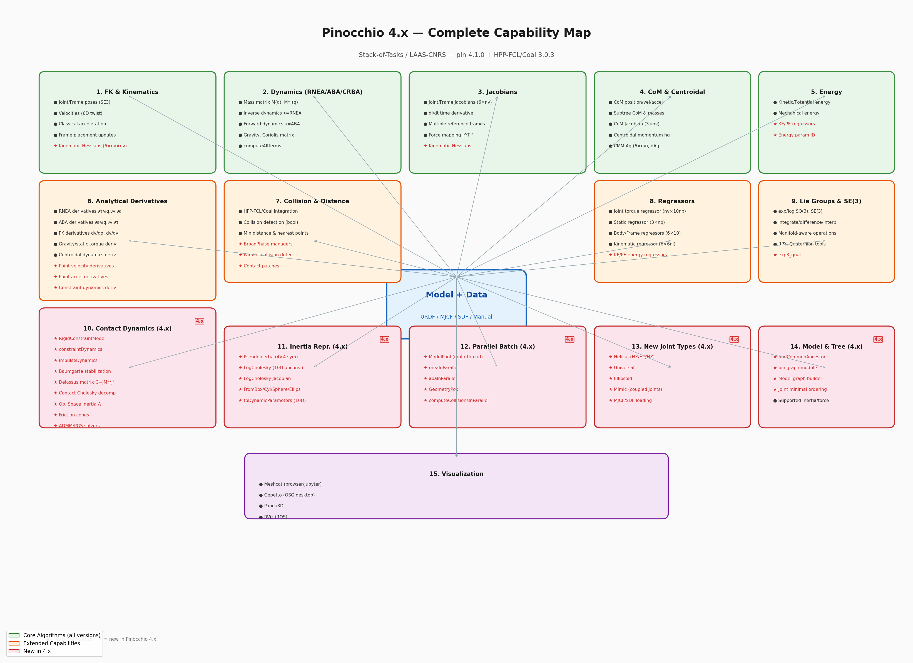
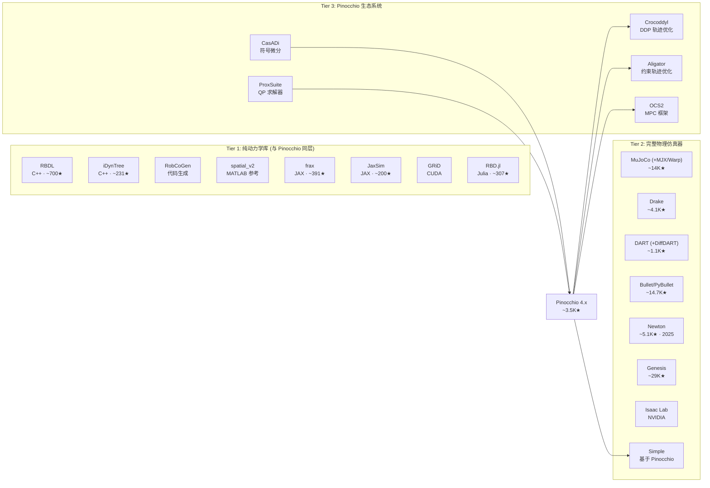
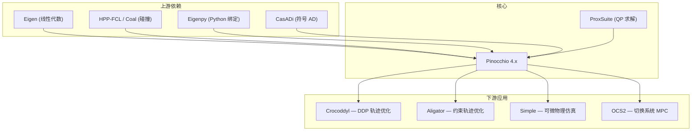

# Pinocchio 4.1.0: Complete Capability Analysis

> **Pinocchio** (https://github.com/stack-of-tasks/pinocchio) is a C++/Python library for efficient rigid-body dynamics algorithms, developed by LAAS-CNRS (Gepetto team) and INRIA (Willow team). It implements state-of-the-art algorithms for forward/inverse kinematics, forward/inverse dynamics, Jacobians, collision detection, centroidal dynamics, and — critically — **analytical derivatives** of all these quantities. This makes it uniquely suited for optimization-based robotics (trajectory optimization, MPC, differentiable simulation).
>
> Version 4.x introduced significant new capabilities: kinematic Hessians, PseudoInertia & LogCholesky parameterizations for differentiable inertia optimization, modern constraint dynamics with Baumgarte stabilization, Delassus matrix computation, Contact Cholesky decomposition with operational space inertia, friction cones, ADMM/PGS constraint solvers, parallel batch computation, BroadPhase collision managers, MJCF/SDF model loading, new joint types (Helical, Universal, Ellipsoid, Mimic), and energy regressors.

> **Official resources:**
> - GitHub: https://github.com/stack-of-tasks/pinocchio
> - Documentation: https://gepettoweb.laas.fr/doc/stack-of-tasks/pinocchio/master/doxygen-html/
> - Tutorials & examples: https://github.com/stack-of-tasks/pinocchio/tree/master/examples
> - Paper: Carpentier et al., "The Pinocchio C++ library — A fast and flexible implementation of rigid body dynamics algorithms and their analytical derivatives," SII 2019
> - Paper (v4 features): Carpentier et al., "Pinocchio 3: Analytical Derivatives of Rigid Body Dynamics Algorithms with Contact and Their Application," IEEE TRO 2024

---

## 0. Environment Note

> [!NOTE]
> **本文档基于 `itvlaGp` 环境中的 Pinocchio 4.1.0 (通过 `uv pip install pin` 安装).**
>
> ```
> Package: pin 4.1.0
> HPP-FCL (Coal): 3.0.3
> Eigenpy: 3.12.0
> ```
>
> 验证安装:
> ```python
> import pinocchio as pin
> print(pin.__version__)           # 4.1.0
> print(pin.WITH_HPP_FCL)          # True
> print(pin.WITH_URDFDOM)          # True
> print(pin.WITH_SDFORMAT)         # True
> ```
>
> **历史注意:** PyPI 上的 `pinocchio` 包名 (无 `pin` 前缀) 实际上是 [pinocchio (nose testing plugin)](https://github.com/mkwiatkowski/pinocchio), 与机器人学无关. 正确的安装包名为 `pin`.

---

## Capability Overview

下图展示了 Pinocchio 4.x 所有可提取信息的完整能力图谱:



Pinocchio 从一个机器人模型 (URDF/SDF/MJCF 或手动构建) 中可提取的信息, 按类别分为以下大类:

```mermaid
graph TD
    URDF["URDF / SDF / MJCF"] --> Model["Model + Data"]
    Manual["Manual Build"] --> Model
    Model --> FK["1. Forward Kinematics<br/>Joint/Frame Poses, Velocities, Accelerations"]
    Model --> Dyn["2. Dynamics<br/>Mass Matrix, RNEA, ABA, Gravity, Coriolis"]
    Model --> Jac["3. Jacobians & Hessians<br/>Joint/Frame Jacobians, dJ/dt, Kinematic Hessians"]
    Model --> CoM["4. Center of Mass<br/>CoM, vCoM, aCoM, Jcom, Subtree Masses"]
    Model --> Cent["5. Centroidal Dynamics<br/>Momentum hg, Ag Matrix, dhg"]
    Model --> Energy["6. Energy & Regressors<br/>KE, PE, Mechanical Energy, Energy Regressors"]
    Model --> Deriv["7. Analytical Derivatives<br/>RNEA/ABA/FK/Gravity/Point Derivatives"]
    Model --> Coll["8. Collision & Distance<br/>HPP-FCL/Coal, BroadPhase Managers, Parallel"]
    Model --> Reg["9. Regressors<br/>Torque/Kinematic/Energy/Static Regressors"]
    Model --> Contact["10. Contact Dynamics<br/>Constraint Dynamics, Delassus, Contact Cholesky,<br/>Impulse, Friction Cones, ADMM/PGS Solvers"]
    Model --> Lie["11. Lie Group / SE(3)<br/>exp/log, integrate, difference, interpolate, Quaternion"]
    Model --> Inertia["12. Inertia Representations<br/>PseudoInertia, LogCholesky, Factory Methods"]
    Model --> Info["13. Model Introspection & Tree<br/>Joint Limits, Tree Structure, findCommonAncestor"]
    Model --> Parallel["14. Parallel Batch Computation<br/>ModelPool, GeometryPool, RNEA/ABA/Collision in Parallel"]
    Model --> Viz["15. Visualization<br/>Meshcat, Gepetto, Panda3D, RViz"]
```



---

## 1. Model Loading & Introspection

### 1.1 从 URDF / MJCF / SDF 加载

Pinocchio 的核心数据结构是 `Model`(描述机器人的运动学和动力学参数)和 `Data`(存储计算中间结果和输出).

```python
import pinocchio as pin
import numpy as np

# ---- URDF 加载 ----
# 方式 1: 仅运动学/动力学模型
model = pin.buildModelFromUrdf("robot.urdf")

# 方式 2: 模型 + 碰撞/视觉几何体
model, collision_model, visual_model = pin.buildModelsFromUrdf(
    "robot.urdf", package_dirs="meshes/"
)

# 方式 3: 浮动基座 (人形/四足)
model = pin.buildModelFromUrdf("humanoid.urdf", pin.JointModelFreeFlyer())

# 方式 4: 从 XML 字符串
model = pin.buildModelFromXML(urdf_xml_string)

# ---- MJCF 加载 (4.x 新增) ----
# 仅模型
model = pin.buildModelFromMJCF("robot.xml")

# 模型 + 带有 root joint 的模型
model = pin.buildModelFromMJCFAndRootJoint("robot.xml", pin.JointModelFreeFlyer())

# 模型 + 约束 (MJCF 中的 equality 约束)
model, constraint_models = pin.buildModelAndConstraintsFromMJCF("robot.xml")

# 模型 + 碰撞几何
geom_model = pin.buildGeomFromMJCF(model, "robot.xml", pin.GeometryType.COLLISION)

# ---- SDF 加载 (4.x 新增, 需 WITH_SDFORMAT=True) ----
models, constraints = pin.buildModelsAndConstraintsFromSdf("robot.sdf")

# 创建数据对象 (存放计算结果)
data = model.createData()
```

**参考:**
- URDF: https://gepettoweb.laas.fr/doc/stack-of-tasks/pinocchio/master/doxygen-html/md_doc_b-examples_i-build-model.html
- MJCF: https://github.com/stack-of-tasks/pinocchio/tree/master/examples — `robot-model-from-mjcf.py`
- SDF: https://github.com/stack-of-tasks/pinocchio/pull/1427

### 1.2 Model 可提取的静态信息

加载模型后, 无需任何计算即可直接读取以下信息:

| 属性 | 类型 | 说明 |
|------|------|------|
| `model.njoints` | int | 关节总数 (含 universe 虚拟关节) |
| `model.nq` | int | 广义坐标维度 (configuration space dim) |
| `model.nv` | int | 广义速度维度 (velocity/tangent space dim, = 自由度 DoF) |
| `model.nbodies` | int | 刚体数量 |
| `model.nframes` | int | 帧 (frame) 数量 |
| `model.name` | str | 模型名称 |
| `model.gravity` | Motion | 重力加速度 (默认 $[0, 0, -9.81]$ m/s$^2$) |
| `model.names[i]` | str | 第 $i$ 个关节的名称 |
| `model.parents[i]` | int | 第 $i$ 个关节的父关节索引 (构成运动学树) |
| `model.joints[i]` | JointModel | 第 $i$ 个关节的类型和参数 |
| `model.jointPlacements[i]` | SE3 | 第 $i$ 个关节在其父关节坐标系中的位姿 |
| `model.inertias[i]` | Inertia | 第 $i$ 个连杆的空间惯量 (mass, lever/CoM, rotational inertia) |
| `model.frames[i]` | Frame | 帧信息: `.name`, `.type`, `.parent`, `.placement`, `.previousFrame` |
| `model.lowerPositionLimit` | ndarray(nq) | 关节位置下限 |
| `model.upperPositionLimit` | ndarray(nq) | 关节位置上限 |
| `model.velocityLimit` | ndarray(nv) | 关节速度限制 |
| `model.effortLimit` | ndarray(nv) | 关节力矩/力限制 |
| `model.friction` | ndarray(nv) | 关节摩擦系数 |
| `model.damping` | ndarray(nv) | 关节阻尼系数 |
| `model.rotorInertia` | ndarray(nv) | 电机转子惯量 |
| `model.rotorGearRatio` | ndarray(nv) | 电机减速比 |
| `model.subtrees[i]` | list | 以关节 $i$ 为根的子树中所有关节索引 |
| `model.supports[i]` | list | 从根到关节 $i$ 的支撑链 (ancestor chain) |

> **$n_q$ vs $n_v$ 的区别:** 对于纯旋转关节 (revolute), $n_q = n_v = 1$. 但对于球面关节 (spherical, 用四元数表示), $n_q = 4$ 而 $n_v = 3$; 对于自由浮动关节 (free-flyer), $n_q = 7$ (xyz + quaternion) 而 $n_v = 6$ (线速度 + 角速度). 这是因为构型空间 $\mathcal{Q}$ 是流形 (manifold) 而非欧氏空间.

```python
# ---- 遍历所有关节, 提取完整信息 ----
for i in range(model.njoints):
    print(f"Joint {i}: name='{model.names[i]}', parent={model.parents[i]}, "
          f"nq={model.nqs[i]}, nv={model.nvs[i]}, "
          f"idx_q={model.idx_qs[i]}, idx_v={model.idx_vs[i]}")
    inertia = model.inertias[i]
    print(f"  mass={inertia.mass:.4f} kg, CoM={inertia.lever.T}, "
          f"rotational_inertia=\n{inertia.inertia}")

# ---- 遍历所有帧 ----
for i in range(model.nframes):
    frame = model.frames[i]
    # frame.type: JOINT, FIXED_JOINT, BODY, OP_FRAME, SENSOR
    print(f"Frame {i}: name='{frame.name}', type={frame.type}, parent_joint={frame.parent}")

# ---- 关节限制 ----
print(f"Position limits: [{model.lowerPositionLimit.T}, {model.upperPositionLimit.T}]")
print(f"Velocity limits: {model.velocityLimit.T}")
print(f"Effort limits:   {model.effortLimit.T}")

# ---- 运动学树结构 ----
for i in range(model.njoints):
    print(f"Joint {i} ({model.names[i]}): "
          f"subtree={list(model.subtrees[i])}, "
          f"supports={list(model.supports[i])}")
```

### 1.3 支持的关节类型

Pinocchio 支持丰富的关节类型. 4.x 新增了 Helical, Universal, Ellipsoid, Mimic 关节:

| 关节类型 | nq | nv | 说明 |
|----------|----|----|------|
| `JointModelRX/RY/RZ` | 1 | 1 | 绕 X/Y/Z 轴的旋转关节 (revolute) |
| `JointModelPX/PY/PZ` | 1 | 1 | 沿 X/Y/Z 轴的平移关节 (prismatic) |
| `JointModelRevoluteUnaligned` | 1 | 1 | 绕任意轴的旋转关节 |
| `JointModelPrismaticUnaligned` | 1 | 1 | 沿任意轴的平移关节 |
| `JointModelRUBX/Y/Z` | 2 | 1 | 连续旋转关节 (unbounded, 用 cos/sin 表示) |
| `JointModelSpherical` | 4 | 3 | 球面关节 (四元数表示) |
| `JointModelSphericalZYX` | 3 | 3 | 球面关节 (欧拉角 ZYX 表示) |
| `JointModelFreeFlyer` | 7 | 6 | 自由浮动关节 (xyz + quaternion) |
| `JointModelPlanar` | 4 | 3 | 平面关节 (x, y, cos$\theta$, sin$\theta$) |
| `JointModelTranslation` | 3 | 3 | 纯平移关节 |
| `JointModelComposite` | $\sum$ | $\sum$ | 复合关节 (多个简单关节的组合) |
| **`JointModelHX/HY/HZ`** | 1 | 1 | **螺旋关节 (4.x 新增)**: 同时旋转+平移, 如螺栓、丝杠 |
| **`JointModelUniversal`** | 2 | 2 | **万向关节 (4.x 新增)**: 两个相交轴的旋转自由度 |
| **`JointModelEllipsoid`** | 3 | 3 | **椭球关节 (4.x 新增)**: 三个旋转自由度 |
| **`JointModelMimic`** | - | - | **Mimic 关节 (4.x 新增)**: 耦合跟随关节, $q_{mimic} = s \cdot q_{ref} + o$ |

```python
# ---- 4.x 新增关节类型 ----

# 螺旋关节: 旋转和平移耦合 (如螺丝, 丝杠)
helix = pin.JointModelHX()  # 绕 X 轴, nq=1, nv=1
# 还有 pin.JointModelHY(), pin.JointModelHZ()

# 万向关节: 两个旋转自由度 (如万向节、传动轴)
universal = pin.JointModelUniversal()  # nq=2, nv=2

# 椭球关节: 三个旋转自由度
ellipsoid = pin.JointModelEllipsoid()  # nq=3, nv=3 (不同于 Spherical 的四元数表示)

# Mimic 关节: 跟随另一个关节的运动 (用于平行夹爪等)
# q_mimic = scaling * q_reference + offset
mimic = pin.JointModelMimic(pin.JointModelRX(), scaling=2.0, offset=0.5)
```

**参考:** https://github.com/stack-of-tasks/pinocchio/pull/1575 (Helical), https://github.com/stack-of-tasks/pinocchio/pull/1838 (Universal), https://github.com/stack-of-tasks/pinocchio/pull/2192 (Mimic)

### 1.4 手动构建模型 (无需 URDF)

```python
model = pin.Model()
model.name = "my_2dof_arm"

# 添加关节 1: 绕 Z 轴旋转
joint1_id = model.addJoint(
    0,                        # parent joint (0 = universe/root)
    pin.JointModelRZ(),       # joint type
    pin.SE3.Identity(),       # placement in parent frame
    "shoulder"                # joint name
)
# 为关节 1 附加刚体 (连杆)
model.appendBodyToJoint(
    joint1_id,
    pin.Inertia(1.0, np.array([0, 0, 0.5]), np.eye(3) * 0.01),  # mass, CoM, inertia
    pin.SE3.Identity()
)
model.addJointFrame(joint1_id)

# 添加关节 2: 绕 Y 轴旋转, 安装在关节 1 的末端
joint2_id = model.addJoint(
    joint1_id,
    pin.JointModelRY(),
    pin.SE3(np.eye(3), np.array([0, 0, 1.0])),  # offset along z by 1m
    "elbow"
)
model.appendBodyToJoint(
    joint2_id,
    pin.Inertia(0.5, np.array([0, 0, 0.25]), np.eye(3) * 0.005),
    pin.SE3.Identity()
)
model.addJointFrame(joint2_id)

print(f"Model: njoints={model.njoints}, nq={model.nq}, nv={model.nv}")
# Output: Model: njoints=3, nq=2, nv=2  (含 universe 关节)
```

### 1.5 模型操作

```python
# ---- 锁定部分关节, 创建简化模型 ----
joints_to_lock = [model.getJointId("wrist1_joint"), model.getJointId("wrist2_joint")]
q_ref = pin.neutral(model)  # 锁定位置
reduced_model = pin.buildReducedModel(model, joints_to_lock, q_ref)

# ---- 合并两个模型 (如双臂) ----
combined = pin.appendModel(model_left, model_right, frame_id, pin.SE3.Identity())

# ---- 运动学树查询 (4.x 新增) ----
# 查找两个关节的最近公共祖先
ancestor_id, depth1, depth2 = pin.findCommonAncestor(model, joint1_id, joint2_id)
print(f"Common ancestor: {model.names[ancestor_id]}, depths: ({depth1}, {depth2})")

# ---- 关节最小排序 ----
ordering = pin.computeJointMinimalOrdering(model)

# ---- 序列化/反序列化 ----
model_str = model.saveToString()
model_restored = pin.Model()
model_restored.loadFromString(model_str)
# 也支持 saveToBinary/loadFromBinary, saveToText/loadFromText
```

**参考:** https://gepettoweb.laas.fr/doc/stack-of-tasks/pinocchio/master/doxygen-html/md_doc_b-examples_i-build-model.html

---

## 2. Forward Kinematics (正运动学)

FK 是 Pinocchio 最基础的计算: 给定关节角度 $q$ (及可选的速度 $\dot{q}$, 加速度 $\ddot{q}$), 计算每个关节和帧的位姿、速度、加速度.

### 2.1 核心 API

| 函数 | 输入 | 计算内容 | 输出存储位置 |
|------|------|----------|-------------|
| `forwardKinematics(model, data, q)` | $q$ | 关节位姿 | `data.oMi[i]` |
| `forwardKinematics(model, data, q, v)` | $q, \dot{q}$ | 位姿 + 速度 | `data.oMi[i]`, `data.v[i]` |
| `forwardKinematics(model, data, q, v, a)` | $q, \dot{q}, \ddot{q}$ | 位姿 + 速度 + 加速度 | `data.oMi[i]`, `data.v[i]`, `data.a[i]` |
| `updateFramePlacements(model, data)` | (FK 后调用) | 所有帧位姿 | `data.oMf[i]` |
| `framesForwardKinematics(model, data, q)` | $q$ | FK + 帧位姿 (合并) | `data.oMi[i]`, `data.oMf[i]` |

其中:
- `data.oMi[i]`: 第 $i$ 个**关节** (joint) 在世界坐标系 (origin) 中的 SE(3) 位姿, 包含 `.translation` (3D 位置) 和 `.rotation` (3×3 旋转矩阵)
- `data.oMf[i]`: 第 $i$ 个**帧** (frame) 在世界坐标系中的 SE(3) 位姿 — **这就是我们目前用来提取 3D 关键点的数据**
- `data.v[i]`: 第 $i$ 个关节的空间速度 (6D twist: linear + angular)
- `data.a[i]`: 第 $i$ 个关节的空间加速度

### 2.2 完整示例: 提取所有帧信息

```python
import pinocchio as pin
import numpy as np

model = pin.buildModelFromUrdf("robot.urdf")
data = model.createData()

q = pin.neutral(model)           # 零位构型
v = np.zeros(model.nv)           # 零速度
a = np.zeros(model.nv)           # 零加速度

# 计算 FK (含速度和加速度)
pin.forwardKinematics(model, data, q, v, a)
pin.updateFramePlacements(model, data)

# ---- 提取关节 3D 位置 + 姿态 ----
for i in range(model.njoints):
    pos = data.oMi[i].translation      # (3,) 世界坐标系中的位置
    rot = data.oMi[i].rotation          # (3, 3) 旋转矩阵
    homogeneous = data.oMi[i].homogeneous  # (4, 4) 齐次变换矩阵
    print(f"Joint {model.names[i]}: pos={pos.T}, rot_det={np.linalg.det(rot):.1f}")

# ---- 提取帧 3D 位置 (关键点) ----
for i in range(model.nframes):
    frame = model.frames[i]
    pos = data.oMf[i].translation
    rot = data.oMf[i].rotation
    print(f"Frame '{frame.name}' ({frame.type}): pos={pos.T}")

# ---- 提取关节/帧速度和加速度 ----
for i in range(1, model.njoints):
    v_joint = data.v[i]
    print(f"Joint {model.names[i]}: "
          f"linear_vel={v_joint.linear.T}, angular_vel={v_joint.angular.T}")
```

### 2.3 帧速度与加速度 (更精细的提取)

```python
pin.forwardKinematics(model, data, q, v, a)
pin.updateFramePlacements(model, data)

frame_id = model.getFrameId("end_effector")

# 帧速度 (6D twist), 可选择参考坐标系:
#   LOCAL:               在帧自身坐标系中
#   WORLD:               在世界坐标系中 (空间速度)
#   LOCAL_WORLD_ALIGNED:  原点在帧位置, 但轴与世界坐标系对齐
v_frame = pin.getFrameVelocity(model, data, frame_id, pin.LOCAL_WORLD_ALIGNED)
print(f"End-effector linear velocity:  {v_frame.linear.T} m/s")
print(f"End-effector angular velocity: {v_frame.angular.T} rad/s")

# 帧加速度 (spatial acceleration, 含 Coriolis 项)
a_frame = pin.getFrameAcceleration(model, data, frame_id, pin.LOCAL_WORLD_ALIGNED)

# 经典加速度 (classical acceleration, 即人们通常理解的 "加速度")
# a_classical = a_spatial + v_angular × v_linear
a_classical = pin.getFrameClassicalAcceleration(model, data, frame_id, pin.LOCAL_WORLD_ALIGNED)
print(f"Classical linear acceleration: {a_classical.linear.T} m/s^2")
```

> **空间加速度 vs 经典加速度:** 空间加速度 $\dot{v}$ 是 twist 的时间导数, 包含了科里奥利/离心力效应. 经典加速度 $a_{\text{classical}} = \ddot{p}$ 才是质点加速度的直觉含义. 两者的关系: $a_{\text{classical}} = a_{\text{spatial}} + \omega \times v_{\text{linear}}$.

**参考:** https://gepettoweb.laas.fr/doc/stack-of-tasks/pinocchio/master/doxygen-html/md_doc_b-examples_d-inverse-kinematics.html

---

## 3. Dynamics (动力学)

Pinocchio 实现了机器人动力学的三大核心算法: RNEA (逆动力学), ABA (正动力学), CRBA (质量矩阵). 这三者共同支撑了从控制到仿真的几乎所有动力学需求.

### 3.1 方程背景

机器人动力学的标准形式为:

$$M(q)\ddot{q} + C(q, \dot{q})\dot{q} + g(q) = \tau + J_c^T \lambda$$

其中:
- $M(q)$: 广义质量/惯性矩阵 (mass matrix), $n_v \times n_v$, 对称正定
- $C(q, \dot{q})$: 科里奥利矩阵 (Coriolis matrix), $n_v \times n_v$
- $g(q)$: 广义重力向量, $n_v \times 1$
- $\tau$: 关节力矩/力 (joint torques), $n_v \times 1$
- $J_c$: 接触雅可比, $\lambda$: 接触力

### 3.2 逆动力学 (RNEA)

**RNEA** (Recursive Newton-Euler Algorithm) 求解: 给定 $q, \dot{q}, \ddot{q}$, 计算所需的关节力矩 $\tau$.

$$\tau = M(q)\ddot{q} + C(q, \dot{q})\dot{q} + g(q)$$

| 函数 | 计算 | 复杂度 |
|------|------|--------|
| `pin.rnea(model, data, q, v, a)` | $\tau = \text{RNEA}(q, \dot{q}, \ddot{q})$ | $O(n)$ |
| `pin.rnea(model, data, q, v, a, fext)` | 带外力的 RNEA | $O(n)$ |
| `pin.nonLinearEffects(model, data, q, v)` | $C\dot{q} + g = \text{RNEA}(q, \dot{q}, 0)$ | $O(n)$ |
| `pin.computeGeneralizedGravity(model, data, q)` | $g = \text{RNEA}(q, 0, 0)$ | $O(n)$ |
| `pin.computeCoriolisMatrix(model, data, q, v)` | 科里奥利矩阵 $C(q, \dot{q})$ | $O(n^2)$ |
| `pin.computeStaticTorque(model, data, q, fext)` | 静态力矩 $g(q) - J^T f_{\text{ext}}$ | $O(n)$ |

```python
# 逆动力学: 给定期望运动, 计算所需力矩
tau = pin.rnea(model, data, q, v, a_desired)
print(f"Required joint torques: {tau.T}")

# 仅计算重力补偿力矩 (最常用)
g = pin.computeGeneralizedGravity(model, data, q)
print(f"Gravity torques: {g.T}")

# 非线性效应 (Coriolis + gravity)
nle = pin.nonLinearEffects(model, data, q, v)
print(f"Nonlinear effects (C*v + g): {nle.T}")

# 完整科里奥利矩阵
C = pin.computeCoriolisMatrix(model, data, q, v)
print(f"Coriolis matrix C: {C.shape}")  # (nv, nv)
```

### 3.3 正动力学 (ABA)

**ABA** (Articulated Body Algorithm) 求解: 给定 $q, \dot{q}, \tau$, 计算关节加速度 $\ddot{q}$.

$$\ddot{q} = M(q)^{-1}(\tau - C(q, \dot{q})\dot{q} - g(q))$$

| 函数 | 计算 | 复杂度 |
|------|------|--------|
| `pin.aba(model, data, q, v, tau)` | $\ddot{q} = \text{ABA}(q, \dot{q}, \tau)$ | $O(n)$ |
| `pin.aba(model, data, q, v, tau, fext)` | 带外力的 ABA | $O(n)$ |

```python
# 正动力学: 给定力矩, 计算加速度
tau_applied = np.ones(model.nv)
a_result = pin.aba(model, data, q, v, tau_applied)
print(f"Resulting joint accelerations: {a_result.T}")
# a_result 也存储在 data.ddq 中
```

### 3.4 质量矩阵 (CRBA)

**CRBA** (Composite Rigid Body Algorithm) 计算质量矩阵 $M(q)$.

| 函数 | 计算 | 复杂度 |
|------|------|--------|
| `pin.crba(model, data, q)` | 质量矩阵 $M(q)$ (上三角) | $O(n^2)$ |
| `pin.computeMinverse(model, data, q)` | $M^{-1}(q)$ | $O(n^2)$ |

```python
# 质量矩阵
pin.crba(model, data, q)
M = data.M  # 注意: 仅存储上三角!
M_full = M + M.T - np.diag(M.diagonal())  # 完整对称矩阵
print(f"Mass matrix M(q): {M_full.shape}")

# 质量矩阵的逆
pin.computeMinverse(model, data, q)
Minv = data.Minv
# 验证: M * M^{-1} ≈ I
assert np.allclose(M_full @ Minv, np.eye(model.nv), atol=1e-10)

# Composite Rigid Body Inertia (CRBA 的副产品)
# data.Ycrb[i] 存储以关节 i 为根的子树的等效惯量
pin.crba(model, data, q)
for i in range(model.njoints):
    print(f"Joint {model.names[i]}: subtree composite mass = {data.Ycrb[i].mass:.4f} kg")
```

### 3.5 一次性计算所有量: `computeAllTerms`

```python
# 一次调用, 计算几乎所有动力学量
pin.computeAllTerms(model, data, q, v)

# 之后可直接访问:
print(f"Mass matrix M:       {data.M.shape}")        # (nv, nv)
print(f"Nonlinear effects:   {data.nle.T}")           # (nv,) = C*v + g
print(f"CoM position:        {data.com[0].T}")        # (3,)
print(f"CoM velocity:        {data.vcom[0].T}")       # (3,)
print(f"CoM Jacobian:        {data.Jcom.shape}")      # (3, nv)
print(f"Kinetic energy:      {data.kinetic_energy}")   # scalar
print(f"Potential energy:    {data.potential_energy}")  # scalar
print(f"Total mass:          {data.mass[0]}")          # scalar
```

**参考:** https://gepettoweb.laas.fr/doc/stack-of-tasks/pinocchio/master/doxygen-html/md_doc_b-examples_e-dynamics.html

---

## 4. Jacobians & Kinematic Hessians (雅可比矩阵与运动学 Hessian)

### 4.1 雅可比矩阵

雅可比矩阵 $J \in \mathbb{R}^{6 \times n_v}$ 将关节速度 $\dot{q}$ 映射为末端执行器的空间速度:

$$v_{\text{frame}} = J(q) \cdot \dot{q}$$

| 函数 | 说明 |
|------|------|
| `computeJointJacobians(model, data, q)` | 计算所有关节的雅可比 |
| `getJointJacobian(model, data, joint_id, rf)` | 提取特定关节的雅可比 |
| `computeJointJacobian(model, data, q, joint_id)` | 计算单个关节雅可比 (LOCAL 坐标系) |
| `computeFrameJacobian(model, data, q, frame_id, rf)` | 计算帧的雅可比 |
| `getFrameJacobian(model, data, frame_id, rf)` | 提取帧雅可比 (需先调用 computeJointJacobians) |
| `computeJointJacobiansTimeVariation(model, data, q, v)` | 雅可比对时间的导数 $\dot{J}$ |
| `getJointJacobianTimeVariation(model, data, joint_id, rf)` | 提取 $\dot{J}$ |
| `getFrameJacobianTimeVariation(model, data, frame_id, rf)` | 帧的 $\dot{J}$ |

**参考坐标系 (Reference Frame)** 是理解雅可比的关键:
- `pin.LOCAL`: 在关节/帧自身坐标系中 (body-fixed frame)
- `pin.WORLD`: 在世界坐标系中 (spatial Jacobian)
- `pin.LOCAL_WORLD_ALIGNED` (LWA): 原点在关节/帧位置, 轴与世界坐标系对齐 — **最常用**, 因为线速度部分直接对应笛卡尔速度

```python
# ---- 末端执行器雅可比 ----
pin.computeJointJacobians(model, data, q)
pin.framesForwardKinematics(model, data, q)

frame_id = model.getFrameId("end_effector")

# 帧雅可比 (6 x nv): 前3行=线速度映射, 后3行=角速度映射
J = pin.computeFrameJacobian(model, data, q, frame_id, pin.LOCAL_WORLD_ALIGNED)
print(f"Frame Jacobian: {J.shape}")  # (6, nv)

J_linear = J[:3, :]   # (3, nv) 线速度部分
J_angular = J[3:, :]   # (3, nv) 角速度部分

# ---- 不同参考坐标系的关节雅可比 ----
J_local = pin.getJointJacobian(model, data, 6, pin.LOCAL)
J_world = pin.getJointJacobian(model, data, 6, pin.WORLD)
J_lwa   = pin.getJointJacobian(model, data, 6, pin.LOCAL_WORLD_ALIGNED)

# ---- 雅可比的时间导数 (用于操作空间控制) ----
pin.computeJointJacobiansTimeVariation(model, data, q, v)
dJ = pin.getJointJacobianTimeVariation(model, data, 6, pin.LOCAL_WORLD_ALIGNED)
print(f"dJ/dt: {dJ.shape}")  # (6, nv)
# 操作空间加速度: a_task = J * ddq + dJ * dq
```

### 4.2 运动学 Hessian (4.x 新增)

运动学 Hessian 是雅可比对构型 $q$ 的导数, 即空间速度的二阶映射. 对于关节 $i$, Hessian $H_i \in \mathbb{R}^{6 \times n_v \times n_v}$ 满足:

$$\frac{d}{dt} J_i(q) \dot{q} = H_i(q)[\dot{q}, \dot{q}] + J_i(q) \ddot{q}$$

这在二阶优化 (如 Newton-Raphson IK、轨迹优化的二阶展开) 中至关重要.

```python
q = pin.randomConfiguration(model)

# 计算所有关节的运动学 Hessian
pin.computeJointKinematicHessians(model, data, q)

# 提取特定关节的 Hessian 张量
joint_id = 6
H = pin.getJointKinematicHessian(model, data, joint_id, pin.LOCAL_WORLD_ALIGNED)
print(f"Joint Hessian shape: {H.shape}")  # (6, nv, nv)

# 提取特定帧的 Hessian
frame_id = model.getFrameId("end_effector")
Hf = pin.getFrameKinematicHessian(model, data, frame_id, pin.LOCAL_WORLD_ALIGNED)
print(f"Frame Hessian shape: {Hf.shape}")  # (6, nv, nv)
# H[k, i, j] = d²(v_k) / d(q_i) d(q_j), k ∈ {0..5} 对应 6D twist 分量
```

**参考:** Carpentier et al., "Pinocchio 3: Analytical Derivatives of Rigid Body Dynamics Algorithms with Contact," TRO 2024, Section IV-B. https://github.com/stack-of-tasks/pinocchio/pull/1559

### 4.3 雅可比的应用

```python
# ---- 逆运动学 (Damped Least-Squares IK) ----
oMdes = pin.SE3(np.eye(3), np.array([0.5, 0.0, 0.3]))  # 目标位姿
eps = 1e-4
damp = 1e-6
q_ik = pin.neutral(model)

for _ in range(1000):
    pin.framesForwardKinematics(model, data, q_ik)
    oMcur = data.oMf[frame_id]
    err = pin.log6(oMcur.inverse() * oMdes).vector  # 6D 位姿误差 (in se(3))
    if np.linalg.norm(err) < eps:
        break
    J = pin.computeFrameJacobian(model, data, q_ik, frame_id, pin.LOCAL)
    # Damped least-squares: dq = J^T (J J^T + λ I)^{-1} err
    JJt = J @ J.T + damp * np.eye(6)
    dq = J.T @ np.linalg.solve(JJt, err)
    q_ik = pin.integrate(model, q_ik, dq)

# ---- 力传递: 笛卡尔力 -> 关节力矩 ----
f_cartesian = np.array([10, 0, 0, 0, 0, 0])  # 6D wrench at end-effector
tau_joints = J.T @ f_cartesian  # 等效关节力矩

# ---- 奇异性分析 ----
_, s, _ = np.linalg.svd(J)
manipulability = np.prod(s)
condition_number = s[0] / s[-1] if s[-1] > 1e-10 else float('inf')
print(f"Manipulability: {manipulability:.6f}")
print(f"Condition number: {condition_number:.2f}")
```

**参考:** https://gepettoweb.laas.fr/doc/stack-of-tasks/pinocchio/master/doxygen-html/md_doc_b-examples_d-inverse-kinematics.html

---

## 5. Center of Mass (质心)

### 5.1 API

| 函数 | 计算 | 输出 |
|------|------|------|
| `computeTotalMass(model)` | 机器人总质量 | 返回 scalar |
| `computeSubtreeMasses(model, data)` | 各子树质量 | `data.mass[i]` |
| `centerOfMass(model, data, q)` | CoM 位置 | `data.com[0]` |
| `centerOfMass(model, data, q, v)` | CoM 位置 + 速度 | `data.com[0]`, `data.vcom[0]` |
| `centerOfMass(model, data, q, v, a)` | CoM 位置 + 速度 + 加速度 | `data.com[0]`, `data.vcom[0]`, `data.acom[0]` |
| `jacobianCenterOfMass(model, data, q)` | CoM 雅可比 | `data.Jcom` (3×nv) |
| `getJacobianSubtreeCenterOfMass(model, data, i)` | 子树 CoM 雅可比 | 返回 (3, nv) |

```python
# ---- 全局质心 ----
total_mass = pin.computeTotalMass(model)
pin.centerOfMass(model, data, q, v, a)

com  = data.com[0]    # (3,) 世界坐标系中的质心位置
vcom = data.vcom[0]   # (3,) 质心速度
acom = data.acom[0]   # (3,) 质心加速度
print(f"Total mass: {total_mass} kg")
print(f"CoM: {com.T} m")
print(f"CoM velocity: {vcom.T} m/s")

# ---- 各子树质心 (逐连杆) ----
pin.computeSubtreeMasses(model, data)
for i in range(model.njoints):
    print(f"Joint {model.names[i]}: "
          f"subtree mass={data.mass[i]:.3f} kg, "
          f"subtree CoM={data.com[i].T}")

# ---- CoM 雅可比 ----
Jcom = pin.jacobianCenterOfMass(model, data, q)  # (3, nv)
# vcom = Jcom @ dq

# ---- 碰撞体半径 (body radius 用于自碰撞检测) ----
pin.computeBodyRadius(model, data, geom_model)
```

---

## 6. Centroidal Dynamics (质心动量动力学)

质心动量 $h_G = [k_G; l_G]$ 包含线性动量 (linear momentum) 和角动量 (angular momentum), 是人形机器人平衡控制的关键量.

$$h_G = A_G(q) \dot{q}$$

其中 $A_G$ 是 **Centroidal Momentum Matrix** (CMM, 6×nv).

| 函数 | 计算 | 输出 |
|------|------|------|
| `computeCentroidalMomentum(model, data)` | 质心动量 $h_G$ | `data.hg` (Force 类型) |
| `computeCentroidalMomentumTimeVariation(model, data)` | $\dot{h}_G$ | `data.dhg` |
| `ccrba(model, data, q, v)` | CMM $A_G$ + 复合惯量 | `data.Ag` (6×nv) |
| `dccrba(model, data, q, v)` | $\dot{A}_G$ | `data.dAg` (6×nv) |
| `computeCentroidalMap(model, data, q)` | 仅 $A_G$ (无速度) | `data.Ag` |
| `computeCentroidalMapTimeVariation(model, data, q, v)` | 仅 $\dot{A}_G$ | `data.dAg` |
| `computeCentroidalDynamicsDerivatives(model, data, q, v, a)` | $\dot{h}_G$ 对 $q, \dot{q}, \ddot{q}$ 的偏导 | 通过 `getCentroidalDynamicsDerivatives()` 获取 |

```python
pin.forwardKinematics(model, data, q, v, a)

# 质心动量
hg = pin.computeCentroidalMomentum(model, data)
print(f"Linear momentum:  {hg.linear.T} kg*m/s")
print(f"Angular momentum: {hg.angular.T} kg*m^2/s")

# 质心动量的时间导数
dhg = pin.computeCentroidalMomentumTimeVariation(model, data)
print(f"Momentum rate (= total external wrench): {dhg}")

# Centroidal Momentum Matrix
Ag = pin.ccrba(model, data, q, v)
print(f"CMM Ag: {data.Ag.shape}")  # (6, nv)

# CMM 的时间导数
dAg = pin.dccrba(model, data, q, v)
print(f"dAg/dt: {data.dAg.shape}")  # (6, nv)

# 质心动力学导数 (用于优化)
pin.computeCentroidalDynamicsDerivatives(model, data, q, v, a)
dhg_dq, dhg_dv, dhg_da, dhg_partial = pin.getCentroidalDynamicsDerivatives(model, data)
# 返回 4 个矩阵: ∂ḣ_G/∂q, ∂ḣ_G/∂v, ∂ḣ_G/∂a, ∂ḣ_G/∂(partial)
```

**参考:** Orin & Goswami, "Centroidal Momentum Matrix of a humanoid robot: Structure and properties," IROS 2008

---

## 7. Energy & Energy Regressors (能量与能量回归器)

### 7.1 基本能量计算

| 函数 | 计算 | 公式 |
|------|------|------|
| `computeKineticEnergy(model, data, q, v)` | 动能 | $T = \frac{1}{2}\dot{q}^T M(q) \dot{q}$ |
| `computePotentialEnergy(model, data, q)` | 势能 | $V = -\sum m_i g^T p_i$ |
| `computeMechanicalEnergy(model, data, q, v)` | 机械能 | $E = T + V$ |

```python
pin.forwardKinematics(model, data, q, v)

KE = pin.computeKineticEnergy(model, data, q, v)
PE = pin.computePotentialEnergy(model, data, q)
ME = pin.computeMechanicalEnergy(model, data, q, v)
print(f"Kinetic energy:    {KE:.4f} J")
print(f"Potential energy:  {PE:.4f} J")
print(f"Mechanical energy: {ME:.4f} J")  # = KE + PE
assert np.isclose(ME, KE + PE)

# computeAllTerms 之后也可直接访问:
# data.kinetic_energy, data.potential_energy, data.mechanical_energy
```

### 7.2 能量回归器 (4.x 新增)

能量回归器将能量表达为动力学参数的线性函数, 可用于参数辨识中的能量一致性约束.

| 函数 | 输出 | 说明 |
|------|------|------|
| `computeKineticEnergyRegressor(model, data, q, v)` | `data.kineticEnergyRegressor` | 动能 $T = \Phi^T_{\text{KE}} \cdot \pi$, 其中 $\pi$ 是动力学参数 |
| `computePotentialEnergyRegressor(model, data, q)` | `data.potentialEnergyRegressor` | 势能 $V = \Phi^T_{\text{PE}} \cdot \pi$ |

```python
pin.computeKineticEnergyRegressor(model, data, q, v)
phi_ke = data.kineticEnergyRegressor  # (10 * nbodies,) 向量
print(f"Kinetic energy regressor shape: {phi_ke.shape}")

pin.computePotentialEnergyRegressor(model, data, q)
phi_pe = data.potentialEnergyRegressor  # (10 * nbodies,) 向量
print(f"Potential energy regressor shape: {phi_pe.shape}")

# 验证: KE = phi_ke @ pi, PE = phi_pe @ pi
# 其中 pi 是所有连杆的 10D 动力学参数 (mass, m*cx, m*cy, m*cz, Ixx, Ixy, Ixz, Iyy, Iyz, Izz)
```

**参考:** https://github.com/stack-of-tasks/pinocchio/pull/1729

---

## 8. Analytical Derivatives (解析导数)

这是 Pinocchio 相对于其他机器人学库 (如 KDL, RBDL) 的 **核心差异化能力**. Pinocchio 提供了 RNEA 和 ABA 算法的 **闭式解析导数**, 比有限差分快几个数量级, 且无数值误差.

> **论文基础:** Carpentier & Mansard, "Analytical Derivatives of Rigid Body Dynamics Algorithms," RSS 2018.
> https://hal.archives-ouvertes.fr/hal-01790971

### 8.1 逆动力学导数 (RNEA Derivatives)

$$\frac{\partial \tau}{\partial q}, \quad \frac{\partial \tau}{\partial \dot{q}}, \quad \frac{\partial \tau}{\partial \ddot{q}} = M(q)$$

```python
pin.computeRNEADerivatives(model, data, q, v, a)

dtau_dq = data.dtau_dq  # (nv, nv): 力矩对构型的偏导
dtau_dv = data.dtau_dv  # (nv, nv): 力矩对速度的偏导
M       = data.M         # (nv, nv): 力矩对加速度的偏导 = 质量矩阵

print(f"dtau/dq: {dtau_dq.shape}")
print(f"dtau/dv: {dtau_dv.shape}")
```

### 8.2 正动力学导数 (ABA Derivatives)

$$\frac{\partial \ddot{q}}{\partial q}, \quad \frac{\partial \ddot{q}}{\partial \dot{q}}, \quad \frac{\partial \ddot{q}}{\partial \tau} = M^{-1}(q)$$

```python
pin.computeABADerivatives(model, data, q, v, tau)

ddq_dq  = data.ddq_dq  # (nv, nv): 加速度对构型的偏导
ddq_dv  = data.ddq_dv  # (nv, nv): 加速度对速度的偏导
Minv    = data.Minv     # (nv, nv): 加速度对力矩的偏导 = M^{-1}

# 验证: ddq/dtau = M^{-1}
assert np.allclose(Minv, np.linalg.inv(data.M), atol=1e-10)
```

### 8.3 运动学导数 (FK Derivatives)

```python
pin.computeForwardKinematicsDerivatives(model, data, q, v, a)

frame_id = model.getFrameId("end_effector")

# 帧速度对 q 和 v 的偏导
dvf_dq, dvf_dv = pin.getFrameVelocityDerivatives(
    model, data, frame_id, pin.LOCAL_WORLD_ALIGNED
)
print(f"dv_frame/dq: {dvf_dq.shape}")  # (6, nv)
print(f"dv_frame/dv: {dvf_dv.shape}")  # (6, nv) = Frame Jacobian

# 帧加速度对 q 和 v 的偏导
daf_dq, daf_dv = pin.getFrameAccelerationDerivatives(
    model, data, frame_id, pin.LOCAL_WORLD_ALIGNED
)
print(f"da_frame/dq: {daf_dq.shape}")  # (6, nv)
print(f"da_frame/dv: {daf_dv.shape}")  # (6, nv)

# 关节速度导数
dv_dq, dv_dv = pin.getJointVelocityDerivatives(
    model, data, 6, pin.LOCAL_WORLD_ALIGNED
)
```

### 8.4 点速度/加速度导数 (4.x 新增)

4.x 引入了任意点 (不仅是帧原点) 的速度和经典加速度导数, 对于接触点跟踪和操作空间控制特别有用.

```python
pin.computeForwardKinematicsDerivatives(model, data, q, v, np.zeros(model.nv))

# 点速度导数: 任意安装在关节上的点
# placement: 点在关节坐标系中的 SE3 位姿
placement = pin.SE3(np.eye(3), np.array([0., 0., 0.5]))  # 偏移 0.5m
dvp_dq, dvp_dv = pin.getPointVelocityDerivatives(
    model, data, joint_id, placement, pin.LOCAL_WORLD_ALIGNED
)
print(f"Point vel ∂/∂q: {dvp_dq.shape}")  # (3, nv)
print(f"Point vel ∂/∂v: {dvp_dv.shape}")  # (3, nv)

# 点经典加速度导数 (返回 4 个矩阵)
dap_dq, dap_dv, dap_da1, dap_da2 = pin.getPointClassicAccelerationDerivatives(
    model, data, joint_id, placement, pin.LOCAL_WORLD_ALIGNED
)
print(f"Point accel ∂/∂q: {dap_dq.shape}")  # (3, nv)
```

**参考:** https://github.com/stack-of-tasks/pinocchio/pull/1622

### 8.5 其他导数

```python
# 重力导数
pin.computeGeneralizedGravityDerivatives(model, data, q)
# dg/dq 存储在 data.dtau_dq 中

# 静态力矩导数
fext = pin.StdVec_Force()
for i in range(model.njoints):
    fext.append(pin.Force.Zero())
pin.computeStaticTorqueDerivatives(model, data, q, fext)

# CoM 速度导数
pin.centerOfMass(model, data, q, v)
pin.computeJointJacobians(model, data, q)
dvcom_dq = pin.getCenterOfMassVelocityDerivatives(model, data)
print(f"dvcom/dq: {dvcom_dq.shape}")  # (3, nv)
```

**应用场景:** 轨迹优化 (iLQR/DDP), 模型预测控制 (MPC), 可微仿真, 灵敏度分析, 基于梯度的运动规划.

---

## 9. Collision & Distance (碰撞检测与距离计算)

Pinocchio 通过集成 **HPP-FCL 3.0.3** (现更名为 **Coal**) 库实现碰撞检测和最小距离计算. 4.x 新增了 BroadPhase 碰撞管理器和并行碰撞检测.

### 9.1 支持的几何形状

| HPP-FCL / Coal 类型 | 说明 |
|-------------|------|
| `hppfcl.Sphere(radius)` | 球体 |
| `hppfcl.Box(x, y, z)` | 长方体 |
| `hppfcl.Cylinder(radius, length)` | 圆柱体 |
| `hppfcl.Capsule(radius, length)` | 胶囊体 |
| `hppfcl.Cone(radius, length)` | 圆锥体 |
| `hppfcl.Halfspace(normal, offset)` | 半空间 (无限平面) |
| `hppfcl.Plane(normal, offset)` | 平面 |
| `hppfcl.ConvexBase` | 凸体 |
| `hppfcl.BVHModelOBBRSS` | 三角网格 (OBB-RSS 包围盒层次) |

### 9.2 从 URDF 加载碰撞模型

```python
model = pin.buildModelFromUrdf("robot.urdf")
collision_model = pin.buildGeomFromUrdf(
    model, "robot.urdf", pin.GeometryType.COLLISION, "meshes/"
)
visual_model = pin.buildGeomFromUrdf(
    model, "robot.urdf", pin.GeometryType.VISUAL, "meshes/"
)

# 添加所有碰撞对
collision_model.addAllCollisionPairs()
# 从 SRDF 文件移除已知安全的碰撞对 (如相邻连杆)
pin.removeCollisionPairs(model, collision_model, "robot.srdf")

print(f"Geometry objects: {collision_model.ngeoms}")
print(f"Collision pairs: {len(collision_model.collisionPairs)}")
```

### 9.3 手动创建碰撞几何

```python
import hppfcl

geom_model = pin.GeometryModel()

# 为关节 3 添加球形碰撞体
# 注意 4.x API: GeometryObject(name, joint_id, SE3_placement, shape)
sphere = hppfcl.Sphere(0.1)  # 半径 0.1m
go1 = pin.GeometryObject(
    "link3_collision",                                     # 名称
    3,                                                      # 父关节 ID
    pin.SE3(np.eye(3), np.array([0, 0, 0.5])),            # 在关节坐标系中的位姿
    sphere                                                  # 碰撞几何
)
go1_id = geom_model.addGeometryObject(go1)

# 为关节 6 添加胶囊碰撞体
capsule = hppfcl.Capsule(0.05, 0.3)
go2 = pin.GeometryObject(
    "link6_collision", 6, pin.SE3.Identity(), capsule
)
go2_id = geom_model.addGeometryObject(go2)

# 注册碰撞对
geom_model.addCollisionPair(pin.CollisionPair(go1_id, go2_id))
```

> **注意:** Pinocchio 4.x 中 `GeometryObject` 构造函数的参数顺序为 `(name, joint_id, SE3, shape)`, 与 2.x 的 `(name, joint_id, shape, SE3)` 不同.

### 9.4 碰撞检测与距离计算

```python
geom_data = pin.GeometryData(geom_model)

# ---- 碰撞检测 ----
is_collision = pin.computeCollisions(
    model, data, geom_model, geom_data, q,
    False  # stop_at_first_collision: False = 检查所有对
)
print(f"Any collision: {is_collision}")

for i, cr in enumerate(geom_data.collisionResults):
    pair = geom_model.collisionPairs[i]
    name1 = geom_model.geometryObjects[pair.first].name
    name2 = geom_model.geometryObjects[pair.second].name
    print(f"  {name1} <-> {name2}: collision={cr.isCollision()}")

# ---- 最小距离计算 ----
pin.computeDistances(model, data, geom_model, geom_data, q)

for i, dr in enumerate(geom_data.distanceResults):
    pair = geom_model.collisionPairs[i]
    name1 = geom_model.geometryObjects[pair.first].name
    name2 = geom_model.geometryObjects[pair.second].name
    print(f"  {name1} <-> {name2}: "
          f"min_distance={dr.min_distance:.4f} m")
    print(f"    nearest_point_1 = {dr.getNearestPoint1().T}")
    print(f"    nearest_point_2 = {dr.getNearestPoint2().T}")

# ---- Contact Patches (接触面片, 4.x 新增) ----
# 计算接触面片 (碰撞时的接触区域)
pin.computeContactPatches(model, geom_model, geom_data, q)
```

### 9.5 BroadPhase 碰撞管理器 (4.x 新增)

BroadPhase 管理器通过层次化包围盒加速碰撞检测, 对大量碰撞对的场景 (如多机器人、复杂环境) 效率提升显著.

```python
# 可选的 BroadPhase 策略:
# - DynamicAABBTree: 动态 AABB 树 (推荐, 插入/删除效率好)
# - IntervalTree: 区间树
# - SSaP: 基于扫描的排序与修剪
# - SaP: 排序与修剪
# - Naive: 暴力枚举 (作为基准)

# TreeBroadPhaseManager 用于单次查询, BroadPhaseManagerPool 用于并行
bp = pin.TreeBroadPhaseManager_DynamicAABBTreeCollisionManager()
# 或
bp = pin.BroadPhaseManager_SaPCollisionManager()
```

**参考:** https://github.com/humanoid-path-planner/hpp-fcl, https://github.com/stack-of-tasks/pinocchio/pull/1648

---

## 10. Regressors (回归器)

回归器将机器人的动力学参数 (质量、惯量、质心偏移) 线性地与可观测量 (力矩、位姿) 关联起来, 是 **系统辨识** (system identification) 的核心工具.

| 函数 | 输出维度 | 说明 |
|------|---------|------|
| `computeJointTorqueRegressor(model, data, q, v, a)` | $n_v \times 10n_{\text{bodies}}$ | 力矩回归器: $\tau = Y(q, \dot{q}, \ddot{q}) \cdot \pi$ |
| `computeStaticRegressor(model, data, q)` | $3 \times n_{\text{params}}$ | 静态 CoM 回归器 |
| `bodyRegressor(vel, acc)` | $6 \times 10$ | 单体回归器: wrench $= Y(v, a) \cdot \phi_i$ |
| `jointBodyRegressor(model, data, joint_id)` | $6 \times 10$ | 关节处的体回归器 |
| `frameBodyRegressor(model, data, frame_id)` | $6 \times 10$ | 帧处的体回归器 |
| `computeJointKinematicRegressor(model, data, joint_id, rf, SE3)` | $6 \times 6n_{\text{joints}}$ | 运动学回归器 |
| `computeFrameKinematicRegressor(model, data, frame_id, rf)` | $6 \times 6n_{\text{joints}}$ | 帧运动学回归器 |
| `computeKineticEnergyRegressor(model, data, q, v)` | $10n_{\text{bodies}}$ 向量 | 动能回归器 (4.x 新增) |
| `computePotentialEnergyRegressor(model, data, q)` | $10n_{\text{bodies}}$ 向量 | 势能回归器 (4.x 新增) |

每个刚体有 10 个动力学参数 $\phi_i = [m, mc_x, mc_y, mc_z, I_{xx}, I_{xy}, I_{xz}, I_{yy}, I_{yz}, I_{zz}]$ (质量、质量×质心偏移、惯量张量上三角).

```python
# ---- 力矩回归器 (系统辨识核心) ----
pin.computeJointTorqueRegressor(model, data, q, v, a)
Y = data.jointTorqueRegressor  # (nv, 10*nbodies)
# tau = Y @ pi, 其中 pi 是所有连杆的 10 维动力学参数向量的拼接

# 给定多组 (q, v, a, tau) 测量数据, 可以用最小二乘法辨识参数:
# pi_estimated = np.linalg.lstsq(Y_stacked, tau_stacked)[0]

# ---- 静态回归器 (CoM 标定) ----
pin.computeStaticRegressor(model, data, q)
Y_static = data.staticRegressor  # (3, n_params)

# ---- 单体回归器 ----
B = pin.bodyRegressor(pin.Motion.Random(), pin.Motion.Random())
print(f"Body regressor: {B.shape}")  # (6, 10)
# wrench = B @ phi_i, 其中 B 仅取决于刚体的速度和加速度

# ---- 运动学回归器 (运动学标定) ----
pin.framesForwardKinematics(model, data, q)
R_kin = pin.computeFrameKinematicRegressor(
    model, data, model.nframes - 1, pin.LOCAL
)
print(f"Kinematic regressor: {R_kin.shape}")  # (6, 6*njoints)
```

**应用:** 参数辨识 (从实测力矩+运动数据估计质量/惯量), 自适应控制, 运动学标定.

**参考:** Atkeson, An, & Hollerbach, "Estimation of Inertial Parameters of Manipulator Loads and Links," IJRR 1986

---

## 11. Contact Dynamics (接触/约束动力学) — 4.x 大幅扩展

4.x 引入了全新的基于约束模型的接触动力学框架, 替代了旧的 `forwardDynamics`/`impulseDynamics` API. 新框架支持多种约束类型、Baumgarte 稳定化、Delassus 矩阵、Contact Cholesky 分解以及 ADMM/PGS 求解器.

### 11.1 约束模型类型

| 约束模型类 | 说明 |
|-----------|------|
| `RigidConstraintModel` | 刚性接触约束 (6D 焊接 或 3D 点接触) |
| `PointContactConstraintModel` | 点接触约束 (摩擦锥内) |
| `FrameAnchorConstraintModel` | 帧锚定约束 (将帧固定到空间中的某点) |
| `JointLimitConstraintModel` | 关节限位约束 |
| `JointFrictionConstraintModel` | 关节摩擦约束 |
| `PointAnchorConstraintModel` | 点锚定约束 |

### 11.2 约束动力学求解

```python
# ---- 定义约束 ----
# RigidConstraintModel: 将关节 6 固定在世界坐标系的某位姿
# ContactType: CONTACT_6D (焊接/6维约束) 或 CONTACT_3D (点接触/3维约束)
rcm = pin.RigidConstraintModel(
    pin.ContactType.CONTACT_6D,   # 约束类型
    model,                         # 模型
    6,                             # 约束关节 ID
    pin.SE3.Identity()             # 期望接触位姿
)
rcm.name = "ee_contact"

# 约束模型列表和数据
cms = [rcm]
cds = [rcm.createData()]

# Proximal solver 设置
prox = pin.ProximalSettings()
prox.max_iter = 30           # 最大迭代次数
prox.mu = 1e-8               # 正则化参数
prox.absolute_accuracy = 1e-12
prox.relative_accuracy = 1e-12

# ---- 初始化约束动力学 ----
pin.initConstraintDynamics(model, data, cms, cds)

# ---- 约束正动力学 ----
tau = np.zeros(model.nv)
pin.constraintDynamics(model, data, q, v, tau, cms, cds, prox)
print(f"Constrained acceleration: {data.ddq.T}")
# 约束力可通过 cds[i].contact_force 获取

# ---- 约束动力学导数 ----
pin.computeConstraintDynamicsDerivatives(model, data, cms, cds, prox)
# data.ddq_dq, data.ddq_dv, data.ddq_dtau 可用

# ---- 碰撞/冲量动力学 ----
# 接触后的速度跳变
restitution_coeff = 0.0  # 完全非弹性碰撞
pin.impulseDynamics(model, data, q, v, cms, cds, restitution_coeff, prox)
print(f"Post-impact velocity: {data.dq_after.T}")

# 冲量动力学导数
pin.computeImpulseDynamicsDerivatives(model, data, cms, cds, restitution_coeff, prox)
```

**参考:**
- Carpentier et al., "Pinocchio 3: Analytical Derivatives of Rigid Body Dynamics Algorithms with Contact," TRO 2024
- https://github.com/stack-of-tasks/pinocchio/pull/1617

### 11.3 Baumgarte 稳定化

约束求解中常见的数值漂移问题可通过 Baumgarte 校正来消除. 每个约束模型都支持设置 Baumgarte 参数:

```python
# 设置 Baumgarte 校正参数 (Kp, Kd)
# 校正加速度: a_corrected = a - Kp * position_error - Kd * velocity_error
rcm.setBaumgarteCorrectorParameters(Kp=100.0, Kd=20.0)

# 还可设置期望的接触位姿/速度/加速度
rcm.desired_contact_placement = pin.SE3.Identity()
rcm.desired_contact_velocity = pin.Motion.Zero()
rcm.desired_contact_acceleration = pin.Motion.Zero()

# 合规性 (compliance) 设置
rcm.setCompliance(1e-6)  # 微弹性接触
compliance = rcm.retrieveCompliance()
```

### 11.4 Delassus 矩阵

Delassus 矩阵 $G = J M^{-1} J^T$ 是约束空间中的等效质量矩阵, 在接触力求解中起核心作用.

```python
# 计算 Delassus 矩阵
D = pin.computeDelassusMatrix(model, data, q, cms, cds)
print(f"Delassus matrix: {D.shape}")  # (n_constraints, n_constraints)

# 带阻尼的 Delassus 矩阵逆 (用于正则化求解)
mu_damping = 1e-6
Dinv = pin.computeDampedDelassusMatrixInverse(model, data, q, cms, cds, mu_damping)
print(f"Damped Delassus inverse: {Dinv.shape}")
```

**参考:** https://github.com/stack-of-tasks/pinocchio/pull/1787

### 11.5 Contact Cholesky 分解与操作空间惯量

Contact Cholesky 利用 KKT 矩阵的稀疏性进行高效分解, 同时计算出质量矩阵逆和操作空间惯量矩阵.

$$\begin{bmatrix} M & J^T \\ J & 0 \end{bmatrix}^{-1}$$

```python
# ---- Contact Cholesky 分解 ----
ccd = pin.ContactCholeskyDecomposition(model, data, cms, cds)
ccd.compute(model, data, cms, cds)

# 质量矩阵的逆
Minv = ccd.getInverseMassMatrix()
print(f"M^{-1}: {Minv.shape}")  # (nv, nv)

# 操作空间惯量矩阵 (Operational Space Inertia Matrix, OSIM)
# Λ = (J M^{-1} J^T)^{-1}
Lambda = ccd.getOperationalSpaceInertiaMatrix()
print(f"OSIM Λ: {Lambda.shape}")  # (n_constraints, n_constraints)

# 操作空间惯量矩阵的逆
Lambda_inv = ccd.getInverseOperationalSpaceInertiaMatrix()
print(f"OSIM^{-1}: {Lambda_inv.shape}")

# 求解 KKT 系统
rhs = np.random.randn(ccd.size())
solution = ccd.solve(rhs)

# 阻尼更新
ccd.updateDamping(1e-6)
```

**参考:** Carpentier et al., "Pinocchio 3," TRO 2024, Section V. https://github.com/stack-of-tasks/pinocchio/pull/1793

### 11.6 摩擦锥 (Friction Cones)

```python
# Coulomb 摩擦锥
mu_friction = 0.7  # 摩擦系数
cone = pin.CoulombFrictionCone(mu_friction)
# cone.mu 返回摩擦系数

# 对偶摩擦锥 (用于力可行性检验)
dual_cone = pin.DualCoulombFrictionCone(mu_friction)
```

### 11.7 ADMM 约束求解器设置

4.x 包含了 ADMM (Alternating Direction Method of Multipliers) 和 PGS (Projected Gauss-Seidel) 求解器用于约束动力学.

```python
# ADMM 求解器参数
admm = pin.ADMMSolverSettings()
admm.max_iterations = 200
admm.absolute_feasibility_tol = 1e-6
admm.absolute_complementarity_tol = 1e-6
admm.relative_feasibility_tol = 1e-6
admm.relative_complementarity_tol = 1e-6
admm.mu_prox = 1e-4
admm.rho_init = 1e-2
admm.rho_min = 1e-6
admm.rho_max = 1e6
admm.solve_ncp = True   # 求解非线性互补问题 (NCP)
admm.anderson_capacity = 5  # Anderson 加速
admm.measure_timings = True
```

**参考:** https://github.com/stack-of-tasks/pinocchio/pull/2076

---

## 12. Inertia Representations (惯量表示) — 4.x 新增

4.x 引入了多种惯量表示方法, 特别是面向可微优化的 **PseudoInertia** 和 **LogCholesky** 参数化, 解决了传统惯量参数化在优化中可能违反物理约束 (正定性、三角不等式) 的问题.

### 12.1 Inertia 工厂方法

```python
# ---- 从几何体创建标准惯量 ----
I_box = pin.Inertia.FromBox(mass=2.0, lx=0.3, ly=0.2, lz=0.1)
I_cyl = pin.Inertia.FromCylinder(mass=1.5, radius=0.05, length=0.4)
I_sphere = pin.Inertia.FromSphere(mass=1.0, radius=0.1)
I_ellipsoid = pin.Inertia.FromEllipsoid(mass=2.0, a=0.2, b=0.15, c=0.1)

print(f"Box inertia: mass={I_box.mass}, lever={I_box.lever.T}")
print(f"  rotational inertia:\n{I_box.inertia}")

# ---- 从 10 维动力学参数创建 ----
# phi = [m, m*cx, m*cy, m*cz, Ixx, Ixy, Ixz, Iyy, Iyz, Izz]
dp = I_box.toDynamicParameters()
print(f"Dynamic parameters (10D): {dp.T}")
I_from_dp = pin.Inertia.FromDynamicParameters(dp)
assert np.isclose(I_from_dp.mass, I_box.mass)

# ---- 随机惯量 (用于测试) ----
I_rand = pin.Inertia.Random()
```

### 12.2 PseudoInertia

PseudoInertia 是惯量的 4×4 对称矩阵表示, 统一了质量、质心和惯量张量:

$$\Sigma = \begin{bmatrix} \sigma & h \\ h^T & m \end{bmatrix} \in \mathbb{R}^{4 \times 4}$$

其中 $m$ 是质量, $h = m \cdot c$ (质量 × 质心偏移), $\sigma$ 是二阶矩阵. 物理有效性等价于 $\Sigma \succeq 0$ (半正定), 这是一个凸约束, 因此 PseudoInertia 非常适合作为优化变量.

```python
I = pin.Inertia.Random()

# Inertia -> PseudoInertia
pi = I.toPseudoInertia()
print(f"PseudoInertia mass: {pi.mass}")
print(f"PseudoInertia h (= m*c): {pi.h.T}")
print(f"PseudoInertia sigma:\n{pi.sigma}")

# 4×4 矩阵表示
Sigma = pi.toMatrix()
print(f"PseudoInertia matrix (4x4):\n{Sigma}")

# PseudoInertia -> Inertia (逆转换)
I_back = pi.toInertia()
assert np.isclose(I.mass, I_back.mass)

# PseudoInertia -> 10D 动力学参数
dp = pi.toDynamicParameters()
print(f"Dynamic parameters: {dp.T}")

# 从其他形式创建
pi2 = pin.PseudoInertia.FromInertia(I)
pi3 = pin.PseudoInertia.FromMatrix(Sigma)
pi4 = pin.PseudoInertia.FromDynamicParameters(dp)
```

**参考:** Wensing, Kim & Slotine, "Linear Matrix Inequalities for Physically Consistent Inertial Parameter Identification: A Statistical Perspective on the Mass Distribution," IEEE RA-L 2018

### 12.3 LogCholesky 参数化

LogCholesky 是一种 **无约束** 的 10 维参数化: 任意 10 维向量都对应一个物理有效的惯量. 这使得梯度优化可以不用添加约束就自动保证物理有效性.

LogCholesky 将 PseudoInertia 的 4×4 矩阵进行 Cholesky 分解 $\Sigma = L L^T$, 然后取 $L$ 的对角元素的对数 (保证正定性):

$$\alpha = [\log(L_{11}), L_{21}, L_{31}, L_{41}, \log(L_{22}), L_{32}, L_{42}, \log(L_{33}), L_{43}, \log(L_{44})]$$

```python
I = pin.Inertia.Random()
dp = I.toDynamicParameters()

# 动力学参数 -> LogCholesky (10D 无约束向量)
lcp = pin.LogCholeskyParameters(dp)
print(f"LogCholesky parameters (10D): {lcp.parameters.T}")
# 任意修改这 10 个值都能还原出物理有效的惯量!

# LogCholesky -> Inertia
I_back = lcp.toInertia()
print(f"Roundtrip: mass {I.mass:.6f} (注意: 由于参数化变换, 不保证完全相同)")

# LogCholesky -> PseudoInertia
pi = lcp.toPseudoInertia()

# LogCholesky -> 动力学参数
dp_back = lcp.toDynamicParameters()

# LogCholesky 的 Jacobian (10×10): d(dynamic_params) / d(log_cholesky_params)
# 对可微优化至关重要!
J = lcp.calculateJacobian()
print(f"LogCholesky Jacobian: {J.shape}")  # (10, 10)
```

**参考:**
- Rucker & Wensing, "Smooth Parameterization of Rigid-Body Inertia," IEEE RA-L 2022
- https://github.com/stack-of-tasks/pinocchio/pull/1823

---

## 13. Lie Group & SE(3) Operations (李群操作)

### 13.1 SE(3) 刚体变换

```python
# ---- 创建 SE(3) 对象 ----
T = pin.SE3(rotation_3x3, translation_3d)  # 从 R, t 创建
T_id = pin.SE3.Identity()                   # 单位变换
T_rand = pin.SE3.Random()                   # 随机变换

# ---- 基本操作 ----
T12 = T1 * T2          # 变换复合
T_inv = T.inverse()     # 逆变换
p_world = T.act(p_local)       # 点变换: p_w = R*p_l + t
p_local = T.actInv(p_world)   # 逆点变换: p_l = R^T*(p_w - t)

# ---- 访问分量 ----
t = T.translation       # (3,) 平移
R = T.rotation           # (3, 3) 旋转矩阵
H = T.homogeneous        # (4, 4) 齐次变换矩阵

# ---- SE3 <-> XYZQUAT 转换 ----
xyzquat = pin.SE3ToXYZQUAT(T)     # (7,): [x, y, z, qx, qy, qz, qw]
T_back = pin.XYZQUATToSE3(xyzquat)
```

### 13.2 指数映射与对数映射

指数映射 (exp) 将李代数元素 (twist/角速度) 映射为群元素 (变换/旋转); 对数映射 (log) 是其逆.

```python
# ---- SO(3): 旋转 ----
omega = np.array([0.1, 0.2, 0.3])    # 旋转向量 (轴角表示)
R = pin.exp3(omega)                    # omega -> 旋转矩阵 R
omega_back = pin.log3(R)               # R -> 旋转向量
assert np.allclose(omega, omega_back)

# exp3/log3 的雅可比 (用于优化)
Jexp3 = pin.Jexp3(omega)   # (3, 3): d(exp3(omega))/d(omega)
Jlog3 = pin.Jlog3(R)       # (3, 3): d(log3(R))/d(R)

# ---- SE(3): 刚体变换 ----
twist = np.array([0.1, 0.2, 0.3, 0.01, 0.02, 0.03])  # [linear; angular]
T = pin.exp6(twist)                    # twist -> SE(3) 变换
twist_back = pin.log6(T)              # SE(3) -> twist (返回 Motion 类型)
assert np.allclose(twist, twist_back.vector)

# exp6/log6 的雅可比
Jexp6 = pin.Jexp6(pin.Motion(twist))  # (6, 6)
Jlog6 = pin.Jlog6(T)                  # (6, 6)

# ---- 四元数指数映射 (4.x 新增) ----
omega = np.array([0.1, 0.2, 0.3])
quat = pin.exp3_quat(omega)  # 旋转向量 -> 四元数 (4,)
print(f"Quaternion: {quat}")
```

### 13.3 构型空间流形操作

对于含四元数关节 (spherical, free-flyer) 的机器人, 构型空间 $\mathcal{Q}$ 不是欧氏空间, 因此不能简单地做 $q + \delta q$. Pinocchio 提供了流形感知的操作:

```python
q1 = pin.randomConfiguration(model)
q2 = pin.randomConfiguration(model)

# 流形上的差 (tangent vector from q1 to q2)
dq = pin.difference(model, q1, q2)  # (nv,) -- 注意是 nv 维, 非 nq 维!

# 流形上的积分 (沿切向量 v 步进)
q_new = pin.integrate(model, q1, dq * 0.5)
# 等价于 "q1 + 0.5 * dq", 但正确处理了四元数

# 测地线插值
q_mid = pin.interpolate(model, q1, q2, 0.5)

# 距离
dist = pin.distance(model, q1, q2)
sdist = pin.squaredDistance(model, q1, q2)

# 归一化 (确保四元数为单位四元数)
pin.normalize(model, q_new)
assert pin.isNormalized(model, q_new)

# 积分/差分的雅可比 (对优化至关重要)
J_int_dq = pin.dIntegrate(model, q1, dq, pin.ARG0)  # d(integrate)/dq
J_int_dv = pin.dIntegrate(model, q1, dq, pin.ARG1)  # d(integrate)/dv
J_diff_q0 = pin.dDifference(model, q1, q2, pin.ARG0)  # d(difference)/dq1
J_diff_q1 = pin.dDifference(model, q1, q2, pin.ARG1)  # d(difference)/dq2
```

### 13.4 其他数学工具

```python
# ---- 斜对称矩阵 ----
v = np.array([1.0, 2.0, 3.0])
S = pin.skew(v)         # [0, -3, 2; 3, 0, -1; -2, 1, 0]
v_back = pin.unSkew(S)  # 逆操作

# ---- RPY (Roll-Pitch-Yaw) ----
R = pin.rpy.rpyToMatrix(roll, pitch, yaw)     # RPY -> 旋转矩阵
r, p, y = pin.rpy.matrixToRpy(R)              # 旋转矩阵 -> RPY
J_rpy = pin.rpy.computeRpyJacobian(rpy_vec)   # RPY 雅可比
J_rpy_inv = pin.rpy.computeRpyJacobianInverse(rpy_vec)
J_rpy_dot = pin.rpy.computeRpyJacobianTimeDerivative(rpy_vec, drpy_vec)
R_x = pin.rpy.rotate('x', angle)              # 绕单轴旋转

# ---- 四元数 ----
quat = pin.Quaternion(w, x, y, z)
R_from_quat = quat.toRotationMatrix()

# ---- 线性代数工具 ----
# 计算最大特征值/特征向量 (幂迭代法)
v_eig = pin.linalg.computeLargestEigenvector(M)  # 最大特征向量
lambda_max = pin.linalg.retrieveLargestEigenvalue(v_eig)  # 最大特征值
```

**参考:** Sola, Deray & Atchuthan, "A micro Lie theory for state estimation in robotics," arXiv:1812.01537

---

## 14. Supported Inertia & Force (支撑惯量与支撑力)

这些函数允许将任意帧当作虚拟力/力矩传感器使用.

```python
pin.forwardKinematics(model, data, q, v, a)
pin.updateFramePlacements(model, data)

frame_id = model.getFrameId("wrist")

# 该帧所支撑的等效惯量 (包括子树中所有连杆)
I_supported = pin.computeSupportedInertiaByFrame(model, data, frame_id, True)
# 第 4 个参数 with_subtree: True 包含子树, False 仅当前连杆
print(f"Supported mass at wrist: {I_supported.mass} kg")

# 该帧处的支撑力 (等效于虚拟 F/T 传感器读数)
f_supported = pin.computeSupportedForceByFrame(model, data, frame_id)
print(f"Supported force: linear={f_supported.linear.T}, torque={f_supported.angular.T}")
```

---

## 15. Parallel Batch Computation (并行批量计算) — 4.x 新增

4.x 引入了 `ModelPool` 和 `GeometryPool` 用于多线程并行执行 RNEA、ABA 和碰撞检测. 这对于需要大量采样的应用 (蒙特卡罗仿真、粒子滤波、集群规划) 至关重要.

### 15.1 ModelPool: 并行 RNEA/ABA

```python
# 创建线程池
pool = pin.ModelPool(model)
n_threads = 4
n_batch = 100

# 准备批量数据 (注意: 使用 column-major 格式, 即每列是一个样本)
qs = np.column_stack([pin.randomConfiguration(model) for _ in range(n_batch)])  # (nq, n_batch)
vs = np.random.randn(model.nv, n_batch)     # (nv, n_batch)
accs = np.zeros((model.nv, n_batch))         # (nv, n_batch)
taus = np.zeros((model.nv, n_batch))         # (nv, n_batch) — 输出
ddqs = np.zeros((model.nv, n_batch))         # (nv, n_batch) — 输出

# ---- 并行 RNEA: 批量逆动力学 ----
pin.rneaInParallel(n_threads, pool, qs, vs, accs, taus)
# taus[:, i] 现在包含第 i 个构型的逆动力学力矩
print(f"Batch RNEA result shape: {taus.shape}")  # (nv, n_batch)

# ---- 并行 ABA: 批量正动力学 ----
taus_input = np.random.randn(model.nv, n_batch)
pin.abaInParallel(n_threads, pool, qs, vs, taus_input, ddqs)
# ddqs[:, i] 现在包含第 i 个构型的正动力学加速度
print(f"Batch ABA result shape: {ddqs.shape}")  # (nv, n_batch)
```

### 15.2 GeometryPool: 并行碰撞检测

```python
# 创建几何线程池
gpool = pin.GeometryPool(model, geom_model)

# 批量构型
qs_batch = np.column_stack([pin.randomConfiguration(model) for _ in range(n_batch)])

# 并行碰撞检测
results = pin.computeCollisionsInParallel(n_threads, gpool, qs_batch)
# results[i] 为 True 表示第 i 个构型存在碰撞
print(f"Batch collision results: {sum(results)}/{n_batch} collisions")
```

**参考:**
- https://github.com/stack-of-tasks/pinocchio/pull/1536 (ModelPool)
- https://github.com/stack-of-tasks/pinocchio/pull/1648 (GeometryPool)

---

## 16. Cholesky Decomposition (Cholesky 分解)

Pinocchio 利用运动学树的稀疏结构, 提供了高效的 Cholesky 分解和求解.

```python
pin.crba(model, data, q)         # 先计算质量矩阵 M
pin.cholesky.decompose(model, data)  # M = L * D * L^T (利用树结构的稀疏分解)

# 求解线性方程组 M * x = b
b = np.random.randn(model.nv)
x = pin.cholesky.solve(model, data, b)
assert np.allclose(data.M @ x, b)

# 通过 Cholesky 计算 M^{-1} (比直接求逆更稳定)
Minv = pin.cholesky.computeMinv(model, data)
```

---

## 17. Visualization (可视化)

Pinocchio 支持 5 种可视化后端:

| 后端 | 特点 | 适用场景 |
|------|------|---------|
| **MeshcatVisualizer** | 基于浏览器, 可嵌入 Jupyter | 最通用, 推荐首选 |
| **GepettoVisualizer** | 基于 OpenSceneGraph 桌面应用 | 高质量渲染 |
| **Panda3dVisualizer** | 游戏引擎后端 | 交互式场景 |
| **RVizVisualizer** | ROS 集成 | ROS 工作流 |
| **BaseVisualizer** | 基类, 可自定义 | 自定义渲染管线 |

```python
from pinocchio.visualize import MeshcatVisualizer

# 初始化
viz = MeshcatVisualizer(model, collision_model, visual_model)
viz.initViewer(open=True)       # 打开浏览器窗口
viz.loadViewerModel("robot")    # 加载模型到场景

# 显示指定构型
q = pin.neutral(model)
viz.display(q)

# 播放轨迹
for q_t in trajectory:
    viz.display(q_t)
    time.sleep(0.01)
```

**参考:** https://gepettoweb.laas.fr/doc/stack-of-tasks/pinocchio/master/doxygen-html/md_doc_b-examples_g-visualize.html

---

## 18. Model Graph (模型图) — 4.x 新增

`pin.graph` 模块提供了从运动学描述构建 Pinocchio 模型的高级接口, 支持 URDF/SDF/MJCF 格式的统一建模:

```python
# pin.graph 模块提供的构建工具
# 可用的图节点类型:
#   JointRevolute, JointPrismatic, JointFreeFlyer, JointSpherical, ...
#   JointHelical, JointUniversal, JointEllipsoid, JointMimic, ...
#   JointFixed, JointComposite
#   BodyFrame, OpFrame, SensorFrame
#   Box, Sphere, Cylinder, Capsule, Mesh

# 从图构建模型
model = pin.graph.buildModel(model_graph)
geom_model = pin.graph.buildGeometryModel(model_graph, geom_type=pin.GeometryType.COLLISION)

# 配置转换
converter = pin.graph.createConverter(model_graph)

# 模型合并
pin.graph.merge(graph1, graph2)

# 关节锁定
pin.graph.lockJoints(model_graph, locked_joint_names)

# 名称前缀 (用于多机器人)
pin.graph.prefixNames(model_graph, "left_arm/")
```

---

## 19. Serialization (序列化)

```python
# ---- 字符串序列化 (XML 格式) ----
xml_str = model.saveToString()
model2 = pin.Model()
model2.loadFromString(xml_str)

# ---- 二进制序列化 (更紧凑) ----
model.saveToBinary("model.bin")
model3 = pin.Model()
model3.loadFromBinary("model.bin")

# ---- 文本序列化 ----
model.saveToText("model.txt")
```

---

## Summary: 从机器人模型中可获取的全部信息

下表汇总了 Pinocchio 4.x 能从一个机器人模型 ($q, \dot{q}, \ddot{q}$) 中提取的所有信息:

| 类别 | 信息 | 关键 API | 复杂度 | 新/旧 |
|------|------|---------|--------|-------|
| **静态模型信息** | 关节数/名称/类型/限制, 连杆质量/惯量/CoM, 帧名称/类型, 运动学树 | `model.*` | $O(1)$ | 旧 |
| **关节/帧位姿** | 3D 位置, 旋转矩阵, 齐次矩阵 | `forwardKinematics`, `oMi/oMf` | $O(n)$ | 旧 |
| **关节/帧速度** | 线速度, 角速度 (6D twist) | `forwardKinematics(q,v)`, `getFrameVelocity` | $O(n)$ | 旧 |
| **关节/帧加速度** | 空间加速度, 经典加速度 | `forwardKinematics(q,v,a)`, `getFrameAcceleration` | $O(n)$ | 旧 |
| **雅可比矩阵** | 关节/帧雅可比 (6×nv) 及其时间导数 | `computeFrameJacobian`, `getJointJacobian` | $O(n)$ | 旧 |
| **运动学 Hessian** | 6×nv×nv 二阶运动学映射 | `computeJointKinematicHessians` | $O(n^2)$ | **4.x** |
| **质量矩阵** | $M(q)$, $M^{-1}(q)$ | `crba`, `computeMinverse` | $O(n^2)$ | 旧 |
| **逆动力学** | 关节力矩 $\tau$ | `rnea` | $O(n)$ | 旧 |
| **正动力学** | 关节加速度 $\ddot{q}$ | `aba` | $O(n)$ | 旧 |
| **非线性效应** | $C\dot{q} + g$, 科里奥利矩阵 $C$, 重力 $g$ | `nonLinearEffects`, `computeCoriolisMatrix` | $O(n)$/$O(n^2)$ | 旧 |
| **质心** | CoM 位置/速度/加速度, 子树质心, CoM 雅可比 | `centerOfMass`, `jacobianCenterOfMass` | $O(n)$ | 旧 |
| **质心动量** | 线性/角动量 $h_G$, CMM $A_G$, $\dot{h}_G$ | `ccrba`, `computeCentroidalMomentum` | $O(n)$ | 旧 |
| **能量** | 动能, 势能, 机械能 | `computeKineticEnergy`, `computeMechanicalEnergy` | $O(n)$ | 旧 |
| **能量回归器** | $T = \Phi_{KE}^T \pi$, $V = \Phi_{PE}^T \pi$ | `computeKineticEnergyRegressor` | $O(n)$ | **4.x** |
| **解析导数** | $\partial\tau/\partial q$, $\partial\ddot{q}/\partial q$ 等 | `computeRNEADerivatives`, `computeABADerivatives` | $O(n)$ | 旧 |
| **点导数** | 任意点速度/经典加速度对 $q,v$ 的偏导 | `getPointVelocityDerivatives` | $O(n)$ | **4.x** |
| **碰撞检测** | 碰撞布尔值, 最小距离, 最近点, 接触面片 | `computeCollisions`, `computeDistances` | 取决于几何 | 旧 |
| **BroadPhase 碰撞** | 层次化包围盒加速碰撞 | `BroadPhaseManager_*` | 加速 | **4.x** |
| **回归器** | 力矩/运动学/能量回归矩阵 (用于系统辨识) | `computeJointTorqueRegressor` | $O(n)$ | 旧 |
| **约束动力学** | 约束正/逆动力学, 约束力, 约束导数 | `constraintDynamics` | $O(n)$ | **4.x** |
| **Delassus 矩阵** | $G = J M^{-1} J^T$, 阻尼逆 | `computeDelassusMatrix` | $O(n)$ | **4.x** |
| **Contact Cholesky** | KKT 分解, 操作空间惯量矩阵 $\Lambda$ | `ContactCholeskyDecomposition` | $O(n)$ | **4.x** |
| **冲量动力学** | 碰撞后速度跳变, 冲量力, 冲量导数 | `impulseDynamics` | $O(n)$ | **4.x** |
| **摩擦锥** | Coulomb 摩擦锥, 对偶锥 | `CoulombFrictionCone` | $O(1)$ | **4.x** |
| **ADMM/PGS 求解器** | 约束/NCP 求解器设置 | `ADMMSolverSettings` | 迭代 | **4.x** |
| **PseudoInertia** | 4×4 对称矩阵惯量表示 (凸优化友好) | `toPseudoInertia()` | $O(1)$ | **4.x** |
| **LogCholesky** | 10D 无约束惯量参数化 (可微优化) + Jacobian | `LogCholeskyParameters` | $O(1)$ | **4.x** |
| **惯量工厂** | FromBox/Cylinder/Sphere/Ellipsoid | `Inertia.FromBox` 等 | $O(1)$ | **4.x** |
| **支撑力** | 帧处的等效力/力矩 (虚拟 F/T 传感器) | `computeSupportedForceByFrame` | $O(n)$ | 旧 |
| **子树惯量** | 子树等效惯量 (CRBA 副产品) | `data.Ycrb[i]` | $O(n)$ | 旧 |
| **并行批量** | RNEA/ABA/碰撞的多线程并行 | `ModelPool`, `rneaInParallel` | 线性加速 | **4.x** |
| **新关节类型** | 螺旋/万向/椭球/Mimic | `JointModelHX`, `JointModelMimic` | - | **4.x** |
| **运动学树查询** | 最近公共祖先 | `findCommonAncestor` | $O(n)$ | **4.x** |
| **MJCF/SDF 加载** | MuJoCo XML, SDFormat 支持 | `buildModelFromMJCF` | $O(n)$ | **4.x** |
| **模型图** | 统一建模接口 | `pin.graph.buildModel` | $O(n)$ | **4.x** |

---

## 20. Comparative Analysis with Alternative Libraries (替代库横向比较分析)

Pinocchio 定位为 **纯刚体动力学算法库** — 它提供最快的 RNEA/ABA/CRBA 实现及其闭式解析导数, 但它不是一个完整的物理仿真器 (没有时间步进器、渲染器或 RL 接口). 理解这一定位有助于判断何时 Pinocchio 是最佳选择, 何时需要其他工具.

本节对 25+ 个开源库进行横向对比, 涵盖三个层次:

### 20.1 定位与分类



> **纵向演进:** Roy Featherstone 在 2008 年提出空间向量代数和 $O(n)$ 动力学算法 (spatial_v2), 此后 RBDL (2012) 将其实现为 C++ 库, Pinocchio (2015) 进一步添加了解析导数 [6] 和 Lie 群操作, 成为当前性能最优的 CPU 动力学库. 2026 年, frax 将同等性能带入 JAX/GPU 生态. 与此同时, MuJoCo (2012→2022 开源) 和 Drake (2016) 从仿真器方向演进, 逐步增加可微性. Newton (2025) 则尝试统一多个求解器后端.

### 20.2 纯动力学库详解

**1. RBDL** (Rigid Body Dynamics Library) — https://github.com/rbdl/rbdl

C++ 实现的 Featherstone 算法库 (ABA, RNEA, CRBA, Jacobians, FK/IK). 支持 CasADi 自动微分后端 (rbdl-casadi). 模型加载: URDF + Lua 脚本. 轻量、简单, 但在 MIT IROS 2019 基准测试 [16] 中 ABA/CRBA 速度落后于 Pinocchio. 维护活跃度低 (最后更新 2025.06). **适合:** 对依赖要求极低、不需要解析导数的简单项目.

**2. iDynTree** (IIT) — https://github.com/robotology/idyntree

意大利理工学院 (IIT) 为 iCub 人形机器人开发的动力学库. 特色是无向图数据结构 (可自由切换浮动基座连杆) 和多种 6D 量表示 (mixed, body, inertial). 文档中明确指出: "如果你需要最快的库, 请使用 Pinocchio" [来源: iDynTree README]. **适合:** iCub 生态、需要灵活切换基座连杆的人形机器人.

**3. RobCoGen** — https://robcogenteam.bitbucket.io/

Java 代码生成器, 为每个具体机器人模型生成优化的 C++/MATLAB 代码 (RNEA, ABA, CRBA, Jacobians, 坐标变换). 生成代码比 RBDL 快 3.24 倍, 接近符号生成器 SD-FAST 的速度 (比值 1.22). 缺点: 每换一个机器人都需要重新生成, 不支持运行时模型切换. **适合:** 需要极致单机器人性能的嵌入式部署.

**4. spatial_v2** (Featherstone) — https://royfeatherstone.org/spatial/

Roy Featherstone 教科书 *Rigid Body Dynamics Algorithms* (Springer, 2008) 的 MATLAB 参考实现. 所有现代动力学库 (Pinocchio, RBDL, DART, Drake) 都实现了他的算法. **适合:** 教学和算法理解.

**5. frax** (Stanford ASL, 2026) — https://github.com/StanfordASL/frax

纯 JAX 实现的机器人运动学与动力学库 (2026 年 4 月发布). JIT 编译后在 CPU 上达到 25-100 kHz 控制频率, 与 C++ Pinocchio 速度相当; 在 GPU 上达到 **1 亿+ 次/秒** 的动力学评估. JIT 编译时间仅 1-2 秒 (MJX/Brax 需 6-12 秒). 支持 URDF, 内置 Franka Panda 和 Unitree G1 碰撞模型. **适合:** 需要 JAX 自动微分 + GPU 批量并行的场景 (强化学习、轨迹优化、贝叶斯推断). 是 Pinocchio 在 JAX/GPU 生态中最直接的对标者.

**参考:** Morton & Pavone, arXiv:2604.04310 [21]

**6. JaxSim** (IIT) — https://github.com/ami-iit/jaxsim

IIT 开发的 JAX 可微物理引擎, 实现 RNEA/ABA/CRBA, 支持 SDF/URDF 加载, 提供软接触模型和完整摩擦锥. 支持 JAX 的 `vmap`/`grad`/`jit`. 仍处于实验阶段 (API 可能变化). **适合:** 需要 JAX 生态中可微浮动基座动力学 + 软接触的研究.

**7. GRiD** — https://github.com/robot-acceleration/GRiD

GPU 加速的 RNEA 及其解析梯度, 使用 CUDA 实现. 比多线程 CPU 快 7.6 倍. 支持 URDF 解析和 CUDA 代码生成. 目前仅实现 RNEA (逆动力学). **适合:** 轨迹优化中需要大量并行逆动力学评估的场景.

**参考:** Plancher et al., "GRiD: GPU-Accelerated Rigid Body Dynamics with Analytical Gradients," ICRA 2022 [22]

**8. RigidBodyDynamics.jl** — https://github.com/JuliaRobotics/RigidBodyDynamics.jl

Julia 实现的 Featherstone 算法, 缓存中间计算以提高效率. 约 307 颗星, 最后更新 2024.11. **适合:** Julia 生态中的机器人研究.

#### 纯动力学库对比表

| 库 | 语言 | 算法 | 导数方法 | GPU | Stars | 许可证 | vs Pinocchio 速度 |
|---|---|---|---|---|---|---|---|
| **Pinocchio** | C++ / Python | RNEA, ABA, CRBA, FK, Jac, Hessian | **闭式解析** + CppAD/CasADi | 否 (CPU 多线程) | ~3.5K | BSD-2 | 基准 (1.0×) |
| RBDL | C++ / Cython | RNEA, ABA, CRBA, FK, Jac | CasADi AD | 否 | ~700 | zlib | ~0.7–0.9× |
| iDynTree | C++ / Python | RNEA, CRBA, FK, Jac | 无 (推荐 adam) | 否 | ~231 | BSD-3 | <1× (自认更慢) |
| RobCoGen | Java→C++ | RNEA, ABA, CRBA, Jac | AD 兼容代码 | 否 | - | - | ~1.2× (per-robot) |
| spatial_v2 | MATLAB | RNEA, ABA, CRBA | 无 | 否 | - | - | 参考实现 |
| **frax** | Python (JAX) | RNEA, ABA, CRBA, FK, Jac | **JAX autodiff** | **是** | ~391 | 开源 | ≈1× CPU, **100M+/s GPU** |
| JaxSim | Python (JAX) | RNEA, ABA, CRBA, FK, Jac | JAX autodiff | 是 | ~200 | BSD-3 | 待测 |
| GRiD | C++/CUDA | RNEA + 梯度 | 解析 (CUDA) | **是** | - | - | 7.6× (GPU RNEA) |
| RBD.jl | Julia | RNEA, ABA, CRBA, FK, Jac | 无 | 否 | ~307 | MIT | ~0.8× |

### 20.3 物理仿真器详解

**1. MuJoCo** (Google DeepMind) — https://github.com/google-deepmind/mujoco

当前强化学习领域最主流的物理仿真器 (~14K 星). 2022 年开源. 核心特性: 广义坐标动力学 + 凸优化接触求解 (Newton 求解器), 支持肌腱、肌肉、气动/液压执行器. **MuJoCo MJX** (JAX 后端) 在 8 芯 TPU v5 上达到 270 万步/秒; **MuJoCo Warp** (NVIDIA 后端) 在 RTX PRO 6000 上比 MJX 快 152-313 倍. MuJoCo C 核心仅支持有限差分求导. **vs Pinocchio:** 对于纯 RNEA/ABA, Pinocchio 的 CPU 单线程更快 (1-3 μs vs MuJoCo ~10 μs); 但 MuJoCo 提供完整的仿真循环 (时间步进、接触、渲染).

**参考:** Todorov, Erez & Tassa, "MuJoCo: A physics engine for model-based control," IROS 2012 [17]

**2. Drake** (MIT / Toyota Research) — https://github.com/RobotLocomotion/drake

完整的机器人学工具箱 (~4.1K 星): 规划、控制、分析、仿真. 特色: **Hydroelastic 接触** (面接触压力分布, 而非点接触), `GlobalInverseKinematics` (混合整数规划的全局 IK), 完整 `AutoDiffXd` 标量类型. 支持 URDF/SDF/MJCF/Drake Model Directives. **vs Pinocchio:** Drake 更广但更慢; Pinocchio 在纯动力学上更快且有解析导数, 而 Drake 在接触建模和优化问题建模上更强.

**3. DART** (Georgia Tech / CMU) — https://github.com/dartsim/dart

研究级动力学仿真器 (~1.1K 星). 最大亮点: **15+ 种 LCP 接触求解器** (Dantzig, PGS, Lemke, Baraff, 内点法, MPRGP 等). 多碰撞后端 (FCL, Bullet, ODE). **DiffDART** 扩展提供解析接触梯度, 比有限差分快 87 倍 (Atlas 机器人). **vs Pinocchio:** DART 在接触求解器多样性上远超 Pinocchio, 但纯动力学速度不如 Pinocchio.

**参考:** Lee et al., "DART: Dynamic Animation and Robotics Toolkit," JOSS 2018 [19]; Werling et al., DiffDART, RSS 2021 [20]

**4. Bullet / PyBullet** — https://github.com/bulletphysics/bullet3

经典物理引擎 (~14.7K 星), 源自游戏物理, 现广泛用于 RL 研究 (尤其是 2017-2021 年). PGS LCP 接触求解, 支持 URDF/SDF/MJCF 加载. PyBullet 提供 Python 接口. 不可微. **vs Pinocchio:** 定位差异大; Bullet 适合快速搭建 RL 环境, Pinocchio 适合精确的动力学计算和控制.

**5. Newton** (Linux Foundation, 2025) — https://github.com/newton-physics/newton

2025 年 9 月发布的新一代 GPU 物理引擎 (~5.1K 星), 由 **NVIDIA + Google DeepMind + Disney Research** 联合贡献给 Linux 基金会. 特色: **7 种求解器后端** (Featherstone/CRBA, MuJoCo Warp, 半隐式 Euler, XPBD, VBD/AVBD, Style3D, 隐式 MPM). 基于 NVIDIA Warp 实现, 通过 Warp AD 可微. 内置 GPU 批量 IK (LM + L-BFGS). **vs Pinocchio:** Newton 是面向大规模并行仿真的平台, 不替代 Pinocchio 在单实例精确动力学上的角色, 但在 GPU 吞吐量上远超.

**参考:** Linux Foundation, "Newton Physics Simulation," 2025 [26]

**6. Genesis** — https://github.com/Genesis-Embodied-AI/genesis-world

多物理引擎 (~29K 星): 刚体、FEM、MPM、SPH、PBD. 声称在 RTX 4090 上达到 4300 万 FPS (Franka 机械臂). 自定义编译器 (Quadrants) 支持 CUDA, ROCm, Metal, Vulkan, x86, ARM64. 可微性目前仅限 MPM 求解器. **注意: 性能声称存在争议** — 独立分析发现实际性能被夸大超过 100 倍, 在复杂动力学上比现有 GPU 仿真器慢 3-10 倍; MuJoCo 团队亦指出对比方式 "不够诚实" (来源: GitHub Discussion #2303).

**7. Isaac Lab** (NVIDIA) — https://github.com/isaac-sim/IsaacLab

基于 Isaac Sim 的 GPU RL/IL 框架 (Isaac Gym 的继任者). PhysX 后端, RTX 相机/LiDAR, 30+ 预建环境, 多 GPU/多节点扩展. **vs Pinocchio:** 互补 — 可在 Isaac Lab 环境中使用 Pinocchio 控制器.

**8. Brax** (Google) — https://github.com/google/brax

JAX 物理引擎 (~3.2K 星), 4 种物理管线 (Spring, PBD, Generalized, MJX). 2023 年起物理部分 **部分废弃**, 用户被引导至 MJX 或 MuJoCo Warp; 仅 `brax/training` 仍活跃维护.

**9. Simple** (Simple-Robotics) — https://github.com/Simple-Robotics/simple

**基于 Pinocchio** 构建的可微物理仿真器. 使用 Pinocchio 的动力学 + Coal 的碰撞检测, 求解非松弛的 NCP 接触. 端到端可微, 解析梯度比 AD 方法快 **100 倍** (7-DoF 操作臂: 5 μs, 36-DoF 人形: 95 μs). **vs Pinocchio:** 是 Pinocchio 的自然延伸, 将其从动力学算法库扩展为完整可微仿真器.

**参考:** Le Lidec et al., "From Compliant to Rigid Contact Simulation: a Unified and Efficient Approach," RSS 2024 [24]

**10. Dojo** (Stanford/CMU) — https://github.com/dojo-sim/Dojo.jl

Julia 实现的可微物理引擎 (~385 星). 硬接触 (NCP + 二阶锥约束), 自定义原始-对偶内点求解器, 通过隐函数定理获得光滑梯度. 在 Atlas 机器人上以 65 Hz 实时. **已停止主动开发**.

**11. Nimble Physics** (Stanford) — https://github.com/keenon/nimblephysics

DART 的可微分叉, 通过 LCP 的解析梯度实现 87 倍加速. PyTorch 集成 (`nimble.timestep` 是有效的 PyTorch 函数). 当前转向生物力学方向 (AddBiomechanics). **注意:** 仅推荐用于生物力学应用.

**12. RaiSim** (ETH Zurich) — https://raisim.com/

高效物理仿真器, 独特的 per-contact 迭代求解器, 几乎无需调参. SimBenchmark 的创建者. **注意: 非真正开源**, 需要商业许可证 (原开源许可于 2020.11 过期).

**13. Simbody** — https://github.com/simbody/simbody

OpenSim 生物力学平台的底层引擎. $O(n)$ Featherstone 动力学, Hertz/Hunt-Crossley 接触模型, 多种积分器和优化器. 无 Python API. **适合:** 生物力学研究.

#### 物理仿真器对比表

| 仿真器 | Stars | 接触模型 | 可微 | GPU 加速 | 模型格式 | 核心应用 | 许可证 |
|--------|-------|---------|------|---------|---------|---------|--------|
| **MuJoCo** | ~14K | Newton 凸优化 | MJX: JAX AD; Warp: 部分 | MJX + Warp | MJCF, URDF | RL, 控制 | Apache-2.0 |
| **Drake** | ~4.1K | Hydroelastic | AutoDiffXd | 否 | URDF, SDF, MJCF | 操作, 规划 | BSD-3 |
| **DART** | ~1.1K | 15+ LCP 求解器 | DiffDART (解析) | 否 | URDF, SDF | 研究 | BSD-2 |
| **Bullet** | ~14.7K | PGS LCP | 否 | 否 | URDF, SDF | RL, 游戏 | zlib |
| **Newton** | ~5.1K | 7 后端 (含 MuJoCo Warp) | Warp AD | **是** (NVIDIA) | URDF, MJCF, USD | RL, 仿真 | Apache-2.0 |
| **Genesis** | ~29K | 多物理 | 部分 (MPM) | **是** | URDF, MJCF | 通用 | Apache-2.0 |
| **Isaac Lab** | - | PhysX | 否 | **是** (PhysX) | URDF, USD | RL/IL | 开源 |
| **Brax** | ~3.2K | Spring/PBD | JAX AD | **是** | MJCF | RL | Apache-2.0 |
| **Simple** | - | NCP (非松弛) | **解析 (100×)** | 否 | URDF | 可微仿真 | BSD |
| **Dojo** | ~385 | NCP + SOCP | 隐函数定理 | 否 | - | 可微仿真 | MIT |
| **Nimble** | - | LCP 解析梯度 | **解析 (87×)** | 否 | URDF | 生物力学 | - |
| **RaiSim** | ~396 | Per-contact 迭代 | 否 | 否 | URDF | 控制 | 商业 |
| **Simbody** | - | Hertz/Hunt-Crossley | 否 | 否 | - | 生物力学 | Apache-2.0 |

### 20.4 关键技术维度对比

#### (a) 导数/可微方法

这是区分不同库的最关键技术维度. Pinocchio 的核心竞争力在于 **闭式解析导数**.

| 方法 | 代表库 | 原理 | 速度 | 精度 |
|------|-------|------|------|------|
| **闭式解析** | Pinocchio, GRiD, Simple, Nimble | 手推偏导数公式, $O(n)$ 递归计算 | **最快** | 机器精度 |
| **自动微分 (AD)** | Drake (AutoDiffXd), frax/JaxSim/MJX (JAX), CasADi | 编译器/运行时自动应用链式法则 | 中等 (2-5× 开销) | 机器精度 |
| **有限差分** | MuJoCo (C 核心), Bullet | 对每个自由度施加微扰 | **最慢** | 截断误差 |

设机器人有 $n_v$ 个自由度, RNEA 单次计算代价为 $C_{\text{RNEA}}$:

$$\text{有限差分: } C_{\text{FD}} = (2 n_v + 1) \cdot C_{\text{RNEA}} \quad \text{(中心差分)}$$

$$\text{解析导数: } C_{\text{analytical}} \approx 1.5 \cdot C_{\text{RNEA}} \quad \text{(Carpentier \& Mansard 2018 [6])}$$

$$\text{加速比: } \frac{C_{\text{FD}}}{C_{\text{analytical}}} \approx \frac{2 n_v + 1}{1.5} \approx O(n_v)$$

对于 7-DoF 机械臂, 解析导数比有限差分快约 **10 倍**; 对于 30-DoF 人形, 快约 **40 倍**. 这就是为什么 Pinocchio 在基于梯度的优化 (轨迹优化, MPC) 中占据核心地位.

> AD (自动微分) 的速度介于两者之间, 但其 2-5 倍内存和计算开销在实时控制中仍然显著. frax 的策略是用 JAX JIT 编译来抵消 AD 开销, 在 CPU 上接近 Pinocchio 速度.

#### (b) 接触/碰撞模型

不同的接触建模方法直接影响 sim-to-real 迁移的准确性.

| 方法 | 代表库 | 优点 | 缺点 |
|------|-------|------|------|
| **互补约束 LCP** | DART, Bullet (Dantzig/Lemke) | 物理精确, 无穿透 | NP-hard, 摩擦锥线性化 |
| **互补约束 NCP** | Simple, Dojo, Drake | 完整摩擦锥, 无线性化 | 求解代价高 |
| **罚函数法** | MuJoCo, RaiSim | 光滑、快速、可调 | 需调参, 物理不一致 |
| **Hydroelastic** | Drake, Newton | 面接触压力分布 | 更昂贵 |
| **ADMM/Proximal** | Pinocchio 4.x (via Simple) | 统一柔/刚接触, 高效 | 较新, 大规模验证较少 |

> **关键发现:** Carpentier 等 2024 年的接触模型比较研究 [23] 发现, 常用的接触近似 (如 MuJoCo 的正则化) 可能严重扩大 sim-to-real 差距. 非松弛 NCP 方法 (Simple, Dojo) 在物理精度上更优.

#### (c) GPU/并行支持

| 库 | CPU 多线程 | GPU 计算 | 批量吞吐 |
|---|---|---|---|
| Pinocchio 4.x | `ModelPool` (RNEA/ABA) | 否 | ~100K/s (8 线程, 7-DoF) |
| MuJoCo MJX | 否 | JAX/XLA | 270 万步/秒 (8× TPU v5) |
| MuJoCo Warp | 否 | NVIDIA Warp | MJX 的 152-313× |
| Newton | 否 | NVIDIA Warp | ≈ MuJoCo Warp |
| frax | 否 | JAX/XLA | **1 亿+ 动力学评估/秒** |
| GRiD | 否 | CUDA 自定义 | 7.6× over 多线程 CPU |
| Genesis | 否 | Taichi | 4300 万 FPS (声称, 有争议) |
| Isaac Lab | 否 | PhysX GPU | 8.2-15 万步/秒 (4096 环境) |

> Pinocchio 目前 **没有 GPU 后端**, 这是其最大短板. 但在单实例 CPU 动力学 + 导数计算上, 没有库比它更快. 对于需要 GPU 并行的场景, 推荐搭配 frax (纯动力学) 或 MuJoCo MJX/Warp (完整仿真).

#### (d) 模型格式支持

| 库 | URDF | MJCF | SDF | USD | 编程构建 |
|---|---|---|---|---|---|
| Pinocchio 4.x | ✓ | ✓ | ✓ | - | ✓ |
| MuJoCo | ✓ | ✓ (原生) | - | - | ✓ |
| Drake | ✓ | ✓ | ✓ | - | ✓ |
| DART | ✓ | ✓ | ✓ | - | ✓ |
| Newton | ✓ | ✓ | - | ✓ (OpenUSD) | ✓ |
| Genesis | ✓ | ✓ | - | - | ✓ |
| Brax | - | ✓ (仅) | - | - | - |
| frax | ✓ | - | - | - | ✓ |
| JaxSim | ✓ | - | ✓ | - | - |
| RBDL | ✓ | - | - | - | ✓ (Lua) |

#### (e) 生态系统与社区

| 库 | GitHub Stars | PyPI 包 | 文档质量 | 工业采用 |
|---|---|---|---|---|
| MuJoCo | ~14K | `mujoco` | 优秀 | DeepMind, 广泛 |
| Bullet | ~14.7K | `pybullet` | 中等 | 游戏, RL 研究 |
| Genesis | ~29K | `genesis-world` | 早期 | 待验证 |
| Newton | ~5.1K | - | 早期 | Skild AI, Samsung, TRI |
| Drake | ~4.1K | `drake` | 优秀 | TRI, 学术 |
| Pinocchio | ~3.5K | `pin` | 良好 | LAAS, INRIA, 学术 |
| Brax | ~3.2K | `brax` | 良好 | Google |
| DART | ~1.1K | `dartpy` | 中等 | 学术 |
| frax | ~391 | - | 早期 | Stanford ASL |

### 20.5 性能基准

#### IROS 2019 基准测试 (Neuman et al. [16])

MIT 团队对 RNEA/ABA/CRBA 三大算法在多个库上的系统基准测试 (7-DoF KUKA iiwa, 单线程 CPU):

| 库 | RNEA (μs) | ABA (μs) | CRBA (μs) | RNEA 导数 (μs) |
|---|---|---|---|---|
| **Pinocchio** | ~1.5 | ~3.0 | ~3.5 | ~5 (解析) |
| RBDL | ~1.7 | ~4.5 | ~5.0 | N/A (需 CasADi) |
| RobCoGen | ~1.2 (代码生成) | ~2.5 | ~3.0 | N/A |
| RBD.jl | ~2.0 | ~5.5 | ~6.0 | N/A |

> **注意:** 以上数据为近似值, 基于 IROS 2019 论文图表. 确切数值取决于硬件和编译选项. Pinocchio 的解析导数 (RNEA derivatives ~5 μs) 是其独有优势; 其他库需用有限差分 (~50 μs for 7-DoF) 或 CasADi AD (~15 μs).

#### GPU 批量基准

| 库 | 硬件 | 7-DoF 逆动力学/秒 | 说明 |
|---|---|---|---|
| Pinocchio (CPU) | Intel i7 单线程 | ~650K | 纯 RNEA |
| frax (GPU) | NVIDIA GPU | **100M+** | JAX JIT, 批量 |
| GRiD (GPU) | NVIDIA GPU | ~5M (含梯度) | CUDA, 含解析梯度 |
| MuJoCo Warp | RTX PRO 6000 | 数百万 | 含接触 |

#### SimBenchmark 接触仿真 (ETH [25])

Hwangbo & Kang 的 SimBenchmark 测试了五个仿真器在接触丰富场景 (盒子堆叠, PD 控制, 多体) 中的表现:

- **RaiSim:** 精度和稳定性最佳, 需最少调参
- **MuJoCo:** 速度与精度的最佳平衡
- **Bullet:** 适合大量非关联刚体
- **ODE:** 成熟但在约束系统中不如 MuJoCo
- **DART:** 接触求解器多样性最佳

> Pinocchio 未包含在 SimBenchmark 中, 因为它不是完整的仿真器 (无时间步进). 但 Simple 仿真器 (基于 Pinocchio) 在自身基准中展示了与 MuJoCo 和 Drake 相当的接触仿真精度, 且梯度计算快 100 倍.

### 20.6 Pinocchio 生态系统

Pinocchio 不是一个孤立的库, 而是一个丰富的优化与控制栈的核心:



| 项目 | 功能 | GitHub | 关键特性 |
|------|------|--------|---------|
| **Crocoddyl** | DDP/iLQR 轨迹优化 | [loco-3d/crocoddyl](https://github.com/loco-3d/crocoddyl) | 多接触运动规划, 利用 Pinocchio 解析导数 |
| **Aligator** | 约束轨迹优化 | [Simple-Robotics/aligator](https://github.com/Simple-Robotics/aligator) | ProxDDP + FeasibleDDP, 四足 MPC 验证 (T-RO 2025) |
| **ProxSuite** | 凸 QP 求解 | [Simple-Robotics/proxsuite](https://github.com/Simple-Robotics/proxsuite) | ProxQP 求解器, QPLayer (PyTorch 可微), T-RO 2025 |
| **OCS2** | 切换系统 MPC | [leggedrobotics/ocs2](https://github.com/leggedrobotics/ocs2) | DDP/SQP/IPM, ROS 集成, ETH RSL |
| **CasADi + Pinocchio** | 符号动力学 + NLP | [casadi/casadi](https://github.com/casadi/casadi) | 代码生成, IPOPT/SNOPT 接口, 实时 MPC |
| **Simple** | 可微物理仿真 | [Simple-Robotics/simple](https://github.com/Simple-Robotics/simple) | NCP 接触, 端到端可微, 100× 梯度加速 |

> **"Pinocchio + X" 范式:** 在实际机器人系统中, 常见模式是用 Pinocchio 做控制器内的动力学计算 (因为快且有解析导数), 同时用 MuJoCo 或 Drake 做仿真环境. 例如: OCS2 的 MPC 控制器在内部调用 Pinocchio, 但在 Isaac Lab 或 MuJoCo 环境中测试.

### 20.7 应用场景选择指南

| 应用场景 | 推荐首选 | 备选 | 理由 |
|---------|---------|------|------|
| **轨迹优化 / MPC** | **Pinocchio** + Crocoddyl/Aligator | Drake | $O(n)$ 解析导数, 最快 RNEA/ABA |
| **大规模并行 RL** | **MuJoCo** (MJX/Warp) 或 Isaac Lab | Newton, Genesis | GPU 百万级并行, 成熟接触 |
| **接触丰富的操作** | **Drake** (Hydroelastic) 或 **MuJoCo** | Simple | 高保真接触, 面接触模型 |
| **端到端可微仿真** | **Simple** 或 **DiffDART** | Dojo, Nimble | 解析接触梯度, 100× 加速 |
| **系统辨识 / 参数估计** | **Pinocchio** | RBDL + CasADi | 回归器 + LogCholesky + 解析导数 |
| **GPU 纯动力学计算** | **frax** 或 **GRiD** | JaxSim | JAX/CUDA, 1 亿+ 评估/秒 |
| **人形全身控制** | **Pinocchio** + OCS2 | Drake | 质心动量 + 浮动基座 + 快速逆动力学 |
| **生物力学** | **Simbody** (OpenSim) | Nimble | 成熟生态, 肌腱/肌肉模型 |
| **快速原型 / 教学** | **MuJoCo** 或 **PyBullet** | Webots, CoppeliaSim | 易用, 可视化, 文档丰富 |

> **总结:** 没有一个库在所有维度上都优于 Pinocchio. Pinocchio 在 **CPU 纯动力学算法速度** 和 **闭式解析导数** 上仍是无可争议的最优; 但在 **GPU 并行**、**完整仿真** (时间步进 + 接触 + 渲染) 和 **RL 生态集成** 上不如 MuJoCo/Drake/Newton. 最佳实践是 "Pinocchio + X": 用 Pinocchio 做控制/优化的内核, 搭配适合应用场景的仿真器.

---

## References

1. **Pinocchio GitHub:** https://github.com/stack-of-tasks/pinocchio
2. **API Documentation:** https://gepettoweb.laas.fr/doc/stack-of-tasks/pinocchio/master/doxygen-html/
3. **Tutorials & Examples:** https://github.com/stack-of-tasks/pinocchio/tree/master/examples
4. **Cheat Sheet:** https://gepettoweb.laas.fr/doc/stack-of-tasks/pinocchio/master/doxygen-html/md_doc_d-practical-exercises_1-directgeom_cheat_sheet.html
5. **Paper — Pinocchio Library:** Carpentier et al., "The Pinocchio C++ library — A fast and flexible implementation of rigid body dynamics algorithms and their analytical derivatives," SII 2019. https://hal.archives-ouvertes.fr/hal-01866228
6. **Paper — Analytical Derivatives:** Carpentier & Mansard, "Analytical Derivatives of Rigid Body Dynamics Algorithms," RSS 2018. https://hal.archives-ouvertes.fr/hal-01790971
7. **Paper — Pinocchio 3 (Contact):** Carpentier et al., "Pinocchio 3: Analytical Derivatives of Rigid Body Dynamics Algorithms with Contact and Their Application," IEEE TRO 2024.
8. **Paper — Centroidal Momentum:** Orin & Goswami, "Centroidal Momentum Matrix of a humanoid robot: Structure and properties," IROS 2008.
9. **HPP-FCL / Coal (collision library):** https://github.com/humanoid-path-planner/hpp-fcl
10. **Micro Lie Theory:** Sola, Deray & Atchuthan, "A micro Lie theory for state estimation in robotics," arXiv:1812.01537. https://arxiv.org/abs/1812.01537
11. **Paper — LogCholesky Inertia:** Rucker & Wensing, "Smooth Parameterization of Rigid-Body Inertia," IEEE RA-L 2022.
12. **Paper — PseudoInertia:** Wensing, Kim & Slotine, "Linear Matrix Inequalities for Physically Consistent Inertial Parameter Identification," IEEE RA-L 2018.
13. **Paper — System Identification:** Atkeson, An, & Hollerbach, "Estimation of Inertial Parameters of Manipulator Loads and Links," IJRR 1986.
14. **本项目中的 FK 使用:** [generate_r1pro_keypoints.py](../../util_scripts/generate_r1pro_keypoints.py) — 使用 `forwardKinematics` + `updateFramePlacements` + `oMf[i].translation` 提取 16 个关键点的 3D 坐标.
15. **RBDL:** Felis, M.L., "RBDL: an Efficient Rigid-Body Dynamics Library using Recursive Algorithms," *Autonomous Robots* 41(2), 2017. https://github.com/rbdl/rbdl
16. **Benchmarking RBD Algorithms:** Neuman et al., "Benchmarking and Workload Analysis of Robot Dynamics Algorithms," IROS 2019. https://people.csail.mit.edu/devadas/pubs/iros2019.pdf
17. **MuJoCo:** Todorov, Erez & Tassa, "MuJoCo: A physics engine for model-based control," IROS 2012. https://github.com/google-deepmind/mujoco
18. **Drake:** Tedrake et al., "Drake: Model-Based Design and Verification for Robotics." https://github.com/RobotLocomotion/drake
19. **DART:** Lee et al., "DART: Dynamic Animation and Robotics Toolkit," JOSS 2018. https://github.com/dartsim/dart
20. **DiffDART:** Werling et al., "Fast and Feature-Complete Differentiable Physics for Articulated Rigid Bodies with Contact," RSS 2021. https://arxiv.org/abs/2103.16021
21. **frax:** Morton & Pavone, "frax: Fast Robot Kinematics and Dynamics in JAX," Stanford ASL, 2026. https://github.com/StanfordASL/frax — arXiv:2604.04310
22. **GRiD:** Plancher et al., "GRiD: GPU-Accelerated Rigid Body Dynamics with Analytical Gradients," ICRA 2022. https://github.com/robot-acceleration/GRiD
23. **Contact Models Survey:** Carpentier et al., "Contact Models in Robotics: a Comparative Analysis," IEEE T-RO 2024. https://arxiv.org/abs/2304.06372
24. **Simple Simulator:** Le Lidec et al., "From Compliant to Rigid Contact Simulation: a Unified and Efficient Approach," RSS 2024. https://github.com/Simple-Robotics/simple
25. **SimBenchmark:** Hwangbo & Kang, SimBenchmark. https://leggedrobotics.github.io/SimBenchmark/
26. **Newton Physics:** NVIDIA, Google DeepMind & Disney Research, "Newton: An Open-Source Physics Engine for Robotics Simulation," Linux Foundation, 2025. https://github.com/newton-physics/newton
27. **Genesis:** Genesis-Embodied-AI, "Genesis: A Generative and Universal Physics Engine for Robotics and Beyond," 2024. https://github.com/Genesis-Embodied-AI/genesis-world
28. **Awesome Robotics Libraries:** https://github.com/jslee02/awesome-robotics-libraries — comprehensive feature comparison tables for robotics libraries.
