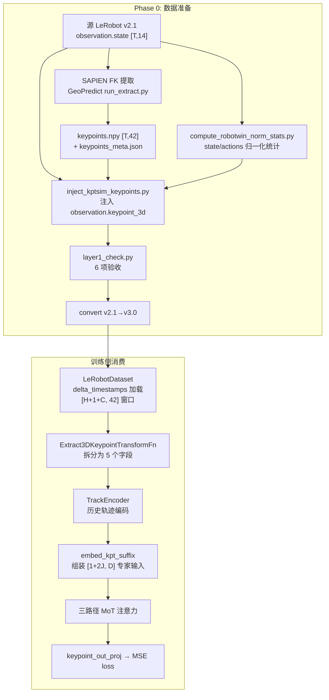
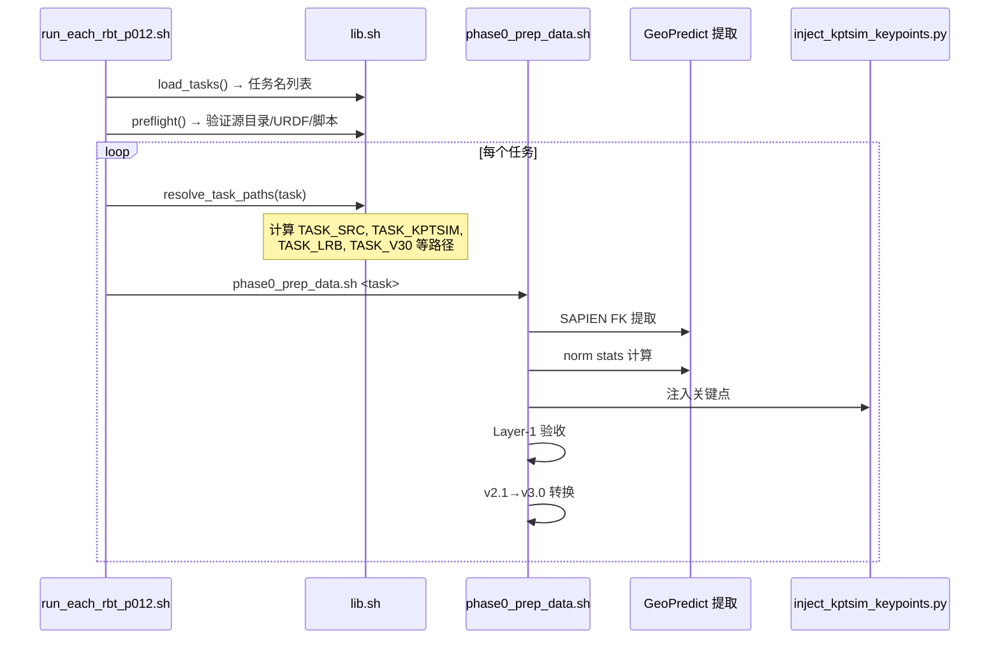
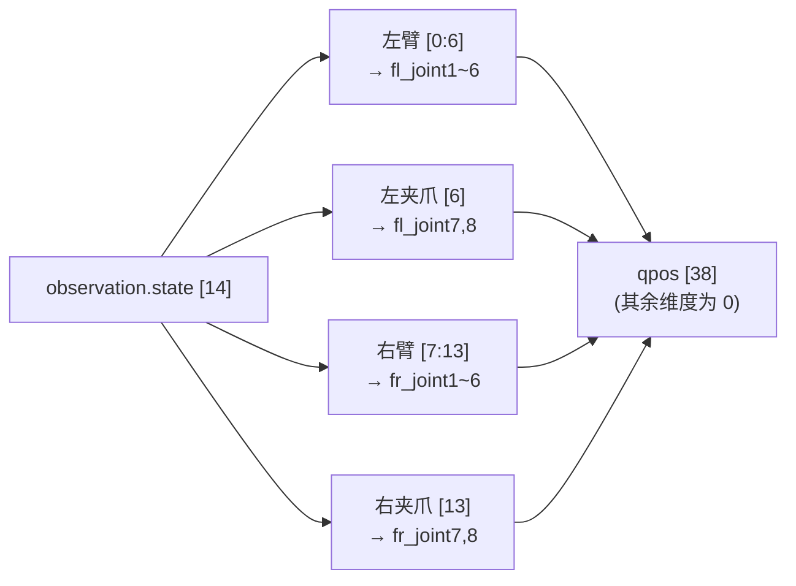
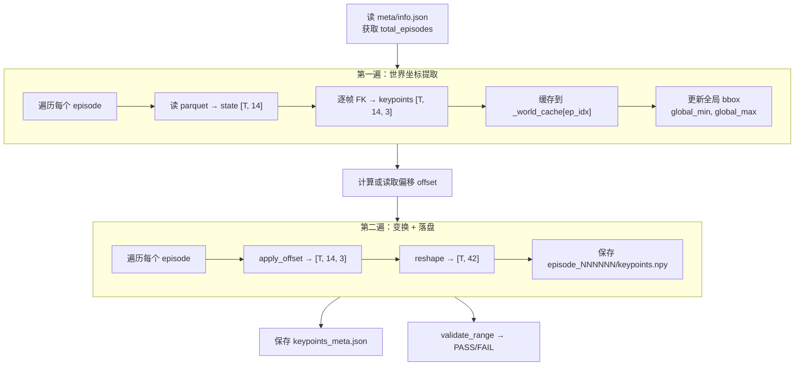
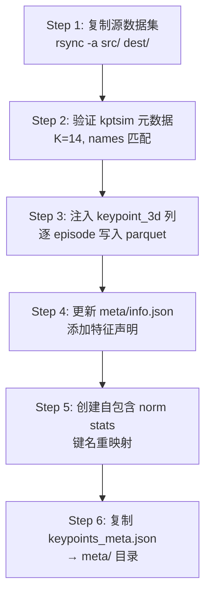
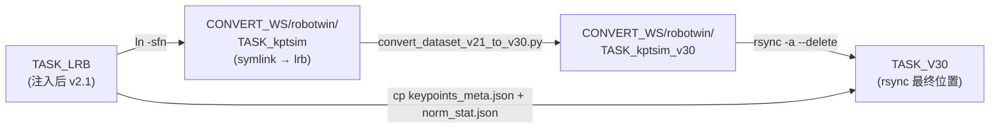
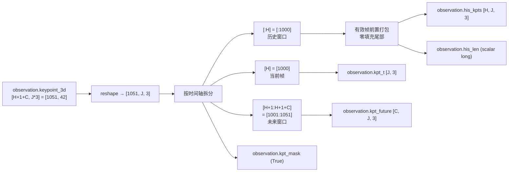
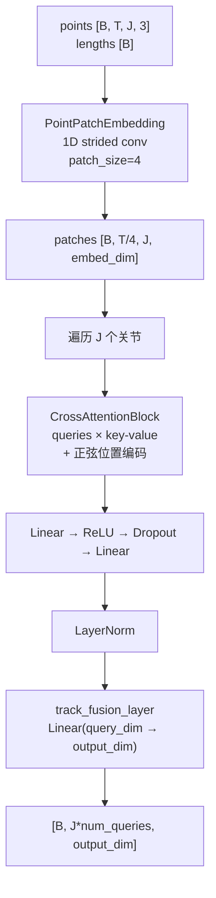
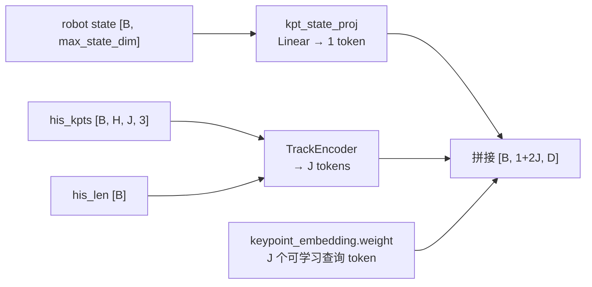
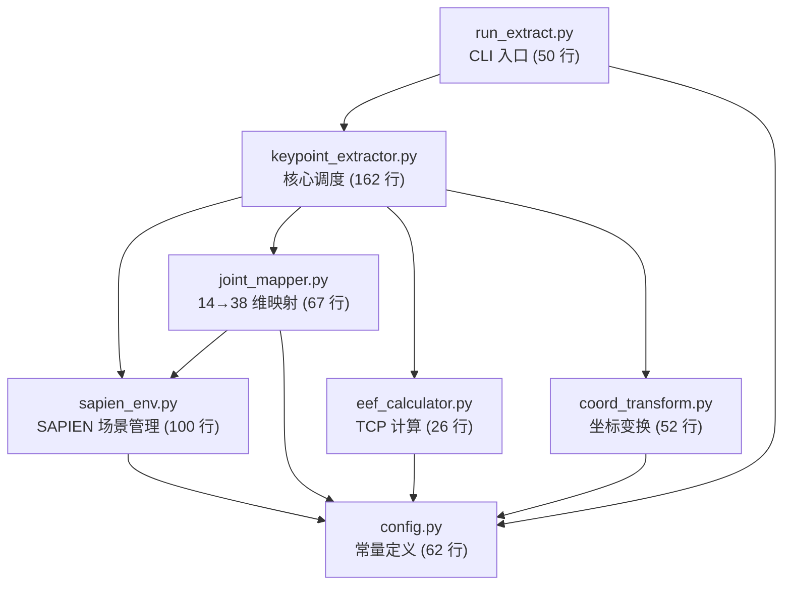

# kptsim 3D 关键点轨迹：数据生成与训练消费全链路深度解析

> **定位**: 从 RoboTwin 2.0 源数据到 InternVLA-A1.5 训练可用的 3D 关键点特征，涉及 SAPIEN FK 提取、坐标变换、注入 LeRobot 数据集、v2.1→v3.0 格式转换、以及训练侧的 delta-timestamp 堆叠与 TrackEncoder 消费。本文逐代码、逐模块地追踪整条数据流，标注所有可配置项。
>
> **论文出处**:
> - InternVLA-A1.5: [arXiv:2607.04988](https://arxiv.org/abs/2607.04988)
> - GeoPredict: [arXiv:2512.16811](https://arxiv.org/abs/2512.16811)
>
> **编排程序入口**: [`b/s/rbt/run_each_rbt_p012.sh`](../../s/rbt/run_each_rbt_p012.sh)（设计文档 [`run_ech_rbt_p012.md`](run_ech_rbt_p012.md)）

---

## 目录

- [1. 全链路概览](#1-全链路概览)
- [2. 编排层：从任务列表到 Phase 0 调用](#2-编排层从任务列表到-phase-0-调用)
- [3. SAPIEN FK 提取（GeoPredict）](#3-sapien-fk-提取geopredict)
  - [3.1 CLI 入口与模块结构](#31-cli-入口与模块结构)
  - [3.2 URDF 加载与仿真场景](#32-urdf-加载与仿真场景)
  - [3.3 14 维状态到 38 维 qpos 的映射](#33-14-维状态到-38-维-qpos-的映射)
  - [3.4 正运动学：从 qpos 到 14 个 3D 关键点](#34-正运动学从-qpos-到-14-个-3d-关键点)
  - [3.5 TCP 位置计算](#35-tcp-位置计算)
  - [3.6 坐标变换：世界系到体素系](#36-坐标变换世界系到体素系)
  - [3.7 两遍扫描与落盘格式](#37-两遍扫描与落盘格式)
  - [3.8 keypoints_meta.json 结构](#38-keypoints_metajson-结构)
- [4. 归一化统计计算](#4-归一化统计计算)
- [5. 关键点注入（inject_kptsim_keypoints.py）](#5-关键点注入inject_kptsim_keypointspy)
  - [5.1 六步注入流程](#51-六步注入流程)
  - [5.2 norm_stat.json 键名重映射](#52-norm_statjson-键名重映射)
  - [5.3 info.json 特征声明](#53-infojson-特征声明)
- [6. Layer-1 验收检查](#6-layer-1-验收检查)
- [7. v2.1 到 v3.0 格式转换](#7-v21-到-v30-格式转换)
- [8. 训练侧：从数据集到模型消费](#8-训练侧从数据集到模型消费)
  - [8.1 delta-timestamp 机制加载关键点窗口](#81-delta-timestamp-机制加载关键点窗口)
  - [8.2 Extract3DKeypointTransformFn：窗口拆分](#82-extract3dkeypointtransformfn窗口拆分)
  - [8.3 TrackEncoder：历史轨迹编码](#83-trackencoder历史轨迹编码)
  - [8.4 embed_kpt_suffix：关键点专家输入组装](#84-embed_kpt_suffix关键点专家输入组装)
  - [8.5 关键点损失计算](#85-关键点损失计算)
- [9. Phase 1 (Warmup) vs Phase 2 (SFT) 的关键点配置差异](#9-phase-1-warmup-vs-phase-2-sft-的关键点配置差异)
- [10. 全链路可配置项汇总](#10-全链路可配置项汇总)
- [11. 数据格式与形状速查表](#11-数据格式与形状速查表)
- [12. 常见故障与排查](#12-常见故障与排查)

---

## 1. 全链路概览

下图展示从 RoboTwin 2.0 源数据到训练侧消费 3D 关键点的完整数据流。



**关键约束**: 提取器为**每个任务单独估计** 世界系→体素系的平移偏移 $\mathbf{o}$（`coord_offset`）。不同任务的偏移不同，因此 `keypoints_meta.json`、`norm_stat.json`、训练数据集、warmup checkpoint 均**禁止跨任务复用**。

---

## 2. 编排层：从任务列表到 Phase 0 调用

主入口 [`run_each_rbt_p012.sh`](../../s/rbt/run_each_rbt_p012.sh) 负责循环编排。与 kptsim 数据生成直接相关的调用链：



[`lib.sh`](../../s/rbt/lib.sh) 的 `resolve_task_paths()` 函数（第 72–91 行）为每个任务名导出一组路径变量，这是整条流水线路径隔离的核心：

```bash
resolve_task_paths() {
  TASK_SRC="${CLEAN_ROOT}/${task}"               # 源 v2.1（只读）
  TASK_KPTSIM="${KPTSIM_ROOT}/${task}_kptsim"    # SAPIEN 产物
  TASK_LRB="${LRB_ROOT}/${task}_kptsim_lrb"      # 注入后 v2.1 副本
  TASK_V30="${V30_ROOT}/${task}_kptsim_lrbv30"    # 训练用 v3.0
  TASK_REPO_ID="${task}_kptsim_lrbv30"            # HF_LEROBOT_HOME repo_id
  TASK_NORM_RAW="${NORM_STATS_DIR}/robotwin_norm_stats_${task}.json"
  # ... 更多 checkpoint/log/state 路径
}
```

**可配置**: `CLEAN_ROOT`、`KPTSIM_ROOT`、`LRB_ROOT`、`V30_ROOT`、`CKPT_ROOT`、`NORM_STATS_DIR`，均可在 `config.env` 中覆盖（见 [`config.env.example`](../../s/rbt/config.env.example)）。默认情况下 `KPTSIM_ROOT = LRB_ROOT = V30_ROOT = CLEAN_ROOT`，所有产物紧邻源数据。

---

## 3. SAPIEN FK 提取（GeoPredict）

### 3.1 CLI 入口与模块结构

提取代码位于 [`GeoPredict/b/script/kpt/`](../../../../GeoPredict/b/script/kpt/) 目录：

| 文件 | 职责 |
|:---|:---|
| [`run_extract.py`](../../../../GeoPredict/b/script/kpt/run_extract.py) | CLI 入口，解析参数，调用 `KeypointExtractor` |
| [`keypoint_extractor.py`](../../../../GeoPredict/b/script/kpt/keypoint_extractor.py) | 核心提取器类 |
| [`sapien_env.py`](../../../../GeoPredict/b/script/kpt/sapien_env.py) | SAPIEN 场景管理，URDF 加载与 FK 查询 |
| [`joint_mapper.py`](../../../../GeoPredict/b/script/kpt/joint_mapper.py) | 14 维 state → 38 维 qpos 映射 |
| [`eef_calculator.py`](../../../../GeoPredict/b/script/kpt/eef_calculator.py) | 末端执行器 TCP 位置计算 |
| [`coord_transform.py`](../../../../GeoPredict/b/script/kpt/coord_transform.py) | 世界系→体素系偏移与范围验证 |
| [`config.py`](../../../../GeoPredict/b/script/kpt/config.py) | 所有常量：关节名、link 名、URDF 路径、体素范围 |

CLI 调用（[`phase0_prep_data.sh`](../../s/rbt/phase0_prep_data.sh) 第 46–51 行）：

```bash
cd "${GEOPREDICT_ROOT}"
"${EXTRACT_PYTHON}" b/script/kpt/run_extract.py \
  --dataset_dir "${TASK_SRC}" \
  --urdf_path "${URDF_PATH}" \
  --output_dir "${TASK_KPTSIM}"
```

**必须在 GeoPredict 仓库根下调用**，因为 `run_extract.py` 第 10 行 `ROOT = Path(__file__).resolve().parents[3]` 依赖 `__file__` 上溯三级来设置 `sys.path`。

**可配置 CLI 参数**:
- `--dataset_dir`：源 LeRobot v2.1 数据集路径
- `--urdf_path`：ALOHA-Agilex URDF 路径
- `--output_dir`：kptsim 产物输出路径
- `--offset x y z`：手动指定世界系偏移（不推荐；省略时自动计算）
- `--episode N`：只提取单个 episode（调试用）

### 3.2 URDF 加载与仿真场景

[`AlohaFKScene`](../../../../GeoPredict/b/script/kpt/sapien_env.py) 类负责 SAPIEN 场景管理（第 13–100 行）。

**构造函数**（第 16–52 行）：
1. 临时 `os.chdir(urdf_dir)` 使 URDF 中的相对 mesh 路径可解析
2. 创建 `sapien.Engine` + `sapien.Scene`，时间步 $1/240$ 秒
3. `URDFLoader.load(urdf)` 加载铰接体，`fix_root_link = True` 固定底座
4. 设置根节点位姿：位置 $[0, -0.65, 0]$，四元数 $[0.707, 0, 0, 0.707]$（$w,x,y,z$ 格式，绕 $X$ 轴旋转 $90°$）
5. 缓存所有 active joints（38 个）、links、joints 的名字→索引/对象映射
6. `scene.step()` 初始化物理状态

**FK 查询**（第 66–95 行）：
- `set_qpos(qpos)`：设置 38 维关节角 → `robot.set_qpos(qpos)` + `scene.step()` 传播 FK
- `get_link_positions(names)`：读取各 link 的 `get_entity_pose().p`，返回 $[\text{len}, 3]$
- `get_joint_global_pose(name)`：返回 `(position[3], quaternion[4])` 的全局位姿

**可配置**:

| 参数 | 默认值 | 来源 |
|:---|:---|:---|
| URDF 路径 | `${ROBOTWIN_ROOT}/assets/embodiments/aloha-agilex/urdf/arx5_description_isaac.urdf` | `config.py` |
| 根节点位置 | $[0, -0.65, 0]$ | `config.py` `ROBOT_ROOT_POS` |
| 根节点四元数 | $[0.707, 0, 0, 0.707]$ | `config.py` `ROBOT_ROOT_QUAT` |

### 3.3 14 维状态到 38 维 qpos 的映射

[`JointMapper`](../../../../GeoPredict/b/script/kpt/joint_mapper.py)（第 21–67 行）处理 LeRobot 数据集中 `observation.state` 的 14 维向量到 SAPIEN 铰接体的 38 维 active-joint 空间的映射。



**映射规则**（`map_state_to_qpos`，第 44–62 行）：

| state 索引 | 含义 | qpos 目标关节 |
|:---:|:---|:---|
| $[0:6]$ | 左臂 6 自由度关节角 | `fl_joint1` ~ `fl_joint6` |
| $6$ | 左夹爪归一化值 | `fl_joint7`, `fl_joint8`（两个对称关节） |
| $[7:13]$ | 右臂 6 自由度关节角 | `fr_joint1` ~ `fr_joint6` |
| $13$ | 右夹爪归一化值 | `fr_joint7`, `fr_joint8`（两个对称关节） |

**夹爪反归一化**（`_denormalize_gripper`，第 41–42 行）：

$$q_{\text{gripper}} = v_{\text{norm}} \times (0.045 - (-0.01)) + (-0.01) = v_{\text{norm}} \times 0.055 - 0.01$$

其中 `GRIPPER_SCALE = [-0.01, 0.045]` 是 ALOHA-Agilex 的夹爪关节行程范围。

### 3.4 正运动学：从 qpos 到 14 个 3D 关键点

[`KeypointExtractor._compute_step_keypoints`](../../../../GeoPredict/b/script/kpt/keypoint_extractor.py)（第 63–80 行）是每帧的核心计算：

```python
def _compute_step_keypoints(self, state_14: np.ndarray) -> np.ndarray:
    qpos = self.joint_mapper.map_state_to_qpos(state_14)   # [14] → [38]
    self.fk_scene.set_qpos(qpos)                            # FK 传播

    left_links  = self.fk_scene.get_link_positions(LEFT_ARM_LINK_NAMES)   # [6, 3]
    right_links = self.fk_scene.get_link_positions(RIGHT_ARM_LINK_NAMES)  # [6, 3]

    left_ee_pos,  left_ee_quat  = self.fk_scene.get_joint_global_pose(LEFT_EE_JOINT_NAME)
    right_ee_pos, right_ee_quat = self.fk_scene.get_joint_global_pose(RIGHT_EE_JOINT_NAME)
    left_tcp  = compute_tcp_position(left_ee_pos, left_ee_quat)
    right_tcp = compute_tcp_position(right_ee_pos, right_ee_quat)

    keypoints = np.zeros((K, 3), dtype=np.float32)   # K=14
    keypoints[:6]  = left_links    # fl_link1 ~ fl_link6
    keypoints[6]   = left_tcp      # fl_eef_tcp
    keypoints[7:13]= right_links   # fr_link1 ~ fr_link6
    keypoints[13]  = right_tcp     # fr_eef_tcp
    return keypoints               # [14, 3]
```

14 个关键点的语义排列：

| 索引 | 名称 | 来源 |
|:---:|:---|:---|
| 0–5 | `fl_link1` ~ `fl_link6` | 左臂 6 个 link 的世界位置 |
| 6 | `fl_eef_tcp` | 左臂末端 TCP（计算得到，见 §3.5） |
| 7–12 | `fr_link1` ~ `fr_link6` | 右臂 6 个 link 的世界位置 |
| 13 | `fr_eef_tcp` | 右臂末端 TCP |

### 3.5 TCP 位置计算

[`compute_tcp_position`](../../../../GeoPredict/b/script/kpt/eef_calculator.py)（第 11–26 行）从末端关节（`fl_joint6` / `fr_joint6`）的全局位姿计算 Tool Center Point：

$$\mathbf{R}_{\text{tcp}} = \mathbf{R}_{\text{ee}} \cdot \mathbf{G} \cdot \mathbf{D}$$

$$\mathbf{p}_{\text{tcp}} = \mathbf{p}_{\text{ee}} + \mathbf{R}_{\text{tcp}} \cdot \begin{bmatrix} d \\ 0 \\ 0 \end{bmatrix}$$

其中：
- $\mathbf{R}_{\text{ee}}$：末端关节四元数转旋转矩阵（通过 `transforms3d.quaternions.quat2mat`）
- $\mathbf{G} = \begin{bmatrix} 1 & 0 & 0 \\ 0 & -1 & 0 \\ 0 & 0 & -1 \end{bmatrix}$（`GLOBAL_TRANS_MATRIX`）：绕 $X$ 轴 $180°$ 旋转，将 SAPIEN 坐标系对齐到 RoboTwin 的惯例
- $\mathbf{D} = \mathbf{I}_3$（`DELTA_MATRIX`）：预留的额外旋转修正，当前为单位阵
- $d = 0.12$ 米（`GRIPPER_BIAS`）：从末端关节沿局部 $X$ 轴到夹爪中心的偏移

### 3.6 坐标变换：世界系到体素系

[`coord_transform.py`](../../../../GeoPredict/b/script/kpt/coord_transform.py) 实现了一个**纯平移变换**（无缩放、无旋转），将世界坐标重新中心化到 GeoPredict 的体素空间。

**自动偏移计算**（`compute_auto_offset`，第 12–18 行）：

$$\mathbf{o} = \frac{\mathbf{p}_{\min}^{\text{world}} + \mathbf{p}_{\max}^{\text{world}}}{2} - \mathbf{c}_{\text{voxel}}$$

其中：
- $\mathbf{p}_{\min}^{\text{world}}$, $\mathbf{p}_{\max}^{\text{world}}$：所有 episode 所有帧所有关键点的全局最小/最大 xyz
- $\mathbf{c}_{\text{voxel}} = \frac{\mathbf{v}_{\min} + \mathbf{v}_{\max}}{2} = \frac{[0,0,0] + [1.6, 1.6, 1.0]}{2} = [0.8, 0.8, 0.5]$

**应用偏移**（`apply_offset`，第 21–22 行）：

$$\mathbf{p}_{\text{voxel}} = \mathbf{p}_{\text{world}} - \mathbf{o}$$

**范围验证**（`validate_range`，第 25–52 行）：检查变换后所有关键点是否落在 $[0, 0, 0]$ 到 $[1.6, 1.6, 1.0]$ 的体素盒内。

**可配置**:

| 常量 | 值 | 含义 |
|:---|:---|:---|
| `VOXEL_RANGE_MIN` | $[0, 0, 0]$ | 体素空间下界 |
| `VOXEL_RANGE_MAX` | $[1.6, 1.6, 1.0]$ | 体素空间上界 |
| `VOXEL_CENTER` | $[0.8, 0.8, 0.5]$ | 体素中心（自动偏移的目标点） |
| `--offset x y z` | 手动指定 | CLI 参数，覆盖自动计算 |

### 3.7 两遍扫描与落盘格式

[`KeypointExtractor.extract_all`](../../../../GeoPredict/b/script/kpt/keypoint_extractor.py)（第 120–162 行）采用**两遍扫描**策略：



**为什么需要两遍**: 偏移 $\mathbf{o}$ 依赖所有 episode 的全局 bounding box，必须先遍历全部数据计算 $\mathbf{p}_{\min}^{\text{world}}$ 和 $\mathbf{p}_{\max}^{\text{world}}$，才能应用变换。

**落盘格式**:
- `episode_NNNNNN/keypoints.npy`：`float32` 数组，shape $[T, 42]$（$14 \times 3$ 展平）
- `keypoints_meta.json`：元数据（见 §3.8）

### 3.8 keypoints_meta.json 结构

[`_save_meta`](../../../../GeoPredict/b/script/kpt/keypoint_extractor.py)（第 96–118 行）生成的 JSON 结构：

```json
{
  "K": 14,
  "keypoint_names": [
    "fl_link1", "fl_link2", "fl_link3", "fl_link4", "fl_link5", "fl_link6",
    "fl_eef_tcp",
    "fr_link1", "fr_link2", "fr_link3", "fr_link4", "fr_link5", "fr_link6",
    "fr_eef_tcp"
  ],
  "coord_offset": [ox, oy, oz],
  "world_range_min": [wx_min, wy_min, wz_min],
  "world_range_max": [wx_max, wy_max, wz_max],
  "transformed_range_min": [vx_min, vy_min, vz_min],
  "transformed_range_max": [vx_max, vy_max, vz_max],
  "urdf_path": "/path/to/arx5_description_isaac.urdf",
  "dataset_dir": "/path/to/source_task",
  "total_episodes": 50
}
```

| 字段 | 说明 |
|:---|:---|
| `K` | 关键点数量（固定 14） |
| `keypoint_names` | 14 个语义名称（与 link/TCP 一一对应） |
| `coord_offset` | 世界系→体素系的 3D 平移偏移 $\mathbf{o}$。**每个任务不同**，禁止跨任务使用 |
| `world_range_*` | 变换前的全局 bounding box |
| `transformed_range_*` | 变换后的 bounding box（应在 $[0,1.6]^2 \times [0,1.0]$ 附近） |
| `dataset_dir` | 溯源：用了哪个源数据集 |

---

## 4. 归一化统计计算

[`compute_robotwin_norm_stats.py`](../../../../GeoPredict/tools/compute_robotwin_norm_stats.py) 独立于关键点提取，计算 `observation.state` 和 `action` 的 z-score 统计。

**计算过程**（第 14–34 行）：

1. 遍历 `data/chunk-000/episode_*.parquet`，提取 `observation.state`（$[T, 14]$）和 `action`（$[T, 14]$）
2. 跨所有 episode 拼接为一个大矩阵
3. 按维度计算 4 项统计：

$$\text{mean}_j = \frac{1}{N}\sum_{i=1}^{N} x_{i,j} \qquad \text{std}_j = \max\left(\sqrt{\frac{1}{N}\sum_{i=1}^{N}(x_{i,j} - \text{mean}_j)^2},\; 10^{-6}\right)$$

$$\text{q01}_j = Q_{0.01}(x_{\cdot,j}) \qquad \text{q99}_j = Q_{0.99}(x_{\cdot,j})$$

**输出 JSON 键名**为 GeoPredict 原始键名：`"state"` 和 `"actions"`（注入时会被重映射，见 §5.2）。

**可配置**:
- `--dataset_dir`：源 LeRobot v2.1 数据集路径
- `--output`：输出 JSON 路径

**编排层调用**（[`phase0_prep_data.sh`](../../s/rbt/phase0_prep_data.sh) 第 58–65 行）：

```bash
"${TRAIN_PYTHON}" "${GEOPREDICT_ROOT}/tools/compute_robotwin_norm_stats.py" \
  --dataset_dir "${TASK_SRC}" \
  --output "${TASK_NORM_RAW}"
```

---

## 5. 关键点注入（inject_kptsim_keypoints.py）

[`inject_kptsim_keypoints.py`](../../util_scripts/inject_kptsim_keypoints.py) 将提取好的 3D 关键点写入 LeRobot 数据集副本，使数据集成为自包含的训练输入。

### 5.1 六步注入流程



**Step 3 详解**（`_inject_keypoints_into_parquets`，第 88–132 行）：

对每个 episode 的 parquet 文件：
1. 加载对应的 `episode_NNNNNN/keypoints.npy`，shape $[T, 42]$
2. 断言行数匹配（parquet 行数 = npy 的 $T$）
3. 以 `float32` 数组列表形式添加 `"observation.keypoint_3d"` 列：每行存 42 个浮点数
4. 原地覆写 parquet 文件

```python
df["observation.keypoint_3d"] = [row for row in kpts.astype(np.float32)]
df.to_parquet(pq_path)
```

### 5.2 norm_stat.json 键名重映射

[`_create_self_contained_stats`](../../util_scripts/inject_kptsim_keypoints.py)（第 150–162 行）将 GeoPredict 原始键名映射为 LeRobot 训练框架使用的键名：

```python
NORM_STATS_KEY_REMAP = {
    "state": "observation.state",   # GeoPredict → LeRobot
    "actions": "action",            # GeoPredict → LeRobot
}
```

重映射后写入**两个位置**：`dest/norm_stat.json` 和 `dest/meta/stats.json`。

### 5.3 info.json 特征声明

[`_update_info_json`](../../util_scripts/inject_kptsim_keypoints.py)（第 135–147 行）向 `meta/info.json` 的 `features` 添加新特征：

```json
{
  "observation.keypoint_3d": {
    "dtype": "float32",
    "shape": [42],
    "names": ["fl_link1_x", "fl_link1_y", "fl_link1_z", ..., "fr_eef_tcp_z"],
    "fps": 15
  }
}
```

同时在 info.json 顶层添加：
- `keypoint_coord_mode`：`"voxel"`（默认）或 `"footprint"`
- `keypoint_coord_offset`：从 `keypoints_meta.json` 复制的 3D 偏移向量

**可配置 CLI 参数**:

| 参数 | 说明 | 默认 |
|:---|:---|:---|
| `--source` | 只读源 LeRobot 数据集目录 | 必填 |
| `--kptsim_dir` | kptsim 目录（含 `episode_*/keypoints.npy`） | 必填 |
| `--dest` | 输出目录（源数据集的副本 + 关键点列 + norm stats） | 必填 |
| `--norm_stats_path` | GeoPredict 归一化统计 JSON 路径 | 必填 |
| `--coord_mode` | 坐标模式：`voxel`（方案 A）或 `footprint`（方案 B） | `voxel` |
| `--force` | 覆盖已存在的 `--dest` | 否 |
| `--skip-copy` | 跳过 rsync，假设 `--dest` 已有副本 | 否 |

---

## 6. Layer-1 验收检查

[`layer1_check.py`](../../s/rbt/layer1_check.py) 执行 6 项参数化验收 + 1 项非阻塞告警：

| # | 检查函数 | 内容 | 判定 |
|:---:|:---|:---|:---|
| 1 | `check_info` | `info.json` 含 `observation.keypoint_3d`，dtype=float32，shape=[42]，coord_mode=voxel，coord_offset 长度 3 | PASS/FAIL |
| 2 | `check_alignment` | 每个 episode 的 parquet 行数与 `keypoints.npy` 行数匹配，数值 $\lvert \text{parquet} - \text{npy} \rvert < 10^{-5}$ | PASS/FAIL |
| 3 | `check_voxel_range` | 所有关键点有限且在 $[-0.01, 1.61]$ 范围内 | PASS/FAIL |
| 4 | `check_norm_stat` | `norm_stat.json` 键为 `observation.state` / `action`（非 GeoPredict 原始键），state.mean 维度=14 | PASS/FAIL |
| 5 | `check_provenance` | `meta/keypoints_meta.json` 与 kptsim 根的 `keypoints_meta.json` 一致（K=14、names 顺序、coord_offset 匹配） | PASS/FAIL |
| 6 | `check_original_columns` | parquet 包含 state/action/timestamp/frame_index/episode_index/index/task_index/keypoint_3d，cam_high 仍在 features | PASS/FAIL |
| — | `warn_tcp_continuity` | 相邻帧 TCP 最大跳变 > 0.15 体素单位时告警 | 仅告警 |

**编排层调用**（[`phase0_prep_data.sh`](../../s/rbt/phase0_prep_data.sh) 第 87–93 行）：

```bash
"${TRAIN_PYTHON}" "${SCRIPT_DIR}/layer1_check.py" \
  --dest-root "${TASK_LRB}" \
  --kptsim-root "${TASK_KPTSIM}" \
  --task "${TASK}"
```

---

## 7. v2.1 到 v3.0 格式转换

[`convert_dataset_v21_to_v30.py`](../../src/lerobot/datasets/v30/convert_dataset_v21_to_v30.py) 是标准 LeRobot 格式迁移（非关键点特化）。

**关键行为**:
- 将 per-episode parquet（`episode_000000.parquet`）合并为分块文件（`file_000.parquet`）
- 将 per-episode 视频合并为分块视频
- 生成 `episodes_stats` parquet
- 更新 `codebase_version` 到 `v3.0`

**转换工作区隔离**（[`phase0_prep_data.sh`](../../s/rbt/phase0_prep_data.sh) 第 96–134 行）：



**为什么隔离**：转换脚本的行为是 `new_root = root.parent / f"{root.name}_v30"` 且 `shutil.rmtree(new_root)` 如果已存在。两个任务共用同一 `--root` 会互相删除 v30 产物。

**Post-conversion**: 转换脚本不会复制 `keypoints_meta.json` 和根目录 `norm_stat.json`，编排层在 rsync 后显式补拷（第 132–133 行）：

```bash
cp -f "${TASK_LRB}/meta/keypoints_meta.json" "${TASK_V30}/meta/keypoints_meta.json"
cp -f "${TASK_LRB}/norm_stat.json" "${TASK_V30}/norm_stat.json"
```

**Layer-2 验证**（第 148–157 行）：内联 Python 断言 `codebase_version` 含 `"3.0"` 且 `features` 含 `observation.keypoint_3d`。

---

## 8. 训练侧：从数据集到模型消费

Phase 0 完成后，`${TASK}_kptsim_lrbv30` 是一个 LeRobot v3.0 数据集，其中 `observation.keypoint_3d` 列包含每帧 42 维的体素坐标关键点。训练侧通过四级管线消费这些数据。

### 8.1 delta-timestamp 机制加载关键点窗口

[`factory.py`](../../src/lerobot/datasets/factory.py)（第 314–318 行）在数据集的 `features` 含 `observation.keypoint_3d` 且 `enable_keypoint_predictor=True` 时，生成 delta timestamps：

```python
elif key == "observation.keypoint_3d" and getattr(cfg, "keypoint_3d_delta_indices", None):
    delta_timestamps[key] = [i / ds_meta.fps for i in cfg.keypoint_3d_delta_indices]
```

`keypoint_3d_delta_indices` 由 [`InternVLAA15Config`](../../src/lerobot/policies/internvla_a1_5/configuration_internvla_a1_5.py)（第 573–591 行）生成：

$$\text{indices} = [-H, -H+1, \ldots, -1, 0, 1, \ldots, C]$$

其中 $H = \texttt{keypoint\_history\_max\_len} = 1000$，$C = \texttt{chunk\_size} = 50$，共 $H + 1 + C = 1051$ 个索引。

`LeRobotDataset.__getitem__` 据此返回 shape 为 $[1051, 42]$ 的堆叠张量。超出 episode 边界的帧被 clamp 到最近有效帧，并在 `observation.keypoint_3d_is_pad` ($[1051]$ bool) 中标记。

### 8.2 Extract3DKeypointTransformFn：窗口拆分

[`Extract3DKeypointTransformFn`](../../src/lerobot/policies/internvla_a1_5/transform_internvla_a1_5.py)（第 656–734 行）将堆叠窗口拆分为训练所需的 5 个字段：



**历史帧打包逻辑**（第 715–726 行）：

由于 episode 起始附近的负偏移帧会被 clamp 到第 0 帧（`is_pad=True`），这些无效帧连续排列在历史窗口的**前端**（最负的偏移）。变换将有效帧（尾部）前移到输出 buffer 的前端，尾部零填充：

```python
num_invalid = int(hist_is_pad.sum().item())
his_len = H - num_invalid
his_kpts = torch.zeros(H, J, 3)
if his_len > 0:
    his_kpts[:his_len] = hist_window[num_invalid:]  # 有效帧前置，最老帧在前
```

这与 GeoPredict 的 `TrackEncoder` 约定一致：`points[i, :length]` 为有效帧，其余为零填充。

**Phase 1 行为**（第 696–702 行）：当数据集不含 `observation.keypoint_3d` 列时（Phase 1 warmup 阶段数据集无 GT 关键点），所有 5 个输出全部零填充且 `kpt_mask=False`。下游代码总是能拿到这些键，但 Phase 1 不贡献关键点重建损失。

**可配置参数**:

| 参数 | 默认值 | 含义 |
|:---|:---|:---|
| `num_joints` | 8（训练用 $J$；注意与提取的 $K=14$ 不同） | 训练侧选取的关键点数量 |
| `history_max_len` | 1000 | 历史窗口长度 $H$ |
| `chunk_size` | 50 | 未来窗口长度 $C$ |

> **注意**: 提取时 $K=14$（14 个关键点 × 3 = 42 维），而训练侧 `num_joints` 默认为 8。这意味着模型训练时取 14 个关键点中的前 $J$ 个（或配置为 14 以使用全部）。配置项 `num_keypoint_joints` 控制此数值。

### 8.3 TrackEncoder：历史轨迹编码

[`TrackEncoder`](../../src/lerobot/policies/internvla_a1_5/keypoints.py)（第 244–313 行）从 GeoPredict 移植，将变长历史轨迹编码为固定维度的 per-joint token。

**架构**:



**关键参数**:

| 参数 | 默认值 | 含义 |
|:---|:---|:---|
| `input_dim` | 3 | 每个点的坐标维度 |
| `output_dim` | 1024 | 输出 token 维度（GeoPredict 为 2048，匹配 InternVLA-A1.5 的专家隐藏层大小） |
| `patch_size` | 4 | 时间轴分片大小 |
| `embed_dim` | 256 | patch 嵌入维度 |
| `query_dim` | 512 | 查询向量维度 |
| `num_queries` | 1 | 每个关节的查询数 |
| `num_heads` | 8 | 交叉注意力头数 |
| `max_seq_len` | 1000 | 最大序列长度（与 $H$ 一致） |

**权重加载**（第 316–323 行）：从 GeoPredict checkpoint 加载时，`track_fusion_layer` 被**排除**（因 `output_dim` 不同：2048 vs 1024），其余子模块（`queries`、`point_patch_embed`、`cross_attention_block`、`linear_transform`、`final_norm`）按前缀匹配加载。

### 8.4 embed_kpt_suffix：关键点专家输入组装

[`InternVLAA15Policy.embed_kpt_suffix`](../../src/lerobot/policies/internvla_a1_5/modeling_internvla_a1_5.py)（第 1562–1617 行）将关键点信息组装为三路径 MoT（Mixture-of-Transformers）注意力中的关键点专家后缀：



**输出**: $[\text{state}(1),\; \text{track}(J),\; \text{query}(J)] = [B, 1+2J, D]$

最后 $J$ 个 query token 的输出隐状态通过 `keypoint_out_proj`（`Linear(kpt_hidden_size, 3)`）投射为预测的当前帧和未来帧 3D 关键点位置。

### 8.5 关键点损失计算

[`InternVLAA15Policy.forward`](../../src/lerobot/policies/internvla_a1_5/modeling_internvla_a1_5.py)（第 2470–2489 行）中的关键点损失：

**当前帧损失**（第 1955–1960 行）：

$$\mathcal{L}_{\text{kpt}}^{\text{cur}} = \text{MSE}(\hat{\mathbf{p}}_t,\; \mathbf{p}_t^{\text{GT}})$$

其中 $\hat{\mathbf{p}}_t = \texttt{keypoint\_out\_proj}(\text{kpt\_query\_out})$，shape $[B, J, 3]$。

**未来帧损失**（第 1968–1975 行）：

$$\mathcal{L}_{\text{kpt}}^{\text{fut}} = \text{MSE}(\hat{\mathbf{p}}_{t+1:t+C},\; \mathbf{p}_{t+1:t+C}^{\text{GT}})$$

**Phase 1 vs Phase 2 masking**（第 2471–2484 行）：

```python
kpt_mask = batch.get("observation.kpt_mask")
if kpt_mask is not None and kpt_mask.any():
    loss_kpt_cur = loss_kpt_current[kpt_mask].mean()   # 仅 Phase 2 样本
    loss_kpt_fut = loss_kpt_future[kpt_mask].mean()
else:
    loss_kpt_cur = zero    # Phase 1: 无 GT，关键点损失为 0
    loss_kpt_fut = zero

loss_kpt = kpt_loss_weight * (loss_kpt_cur + kpt_future_loss_weight * loss_kpt_fut)
```

**加权总损失**:

| 阶段 | $w_{\text{action}}$ | $w_{\text{kpt}}$ | $w_{\text{kpt\_fut}}$ | $w_{\text{video}}$ | 公式 |
|:---:|:---:|:---:|:---:|:---:|:---|
| Warmup | 2.0 | 10.0 | 2.0 | — | $\mathcal{L} = 2\mathcal{L}_{\text{action}} + 10(\mathcal{L}_{\text{kpt}}^{\text{cur}} + 0.2\mathcal{L}_{\text{kpt}}^{\text{fut}})$ |
| SFT | 10.0 | 1.0 | 1.5 | 1.0 | $\mathcal{L} = 10\mathcal{L}_{\text{action}} + 1.0(\mathcal{L}_{\text{kpt}}^{\text{cur}} + 1.5\mathcal{L}_{\text{kpt}}^{\text{fut}}) + \mathcal{L}_{\text{video}} + \mathcal{L}_{\text{vqa}}$ |

---

## 9. Phase 1 (Warmup) vs Phase 2 (SFT) 的关键点配置差异

| 配置项 | Phase 1 (Warmup) | Phase 2 (SFT) |
|:---|:---|:---|
| **数据集是否含 keypoint_3d** | 是（注入后 lrbv30 含此列） | 同左 |
| **kpt_mask** | True（数据集有 GT） | True |
| **init_kpt_expert_from_action** | `true`（从 action expert 拷贝权重冷启动 kpt expert） | `false`（warmup 已初始化） |
| **geopredict_checkpoint_path** | 设置（TrackEncoder 从 GeoPredict checkpoint 初始化） | 不设（已在 warmup ckpt 中） |
| **kpt_loss_weight** | 10.0（关键点为主） | 1.0 |
| **kpt_future_loss_weight** | 2.0 | 1.5 |
| **action_expert_lr_scale** | 0.04（action expert 慢更新） | 1.0 |
| **train_expert_only** | `true`（VLM 冻结） | `false` |
| **knowledge_insulation** | `true`（关键点/动作专家与 VLM 前缀解耦） | `false` |
| **freeze_keypoint_modules** | `false` | `false` |
| **enable_keypoint_predictor** | `true`（policy + dataset） | `true` |
| **num_keypoint_joints** | 14 | 14 |
| **pretrained_path** | InternVLA-A1.5-base | **本任务** warmup ckpt@400 |

**设计意图**:
- Phase 1 用高 `kpt_loss_weight=10` 快速拉起 kpt expert，同时 `action_expert_lr_scale=0.04` 抑制 action expert 发散
- Phase 2 降低 kpt 权重，解冻 VLM，开启 video/VQA loss，做全量微调

---

## 10. 全链路可配置项汇总

### 10.1 提取阶段（GeoPredict）

| 配置项 | 位置 | 默认值 | 说明 |
|:---|:---|:---|:---|
| `EXTRACT_PYTHON` | `config.env` | 必填 | 带 `sapien` 的 Python 解释器 |
| `GEOPREDICT_ROOT` | `config.env` | `ITVLAGP_ROOT/../GeoPredict` | GeoPredict 仓库根 |
| `URDF_PATH` | `config.env` | `${ROBOTWIN_ROOT}/assets/.../arx5_description_isaac.urdf` | ALOHA URDF |
| `--offset x y z` | CLI | 自动计算 | 手动指定世界系偏移（不推荐） |
| `K` | `config.py` | 14 | 关键点数量（硬编码） |
| `GRIPPER_BIAS` | `config.py` | 0.12 | TCP 偏移距离（米） |
| `VOXEL_RANGE_*` | `config.py` | $[0,0,0]$ ~ $[1.6,1.6,1.0]$ | 体素空间范围 |
| `ROBOT_ROOT_POS` | `config.py` | $[0, -0.65, 0]$ | 机器人根节点位置 |
| `ROBOT_ROOT_QUAT` | `config.py` | $[0.707, 0, 0, 0.707]$ | 机器人根节点四元数 |
| `GRIPPER_SCALE` | `config.py` | $[-0.01, 0.045]$ | 夹爪关节行程范围 |

### 10.2 注入阶段（itvlaGp）

| 配置项 | 位置 | 默认值 | 说明 |
|:---|:---|:---|:---|
| `--coord_mode` | CLI | `voxel` | 坐标模式 |
| `--force` | CLI | 否 | 覆盖已有 dest |
| `--skip-copy` | CLI | 否 | 跳过 rsync |
| `NORM_STATS_KEY_REMAP` | 代码 | `state→observation.state, actions→action` | 键名映射规则 |

### 10.3 验收阶段

| 配置项 | 位置 | 默认值 | 说明 |
|:---|:---|:---|:---|
| `VOXEL_MIN/MAX` | `layer1_check.py` | $-0.01$ / $1.61$ | 体素范围容差 |
| `ADJACENT_TCP_WARN_M` | `layer1_check.py` | $0.15$ | TCP 跳变告警阈值 |
| `EPS` | `layer1_check.py` | $10^{-5}$ | 数值对齐容差 |

### 10.4 编排层

| 配置项 | 位置 | 默认值 | 说明 |
|:---|:---|:---|:---|
| `CLEAN_ROOT` | `config.env` | `/home/a26113/Dta/RoboTwin-Clean` | 源数据根 |
| `KPTSIM_ROOT` | `config.env` | `CLEAN_ROOT` | kptsim 产物根 |
| `LRB_ROOT` | `config.env` | `CLEAN_ROOT` | 注入后 lrb 根 |
| `V30_ROOT` | `config.env` | `CLEAN_ROOT` | v3.0 数据根 |
| `CKPT_ROOT` | `config.env` | `$HOME/Ckp/itvlaGp` | checkpoint/logs/state |
| `CONVERT_WORK_ROOT` | `config.env` | `${CKPT_ROOT}/.convert_ws` | 转换隔离区 |
| `NORM_STATS_DIR` | `config.env` | `${CKPT_ROOT}/norm_stats` | 原始键名 stats |
| `TRAIN_PYTHON` | `config.env` | `${VENV_ROOT}/bin/python` | 训练 Python |
| `--tasks` | CLI | `tasks.batch1.txt` | 任务列表 |
| `--from`/`--until` | CLI | 全部 | 阶段范围 |
| `--force` | CLI | 否 | 强制重做 |
| `--skip-existing` | CLI | 是 | 跳过已完成阶段 |
| `--dry-run` | CLI | 否 | 只打印不执行 |

### 10.5 训练侧（InternVLA-A1.5）

| 配置项 | 位置 | 默认值 | 说明 |
|:---|:---|:---|:---|
| `enable_keypoint_predictor` | policy config | `False` | 启用关键点预测分支 |
| `num_keypoint_joints` | policy config | 14（launch 设置） | 训练使用的关键点数 $J$ |
| `keypoint_history_max_len` | policy config | 1000 | 历史窗口 $H$ |
| `chunk_size` | policy config | 50 | 未来窗口 $C$ |
| `kpt_loss_weight` | policy config | 视阶段 | 关键点当前帧损失权重 |
| `kpt_future_loss_weight` | policy config | 视阶段 | 关键点未来帧损失权重 |
| `init_kpt_expert_from_action` | policy config | 视阶段 | 从 action expert 初始化 kpt expert |
| `geopredict_checkpoint_path` | policy config | 视阶段 | TrackEncoder 预训练权重路径 |
| `freeze_keypoint_modules` | policy config | `False` | 冻结关键点模块 |
| `tokenize_state` | policy config | `True` | 将 robot state 编码为 prompt token |

---

## 11. 数据格式与形状速查表

| 阶段 | 数据 | 形状 | dtype | 位置 |
|:---|:---|:---|:---|:---|
| 源数据 | `observation.state` | $[T, 14]$ | float32 | `data/chunk-000/episode_*.parquet` |
| 提取后 | `keypoints.npy` | $[T, 42]$ | float32 | `${TASK}_kptsim/episode_NNNNNN/` |
| 注入后 | `observation.keypoint_3d` | 每行 $[42]$ | float32 | `${TASK}_kptsim_lrb/data/.../episode_*.parquet` |
| v3.0 | `observation.keypoint_3d` | 每行 $[42]$ | float32 | `${TASK}_kptsim_lrbv30/data/chunk-000/file_*.parquet` |
| 训练加载 | delta-timestamp 堆叠 | $[1051, 42]$ | float32 | `LeRobotDataset.__getitem__` |
| Transform 后 | `observation.his_kpts` | $[1000, J, 3]$ | float32 | — |
| | `observation.his_len` | 标量 | long | — |
| | `observation.kpt_t` | $[J, 3]$ | float32 | — |
| | `observation.kpt_future` | $[50, J, 3]$ | float32 | — |
| | `observation.kpt_mask` | 标量 | bool | — |
| TrackEncoder | 输入 points | $[B, T, J, 3]$ | float | — |
| TrackEncoder | 输出 tokens | $[B, J, 1024]$ | float | — |
| kpt suffix | 拼接 | $[B, 1+2J, D]$ | float | — |
| 预测输出 | 当前帧 kpt | $[B, J, 3]$ | float32 | `keypoint_out_proj` |
| 预测输出 | 未来帧 kpt | $[B, C, J, 3]$ | float32 | `keypoint_out_proj` |

---

## 12. 常见故障与排查

| 现象 | 原因 | 解决 |
|:---|:---|:---|
| `import sapien` 失败 | 用训练 venv 做提取 | 设置 `EXTRACT_PYTHON` 指向带 sapien 的 Python |
| 提取卡住或 mesh 错误 | 未在 GEOPREDICT_ROOT 下运行 | `cd ${GEOPREDICT_ROOT}` 再调用 |
| Check 3 失败（体素值域超界） | offset 算错或手动指定了错误偏移 | 查看 `keypoints_meta.json` 的 `transformed_range_*` |
| Check 4 失败（键名错误） | norm stats 未经键名重映射 | 确认注入步骤使用了 `--norm_stats_path` |
| Check 5 失败（coord_offset 不匹配） | kptsim 和 lrb 来自不同次提取 | 清除 lrb 目录后用 `--force` 重注入 |
| v30 转换后缺少 keypoints_meta.json | 转换脚本不保留自定义文件 | 编排层已处理（rsync + cp）；手动操作时须自行补拷 |
| 后一个任务 v30 被删除 | 两任务共用 convert `--root` | 必须走隔离 `convert_ws/${TASK}`（编排已做） |
| 训练时 kpt loss 全为 0 | `enable_keypoint_predictor=False` 或 `num_keypoint_joints` 不匹配 | 检查 launch 脚本配置 |
| 评测时关键点漂移 | 使用了错误任务的 `keypoints_meta.json` | `--kpt-meta-path` 必须指向本任务的 meta |
| `BackwardCompatibilityError` | 训练指向了 v2.1 数据集 | `repo_id` 必须是 `*_kptsim_lrbv30` |

---

## 附录 A：kptsim 3D 关键点提取器——逐文件代码深度解析

提取器的全部实现位于 [`GeoPredict/b/script/kpt/`](../../../../GeoPredict/b/script/kpt/) 目录，共 7 个 Python 文件（不含空 `__init__.py`），519 行代码。各文件的调用关系：



### A.1 `config.py`——常量定义（62 行）

**文件**: [`GeoPredict/b/script/kpt/config.py`](../../../../GeoPredict/b/script/kpt/config.py)

本文件是整个提取器的"配置中心"，所有可调参数和硬编码常量集中于此。其他 5 个模块均从此 import。

**机器人构型参数**:

```python
ROBOT_ROOT_POS  = np.array([0.0, -0.65, 0.0], dtype=np.float64)
ROBOT_ROOT_QUAT = np.array([0.707, 0.0, 0.0, 0.707], dtype=np.float64)  # [w, x, y, z]
```

根节点位姿来自 RoboTwin 仿真环境。四元数 $[w,x,y,z] = [0.707, 0, 0, 0.707]$ 对应绕 $X$ 轴旋转 $90°$（$\cos(45°) \approx 0.707$, $\sin(45°) \approx 0.707$），这是 ALOHA-Agilex 桌面双臂构型在 RoboTwin 里的惯例安装姿态。$y = -0.65$ 的平移使机器人底座中心处于工作台边缘。

**关节与 link 命名**（第 18–43 行）：

ALOHA-Agilex 是左右对称双臂，URDF 共 38 个 active joint。提取器只关心其中 16 个（每臂 6 + 2 夹爪），其余保持零位。命名规则是 `fl_`（front-left）和 `fr_`（front-right）前缀：

```python
LEFT_ARM_JOINT_NAMES  = ["fl_joint1", ..., "fl_joint6"]   # 6 DOF 左臂关节
LEFT_ARM_LINK_NAMES   = ["fl_link1",  ..., "fl_link6"]    # 6 个左臂 link
LEFT_EE_JOINT_NAME    = "fl_joint6"                        # 左臂末端关节
RIGHT_ARM_JOINT_NAMES = ["fr_joint1", ..., "fr_joint6"]
RIGHT_ARM_LINK_NAMES  = ["fr_link1",  ..., "fr_link6"]
RIGHT_EE_JOINT_NAME   = "fr_joint6"
```

最终关键点名称列表将 link 名与 TCP 名交织排列（第 40–43 行）：

```python
KEYPOINT_NAMES = (
    LEFT_ARM_LINK_NAMES + ["fl_eef_tcp"]     # 索引 0-6
    + RIGHT_ARM_LINK_NAMES + ["fr_eef_tcp"]  # 索引 7-13
)
```

**state 到 qpos 的索引映射**（第 55–58 行）：

```python
LEFT_ARM_STATE_SLICE    = slice(0, 6)    # observation.state[0:6]  → 左臂 6 关节角
LEFT_GRIPPER_STATE_IDX  = 6              # observation.state[6]    → 左夹爪
RIGHT_ARM_STATE_SLICE   = slice(7, 13)   # observation.state[7:13] → 右臂 6 关节角
RIGHT_GRIPPER_STATE_IDX = 13             # observation.state[13]   → 右夹爪
```

**夹爪反归一化**（第 51 行）：

```python
GRIPPER_SCALE = [-0.01, 0.045]
```

数据集中夹爪值是归一化到 $[0, 1]$ 的，需要反变换到 URDF 关节的物理行程 $[-0.01, 0.045]$ 弧度。

**TCP 偏移参数**（第 45–49 行）：

```python
GRIPPER_BIAS = 0.12  # 末端关节到夹爪中心的距离 (米)

GLOBAL_TRANS_MATRIX = np.array(          # 绕 X 轴 180° 旋转
    [[1, 0, 0], [0, -1, 0], [0, 0, -1]], dtype=np.float64
)
DELTA_MATRIX = np.eye(3, dtype=np.float64)  # 预留额外旋转修正 (当前为单位阵)
```

`GLOBAL_TRANS_MATRIX` 的作用是将 SAPIEN 仿真器的末端关节局部坐标系对齐到 RoboTwin 的 TCP 约定。这个矩阵等价于绕 $X$ 轴旋转 $180°$：$y \to -y$, $z \to -z$。`DELTA_MATRIX` 是为将来可能的微调预留的旋转修正接口，目前不做额外旋转。

**体素空间参数**（第 60–62 行）：

```python
VOXEL_RANGE_MIN = np.array([0.0, 0.0, 0.0], dtype=np.float32)
VOXEL_RANGE_MAX = np.array([1.6, 1.6, 1.0], dtype=np.float32)
VOXEL_CENTER    = (VOXEL_RANGE_MIN + VOXEL_RANGE_MAX) / 2   # [0.8, 0.8, 0.5]
```

GeoPredict 论文使用 $1.6 \times 1.6 \times 1.0$ 的非对称体素盒——水平方向 1.6 米覆盖双臂的左右工作空间，垂直方向 1.0 米覆盖桌面到最高抬臂位置。

---

### A.2 `sapien_env.py`——SAPIEN 仿真场景管理（100 行）

**文件**: [`GeoPredict/b/script/kpt/sapien_env.py`](../../../../GeoPredict/b/script/kpt/sapien_env.py)

`AlohaFKScene` 类封装了 SAPIEN 物理引擎的最小化使用——仅用于 FK（正运动学）查询，不做碰撞检测或动力学仿真。

#### 构造函数（第 16–52 行）

```python
class AlohaFKScene:
    def __init__(self, urdf_path, root_pos, root_quat):
        self.urdf_path = Path(urdf_path)
        self._urdf_dir = self.urdf_path.parent
        self._prev_cwd = os.getcwd()

        os.chdir(self._urdf_dir)          # ← 关键：URDF 中 mesh 的相对路径需要此 cwd
        try:
            self.engine = sapien.Engine()
            self.scene = self.engine.create_scene()
            self.scene.set_timestep(1.0 / 240)

            loader = self.scene.create_urdf_loader()
            loader.fix_root_link = True    # ← 底座不可动
            self.robot = loader.load(str(self.urdf_path))
            self.robot.set_root_pose(sapien.Pose(root_pos.tolist(), root_quat.tolist()))

            # 建立名字→索引/对象的缓存
            self._active_joints = self.robot.get_active_joints()
            self._joint_name_to_idx = {joint.get_name(): idx for idx, joint in enumerate(self._active_joints)}
            self._link_cache = {link.get_name(): link for link in self.robot.get_links()}
            self._joint_cache = {joint.get_name(): joint for joint in self.robot.get_joints()}

            self.scene.step()              # ← 初始化物理状态
        finally:
            os.chdir(self._prev_cwd)       # ← 恢复 cwd
```

**实现要点**:

1. **`os.chdir` 的必要性**：ALOHA-Agilex 的 URDF 引用了相对路径的 mesh 文件（如 `meshes/link1.stl`）。SAPIEN 的 `URDFLoader.load()` 在解析 `<mesh filename="..."/>` 时使用进程 cwd 解析相对路径。不切换 cwd 会导致 mesh 加载失败。`try/finally` 确保即使加载失败也恢复原始 cwd。

2. **`fix_root_link = True`**：ALOHA 双臂固定在桌面上，底座不参与自由度计算。如果设为 `False`，SAPIEN 会额外增加 6 个浮动基座自由度，导致 qpos 维度不匹配。

3. **`scene.step()`**：SAPIEN 采用惰性 FK 更新——仅在 `scene.step()` 后才把 `set_qpos` 传播到所有 link 的位姿。构造时先 step 一次使默认零位下的 FK 有效。

4. **名字缓存**：`_link_cache` 和 `_joint_cache` 将 `get_links()` / `get_joints()` 返回的列表预先映射为字典，后续按名字查询时 $O(1)$ 而非 $O(n)$ 遍历。

#### FK 查询接口（第 66–95 行）

```python
def set_qpos(self, qpos: np.ndarray) -> None:
    qpos = np.asarray(qpos, dtype=np.float64)
    if qpos.shape[0] != len(self._active_joints):
        raise ValueError(...)
    self.robot.set_qpos(qpos)
    self.scene.step()                      # ← 传播 FK
```

每次调用 `set_qpos` 都跟随一次 `scene.step()`。虽然看起来像物理仿真步进，但因为没有施加力/力矩、没有碰撞体、且 `fix_root_link=True`，这实际上等价于一次纯 FK 正解。

```python
def get_link_positions(self, link_names: List[str]) -> np.ndarray:
    positions = np.zeros((len(link_names), 3), dtype=np.float32)
    for i, name in enumerate(link_names):
        link = self._link_cache.get(name)
        if link is None:
            link = self.robot.find_link_by_name(name)  # fallback: O(n) 查找
            self._link_cache[name] = link               # 缓存以备后续
        positions[i] = link.get_entity_pose().p          # .p 是 [x, y, z]
    return positions
```

`get_entity_pose()` 返回 `sapien.Pose` 对象，其 `.p` 属性是 link 坐标原点在世界系中的 3D 位置。

```python
def get_joint_global_pose(self, joint_name: str) -> Tuple[np.ndarray, np.ndarray]:
    joint = self._joint_cache.get(joint_name)
    pose = joint.global_pose
    return np.asarray(pose.p, dtype=np.float64), np.asarray(pose.q, dtype=np.float64)
```

`global_pose` 返回关节在世界系中的完整位姿（位置 + 四元数），用于后续 TCP 计算。注意这里返回的是 `float64` 精度，与 link position 的 `float32` 不同——TCP 计算涉及旋转矩阵乘法，需要更高精度。

---

### A.3 `joint_mapper.py`——14 维 state 到 38 维 qpos 映射（67 行）

**文件**: [`GeoPredict/b/script/kpt/joint_mapper.py`](../../../../GeoPredict/b/script/kpt/joint_mapper.py)

`JointMapper` 类解决了数据集关节表示与 SAPIEN 仿真器之间的维度不匹配。

#### 构造函数（第 24–39 行）

```python
class JointMapper:
    def __init__(self, fk_scene: AlohaFKScene):
        self.num_active_joints = fk_scene.get_num_active_joints()  # 38
        joint_name_to_idx = fk_scene.get_joint_name_to_idx()

        self.left_arm_indices = [joint_name_to_idx[name] for name in LEFT_ARM_JOINT_NAMES]
        self.right_arm_indices = [joint_name_to_idx[name] for name in RIGHT_ARM_JOINT_NAMES]
        self.left_gripper_indices = [joint_name_to_idx[name] for name in LEFT_GRIPPER_JOINT_NAMES]
        self.right_gripper_indices = [joint_name_to_idx[name] for name in RIGHT_GRIPPER_JOINT_NAMES]
```

**动态索引查找**：构造时从 SAPIEN 的 active-joint 列表中查找每个目标关节的索引位置，而非硬编码索引。这保证了即使 URDF 中关节的声明顺序变化（例如不同版本的 URDF），映射仍然正确。

#### 夹爪反归一化（第 41–42 行）

```python
def _denormalize_gripper(self, normalized_val: float) -> float:
    return normalized_val * (GRIPPER_SCALE[1] - GRIPPER_SCALE[0]) + GRIPPER_SCALE[0]
```

$$q = v \times (0.045 - (-0.01)) + (-0.01) = 0.055v - 0.01$$

RoboTwin 数据集中夹爪值是归一化到 $[0, 1]$ 的（0 = 全闭，1 = 全开），SAPIEN 需要物理弧度值 $[-0.01, 0.045]$。

#### 核心映射（第 44–62 行）

```python
def map_state_to_qpos(self, state_14: np.ndarray) -> np.ndarray:
    state_14 = np.asarray(state_14, dtype=np.float64)
    qpos = np.zeros(self.num_active_joints, dtype=np.float64)   # [38] 全零初始化

    # 臂关节：直接赋值 (数据集中已是弧度)
    for i, idx in enumerate(self.left_arm_indices):
        qpos[idx] = state_14[LEFT_ARM_STATE_SLICE][i]      # state[0:6] → 左臂 6 关节
    for i, idx in enumerate(self.right_arm_indices):
        qpos[idx] = state_14[RIGHT_ARM_STATE_SLICE][i]     # state[7:13] → 右臂 6 关节

    # 夹爪：反归一化后赋给对称的两个关节
    left_gripper_q = self._denormalize_gripper(state_14[LEFT_GRIPPER_STATE_IDX])   # state[6]
    right_gripper_q = self._denormalize_gripper(state_14[RIGHT_GRIPPER_STATE_IDX]) # state[13]
    for idx in self.left_gripper_indices:     # fl_joint7, fl_joint8
        qpos[idx] = left_gripper_q
    for idx in self.right_gripper_indices:    # fr_joint7, fr_joint8
        qpos[idx] = right_gripper_q

    return qpos
```

**设计要点**:

1. **零初始化**：38 维 qpos 中只有 16 维被赋值（12 臂关节 + 4 夹爪关节），其余 22 维保持 0。这些零值关节包括底座旋转、升降柱等在双臂桌面操作中不活动的自由度。

2. **夹爪对称赋值**：每个夹爪有两个对称的手指关节（`fl_joint7` + `fl_joint8`），赋相同角度使两指同步开合。

3. **float64 精度**：整个映射使用 `float64`，与 SAPIEN 引擎内部精度一致，避免精度截断导致的 FK 误差积累。

---

### A.4 `eef_calculator.py`——TCP 位置计算（26 行）

**文件**: [`GeoPredict/b/script/kpt/eef_calculator.py`](../../../../GeoPredict/b/script/kpt/eef_calculator.py)

这是整个提取器中最精巧的一个模块，仅 26 行但实现了从末端关节位姿到 Tool Center Point 的完整变换链。

```python
def compute_tcp_position(
    ee_joint_pos: np.ndarray,     # [3] 末端关节世界坐标
    ee_joint_quat: np.ndarray,    # [4] 末端关节世界四元数 (w, x, y, z)
    gripper_bias: float = GRIPPER_BIAS,          # 0.12 m
    global_trans_matrix: np.ndarray = GLOBAL_TRANS_MATRIX,  # 绕 X 轴 180°
    delta_matrix: np.ndarray = DELTA_MATRIX,                # I₃
) -> np.ndarray:
    rot_ee = t3d_quat.quat2mat(ee_joint_quat)               # [3, 3] 旋转矩阵
    rot_tcp = rot_ee @ global_trans_matrix @ delta_matrix    # [3, 3] TCP 朝向
    tcp_offset = rot_tcp @ np.array([gripper_bias, 0.0, 0.0], dtype=np.float64)  # [3]
    tcp_pos = ee_joint_pos + tcp_offset                       # [3]
    return tcp_pos.astype(np.float32)
```

**逐步解读**:

**Step 1**: `quat2mat` 将四元数转为 $3 \times 3$ 旋转矩阵 $\mathbf{R}_{\text{ee}}$。`transforms3d` 库的四元数格式为 $[w, x, y, z]$，与 SAPIEN 的 `pose.q` 格式一致。

**Step 2**: 计算 TCP 的旋转矩阵：

$$\mathbf{R}_{\text{tcp}} = \mathbf{R}_{\text{ee}} \cdot \mathbf{G} \cdot \mathbf{D}$$

其中 $\mathbf{G}$ 是 `GLOBAL_TRANS_MATRIX`（绕 $X$ 轴 $180°$），$\mathbf{D}$ 是单位阵。这一步的物理含义是：SAPIEN 中 `fl_joint6` 的局部坐标系的 $X$ 轴不一定指向夹爪方向——`GLOBAL_TRANS_MATRIX` 修正了 SAPIEN 关节坐标系与 RoboTwin 惯例的 $180°$ 翻转差异。具体来说，SAPIEN 的末端关节局部 $Y$ 和 $Z$ 轴的朝向与 RoboTwin 的 `_trans_endpose` 函数相反。

**Step 3**: TCP 偏移：

$$\mathbf{d}_{\text{tcp}} = \mathbf{R}_{\text{tcp}} \cdot \begin{bmatrix} 0.12 \\ 0 \\ 0 \end{bmatrix}$$

在 TCP 的局部坐标系中，$X$ 轴指向夹爪前方。0.12 米是从末端关节旋转中心到夹爪夹持点的固定距离。这个值来自 ALOHA-Agilex 的机械设计图纸。

**Step 4**: 世界系 TCP 位置 = 关节位置 + 偏移：

$$\mathbf{p}_{\text{tcp}} = \mathbf{p}_{\text{ee}} + \mathbf{d}_{\text{tcp}}$$

**返回 float32**：最终结果从 `float64` 截断为 `float32`，与其他关键点的精度保持一致。由 FK 传播的位置误差在毫米以下，`float32` 完全足够。

---

### A.5 `coord_transform.py`——世界系到体素系坐标变换（52 行）

**文件**: [`GeoPredict/b/script/kpt/coord_transform.py`](../../../../GeoPredict/b/script/kpt/coord_transform.py)

提供三个函数：偏移计算、偏移应用、范围验证。

#### 自动偏移计算（第 12–18 行）

```python
def compute_auto_offset(
    global_min: np.ndarray,
    global_max: np.ndarray,
    target_center: np.ndarray = VOXEL_CENTER,   # [0.8, 0.8, 0.5]
) -> np.ndarray:
    workspace_center = (global_min + global_max) / 2.0
    return (workspace_center - target_center).astype(np.float32)
```

这是一个**纯平移对齐**：计算所有关键点的世界系 bounding box 中心，然后求出将其移到体素盒中心 $[0.8, 0.8, 0.5]$ 所需的偏移量。

```
offset = center_world - center_voxel
transformed = world - offset = world - center_world + center_voxel
```

变换后，关键点分布的中心恰好对齐到体素盒的几何中心。**不做缩放**：世界系的米和体素系的单位是 1:1 的，因为 ALOHA 双臂的工作空间（约 $1.2 \times 0.8 \times 0.6$ 米）本来就近似落在 $1.6 \times 1.6 \times 1.0$ 的体素盒内。

#### 偏移应用（第 21–22 行）

```python
def apply_offset(keypoints: np.ndarray, offset: np.ndarray) -> np.ndarray:
    return (keypoints - offset).astype(np.float32)
```

支持任意形状的输入（`[T, 14, 3]` 或 `[T, 42]`），NumPy 广播会自动处理。

#### 范围验证（第 25–52 行）

```python
def validate_range(keypoints, range_min=VOXEL_RANGE_MIN, range_max=VOXEL_RANGE_MAX):
    kpts = np.asarray(keypoints, dtype=np.float32)
    if kpts.shape[-1] != 3:
        kpts = kpts.reshape(-1, 3)         # 展平为 [N, 3]

    actual_min = kpts.min(axis=0)          # [3]
    actual_max = kpts.max(axis=0)          # [3]
    in_range = (actual_min >= range_min).all() and (actual_max <= range_max).all()

    out_of_range_count = int(np.logical_or(
        (kpts < range_min).any(axis=-1),
        (kpts > range_max).any(axis=-1),
    ).sum())

    stats = {
        "actual_min": actual_min.tolist(),
        "actual_max": actual_max.tolist(),
        "out_of_range_count": out_of_range_count,
        "total_points": int(kpts.shape[0]),
    }
    return in_range, stats
```

检查所有变换后的关键点是否在 $[\mathbf{0}, [1.6, 1.6, 1.0]]$ 范围内。`out_of_range_count` 统计超界点数（按关键点而非按维度计数），用于调试。

---

### A.6 `keypoint_extractor.py`——核心调度逻辑（162 行）

**文件**: [`GeoPredict/b/script/kpt/keypoint_extractor.py`](../../../../GeoPredict/b/script/kpt/keypoint_extractor.py)

`KeypointExtractor` 类是提取管线的中枢，协调所有其他模块。

#### 构造函数（第 34–50 行）

```python
class KeypointExtractor:
    def __init__(self, urdf_path, dataset_dir, output_dir, root_pos, root_quat, offset=None):
        self.urdf_path = Path(urdf_path)
        self.dataset_dir = Path(dataset_dir)
        self.output_dir = Path(output_dir)
        self.manual_offset = None if offset is None else np.asarray(offset, dtype=np.float32)
        self._world_cache: Dict[int, np.ndarray] = {}

        self.fk_scene = AlohaFKScene(self.urdf_path, root_pos, root_quat)
        self.joint_mapper = JointMapper(self.fk_scene)
```

`_world_cache` 是两遍扫描策略的关键：第一遍提取的世界坐标关键点按 episode 缓存在内存中，第二遍直接从缓存读取并应用偏移，避免重复 FK 计算。

#### 读取 parquet 状态（第 55–61 行）

```python
def _read_parquet_states(self, episode_idx: int) -> np.ndarray:
    parquet_path = (
        self.dataset_dir / "data" / "chunk-000" / f"episode_{episode_idx:06d}.parquet"
    )
    df = pd.read_parquet(parquet_path)
    states = np.array(df["observation.state"].tolist(), dtype=np.float32)
    return states   # [T, 14]
```

**重要约束**：读取的是 **v2.1 布局**（`data/chunk-000/episode_{idx:06d}.parquet`）。v3.0 会将多个 episode 合并为 `file-000.parquet`，导致此处的按 episode 索引定位失败。因此 **提取必须在 v2.1→v3.0 转换之前执行**。

`df["observation.state"].tolist()` 将 parquet 中的嵌套列表列转为 Python list of lists，再 `np.array` 堆叠为 $[T, 14]$ 矩阵。

#### 单帧关键点计算（第 63–80 行）

```python
def _compute_step_keypoints(self, state_14: np.ndarray) -> np.ndarray:
    qpos = self.joint_mapper.map_state_to_qpos(state_14)   # [14] → [38]
    self.fk_scene.set_qpos(qpos)                            # FK + scene.step()

    left_links  = self.fk_scene.get_link_positions(LEFT_ARM_LINK_NAMES)   # [6, 3]
    right_links = self.fk_scene.get_link_positions(RIGHT_ARM_LINK_NAMES)  # [6, 3]

    left_ee_pos,  left_ee_quat  = self.fk_scene.get_joint_global_pose(LEFT_EE_JOINT_NAME)
    right_ee_pos, right_ee_quat = self.fk_scene.get_joint_global_pose(RIGHT_EE_JOINT_NAME)
    left_tcp  = compute_tcp_position(left_ee_pos, left_ee_quat)    # [3]
    right_tcp = compute_tcp_position(right_ee_pos, right_ee_quat)  # [3]

    keypoints = np.zeros((K, 3), dtype=np.float32)   # [14, 3]
    keypoints[:6]   = left_links
    keypoints[6]    = left_tcp
    keypoints[7:13] = right_links
    keypoints[13]   = right_tcp
    return keypoints
```

单帧的调用链路为：

$$\text{state}_{14} \xrightarrow{\text{JointMapper}} \text{qpos}_{38} \xrightarrow{\text{set\_qpos + step}} \text{FK} \xrightarrow{\text{get\_link\_positions}} \text{links}_{12 \times 3} \xrightarrow{\text{compute\_tcp}} \text{TCP}_{2 \times 3} \xrightarrow{\text{组装}} \text{keypoints}_{14 \times 3}$$

#### episode 级提取（第 82–89 行）

```python
def extract_episode(self, episode_idx: int) -> np.ndarray:
    states = self._read_parquet_states(episode_idx)          # [T, 14]
    keypoints = np.stack(
        [self._compute_step_keypoints(states[t]) for t in range(states.shape[0])],
        axis=0,
    )                                                        # [T, 14, 3]
    self._world_cache[episode_idx] = keypoints               # 缓存世界坐标
    return keypoints
```

逐帧调用 `_compute_step_keypoints`，每帧一次 SAPIEN FK。一个 episode 典型有 100–200 帧，单 episode 提取耗时约 1–3 秒。

#### 全数据集两遍扫描（第 120–162 行）

```python
def extract_all(self, episode_indices=None):
    info = json.load(open(self.dataset_dir / "meta" / "info.json"))
    total_episodes = info["total_episodes"]
    if episode_indices is None:
        episode_indices = list(range(total_episodes))

    self.output_dir.mkdir(parents=True, exist_ok=True)

    # === 第一遍：提取世界坐标，追踪全局 bbox ===
    global_min = np.full(3, np.inf, dtype=np.float32)
    global_max = np.full(3, -np.inf, dtype=np.float32)

    for ep_idx in episode_indices:
        kpts = self.extract_episode(ep_idx)                 # [T, 14, 3]
        global_min = np.minimum(global_min, kpts.min(axis=(0, 1)))   # 按 (T, K) 压缩
        global_max = np.maximum(global_max, kpts.max(axis=(0, 1)))

    # === 计算偏移 ===
    if self.manual_offset is not None:
        offset = self.manual_offset
    else:
        offset = compute_auto_offset(global_min, global_max)

    # === 第二遍：应用偏移、展平、落盘 ===
    all_transformed = []
    for ep_idx in episode_indices:
        kpts = apply_offset(self._world_cache[ep_idx], offset)   # [T, 14, 3]
        kpts_flat = kpts.reshape(kpts.shape[0], K * 3)           # [T, 42]
        self._save_episode_keypoints(ep_idx, kpts_flat)           # → npy
        all_transformed.append(kpts)

    # === 汇总验证 + 保存元数据 ===
    all_transformed_arr = np.concatenate(all_transformed, axis=0)
    final_min = all_transformed_arr.min(axis=(0, 1))
    final_max = all_transformed_arr.max(axis=(0, 1))
    is_valid, stats = validate_range(all_transformed_arr)

    self._save_meta(offset, global_min, global_max, final_min, final_max, total_episodes)
```

**两遍策略的内存开销**：`_world_cache` 持有所有 episode 的 `[T, 14, 3]` float32 数组。以 `place_bread_skillet`（50 episodes、8277 总帧）为例，缓存大小约 $8277 \times 14 \times 3 \times 4 \approx 1.3$ MB，完全可接受。

#### 落盘与元数据（第 91–118 行）

```python
def _save_episode_keypoints(self, episode_idx, keypoints_flat):
    ep_dir = self.output_dir / f"episode_{episode_idx:06d}"
    ep_dir.mkdir(parents=True, exist_ok=True)
    np.save(ep_dir / "keypoints.npy", keypoints_flat.astype(np.float32))
```

每个 episode 一个子目录，与源数据集的 parquet 命名对齐（`episode_000000`、`episode_000001`...），方便后续注入时按索引匹配。

---

### A.7 `run_extract.py`——CLI 入口（50 行）

**文件**: [`GeoPredict/b/script/kpt/run_extract.py`](../../../../GeoPredict/b/script/kpt/run_extract.py)

极简的命令行封装：

```python
ROOT = Path(__file__).resolve().parents[3]    # b/script/kpt → 上三级 = GeoPredict 根
if str(ROOT) not in sys.path:
    sys.path.insert(0, str(ROOT))             # 使 from b.script.kpt.xxx import 可用

from b.script.kpt.config import DATASET_DIR, OUTPUT_DIR, URDF_PATH
from b.script.kpt.keypoint_extractor import KeypointExtractor
```

**`sys.path` 处理**：由于 `b/script/kpt/` 是一个三层嵌套的包，直接 `python run_extract.py` 无法解析 `from b.script.kpt.xxx` 的 import。通过 `parents[3]` 定位到 GeoPredict 仓库根并添加到 `sys.path` 解决。这也是**必须在 GeoPredict 根目录下调用**的原因。

```python
def main():
    parser = argparse.ArgumentParser(...)
    parser.add_argument("--urdf_path", type=str, default=str(URDF_PATH))
    parser.add_argument("--dataset_dir", type=str, default=str(DATASET_DIR))
    parser.add_argument("--output_dir", type=str, default=str(OUTPUT_DIR))
    parser.add_argument("--offset", type=float, nargs=3, default=None)
    parser.add_argument("--episode", type=int, default=None)
    args = parser.parse_args()

    extractor = KeypointExtractor(
        urdf_path=args.urdf_path,
        dataset_dir=args.dataset_dir,
        output_dir=args.output_dir,
        offset=args.offset,
    )
    try:
        if args.episode is not None:
            kpts = extractor.extract_episode(args.episode)   # 单 episode 调试
        else:
            extractor.extract_all()                          # 全量提取
    finally:
        extractor.close()                                    # 释放 SAPIEN 资源
```

`--episode N` 模式仅提取单个 episode 并打印统计（不落盘、不计算偏移），用于快速调试验证 FK 是否正确。

---

### A.8 模块间数据流总结

下图展示一帧数据从 parquet 到最终 npy 的完整调用栈和数据变换：

```
parquet["observation.state"]         # 每行 [14] float32
         │
         ▼ _read_parquet_states
   states: ndarray [T, 14]
         │
         │ for t in range(T):
         ▼
   state_14 = states[t]             # [14] float64 (cast in map_state_to_qpos)
         │
         ▼ JointMapper.map_state_to_qpos        ──── joint_mapper.py
         │  ├─ left arm:   state[0:6]  → qpos[fl_joint1..6 indices]
         │  ├─ right arm:  state[7:13] → qpos[fr_joint1..6 indices]
         │  ├─ left grip:  denorm(state[6])  → qpos[fl_joint7,8 indices]
         │  └─ right grip: denorm(state[13]) → qpos[fr_joint7,8 indices]
   qpos: ndarray [38] float64
         │
         ▼ AlohaFKScene.set_qpos                 ──── sapien_env.py
         │  ├─ robot.set_qpos(qpos)
         │  └─ scene.step()  ← FK 传播
         │
         ├──▶ get_link_positions(LEFT_ARM_LINK_NAMES)   → [6, 3] float32
         ├──▶ get_link_positions(RIGHT_ARM_LINK_NAMES)  → [6, 3] float32
         ├──▶ get_joint_global_pose("fl_joint6")        → (pos[3], quat[4]) float64
         └──▶ get_joint_global_pose("fr_joint6")        → (pos[3], quat[4]) float64
                │
                ▼ compute_tcp_position               ──── eef_calculator.py
                │  ├─ rot_ee = quat2mat(quat)           # [3,3]
                │  ├─ rot_tcp = rot_ee @ G @ D          # [3,3]
                │  ├─ offset = rot_tcp @ [0.12, 0, 0]   # [3]
                │  └─ tcp = pos + offset                # [3] → float32
                │
   keypoints[14, 3]:
     [0:6]  = left_links     (6 link 位置)
     [6]    = left_tcp       (左 TCP)
     [7:13] = right_links    (6 link 位置)
     [13]   = right_tcp      (右 TCP)
         │
         ▼ np.stack over T frames
   episode_kpts: ndarray [T, 14, 3]  ← 缓存到 _world_cache
         │
         │  (第一遍完成后)
         ▼ compute_auto_offset                   ──── coord_transform.py
         │  offset = center(bbox_world) - [0.8, 0.8, 0.5]
         │
         ▼ apply_offset
   transformed: ndarray [T, 14, 3]
         │
         ▼ reshape → [T, 42]
         │
         ▼ np.save → episode_NNNNNN/keypoints.npy  (float32)
```
