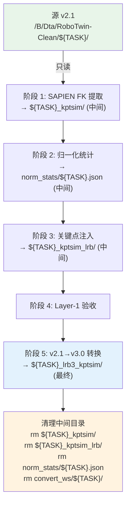

# RoboTwin 2.0 子任务逐个处理——生成含 kptsim 3D 关键点的 LeRobot v3.0 数据

> **目标**: 循环 `/B/Dta/RoboTwin-Clean/` 下 49 个 LeRobot v2.1 源任务，对每个任务执行 SAPIEN FK 关键点提取→归一化统计→注入→验收→v2.1→v3.0 转换，最终产出 `{task}_lrb3_kptsim/` 数据集，清除所有中间目录。
>
> **禁止触碰**: 源任务目录（`{task}/`）和已有的 `{task}_lrb3/` 目录。`stack_bowls_three` 的源目录已是 v3.0 格式（无 episode 级 parquet），提取器无法处理，**跳过**。
>
> **复用**: 全部复用现有脚本，不新建提取/注入/转换逻辑。

---

## 关键变量定义

下表列出本文档和相关脚本（[`run_each_rbt_p012.sh`](../../s/rbt/run_each_rbt_p012.sh)、[`lib.sh`](../../s/rbt/lib.sh)、[`phase0_prep_data.sh`](../../s/rbt/phase0_prep_data.sh)）中使用的路径变量。"原脚本默认值"是 `run_each_rbt_p012.sh` 中的 `${VAR:-default}` 定义；"本次计划期望值"是本文档处理脚本 `prepare_all_kptsim.sh` 实际采用的值。

| 变量 | 含义 | 原脚本默认值 | 本次计划期望值 |
|:---|:---|:---|:---|
| `CLEAN_ROOT` | RoboTwin 2.0 源数据根目录，存放各任务的 v2.1 原始数据和所有派生目录 | `/home/a26113/Dta/RoboTwin-Clean` | `/B/Dta/RoboTwin-Clean` |
| `KPTSIM_ROOT` | SAPIEN FK 提取中间产物（`{task}_kptsim/`）的父目录 | `${CLEAN_ROOT}`（即与源数据同目录） | `${CLEAN_ROOT}`（同左） |
| `LRB_ROOT` | 关键点注入后的 v2.1 副本（`{task}_kptsim_lrb/`）的父目录 | `${CLEAN_ROOT}` | `${CLEAN_ROOT}`（同左） |
| `V30_ROOT` | v2.1→v3.0 转换最终产物的父目录（原脚本产出 `{task}_kptsim_lrbv30/`） | `${CLEAN_ROOT}` | `${CLEAN_ROOT}`（本次产出命名为 `{task}_lrb3_kptsim/`） |
| `CKPT_ROOT` | 训练 checkpoint、日志、流水线状态的根目录 | `${HOME}/Ckp/itvlaGp` | **本次不涉及**（Phase 0 不产生 checkpoint） |
| `CONVERT_WORK_ROOT` | v2.1→v3.0 转换的隔离工作区父目录（每任务一个子目录，转换完即删） | `${CKPT_ROOT}/.convert_ws` | `${CLEAN_ROOT}/.convert_ws` |
| `NORM_STATS_DIR` | 归一化统计 JSON 的存放目录（`robotwin_norm_stats_{task}.json`） | `${CKPT_ROOT}/norm_stats` | `${CLEAN_ROOT}/.norm_stats` |
| `GEOPREDICT_ROOT` | GeoPredict 仓库根目录（含 SAPIEN FK 提取脚本和 norm stats 脚本） | 自动推导 `${ITVLAGP_ROOT}/../GeoPredict` | `/B/SRC/GeoPredict` |
| `ITVLAGP_ROOT` | itvlaGp 仓库根目录（含注入脚本、验收脚本、v2.1→v3.0 转换脚本） | `${SCRIPT_DIR}/../../..`（即 `b/s/rbt` 向上 3 级） | `/B/SRC/itvlaGp` |
| `URDF_PATH` | ALOHA-Agilex 双臂机器人的 URDF 文件路径（SAPIEN FK 所需） | `${ROBOTWIN_ROOT}/assets/embodiments/aloha-agilex/urdf/arx5_description_isaac.urdf` | `/B/SRC/RoboTwin/assets/embodiments/aloha-agilex/urdf/arx5_description_isaac.urdf` |
| `TRAIN_PYTHON` | 训练/注入/转换用的 Python 解释器 | `${VENV_ROOT}/bin/python` | `python3`（`/opt/conda/bin/python3`） |
| `EXTRACT_PYTHON` | SAPIEN 提取用的 Python 解释器（可与 TRAIN_PYTHON 不同） | `${TRAIN_PYTHON}` | `python3`（同上） |

> **本次与原脚本的关键差异**:
> - 原脚本最终产物命名为 `{task}_kptsim_lrbv30`，本次改为 **`{task}_lrb3_kptsim`**。
> - 原脚本的 `CONVERT_WORK_ROOT` 和 `NORM_STATS_DIR` 放在 `CKPT_ROOT` 下，本次改为 `CLEAN_ROOT` 下的隐藏子目录（`.convert_ws/`、`.norm_stats/`），因为本次只做 Phase 0 数据准备，不涉及训练 checkpoint。
> - 原脚本依赖 `lib.sh` + `resolve_task_paths()` 在 shell 环境中展开路径，本次的 `prepare_all_kptsim.sh` 自行定义路径（不依赖 `lib.sh`），保持独立可执行。

---

## 代码变更清单

本次计划涉及 **1 个新增脚本** 和 **1 个修改脚本**，其余 6 个现有脚本**原样复用**，无需任何改动。

### 新增文件

| 文件路径 | 说明 |
|:---|:---|
| `b/s/rbt/prepare_all_kptsim.sh`（itvlaGp） | 批量处理主脚本，循环 49 个 v2.1 源任务执行 5 阶段流水线。完整代码见 [Step 2: 部署处理脚本](#step-2-部署处理脚本) |

**新增脚本要点**:
- 约 200 行 Bash，独立可执行（不依赖 `lib.sh`），自行定义路径变量
- 内置任务发现逻辑：遍历 `CLEAN_ROOT` 子目录，过滤 `_lrb3`、`_lrb3_kptsim`、`_kptsim*`、`_old`、隐藏目录，仅保留含 `meta/info.json` 且 `codebase_version=v2.1` 的目录
- 支持 `--task <name>` 指定单任务、`--tasks t1,t2,t3` 指定多任务、不传参则自动发现全部
- 支持 `--force` 强制重做已完成任务、`--keep-going` 单任务失败继续下一个
- 每个任务成功后自动清理中间目录，失败时保留中间产物便于排查

### 需修改的文件

| 文件路径 | 修改原因 |
|:---|:---|
| `b/s/rbt/discover_source_tasks.py`（itvlaGp） | `DERIVED_SUFFIXES` 缺少 `_lrb3` 和 `_lrb3_kptsim`，导致 `_lrb3` 目录被误识别为源任务 |

**具体修改内容**（第 13 行）：

修改前：
```python
DERIVED_SUFFIXES = ("_kptsim_lrbv30", "_kptsim_lrb", "_kptsim")
```

修改后：
```python
DERIVED_SUFFIXES = ("_lrb3_kptsim", "_kptsim_lrbv30", "_kptsim_lrb", "_kptsim", "_lrb3")
```

> **顺序说明**: `_lrb3_kptsim` 必须在 `_lrb3` 之前，否则 `endswith("_lrb3")` 会先匹配上 `xxx_lrb3_kptsim`，虽然结果同为 `True` 不影响过滤正确性，但放在前面语义更清晰、且能正确标识该目录的真实类别。同理 `_kptsim_lrbv30` 在 `_kptsim` 之前。

> **影响范围**: 此修改仅影响 `discover_source_tasks.py` 的过滤行为。`prepare_all_kptsim.sh` 内置了独立的过滤逻辑，不依赖此脚本，但修复此处可保证 `run_each_rbt_p012.sh --list-tasks` 等原有流程也能正确过滤 `_lrb3` 目录。

### 原样复用（无需修改）的文件

| 文件路径 | 所在仓库 | 用途 | 调用方式 |
|:---|:---|:---|:---|
| `b/script/kpt/run_extract.py` | GeoPredict | SAPIEN FK 关键点提取 | `--dataset_dir` `--urdf_path` `--output_dir` |
| `tools/compute_robotwin_norm_stats.py` | GeoPredict | 计算 state/action 归一化统计 | `--dataset_dir` `--output` |
| `util_scripts/inject_kptsim_keypoints.py` | itvlaGp | 关键点列注入 + norm stats 重映射 | `--source` `--kptsim_dir` `--dest` `--norm_stats_path` `--coord_mode voxel` `--force` |
| `b/s/rbt/layer1_check.py` | itvlaGp | 6 项数据验收检查 | `--dest-root` `--kptsim-root` `--task` |
| `src/lerobot/datasets/v30/convert_dataset_v21_to_v30.py` | itvlaGp | LeRobot v2.1→v3.0 格式转换 | `--repo-id` `--root` `--push-to-hub=false` `--force-conversion` |
| `b/s/rbt/discover_source_tasks.py` | itvlaGp | 源任务列表发现（被 `prepare_all_kptsim.sh` 的内置逻辑替代，但建议同步修复） | `--clean-root` `--names-only` |

> **为什么 6 个脚本都不需要改？** 这些脚本的输入/输出完全由 CLI 参数控制。本次的路径变化（最终产物命名 `_lrb3_kptsim`、中间目录放在 `.norm_stats/` 和 `.convert_ws/`）全部通过 `prepare_all_kptsim.sh` 传入不同的参数值来实现，不需要修改脚本内部逻辑。

---

## 目录

- [第一部分：方案设计](#第一部分方案设计)
  - [1. 现状分析](#1-现状分析)
  - [2. 处理流程设计](#2-处理流程设计)
  - [3. 路径命名规则](#3-路径命名规则)
  - [4. 中间产物与清理策略](#4-中间产物与清理策略)
  - [5. 特殊情况处理](#5-特殊情况处理)
  - [6. 依赖与环境](#6-依赖与环境)
- [第二部分：操作手册](#第二部分操作手册)
  - [Step 0: 环境准备](#step-0-环境准备)
  - [Step 1: 确认源数据](#step-1-确认源数据)
  - [Step 2: 部署处理脚本](#step-2-部署处理脚本)
  - [Step 3: 试跑单个任务](#step-3-试跑单个任务)
  - [Step 4: 批量执行全部任务](#step-4-批量执行全部任务)
  - [Step 5: 验收与确认](#step-5-验收与确认)
  - [Step 6: 故障排查](#step-6-故障排查)

---

# 第一部分：方案设计

## 1. 现状分析

### 1.1 数据目录结构

`/B/Dta/RoboTwin-Clean/` 下共 100 个子目录：

| 类型 | 数量 | 命名格式 | 说明 |
|:---|:---:|:---|:---|
| 源任务 v2.1 | 49 | `{task}/` | 含 `data/chunk-000/episode_*.parquet`，`codebase_version=v2.1` |
| 源任务 v3.0 | 1 | `stack_bowls_three/` | 已被转换为 v3.0（`file-*.parquet`），**提取器无法处理** |
| 已有 v3.0 | 50 | `{task}_lrb3/` | 不含关键点的 v3.0 数据集，**不可触碰** |

49 个 v2.1 源任务均为 50 个 episode，帧数从 3855（`click_bell`）到 31231（`put_bottles_dustbin`）不等。

### 1.2 提取器的布局要求

SAPIEN FK 提取器（[`GeoPredict/b/script/kpt/keypoint_extractor.py`](../../../../GeoPredict/b/script/kpt/keypoint_extractor.py)）的 `_read_parquet_states` 方法硬编码读取：

```
data/chunk-000/episode_{idx:06d}.parquet
```

因此**只能处理 v2.1 格式**。`stack_bowls_three` 的源目录已是 v3.0（`file-000.parquet`），必须跳过。

### 1.3 可复用脚本清单

| 步骤 | 脚本 | 所在仓库 |
|:---|:---|:---|
| SAPIEN FK 提取 | `b/script/kpt/run_extract.py` | GeoPredict |
| 归一化统计 | `tools/compute_robotwin_norm_stats.py` | GeoPredict |
| 关键点注入 | `util_scripts/inject_kptsim_keypoints.py` | itvlaGp |
| Layer-1 验收 | `b/s/rbt/layer1_check.py` | itvlaGp |
| v2.1→v3.0 转换 | `src/lerobot/datasets/v30/convert_dataset_v21_to_v30.py` | itvlaGp |
| 源任务发现 | `b/s/rbt/discover_source_tasks.py` | itvlaGp |

### 1.4 本机环境

- Python: `/opt/conda/bin/python3` (3.11)
- 已有: `pandas`, `numpy`, `pyarrow`
- **缺少**: `sapien`, `transforms3d`, `lerobot`（需安装）
- GeoPredict 仓库: `/B/SRC/GeoPredict`
- itvlaGp 仓库: `/B/SRC/itvlaGp`
- URDF: `/B/SRC/RoboTwin/assets/embodiments/aloha-agilex/urdf/arx5_description_isaac.urdf`

---

## 2. 处理流程设计

对每个 v2.1 源任务 `${TASK}`，执行以下 5 个阶段，成功后清除中间产物：



### 2.1 五阶段详述

**阶段 1 — SAPIEN FK 提取**

```bash
cd /B/SRC/GeoPredict
python3 b/script/kpt/run_extract.py \
  --dataset_dir /B/Dta/RoboTwin-Clean/${TASK} \
  --urdf_path /B/SRC/RoboTwin/assets/embodiments/aloha-agilex/urdf/arx5_description_isaac.urdf \
  --output_dir /B/Dta/RoboTwin-Clean/${TASK}_kptsim
```

- **输入**: 源 v2.1 数据集（只读）
- **输出**: `${TASK}_kptsim/`（含 `episode_NNNNNN/keypoints.npy` + `keypoints_meta.json`）
- **特性**: 自动计算该任务的 `coord_offset`，两遍扫描（见 [kptsim_3dtrj.md §3](kptsim_3dtrj.md)）

**阶段 2 — 归一化统计**

```bash
python3 /B/SRC/GeoPredict/tools/compute_robotwin_norm_stats.py \
  --dataset_dir /B/Dta/RoboTwin-Clean/${TASK} \
  --output /B/Dta/RoboTwin-Clean/.norm_stats/robotwin_norm_stats_${TASK}.json
```

- **输入**: 源 v2.1（只读，取 `observation.state` 和 `action`）
- **输出**: JSON（键 `state` / `actions`，含 `mean` / `std` / `q01` / `q99`）

**阶段 3 — 关键点注入**

```bash
python3 /B/SRC/itvlaGp/util_scripts/inject_kptsim_keypoints.py \
  --source /B/Dta/RoboTwin-Clean/${TASK} \
  --kptsim_dir /B/Dta/RoboTwin-Clean/${TASK}_kptsim \
  --dest /B/Dta/RoboTwin-Clean/${TASK}_kptsim_lrb \
  --norm_stats_path /B/Dta/RoboTwin-Clean/.norm_stats/robotwin_norm_stats_${TASK}.json \
  --coord_mode voxel \
  --force
```

- **输入**: 源 v2.1 + kptsim 产物 + norm stats
- **输出**: `${TASK}_kptsim_lrb/`（源的副本 + `observation.keypoint_3d` 列 + `norm_stat.json` + `meta/keypoints_meta.json`）
- 注入脚本内部会 rsync 复制源数据集到 dest，再原地修改 parquet

**阶段 4 — Layer-1 验收**

```bash
python3 /B/SRC/itvlaGp/b/s/rbt/layer1_check.py \
  --dest-root /B/Dta/RoboTwin-Clean/${TASK}_kptsim_lrb \
  --kptsim-root /B/Dta/RoboTwin-Clean/${TASK}_kptsim \
  --task ${TASK}
```

- 6 项检查全部 PASS 才继续，否则停止当前任务

**阶段 5 — v2.1→v3.0 转换 + 最终落盘**

隔离式转换工作区，避免与其他任务互相删除：

```bash
# 建立隔离工作区
CONVERT_WS="/B/Dta/RoboTwin-Clean/.convert_ws/${TASK}"
rm -rf "${CONVERT_WS}"
mkdir -p "${CONVERT_WS}/robotwin"
ln -sfn "/B/Dta/RoboTwin-Clean/${TASK}_kptsim_lrb" "${CONVERT_WS}/robotwin/${TASK}_kptsim"

# 执行转换
python3 /B/SRC/itvlaGp/src/lerobot/datasets/v30/convert_dataset_v21_to_v30.py \
  --repo-id="robotwin/${TASK}_kptsim" \
  --root="${CONVERT_WS}" \
  --push-to-hub=false \
  --force-conversion

# 搬运到最终位置 (注意命名: _lrb3_kptsim)
rsync -a --delete "${CONVERT_WS}/robotwin/${TASK}_kptsim_v30/" \
  "/B/Dta/RoboTwin-Clean/${TASK}_lrb3_kptsim/"

# 补拷转换脚本不带走的 meta 文件
cp -f "/B/Dta/RoboTwin-Clean/${TASK}_kptsim_lrb/meta/keypoints_meta.json" \
  "/B/Dta/RoboTwin-Clean/${TASK}_lrb3_kptsim/meta/keypoints_meta.json"
cp -f "/B/Dta/RoboTwin-Clean/${TASK}_kptsim_lrb/norm_stat.json" \
  "/B/Dta/RoboTwin-Clean/${TASK}_lrb3_kptsim/norm_stat.json"

# Layer-2 验证
python3 -c "
import json
from pathlib import Path
root = Path('/B/Dta/RoboTwin-Clean/${TASK}_lrb3_kptsim')
info = json.loads((root / 'meta' / 'info.json').read_text())
assert '3.0' in str(info.get('codebase_version', '')), f'version={info.get(\"codebase_version\")}'
assert 'observation.keypoint_3d' in info.get('features', {}), 'missing keypoint_3d'
print('Layer-2 OK:', info.get('codebase_version'), 'episodes:', info.get('total_episodes'))
"

# 清理中间目录
rm -rf "${CONVERT_WS}"
```

**最终清理**（阶段 5 成功后）：

```bash
rm -rf "/B/Dta/RoboTwin-Clean/${TASK}_kptsim"         # 阶段 1 中间产物
rm -rf "/B/Dta/RoboTwin-Clean/${TASK}_kptsim_lrb"      # 阶段 3 中间产物
rm -f  "/B/Dta/RoboTwin-Clean/.norm_stats/robotwin_norm_stats_${TASK}.json"  # 阶段 2 中间产物
```

---

## 3. 路径命名规则

| 目录 | 性质 | 说明 |
|:---|:---|:---|
| `${TASK}/` | **源，只读** | LeRobot v2.1 原始数据 |
| `${TASK}_lrb3/` | **已有，不可触碰** | 不含关键点的 v3.0 |
| `${TASK}_kptsim/` | **中间，完成后删除** | SAPIEN FK 产物 |
| `${TASK}_kptsim_lrb/` | **中间，完成后删除** | 注入后的 v2.1 副本 |
| `.norm_stats/` | **中间，逐个删除** | 归一化统计 JSON |
| `.convert_ws/${TASK}/` | **中间，逐个删除** | v2.1→v3.0 转换隔离区 |
| **`${TASK}_lrb3_kptsim/`** | **最终产物** | 含 `observation.keypoint_3d` 的 LeRobot v3.0 |

**命名逻辑**: `_lrb3` = LeRobot v**3**.0 格式，`_kptsim` = 含 kptsim 3D 关键点。连写 `_lrb3_kptsim` 表示"v3.0 格式 + 含关键点"。

---

## 4. 中间产物与清理策略

**安全原则**: 只有当 `${TASK}_lrb3_kptsim/` 的 Layer-2 验证全部通过后，才删除该任务的中间目录。

| 中间产物 | 生成阶段 | 大小估算 | 清理时机 |
|:---|:---|:---|:---|
| `${TASK}_kptsim/` | 阶段 1 | 数 MB（仅 npy） | 该任务全部阶段成功后 |
| `.norm_stats/...${TASK}.json` | 阶段 2 | 数 KB | 该任务全部阶段成功后 |
| `${TASK}_kptsim_lrb/` | 阶段 3 | 与源数据同大小（rsync 副本） | 该任务全部阶段成功后 |
| `.convert_ws/${TASK}/` | 阶段 5 | 与源数据同大小 | 阶段 5 rsync 完成后立即删除 |

**最坏情况磁盘占用**：同时存在 `_kptsim` + `_kptsim_lrb` + `.convert_ws` ≈ 源数据的 2 倍 + 数 MB。单任务最大约 60 MB（`put_bottles_dustbin`，31K 帧含视频），逐个处理不会撑爆磁盘。

---

## 5. 特殊情况处理

### 5.1 `stack_bowls_three`（源已是 v3.0）

该任务的源目录 `/B/Dta/RoboTwin-Clean/stack_bowls_three/` 已被就地转换为 v3.0 格式（`file-000.parquet` 而非 `episode_*.parquet`）。提取器会因找不到 `episode_000000.parquet` 而失败。

**处理**: 脚本自动跳过此任务，在日志中记录原因。

### 5.2 已存在的 `_lrb3_kptsim` 目录

如果某个任务的 `${TASK}_lrb3_kptsim/` 已存在且完整（含 `meta/info.json` + `norm_stat.json` + `meta/keypoints_meta.json`，且 `codebase_version` 含 `3.0`），默认跳过该任务。使用 `--force` 可强制重做。

### 5.3 残留中间目录

如果脚本因中断而留下中间目录（`_kptsim`、`_kptsim_lrb`），重新运行时会在相应阶段检测到已有产物并复用（不重复提取/注入），只要最终 Layer-2 验证通过即可。`--force` 会清除中间产物并重做。

---

## 6. 依赖与环境

### 6.1 需安装的 Python 包

```bash
pip install sapien transforms3d    # SAPIEN FK 提取所需
pip install -e /B/SRC/itvlaGp      # lerobot + v2.1→v3.0 转换所需
```

### 6.2 环境变量

处理脚本不需要 GPU，所有计算（FK、统计、注入、转换）均为 CPU 操作。

---

# 第二部分：操作手册

## Step 0: 环境准备

### 0.1 安装 Python 依赖

```bash
# 安装 SAPIEN 和 transforms3d (FK 提取所需)
pip install sapien transforms3d

# 安装 lerobot (v2.1→v3.0 转换所需)
pip install -e /B/SRC/itvlaGp

# 验证
python3 -c "import sapien; print('sapien OK')"
python3 -c "import transforms3d; print('transforms3d OK')"
python3 -c "from lerobot.datasets.v30.convert_dataset_v21_to_v30 import convert; print('lerobot convert OK')"
```

### 0.2 验证关键路径

```bash
# 源数据目录
ls /B/Dta/RoboTwin-Clean/adjust_bottle/meta/info.json

# GeoPredict 提取脚本
ls /B/SRC/GeoPredict/b/script/kpt/run_extract.py

# itvlaGp 注入脚本
ls /B/SRC/itvlaGp/util_scripts/inject_kptsim_keypoints.py

# URDF
ls /B/SRC/RoboTwin/assets/embodiments/aloha-agilex/urdf/arx5_description_isaac.urdf

# Layer-1 检查脚本
ls /B/SRC/itvlaGp/b/s/rbt/layer1_check.py

# v2.1→v3.0 转换脚本
ls /B/SRC/itvlaGp/src/lerobot/datasets/v30/convert_dataset_v21_to_v30.py
```

所有 6 个文件必须存在，否则后续步骤会失败。

---

## Step 1: 确认源数据

```bash
# 列出所有源任务及其格式版本
python3 /B/SRC/itvlaGp/b/s/rbt/discover_source_tasks.py \
  --clean-root /B/Dta/RoboTwin-Clean
```

预期输出：49 个 v2.1 任务 + 1 个 v3.0（`stack_bowls_three`）+ 50 个 `_lrb3` 目录。

检查确认：
- 全部 v2.1 源任务都有 `data/chunk-000/episode_*.parquet`
- 没有任何 `_lrb3_kptsim` 目录存在（首次运行）

```bash
ls -d /B/Dta/RoboTwin-Clean/*_lrb3_kptsim 2>/dev/null | wc -l
# 预期输出: 0
```

---

## Step 2: 部署处理脚本

将以下脚本保存为 `/B/SRC/itvlaGp/b/s/rbt/prepare_all_kptsim.sh`：

```bash
#!/usr/bin/env bash
# 循环处理所有 RoboTwin 2.0 v2.1 源任务，生成含 kptsim 3D 关键点的 LeRobot v3.0 数据。
# 最终产物: ${TASK}_lrb3_kptsim/
# 中间产物全部清理。
set -euo pipefail

# ==================== 可配置项 ====================
CLEAN_ROOT="${CLEAN_ROOT:-/B/Dta/RoboTwin-Clean}"
GEOPREDICT_ROOT="${GEOPREDICT_ROOT:-/B/SRC/GeoPredict}"
ITVLAGP_ROOT="${ITVLAGP_ROOT:-/B/SRC/itvlaGp}"
URDF_PATH="${URDF_PATH:-/B/SRC/RoboTwin/assets/embodiments/aloha-agilex/urdf/arx5_description_isaac.urdf}"
PYTHON="${PYTHON:-python3}"
FORCE="${FORCE:-0}"
KEEP_GOING="${KEEP_GOING:-0}"

# 中间产物目录 (隐藏目录，不与源数据混淆)
NORM_STATS_DIR="${CLEAN_ROOT}/.norm_stats"
CONVERT_WS_ROOT="${CLEAN_ROOT}/.convert_ws"

# ==================== CLI 参数 ====================
TASKS=()
while [[ $# -gt 0 ]]; do
  case "$1" in
    --force)       FORCE=1; shift ;;
    --keep-going)  KEEP_GOING=1; shift ;;
    --tasks)       IFS=',' read -ra TASKS <<< "$2"; shift 2 ;;
    --task)        TASKS+=("$2"); shift 2 ;;
    *)             echo "未知参数: $1"; exit 1 ;;
  esac
done

# ==================== 辅助函数 ====================
ts() { date +'%Y-%m-%d %H:%M:%S'; }
log() { echo "[$(ts)] $*"; }
die() { echo "[$(ts)] 错误: $*" >&2; exit 1; }

lrb3_kptsim_ready() {
  local d="${CLEAN_ROOT}/${1}_lrb3_kptsim"
  [[ -f "${d}/meta/info.json" ]] && [[ -f "${d}/norm_stat.json" ]] && [[ -f "${d}/meta/keypoints_meta.json" ]]
}

# ==================== 发现任务 ====================
if [[ ${#TASKS[@]} -eq 0 ]]; then
  while IFS= read -r name; do
    TASKS+=("${name}")
  done < <(
    for d in "${CLEAN_ROOT}"/*/; do
      name="$(basename "$d")"
      # 跳过派生目录
      [[ "${name}" == *_lrb3 ]]        && continue
      [[ "${name}" == *_lrb3_kptsim ]] && continue
      [[ "${name}" == *_kptsim* ]]     && continue
      [[ "${name}" == *_old ]]         && continue
      [[ "${name}" == .* ]]            && continue
      # 必须含 meta/info.json
      [[ -f "${d}meta/info.json" ]]    || continue
      # 必须是 v2.1 (提取器依赖 episode_*.parquet 布局)
      ver="$("${PYTHON}" -c "import json; print(json.load(open('${d}meta/info.json')).get('codebase_version',''))")"
      [[ "${ver}" == "v2.1" ]]         || { log "跳过 ${name}: 版本 ${ver} (非 v2.1, 提取器不兼容)"; continue; }
      echo "${name}"
    done
  )
fi

log "共 ${#TASKS[@]} 个任务待处理"
[[ ${#TASKS[@]} -gt 0 ]] || { log "无可处理任务"; exit 0; }

# ==================== Preflight ====================
[[ -d "${CLEAN_ROOT}" ]]                                         || die "CLEAN_ROOT 不存在: ${CLEAN_ROOT}"
[[ -f "${URDF_PATH}" ]]                                         || die "URDF 不存在: ${URDF_PATH}"
[[ -f "${GEOPREDICT_ROOT}/b/script/kpt/run_extract.py" ]]       || die "提取脚本不存在"
[[ -f "${ITVLAGP_ROOT}/util_scripts/inject_kptsim_keypoints.py" ]] || die "注入脚本不存在"
[[ -f "${ITVLAGP_ROOT}/b/s/rbt/layer1_check.py" ]]              || die "验收脚本不存在"
"${PYTHON}" -c "import sapien" 2>/dev/null                       || die "sapien 未安装: pip install sapien"
"${PYTHON}" -c "import transforms3d" 2>/dev/null                 || die "transforms3d 未安装: pip install transforms3d"

mkdir -p "${NORM_STATS_DIR}"

# ==================== 主循环 ====================
SUCCEEDED=0
FAILED=0
SKIPPED=0
FAIL_LIST=()

for TASK in "${TASKS[@]}"; do
  log "========================================"
  log "开始处理: ${TASK}"
  log "========================================"

  TASK_SRC="${CLEAN_ROOT}/${TASK}"
  TASK_KPTSIM="${CLEAN_ROOT}/${TASK}_kptsim"
  TASK_LRB="${CLEAN_ROOT}/${TASK}_kptsim_lrb"
  TASK_FINAL="${CLEAN_ROOT}/${TASK}_lrb3_kptsim"
  TASK_NORM="${NORM_STATS_DIR}/robotwin_norm_stats_${TASK}.json"
  TASK_CONVERT_WS="${CONVERT_WS_ROOT}/${TASK}"

  # --- 跳过检查 ---
  if [[ "${FORCE}" != "1" ]] && lrb3_kptsim_ready "${TASK}"; then
    log "跳过 ${TASK}: 已存在完整的 ${TASK}_lrb3_kptsim/"
    SKIPPED=$((SKIPPED + 1))
    continue
  fi

  # --- 包裹错误处理 ---
  if ! (
    set -e

    # === 阶段 1: SAPIEN FK 提取 ===
    if [[ "${FORCE}" == "1" ]] || [[ ! -f "${TASK_KPTSIM}/keypoints_meta.json" ]]; then
      log "[${TASK}] 阶段 1/5: SAPIEN FK 提取 → ${TASK}_kptsim/"
      rm -rf "${TASK_KPTSIM}"
      (
        cd "${GEOPREDICT_ROOT}"
        "${PYTHON}" b/script/kpt/run_extract.py \
          --dataset_dir "${TASK_SRC}" \
          --urdf_path "${URDF_PATH}" \
          --output_dir "${TASK_KPTSIM}"
      )
    else
      log "[${TASK}] 阶段 1/5: 复用已有 kptsim ${TASK_KPTSIM}/"
    fi

    # === 阶段 2: 归一化统计 ===
    if [[ "${FORCE}" == "1" ]] || [[ ! -f "${TASK_NORM}" ]]; then
      log "[${TASK}] 阶段 2/5: 归一化统计 → ${TASK_NORM}"
      "${PYTHON}" "${GEOPREDICT_ROOT}/tools/compute_robotwin_norm_stats.py" \
        --dataset_dir "${TASK_SRC}" \
        --output "${TASK_NORM}"
    else
      log "[${TASK}] 阶段 2/5: 复用已有 norm stats"
    fi

    # === 阶段 3: 关键点注入 ===
    if [[ "${FORCE}" == "1" ]] || [[ ! -f "${TASK_LRB}/meta/keypoints_meta.json" ]]; then
      log "[${TASK}] 阶段 3/5: 关键点注入 → ${TASK}_kptsim_lrb/"
      "${PYTHON}" "${ITVLAGP_ROOT}/util_scripts/inject_kptsim_keypoints.py" \
        --source "${TASK_SRC}" \
        --kptsim_dir "${TASK_KPTSIM}" \
        --dest "${TASK_LRB}" \
        --norm_stats_path "${TASK_NORM}" \
        --coord_mode voxel \
        --force
    else
      log "[${TASK}] 阶段 3/5: 复用已有注入数据集"
    fi

    # === 阶段 4: Layer-1 验收 ===
    log "[${TASK}] 阶段 4/5: Layer-1 验收"
    "${PYTHON}" "${ITVLAGP_ROOT}/b/s/rbt/layer1_check.py" \
      --dest-root "${TASK_LRB}" \
      --kptsim-root "${TASK_KPTSIM}" \
      --task "${TASK}"

    # === 阶段 5: v2.1→v3.0 转换 ===
    log "[${TASK}] 阶段 5/5: v2.1→v3.0 转换 → ${TASK}_lrb3_kptsim/"

    # 5a. 隔离工作区
    rm -rf "${TASK_CONVERT_WS}"
    mkdir -p "${TASK_CONVERT_WS}/robotwin"
    ln -sfn "${TASK_LRB}" "${TASK_CONVERT_WS}/robotwin/${TASK}_kptsim"

    # 5b. 转换
    "${PYTHON}" "${ITVLAGP_ROOT}/src/lerobot/datasets/v30/convert_dataset_v21_to_v30.py" \
      --repo-id="robotwin/${TASK}_kptsim" \
      --root="${TASK_CONVERT_WS}" \
      --push-to-hub=false \
      --force-conversion

    CONVERT_OUT="${TASK_CONVERT_WS}/robotwin/${TASK}_kptsim_v30"
    [[ -d "${CONVERT_OUT}" ]] || { log "错误: 转换未产出 ${CONVERT_OUT}"; exit 1; }

    # 5c. 搬运到最终位置
    if [[ -d "${TASK_FINAL}" ]]; then
      rm -rf "${TASK_FINAL}"
    fi
    if command -v rsync >/dev/null 2>&1; then
      mkdir -p "${TASK_FINAL}"
      rsync -a --delete "${CONVERT_OUT}/" "${TASK_FINAL}/"
    else
      cp -a "${CONVERT_OUT}" "${TASK_FINAL}"
    fi

    # 5d. 补拷 meta (转换脚本不带走这些)
    mkdir -p "${TASK_FINAL}/meta"
    cp -f "${TASK_LRB}/meta/keypoints_meta.json" "${TASK_FINAL}/meta/keypoints_meta.json"
    cp -f "${TASK_LRB}/norm_stat.json" "${TASK_FINAL}/norm_stat.json"

    # 5e. 清理转换工作区
    rm -rf "${TASK_CONVERT_WS}"

    # 5f. Layer-2 验证
    "${PYTHON}" -c "
import json
from pathlib import Path
root = Path('${TASK_FINAL}')
info = json.loads((root / 'meta' / 'info.json').read_text())
ver = str(info.get('codebase_version', ''))
assert '3.0' in ver or ver.startswith('v3'), f'codebase_version={ver}'
assert 'observation.keypoint_3d' in info.get('features', {}), 'v30 missing keypoint_3d'
assert (root / 'norm_stat.json').is_file(), 'missing norm_stat.json'
assert (root / 'meta' / 'keypoints_meta.json').is_file(), 'missing keypoints_meta.json'
print(f'Layer-2 OK: {ver}, episodes={info.get(\"total_episodes\")}, frames={info.get(\"total_frames\")}')
"

    # === 全部成功，清理中间产物 ===
    log "[${TASK}] 清理中间目录..."
    rm -rf "${TASK_KPTSIM}"
    rm -rf "${TASK_LRB}"
    rm -f  "${TASK_NORM}"
    log "[${TASK}] 完成 ✓"

  ); then
    # --- 任务失败 ---
    FAILED=$((FAILED + 1))
    FAIL_LIST+=("${TASK}")
    log "!!! ${TASK} 失败 !!!"
    if [[ "${KEEP_GOING}" != "1" ]]; then
      log "使用 --keep-going 可在失败后继续下一个任务"
      die "中止: ${TASK} 失败"
    fi
  else
    SUCCEEDED=$((SUCCEEDED + 1))
  fi
done

# ==================== 汇总 ====================
log "========================================"
log "全部完成"
log "  成功: ${SUCCEEDED}"
log "  跳过: ${SKIPPED}"
log "  失败: ${FAILED}"
if [[ ${FAILED} -gt 0 ]]; then
  log "  失败任务: ${FAIL_LIST[*]}"
fi
log "========================================"

# 清理空的中间目录
rmdir "${NORM_STATS_DIR}" 2>/dev/null || true
rmdir "${CONVERT_WS_ROOT}" 2>/dev/null || true

[[ ${FAILED} -eq 0 ]]
```

**保存并赋予执行权限**:

```bash
chmod +x /B/SRC/itvlaGp/b/s/rbt/prepare_all_kptsim.sh
```

---

## Step 3: 试跑单个任务

**选一个小任务试跑**（`click_bell`，3855 帧，全部任务中最小）：

```bash
cd /B/SRC/itvlaGp
bash b/s/rbt/prepare_all_kptsim.sh --task click_bell
```

**预期输出**（约 1–3 分钟）：

```
[2026-09-02 ...] 共 1 个任务待处理
[2026-09-02 ...] 开始处理: click_bell
[2026-09-02 ...] [click_bell] 阶段 1/5: SAPIEN FK 提取 → click_bell_kptsim/
[INFO] Episode 1/50 extracted, steps=77
...
[2026-09-02 ...] [click_bell] 阶段 2/5: 归一化统计
[2026-09-02 ...] [click_bell] 阶段 3/5: 关键点注入
[2026-09-02 ...] [click_bell] 阶段 4/5: Layer-1 验收
ALL PASS
[2026-09-02 ...] [click_bell] 阶段 5/5: v2.1→v3.0 转换
Layer-2 OK: v3.0, episodes=50, frames=3855
[2026-09-02 ...] [click_bell] 清理中间目录...
[2026-09-02 ...] [click_bell] 完成 ✓
[2026-09-02 ...] 全部完成
[2026-09-02 ...]   成功: 1
```

**验收试跑结果**:

```bash
# 1. 最终目录存在
ls /B/Dta/RoboTwin-Clean/click_bell_lrb3_kptsim/meta/info.json

# 2. 版本和特征正确
python3 -c "
import json
d = json.load(open('/B/Dta/RoboTwin-Clean/click_bell_lrb3_kptsim/meta/info.json'))
print('version:', d['codebase_version'])
print('has keypoint_3d:', 'observation.keypoint_3d' in d['features'])
print('episodes:', d['total_episodes'])
print('frames:', d['total_frames'])
"

# 3. norm_stat.json 键名正确
python3 -c "
import json
d = json.load(open('/B/Dta/RoboTwin-Clean/click_bell_lrb3_kptsim/norm_stat.json'))
print('keys:', list(d.keys()))
# 预期: ['observation.state', 'action']
"

# 4. keypoints_meta.json 存在
python3 -c "
import json
d = json.load(open('/B/Dta/RoboTwin-Clean/click_bell_lrb3_kptsim/meta/keypoints_meta.json'))
print('K:', d['K'], 'offset:', d['coord_offset'])
"

# 5. 源数据未被修改
python3 -c "
import json
d = json.load(open('/B/Dta/RoboTwin-Clean/click_bell/meta/info.json'))
print('源数据 version:', d['codebase_version'])
assert d['codebase_version'] == 'v2.1', '源数据被修改了!'
assert 'observation.keypoint_3d' not in d.get('features', {}), '源数据被注入了关键点!'
print('OK: 源数据未被修改')
"

# 6. _lrb3 目录未被修改
ls /B/Dta/RoboTwin-Clean/click_bell_lrb3/meta/info.json

# 7. 中间目录已清理
[[ ! -d /B/Dta/RoboTwin-Clean/click_bell_kptsim ]] && echo "kptsim 已清理"
[[ ! -d /B/Dta/RoboTwin-Clean/click_bell_kptsim_lrb ]] && echo "kptsim_lrb 已清理"
```

**所有 7 项检查通过后**，继续 Step 4。

---

## Step 4: 批量执行全部任务

```bash
cd /B/SRC/itvlaGp

# 推荐使用 --keep-going，单个任务失败不影响其他任务
bash b/s/rbt/prepare_all_kptsim.sh --keep-going 2>&1 | tee /tmp/prepare_all_kptsim.log
```

**预计耗时**: 49 个任务，每个约 2–10 分钟（取决于帧数），总计约 2–6 小时。

**监控进度**:

```bash
# 在另一个终端查看已完成的任务
ls -d /B/Dta/RoboTwin-Clean/*_lrb3_kptsim 2>/dev/null | wc -l
# 预期从 0 逐渐增长到 49

# 查看当前正在处理哪个任务
tail -5 /tmp/prepare_all_kptsim.log
```

**如果中断后重跑**: 脚本会自动检测已完成的任务（`lrb3_kptsim_ready` 检查），跳过已有完整产物的任务，从断点继续。无需手动干预。

---

## Step 5: 验收与确认

### 5.1 数量检查

```bash
# 应有 49 个 _lrb3_kptsim 目录 (stack_bowls_three 除外)
ls -d /B/Dta/RoboTwin-Clean/*_lrb3_kptsim | wc -l
# 预期: 49
```

### 5.2 批量 Layer-2 检查

```bash
python3 -c "
import json
from pathlib import Path

root = Path('/B/Dta/RoboTwin-Clean')
ok = 0
fail = 0
for d in sorted(root.glob('*_lrb3_kptsim')):
    info_path = d / 'meta' / 'info.json'
    if not info_path.exists():
        print(f'FAIL {d.name}: 缺少 info.json')
        fail += 1
        continue
    info = json.loads(info_path.read_text())
    ver = str(info.get('codebase_version', ''))
    has_kpt = 'observation.keypoint_3d' in info.get('features', {})
    has_norm = (d / 'norm_stat.json').is_file()
    has_meta = (d / 'meta' / 'keypoints_meta.json').is_file()
    if '3.0' in ver and has_kpt and has_norm and has_meta:
        ok += 1
    else:
        print(f'FAIL {d.name}: v={ver} kpt={has_kpt} norm={has_norm} meta={has_meta}')
        fail += 1

print(f'\n总计: {ok} PASS, {fail} FAIL (共 {ok + fail} 个)')
"
```

### 5.3 确认源数据和 `_lrb3` 完好

```bash
python3 -c "
import json
from pathlib import Path

root = Path('/B/Dta/RoboTwin-Clean')
for d in sorted(root.iterdir()):
    if not d.is_dir() or d.name.startswith('.'):
        continue
    if d.name.endswith('_lrb3') or d.name.endswith('_lrb3_kptsim'):
        continue
    if d.name.endswith(('_kptsim', '_kptsim_lrb', '_old')):
        continue
    info_path = d / 'meta' / 'info.json'
    if not info_path.exists():
        continue
    info = json.loads(info_path.read_text())
    if 'observation.keypoint_3d' in info.get('features', {}):
        print(f'警告: 源数据 {d.name} 被注入了关键点!')
    # 检查对应 _lrb3 是否存在
    lrb3 = root / f'{d.name}_lrb3'
    if lrb3.is_dir():
        lrb3_info = json.loads((lrb3 / 'meta' / 'info.json').read_text())
        if 'observation.keypoint_3d' in lrb3_info.get('features', {}):
            print(f'警告: {d.name}_lrb3 被注入了关键点!')

print('源数据和 _lrb3 完好性检查完成')
"
```

### 5.4 确认中间目录已清理

```bash
# 不应有残留的 _kptsim 或 _kptsim_lrb 目录
ls -d /B/Dta/RoboTwin-Clean/*_kptsim /B/Dta/RoboTwin-Clean/*_kptsim_lrb 2>/dev/null
# 预期: 无输出

# 隐藏的中间目录也应已清理
ls -d /B/Dta/RoboTwin-Clean/.norm_stats /B/Dta/RoboTwin-Clean/.convert_ws 2>/dev/null
# 预期: 无输出 (或已为空目录)
```

---

## Step 6: 故障排查

| 现象 | 原因 | 解决 |
|:---|:---|:---|
| `ModuleNotFoundError: sapien` | sapien 未安装 | `pip install sapien` |
| `ModuleNotFoundError: transforms3d` | transforms3d 未安装 | `pip install transforms3d` |
| `ModuleNotFoundError: lerobot` | lerobot 未安装 | `pip install -e /B/SRC/itvlaGp` |
| 某任务阶段 1 报找不到 `episode_000000.parquet` | 源数据已是 v3.0（如 stack_bowls_three） | 脚本自动跳过；确认是否应被跳过 |
| Layer-1 Check 3 失败 (体素值域超界) | 该任务工作空间偏离双臂桌面区域 | 检查 `keypoints_meta.json` 的 `transformed_range_*`，可能需手动 `--offset` |
| 转换后缺少 `keypoints_meta.json` | v2.1→v3.0 转换脚本不保留自定义文件 | 脚本已处理（补拷步骤 5d），若仍缺失检查 `${TASK}_kptsim_lrb/meta/` 是否有此文件 |
| `FileExistsError` (注入步骤) | dest 已存在且未 `--force` | 脚本已传 `--force`；手动运行时确保加 `--force` |
| `FileExistsError` (转换步骤) | 转换工作区残留 | 脚本已先 `rm -rf` 工作区；手动清理 `.convert_ws/${TASK}/` |
| 磁盘空间不足 | 中间产物占用 | 逐个任务处理+清理，峰值约源数据的 2×；清理 `/tmp` 或其他临时文件 |
| 中断后重跑，部分任务报错 | 残留的中间目录不完整 | 使用 `--force --task ${TASK}` 强制重做该任务 |
| 运行极慢 | `put_bottles_dustbin` 有 31K 帧 | 正常，耐心等待；或用 `--task` 先跑小任务确认流程 |
