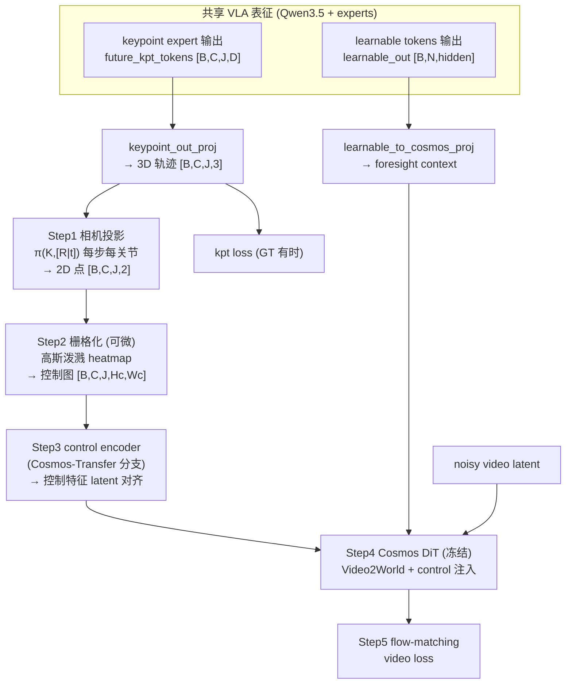
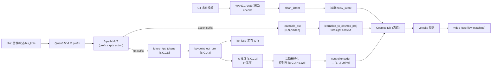
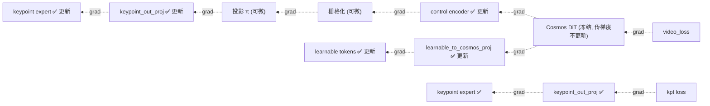

# 接法 B:3D 轨迹作为控制图驱动 Cosmos 世界模型 foresight

> 方案定位:在 InternVLA-A1.5 的 latent foresight 分支上,把 **WAN2.2 视频教师替换为 NVIDIA Cosmos-Predict2.5-2B(物理 AI 世界模型)**,并把 GeoPredict 分支预测的 **3D 关键点轨迹投影为逐帧 2D 控制图(control map)**,以 **Cosmos-Transfer2.5 ControlNet 式**的方式注入,让"未来视频想象"被预测的 3D 轨迹在像素空间逐帧对齐地引导。
>
> 本文只覆盖**接法 B 的方案设计 + 数据流 / 梯度流**。其它接法(A 轨迹当 context、C 交叉一致性)见后续文档。
>
> 代码基线:`src/lerobot/policies/internvla_a1_5/modeling_internvla_a1_5.py`(WAN 分支)与 GeoPredict keypoint 分支(见设计文档 `b/d/itrnVLA15_GeoP_3dtrj_3cn4.md`)。

---

## 1. 一句话概览

现状里 InternVLA-A1.5 有两条**互不通信**的"未来"分支:

- **foresight(2D 像素未来)**:50 个 learnable tokens → 冻结视频扩散教师(WAN)→ flow-matching 视频重建 loss。
- **3D 轨迹(显式几何未来)**:GeoPredict keypoint expert → `future_kpt_pred [B, C, J, 3]` → 由 FK/SAPIEN 的 GT 监督。

**接法 B** 把这两条接起来:预测的 3D 轨迹先投影成相机平面上的逐帧控制图,再作为 **Cosmos 的空间控制条件**,使视频 foresight 被 3D 轨迹**空间对齐地**引导。于是视频 loss 的梯度会**额外回流**去修正 3D 轨迹,而 Cosmos 的物理先验**反过来正则化**几何。

**符号约定**(全文通用):

| 符号 | 含义 |
|:---|:---|
| $B$ | batch size |
| $C$ | `chunk_size`,动作/未来预测的时间步数 |
| $J$ | `num_keypoint_joints`,关键点(关节)数,RoboTwin 双臂 $J=14$ |
| $D$ | keypoint expert 隐藏维度 `kpt_hidden_size` |
| $N$ | `num_learnable_tokens`,foresight token 数(默认 50) |
| $T,H,W$ | 视频帧数 / 高 / 宽(默认 `num_video_frames=4`,$224\times224$) |
| $T_l,H_l,W_l$ | Cosmos latent 网格尺寸(WAN2.1 VAE 压缩比 $4\times8\times8$) |
| $\mathbf{p}_{c,j}\in\mathbb{R}^3$ | 第 $c$ 个未来步、第 $j$ 个关节的 3D 关键点(footprint-relative,度量单位) |
| $K,[R\,|\,t]$ | 相机内参 / 外参(footprint→camera) |

---

## 2. 现状:两条独立分支的接口

### 2.1 foresight 分支(WAN,将被替换)

learnable tokens 过 action expert 后取出 `learnable_out`,投影成视频教师的 cross-attention context,喂进 `wan_dit_forward`:

```2021:2034:src/lerobot/policies/internvla_a1_5/modeling_internvla_a1_5.py
        # Use projected learnable tokens as context (skip text_embedding)
        context = wan_context

        kwargs = dict(
            e=e0,
            seq_lens=seq_lens,
            grid_sizes=grid_sizes,
            freqs=wan.freqs,
            context=context,
            context_lens=None,
        )

        for block in wan.blocks:
            x = block(x, **kwargs)
```

flow-matching 视频 loss(rectified flow,首帧 latent 不计 loss):

```2083:2096:src/lerobot/policies/internvla_a1_5/modeling_internvla_a1_5.py
        video_noise = torch.randn_like(clean_latent)
        noisy_latent = clean_latent * (1 - sigma) + video_noise * sigma
        ...
        video_target = video_noise - clean_latent
        video_target[:, :, 0:1] = 0
        # WAN forward
        with torch.amp.autocast("cuda", dtype=wan_dtype):
            video_pred = self.wan_dit_forward(noisy_latent, wan_context, video_t)
        video_pred[:, :, 0:1] = 0
        return F.mse_loss(video_pred.float(), video_target.float(), reduction="mean")
```

### 2.2 3D 轨迹分支(GeoPredict)

keypoint expert 产出 `kpt_query_out [B, J, D]`,加未来位置编码展开成 $C$ 步,回归出 3D 坐标:

```1967:1976:src/lerobot/policies/internvla_a1_5/modeling_internvla_a1_5.py
            future_kpt_tokens = kpt_query_out.unsqueeze(1) + future_pos[None, :, None, :]  # [B, C, J, D]
            future_kpt_pred = self.keypoint_out_proj(
                future_kpt_tokens.reshape(B * chunk_size, j, -1)
            ).reshape(B, chunk_size, j, 3)
            ...
            loss_kpt_future = F.mse_loss(future_kpt_pred, kpt_future...)
```

**关键观察**:`future_kpt_pred [B, C, J, 3]` 就是一条**度量单位、相机可投影**的未来 3D 轨迹——正好可以拿去生成控制图。

---

## 3. 接法 B 方案设计

### 3.1 为什么用 Cosmos 而不是 WAN

- **Cosmos-Predict2.5** 是物理 AI 世界模型,flow-matching,底层用 **WAN2.1 VAE**($4\times8\times8$)——所以 VAE/latent 通道、flow-matching loss、`_wan_grid_sizes` 逻辑基本可沿用。
- 条件编码器是 **Cosmos-Reason1**(物理 VLM),用 **3D RoPE + cross-modal attention**,天生接受几何/结构化条件。
- **Cosmos-Transfer2.5** 提供 **ControlNet 式空间控制输入**(sim2real/real2real),这正是"把 2D 控制图注入"所需要的能力,而 WAN 在本仓库里只是被 hijack 的纯文本 cross-attention,给不了这条路。

### 3.2 pipeline(五步)



**Step 1 · 相机投影** $\pi$:把 $\mathbf{p}_{c,j}$ 从 footprint 坐标投到像素平面

$$
\tilde{\mathbf{u}}_{c,j} = K\,[R\,|\,t]\,\begin{bmatrix}\mathbf{p}_{c,j}\\ 1\end{bmatrix},\qquad
\mathbf{u}_{c,j} = \Big(\tfrac{\tilde u_x}{\tilde u_z},\ \tfrac{\tilde u_y}{\tilde u_z}\Big)\in\mathbb{R}^2
$$

其中 $K$ 为相机内参、$[R\,|\,t]$ 为 footprint→camera 外参、$\tilde u_z$ 为投影深度。投影整体对 $\mathbf{p}_{c,j}$ 可微,因此梯度能从控制图回流到 3D 轨迹。

**Step 2 · 可微栅格化**:把每个 2D 点 $\mathbf{u}_{c,j}$ 泼成一张高斯 heatmap(而不是硬性 one-hot,保证可微):

$$
M_{c,j}(x,y) = \exp\!\Big(-\tfrac{\lVert (x,y) - \mathbf{u}_{c,j}\rVert^2}{2\sigma^2}\Big)
$$

- $M_{c,j}\in\mathbb{R}^{H_c\times W_c}$ 为第 $c$ 步第 $j$ 关节的控制图通道;$\sigma$ 为泼溅半径(超参,建议 $\sigma\approx1.5{\sim}3$ px @ 控制图分辨率)。
- 可按关节分组堆成 $J$ 通道,或用不同颜色编码手臂 link 得到 RGB 骨架图;推荐 **$J$ 通道 heatmap**,信息无损且几何直观。
- 深度 $\tilde u_z$ 可作为附加通道(归一化后)编码"远近",给 Cosmos 提供 2.5D 线索。

**Step 3 · control encoder**:控制图 $M\in\mathbb{R}^{B\times C\times J\times H_c\times W_c}$ 经一个轻量可训练编码器(Cosmos-Transfer 的 control branch)对齐到 Cosmos latent 网格 $T_l\times H_l\times W_l$,得到控制特征,按帧加到/注入 DiT。

**Step 4 · Cosmos DiT(冻结)**:以 Video2World 模式运行——首帧(当前观测帧)经 frame-replacement 固定,learnable-token context 作为语义条件,control 特征作为空间条件,一起预测未来 latent。

**Step 5 · flow-matching video loss**:沿用现有 rectified-flow 形式,首帧 latent target 置零。

### 3.3 与时间/空间维度的对齐

- **时间**:轨迹的 $C$ 个未来步要映射到 Cosmos latent 的 $T_l$ 帧。若 $C\neq T_l$,在 control encoder 里做时间插值/下采样对齐(WAN2.1 VAE 时间压缩 $4\times$,即 $T_l = 1 + T/4$)。
- **空间**:控制图分辨率 $H_c\times W_c$ 与视频帧 $H\times W$ 一致,control encoder 内部再下采样到 $H_l\times W_l = H/? \times W/?$(与 Cosmos patch/VAE 一致)。

---

## 4. 数据流(forward)



**输入 / 输出速览**:

| 阶段 | 输入 | 输出 |
|:---|:---|:---|
| keypoint expert | prefix/kpt suffix embeds | `future_kpt_tokens [B,C,J,D]` |
| `keypoint_out_proj` | `future_kpt_tokens` | 3D 轨迹 `[B,C,J,3]` |
| 投影 $\pi$ | 3D 轨迹 + $K,[R|t]$ | 2D 点 `[B,C,J,2]`(+深度) |
| 栅格化 | 2D 点 | 控制图 `[B,C,J,Hc,Wc]` |
| control encoder | 控制图 | latent 对齐控制特征 |
| VAE encode(冻结) | GT 未来视频 `[B,C_,T,H,W]` | `clean_latent` |
| Cosmos DiT(冻结) | noisy_latent + foresight ctx + control feat | velocity 预测 |
| video loss | 预测 vs `noise - clean` | 标量 `video_loss` |

---

## 5. 梯度流(backward)

核心变化:**`video_loss` 多出一条经"控制图→投影→3D 轨迹"的梯度路径,回流进 keypoint expert**;Cosmos 冻结,但梯度可穿过它(冻结=不更新权重,但仍传梯度)到达可训练条件输入。



**权重冻结 / 更新一览**:

| 模块 | 状态 | 说明 |
|:---|:---:|:---|
| Cosmos DiT | 🔒 冻结 | 与现 `freeze_wan_dit=True` 一致;传梯度但不更新 |
| WAN2.1 VAE | 🔒 冻结 | 永远冻结 |
| Cosmos-Reason1 条件编码器 | 🔒 冻结 | 语义条件老师 |
| `control encoder`(Transfer 分支) | ✅ 更新 | 新增,轻量 |
| `learnable_to_cosmos_proj` | ✅ 更新 | 新增(替代 `learnable_to_wan_proj`) |
| `learnable_tokens` | ✅ 更新 | foresight token |
| `keypoint expert` | ✅ 更新 | 现在同时被 kpt loss 和 video loss 监督 |
| `keypoint_out_proj` | ✅ 更新 | 3D 回归头 |
| action expert | ✅ 更新 | 由 action loss 驱动 |

**梯度耦合的意义**(本方案精髓):

$$
\frac{\partial \mathcal{L}_{video}}{\partial \theta_{kpt}}
= \underbrace{\frac{\partial \mathcal{L}_{video}}{\partial M}}_{\text{Cosmos+control}}
\cdot \underbrace{\frac{\partial M}{\partial \mathbf{u}}}_{\text{栅格化}}
\cdot \underbrace{\frac{\partial \mathbf{u}}{\partial \mathbf{p}}}_{\pi\text{ 投影}}
\cdot \underbrace{\frac{\partial \mathbf{p}}{\partial \theta_{kpt}}}_{\text{回归头}}
$$

- $\theta_{kpt}$:keypoint expert + `keypoint_out_proj` 参数;$M$:控制图;$\mathbf{u}$:2D 投影点;$\mathbf{p}$:3D 关键点。
- 直观解释:**如果 3D 轨迹预测错了,投影出的控制图就"指错地方",冻结的物理世界模型据此生成的未来视频与真实未来不符,`video_loss` 升高,梯度顺着上式把 3D 轨迹掰回正确位置。** 这就是"foresight 反向监督 3D 几何"的来源。
- 附带效果:**无 3D GT 的样本**(`kpt_mask=False`,即文档"方案 B Phase 1 间接监督"场景)此时仍能通过 `video_loss` 获得**间接几何监督**。

---

## 6. 总 loss

$$
\mathcal{L} = w_a\,\mathcal{L}_{action} + w_v\,\mathcal{L}_{video}
           + w_k\big(\mathcal{L}_{kpt}^{cur} + w_f\,\mathcal{L}_{kpt}^{fut}\big)
           + w_{vqa}\,\mathcal{L}_{vqa}
$$

- $w_a,w_v,w_k,w_f,w_{vqa}$:各项权重,对应 `action_loss_weight / video_loss_weight / kpt_loss_weight / kpt_future_loss_weight` 等现有超参。
- 接法 B **不新增 loss 项**,只是让已有的 $\mathcal{L}_{video}$ 通过控制图这条可微链路**额外**监督 $\theta_{kpt}$。(若要更强约束可叠加接法 C 的一致性项,另文讨论。)

---

## 7. 需要新增/改动的代码点(实现清单)

> 仅规划,便于落地时对照;本文件不含实现。

1. **教师替换**:`wan_model.py::WanVideoModel` → `CosmosVideoModel`(包 Cosmos DiT + WAN2.1 VAE + Transfer control branch);`wan_dit_forward` → `cosmos_dit_forward`。
2. **投影模块** `KeypointToControlMap`(新):输入 `future_kpt_pred [B,C,J,3]` + 相机 $K,[R|t]$,输出控制图 `[B,C,J,Hc,Wc]`;含可微 $\pi$ 投影 + 高斯栅格化。
3. **control encoder**(新,可训练):控制图 → Cosmos latent 网格对齐特征。
4. **`learnable_to_cosmos_proj`**(改):替代 `learnable_to_wan_proj`,维度对齐 Cosmos-Reason1 条件维。
5. **`_compute_video_loss`**(改):把 control 特征传入 `cosmos_dit_forward`;时间/空间维对齐 $C\!\to\!T_l$、$H_c\!\to\!H_l$。
6. **相机参数流**:训练 batch 需带 $K,[R|t]$(RoboTwin/SAPIEN 可从仿真读取);`transform_internvla_a1_5.py` 增加相机字段透传。
7. **冻结配置**:沿用 `freeze_wan_dit` 语义,新增 `freeze_cosmos_dit`;确保 VAE / Cosmos-Reason1 冻结。

---

## 8. 风险与注意

| 风险 | 说明 | 缓解 |
|:---|:---|:---|
| **相机参数依赖** | 投影需 $K,[R|t]$;真机需标定 | 训练期辅助,推理不依赖(部署走 action-only,不加载 Cosmos) |
| **off-distribution** | Cosmos 训练于高分辨率长片段,$4\times224$ 偏离 | 评估时适当提高帧数/分辨率 |
| **冻结教师接不住控制图** | control encoder 需把控制图映到 Cosmos 可用的条件流形 | 先小规模验证 `video_loss` 能正常下降 |
| **归因问题** | 收益可能来自"更强教师"而非"3D 控制" | 必做 ablation:WAN vs Cosmos、有/无控制图、梯度耦合开/关 |
| **投影退化** | 关节投影到画面外或重叠 | heatmap 边界裁剪 + 深度通道 + 可见性 mask |

---

## 9. 与其它接法的关系

- **接法 A(轨迹当 context)**:把 `future_kpt_tokens` 直接拼进 Cosmos cross-attention context,最省事但空间对齐弱。
- **接法 B(本文,轨迹当控制图)**:像素空间**逐帧几何对齐**,最"物理"、最可解释,是 Cosmos-Transfer 独有能力。
- **接法 C(交叉一致性)**:在 A/B 之上再加 3D↔2D reprojection / point-track 一致性 loss,可叠加。

推荐路线:**先 A 打通链路验证收益 → 升级到 B 拿"几何对齐"卖点 → 视需要叠加 C**。

---

*生成日期:2026-08-12 · 基线代码:`modeling_internvla_a1_5.py`(WAN 分支)+ GeoPredict keypoint 分支(`b/d/itrnVLA15_GeoP_3dtrj_3cn4.md`)*
